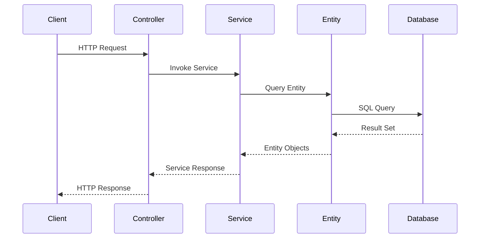

# Design Document: OFBiz Architecture Breakdown Documentation

## Overview

This design document outlines the technical approach for creating comprehensive architecture documentation for Apache OFBiz. The documentation will be organized in `ofbiz-framework/docs-bizwithai/architecture-breakdown/` and will provide systematic coverage from high-level system design to granular component-level implementation details.

### Target Audience

- **Primary**: Enterprise Architects, Principal Engineers, Technical Decision Makers
- **Secondary**: Senior Developers, Integration Architects, Database Architects
- **Tertiary**: UI/UX Developers, External System Integrators

### Documentation Philosophy

1. **Progressive Disclosure**: Start with high-level concepts, drill down to implementation details
2. **Visual-First**: Rich diagrams (UML, sequence, ERD) with supporting text
3. **Code-Grounded**: Reference actual source code to maintain accuracy
4. **Role-Based Navigation**: Multiple entry points based on user role
5. **Standards-Referenced**: Link to official docs and industry standards

## Architecture

### Directory Structure

```
ofbiz-framework/
└── docs-bizwithai/
    └── architecture-breakdown/
        ├── 00-INDEX.md                          # Master navigation hub
        ├── 01-system-overview/
        │   ├── README.md                        # Section overview
        │   ├── system-context.md                # External boundaries
        │   ├── modular-architecture.md          # Component-based design
        │   ├── deployment-topologies.md         # Deployment patterns
        │   ├── technology-stack.md              # Tech choices & rationale
        │   └── architecture-philosophy.md       # Design principles
        ├── 02-framework-core/
        │   ├── README.md
        │   ├── entity-engine/
        │   │   ├── overview.md
        │   │   ├── class-structure.md           # UML diagrams
        │   │   ├── query-engine.md
        │   │   ├── transaction-management.md
        │   │   └── replacement-strategies.md    # Alternative ORMs
        │   ├── service-engine/
        │   │   ├── overview.md
        │   │   ├── class-structure.md
        │   │   ├── service-invocation.md        # Sequence diagrams
        │   │   ├── transaction-handling.md
        │   │   └── replacement-strategies.md
        │   ├── widget-framework/
        │   │   ├── overview.md
        │   │   ├── rendering-pipeline.md
        │   │   ├── form-processing.md
        │   │   └── replacement-strategies.md
        │   ├── security-framework/
        │   │   ├── overview.md
        │   │   ├── authentication-flow.md
        │   │   ├── authorization-flow.md
        │   │   └── replacement-strategies.md
        │   ├── webapp-framework/
        │   │   ├── overview.md
        │   │   ├── request-pipeline.md
        │   │   └── replacement-strategies.md
        │   └── event-driven-architecture/
        │       ├── eca-seca-overview.md
        │       ├── event-processing-flow.md
        │       └── alternative-event-systems.md  # Kafka, RabbitMQ
        ├── 03-data-architecture/
        │   ├── README.md
        │   ├── entity-model-overview.md         # Complete ERD
        │   ├── domain-models/
        │   │   ├── party-domain.md              # Party ERD
        │   │   ├── product-domain.md            # Product ERD
        │   │   ├── order-domain.md              # Order ERD
        │   │   ├── accounting-domain.md         # Accounting ERD
        │   │   └── [other-domains].md
        │   ├── caching-strategy.md
        │   ├── multi-tenancy-architecture.md
        │   ├── data-governance.md
        │   ├── scalability-patterns.md
        │   └── security-encryption.md
        ├── 04-application-modules/
        │   ├── README.md
        │   ├── module-architecture-overview.md
        │   ├── core-modules/
        │   │   ├── party-module.md              # Cannot disable
        │   │   ├── product-module.md            # Cannot disable
        │   │   └── order-module.md              # Cannot disable
        │   ├── optional-modules/
        │   │   ├── accounting-module.md         # Can replace
        │   │   ├── manufacturing-module.md      # Can disable
        │   │   ├── marketing-module.md          # Can disable
        │   │   └── humanres-module.md           # Can disable
        │   ├── module-isolation-techniques.md
        │   ├── module-replacement-patterns.md
        │   └── external-integration-examples/
        │       ├── quickbooks-integration.md
        │       ├── salesforce-integration.md
        │       └── stripe-integration.md
        ├── 05-integration-architecture/
        │   ├── README.md
        │   ├── rest-api-architecture.md
        │   ├── event-driven-integration.md
        │   ├── enterprise-integration-patterns.md
        │   ├── external-service-adapters.md
        │   ├── data-synchronization.md
        │   ├── circuit-breaker-patterns.md
        │   └── api-versioning.md
        ├── 06-runtime-architecture/
        │   ├── README.md
        │   ├── bootstrap-sequence.md
        │   ├── request-lifecycle.md
        │   ├── thread-model.md
        │   ├── classloading-architecture.md
        │   └── jvm-tuning.md
        ├── 07-cross-cutting-concerns/
        │   ├── README.md
        │   ├── logging-architecture.md
        │   ├── error-handling.md
        │   ├── validation-framework.md
        │   └── internationalization.md
        ├── 08-extension-points/
        │   ├── README.md
        │   ├── plugin-architecture.md
        │   ├── customization-patterns.md
        │   ├── api-stability.md
        │   └── upgrade-compatibility.md
        ├── 09-quality-attributes/
        │   ├── README.md
        │   ├── performance-characteristics.md
        │   ├── reliability-patterns.md
        │   ├── security-architecture.md
        │   ├── maintainability.md
        │   └── portability.md
        ├── 10-governance-compliance/
        │   ├── README.md
        │   ├── audit-trail-architecture.md
        │   ├── data-privacy-gdpr.md
        │   ├── access-control-rbac-abac.md
        │   └── regulatory-compliance.md
        └── role-based-guides/
            ├── architect-guide.md
            ├── developer-guide.md
            ├── ui-ux-developer-guide.md
            └── integrator-guide.md
```

### Documentation Organization Principles

1. **Numbered Sections**: 01-10 for clear ordering and progressive complexity
2. **README per Section**: Overview and navigation for each major section
3. **Consistent Structure**: Each document follows standard template
4. **Cross-References**: Extensive linking between related topics
5. **Role-Based Guides**: Curated paths through documentation by role

## Components and Interfaces

### Document Template Structure

Every documentation file will follow this structure:

```markdown
# [Document Title]

**Purpose**: [What this document covers]
**Audience**: [Who should read this]
**Prerequisites**: [What to read first]
**Related Documents**: [Links to related docs]

---

## Overview

[High-level introduction with context]

## Visual Architecture

### [Diagram Type] Diagram

[REQUIRED: At least one diagram per document]

```mermaid
[Mermaid diagram code]
```

**Diagram Description**: [Explain what the diagram shows and key elements]

### Additional Diagrams

[Include as many diagrams as needed to explain the architecture]

## [Main Content Sections]

### Detailed Explanation

[In-depth technical content]

### Key Components

[Detailed breakdown of components shown in diagrams]

### Interaction Patterns

[How components interact - reference diagrams]

## Code References

<details>
<summary>View Source Code References</summary>

**File**: `[relative/path/to/file.java]`

```java
[Code snippet]
```

**Key Classes**:
- `ClassName1`: [Purpose]
- `ClassName2`: [Purpose]

</details>

## Architecture Decisions

[ADR-style decision documentation where applicable]

## Official References

- [Apache OFBiz Official Docs](links)
- [Industry Standards](links)
- [Technology Documentation](links)

## Related Topics

- [Link to related doc 1]
- [Link to related doc 2]

---

**Next**: [Link to logical next document]
**Up**: [Link to parent/section README]
```

### Diagram Requirements by Document Type

#### System Overview Documents
**Required Diagrams**:
- System context diagram (C4 Level 1)
- Component diagram showing major modules
- Deployment topology diagram

#### Framework Core Documents
**Required Diagrams**:
- UML class diagram (key classes and interfaces)
- Sequence diagram (primary flow)
- Component interaction diagram

#### Data Architecture Documents
**Required Diagrams**:
- Entity-Relationship Diagram (ERD)
- Data flow diagram
- Cache architecture diagram (where applicable)

#### Application Module Documents
**Required Diagrams**:
- Module-specific ERD
- Service orchestration sequence diagram
- Module dependency diagram

#### Integration Documents
**Required Diagrams**:
- Integration pattern diagram
- Data flow diagram (OFBiz ↔ External System)
- Sequence diagram for integration flow

#### Runtime Documents
**Required Diagrams**:
- Sequence diagram for lifecycle
- Thread model diagram
- Component loading sequence diagram

**Minimum Requirement**: Every technical document MUST have at least one diagram. Documents without diagrams will fail validation.

### Diagram Standards

#### Mermaid Diagrams

Use Mermaid for:
- **Flowcharts**: Process flows, decision trees
- **Sequence Diagrams**: Request/response flows, service invocation
- **Class Diagrams**: Component relationships (simple cases)
- **ER Diagrams**: Entity relationships
- **Component Diagrams**: Module dependencies

**Example Mermaid Sequence Diagram**:


#### PlantUML for Complex Class Diagrams

For detailed UML class diagrams with many relationships, use PlantUML and include both:
1. PlantUML source in collapsible block
2. Rendered PNG/SVG image

### Code Reference Standards

All code references must:
1. Be in collapsible `<details>` blocks
2. Include file path relative to `ofbiz-framework/`
3. Include line numbers when referencing specific sections
4. Be kept up-to-date with actual source

**Example**:
```markdown
<details>
<summary>View Delegator Interface</summary>

**File**: `framework/entity/src/main/java/org/apache/ofbiz/entity/Delegator.java`

```java
public interface Delegator {
    GenericValue findOne(String entityName, Map<String, ?> fields, boolean useCache);
    List<GenericValue> findByAnd(String entityName, Map<String, ?> fields);
    // ... more methods
}
```

</details>
```

## Data Models

### Master Index Structure

The `00-INDEX.md` will serve as the primary navigation hub:

```markdown
# OFBiz Architecture Breakdown - Master Index

## Quick Navigation by Role

### For Architects
1. [System Overview](01-system-overview/README.md)
2. [Architecture Philosophy](01-system-overview/architecture-philosophy.md)
3. [Component Isolation & Replacement](04-application-modules/module-replacement-patterns.md)
4. [Quality Attributes](09-quality-attributes/README.md)
5. [Architect's Complete Guide](role-based-guides/architect-guide.md)

### For Developers
1. [Framework Core](02-framework-core/README.md)
2. [Extension Points](08-extension-points/README.md)
3. [Customization Patterns](08-extension-points/customization-patterns.md)
4. [Developer's Complete Guide](role-based-guides/developer-guide.md)

### For UI/UX Developers
1. [Widget Framework](02-framework-core/widget-framework/overview.md)
2. [Rendering Pipeline](02-framework-core/widget-framework/rendering-pipeline.md)
3. [UI/UX Developer's Guide](role-based-guides/ui-ux-developer-guide.md)

### For Integration Architects
1. [Integration Architecture](05-integration-architecture/README.md)
2. [External Service Adapters](05-integration-architecture/external-service-adapters.md)
3. [Integration Examples](04-application-modules/external-integration-examples/)
4. [Integrator's Complete Guide](role-based-guides/integrator-guide.md)

## Documentation by Topic

### [01. System Overview](01-system-overview/README.md)
- System Context & Boundaries
- Modular Architecture
- Deployment Topologies
- Technology Stack
- Architecture Philosophy

### [02. Framework Core](02-framework-core/README.md)
- Entity Engine (ORM)
- Service Engine
- Widget Framework
- Security Framework
- Webapp Framework
- Event-Driven Architecture (ECA/SECA)

### [03. Data Architecture](03-data-architecture/README.md)
- Entity Model Overview
- Domain-Specific Models
- Caching Strategy
- Multi-Tenancy
- Data Governance

### [04. Application Modules](04-application-modules/README.md)
- Core Modules (Party, Product, Order)
- Optional Modules (Accounting, Manufacturing, etc.)
- Module Isolation Techniques
- External Integration Examples

### [05. Integration Architecture](05-integration-architecture/README.md)
- REST API Architecture
- Event-Driven Integration
- Enterprise Integration Patterns
- Data Synchronization

### [06. Runtime Architecture](06-runtime-architecture/README.md)
- Bootstrap Sequence
- Request Lifecycle
- Thread Model
- Classloading
- JVM Tuning

### [07. Cross-Cutting Concerns](07-cross-cutting-concerns/README.md)
- Logging
- Error Handling
- Validation
- Internationalization

### [08. Extension Points](08-extension-points/README.md)
- Plugin Architecture
- Customization Patterns
- API Stability
- Upgrade Compatibility

### [09. Quality Attributes](09-quality-attributes/README.md)
- Performance
- Reliability
- Security
- Maintainability
- Portability

### [10. Governance & Compliance](10-governance-compliance/README.md)
- Audit Trail
- Data Privacy (GDPR)
- Access Control (RBAC/ABAC)
- Regulatory Compliance

## Official References

- [Apache OFBiz Official Documentation](https://ofbiz.apache.org/documentation.html)
- [OFBiz Wiki](https://cwiki.apache.org/confluence/display/OFBIZ)
- [GitHub Repository](https://github.com/apache/ofbiz-framework)
```

### Section README Template

Each section's README.md will follow this pattern:

```markdown
# [Section Number]. [Section Name]

## Overview

[Brief description of what this section covers]

## Contents

1. [Document 1](document-1.md) - [Brief description]
2. [Document 2](document-2.md) - [Brief description]
...

## Key Concepts

- **Concept 1**: [Definition]
- **Concept 2**: [Definition]

## Prerequisites

Before reading this section, you should understand:
- [Prerequisite 1](../link)
- [Prerequisite 2](../link)

## Related Sections

- [Related Section 1](../section/)
- [Related Section 2](../section/)

---

**Up**: [Master Index](../00-INDEX.md)
```

## Correctness Properties

*A property is a characteristic or behavior that should hold true across all valid executions of a system—essentially, a formal statement about what the system should do. Properties serve as the bridge between human-readable specifications and machine-verifiable correctness guarantees.*

### Property 1: Documentation Completeness

*For any* requirement in the requirements document, there must exist corresponding documentation that addresses all acceptance criteria for that requirement.

**Validates: All Requirements**

### Property 2: Link Integrity

*For any* internal link in the documentation, the target document must exist and the anchor (if specified) must be present in the target document.

**Validates: Requirements 12.4, 12.5**

### Property 3: Code Reference Accuracy

*For any* code reference in the documentation, the referenced file path must exist in the ofbiz-framework directory structure.

**Validates: Requirements 13.1, 13.4**

### Property 4: Diagram Presence

*For any* technical documentation file (excluding README and index files), the document must contain at least one diagram.

**Validates: Requirements 10.1-10.4**

### Property 5: Diagram Renderability

*For any* Mermaid diagram in the documentation, the diagram syntax must be valid and render correctly in GitHub markdown preview.

**Validates: Requirements 10.5**

### Property 6: Role-Based Navigation Completeness

*For any* role defined in the role-based guides, there must exist a complete navigation path covering all essential topics for that role.

**Validates: Requirements 11.1-11.4**

### Property 7: Progressive Disclosure

*For any* document in the documentation, if it references advanced concepts, those concepts must be explained in prerequisite documents that are linked.

**Validates: Requirements 12.3**

### Property 8: Official Reference Validity

*For any* external link to official documentation or standards, the link must be valid and point to an authoritative source.

**Validates: Requirements 14.1-14.4**

### Property 9: Template Compliance

*For any* documentation file, it must include the required sections: Purpose, Audience, Prerequisites, and Related Documents.

**Validates: Requirements 12.2**

### Property 10: Collapsible Code Block Format

*For any* code snippet longer than 10 lines, it must be contained within a collapsible `<details>` block.

**Validates: Requirements 10.6, 13.2, 13.5**

### Property 11: Cross-Reference Bidirectionality

*For any* document A that references document B, document B should include A in its "Related Documents" section (where contextually appropriate).

**Validates: Requirements 12.4**

## Error Handling

### Missing Source Code References

**Issue**: Referenced source file doesn't exist or has moved

**Handling**:
1. Document will include a note: "⚠️ Source reference needs update"
2. Include last known location
3. Add to validation checklist for review

### Broken Internal Links

**Issue**: Link points to non-existent document or anchor

**Handling**:
1. Automated link checker will identify broken links
2. Create placeholder document with "Coming Soon" notice
3. Update link validation report

### Diagram Rendering Failures

**Issue**: Mermaid diagram doesn't render in GitHub

**Handling**:
1. Validate syntax using Mermaid live editor
2. Simplify complex diagrams
3. Fall back to PlantUML with image export if needed

### Outdated Information

**Issue**: Documentation doesn't match current codebase

**Handling**:
1. Version tag each document with OFBiz version
2. Include "Last Updated" date
3. Periodic review cycle (quarterly)

## Testing Strategy

### Documentation Validation

#### Link Validation
- **Tool**: Custom script or markdown-link-check
- **Frequency**: On every commit
- **Scope**: All internal and external links

#### Code Reference Validation
- **Tool**: Custom script
- **Frequency**: Weekly
- **Scope**: Verify all file paths exist

#### Diagram Presence Validation
- **Tool**: Custom script
- **Frequency**: On every commit
- **Scope**: Verify every technical document has at least one diagram

#### Diagram Syntax Validation
- **Tool**: Mermaid CLI
- **Frequency**: On every commit
- **Scope**: Syntax validation for all Mermaid diagrams

#### Diagram Quality Review
- **Reviewer**: Technical writers + architects
- **Frequency**: Per document completion
- **Checklist**:
  - Diagram accurately represents architecture
  - All key components labeled
  - Relationships clearly shown
  - Diagram description provided
  - Appropriate diagram type used

#### Template Compliance
- **Tool**: Custom linter
- **Frequency**: On every commit
- **Scope**: Check required sections present

### Content Quality Review

#### Technical Accuracy Review
- **Reviewer**: Senior OFBiz developers
- **Frequency**: Per document completion
- **Checklist**:
  - Technical accuracy
  - Code references correct
  - Diagrams accurate
  - No misleading information

#### Completeness Review
- **Reviewer**: Documentation team
- **Frequency**: Per section completion
- **Checklist**:
  - All requirements addressed
  - All acceptance criteria met
  - Cross-references complete
  - Role-based paths functional

### User Acceptance Testing

#### Architect Review
- **Tester**: Enterprise architects
- **Focus**: System overview, quality attributes, ADRs
- **Success Criteria**: Can make informed architectural decisions

#### Developer Review
- **Tester**: Senior developers
- **Focus**: Framework core, extension points, code references
- **Success Criteria**: Can customize OFBiz safely

#### Integrator Review
- **Tester**: Integration architects
- **Focus**: Integration architecture, external examples
- **Success Criteria**: Can design external integrations

## Implementation Phases

### Phase 1: Foundation (Weeks 1-2)
- Create directory structure
- Create 00-INDEX.md
- Create all section README.md files
- Set up documentation templates
- Implement validation scripts

### Phase 2: System Overview (Weeks 3-4)
- System context diagrams
- Modular architecture documentation
- Deployment topologies
- Technology stack rationale
- Architecture philosophy

### Phase 3: Framework Core (Weeks 5-8)
- Entity Engine documentation
- Service Engine documentation
- Widget Framework documentation
- Security Framework documentation
- Webapp Framework documentation
- Event-driven architecture

### Phase 4: Data Architecture (Weeks 9-10)
- Entity model overview
- Domain-specific ERDs
- Caching strategy
- Multi-tenancy architecture

### Phase 5: Application Modules (Weeks 11-13)
- Core modules documentation
- Optional modules documentation
- Module isolation techniques
- External integration examples

### Phase 6: Integration & Runtime (Weeks 14-15)
- Integration architecture
- Runtime architecture
- Cross-cutting concerns

### Phase 7: Extension & Quality (Weeks 16-17)
- Extension points
- Quality attributes
- Governance & compliance

### Phase 8: Role-Based Guides (Week 18)
- Architect guide
- Developer guide
- UI/UX developer guide
- Integrator guide

### Phase 9: Validation & Polish (Weeks 19-20)
- Link validation
- Code reference validation
- Technical accuracy review
- User acceptance testing
- Final polish and corrections

## Architecture Decision Records

### ADR-001: Use Mermaid for Diagrams

**Context**: Need to choose diagram format that renders in GitHub and is maintainable

**Decision**: Use Mermaid as primary diagram format

**Consequences**:
- ✅ Renders natively in GitHub markdown
- ✅ Version controllable (text-based)
- ✅ Easy to update
- ❌ Limited complexity for class diagrams
- **Mitigation**: Use PlantUML for complex UML, export as images

**Alternatives Considered**:
- Draw.io: Not version-controllable
- PlantUML: Requires rendering step
- ASCII art: Limited visual appeal

### ADR-002: Separate docs-bizwithai from Official docs

**Context**: Need to keep custom documentation separate from Apache OFBiz official docs

**Decision**: Create `docs-bizwithai/` directory alongside official `docs/`

**Consequences**:
- ✅ Clear separation of concerns
- ✅ No conflicts with upstream
- ✅ Easy to maintain custom docs
- ❌ Users need to know about both locations
- **Mitigation**: Clear signposting in both locations

**Alternatives Considered**:
- Merge into official docs: Risk of conflicts
- Separate repository: Harder to keep in sync

### ADR-003: Collapsible Code Blocks

**Context**: Need to include code references without overwhelming readers

**Decision**: Use HTML `<details>` tags for all code snippets > 10 lines

**Consequences**:
- ✅ Maintains document readability
- ✅ Code available when needed
- ✅ Works in GitHub markdown
- ❌ Requires manual HTML
- **Mitigation**: Template and examples provided

**Alternatives Considered**:
- Always show code: Too verbose
- Separate code files: Breaks context
- Links only: Extra navigation burden

### ADR-004: Role-Based Navigation

**Context**: Different users need different information paths

**Decision**: Create dedicated role-based guide documents with curated paths

**Consequences**:
- ✅ Faster onboarding for specific roles
- ✅ Reduced cognitive load
- ✅ Clear learning paths
- ❌ Maintenance overhead (multiple paths)
- **Mitigation**: Generate from master index

**Alternatives Considered**:
- Single linear path: Doesn't fit all users
- Tags only: Requires search
- Separate docs per role: Too much duplication

### ADR-005: Progressive Numbering

**Context**: Need clear organization and ordering

**Decision**: Use 01-10 numbered prefixes for major sections

**Consequences**:
- ✅ Clear ordering
- ✅ Easy to reference
- ✅ Sorts correctly in file browsers
- ❌ Harder to insert new sections
- **Mitigation**: Leave gaps (01, 02, 03... allows 01.5 if needed)

**Alternatives Considered**:
- Alphabetical: No clear progression
- No prefixes: Harder to navigate
- Semantic names only: Ambiguous ordering

## Official References

### Apache OFBiz Documentation
- [Official Documentation](https://ofbiz.apache.org/documentation.html)
- [OFBiz Wiki](https://cwiki.apache.org/confluence/display/OFBIZ)
- [GitHub Repository](https://github.com/apache/ofbiz-framework)
- [Developer Mailing List](https://ofbiz.apache.org/mailing-lists.html)

### Industry Standards
- [Enterprise Integration Patterns](https://www.enterpriseintegrationpatterns.com/)
- [C4 Model for Architecture](https://c4model.com/)
- [Architecture Decision Records](https://adr.github.io/)
- [Mermaid Documentation](https://mermaid-js.github.io/)

### Technology References
- [Java EE Specifications](https://jakarta.ee/specifications/)
- [REST API Design](https://restfulapi.net/)
- [OAuth 2.0](https://oauth.net/2/)
- [GDPR Compliance](https://gdpr.eu/)

## Related Documents

- [Requirements Document](requirements.md)
- [Task List](tasks.md) - To be created
- [OFBiz Steering Files](../steering/)

---

**Version**: 1.0
**Last Updated**: 2024-12
**OFBiz Version**: Trunk (Latest)
**Status**: Design Phase
