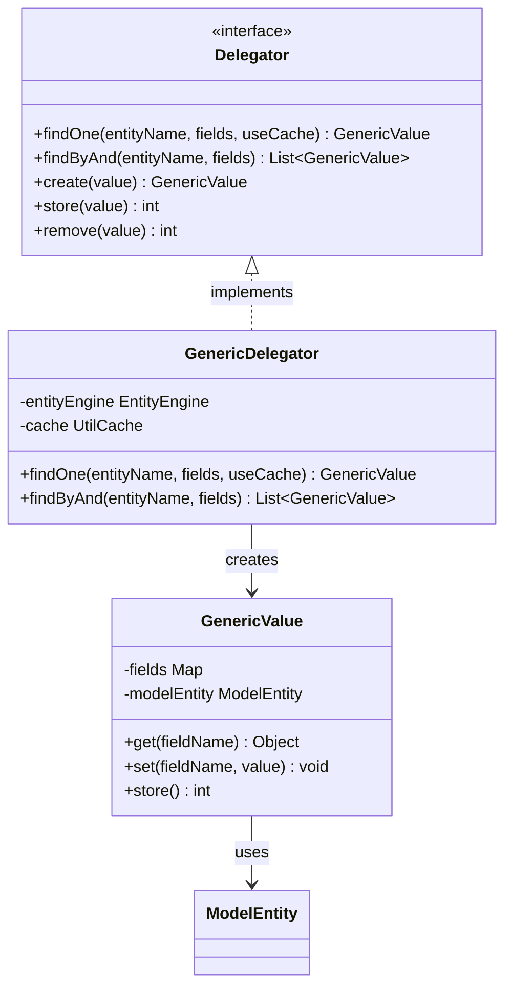
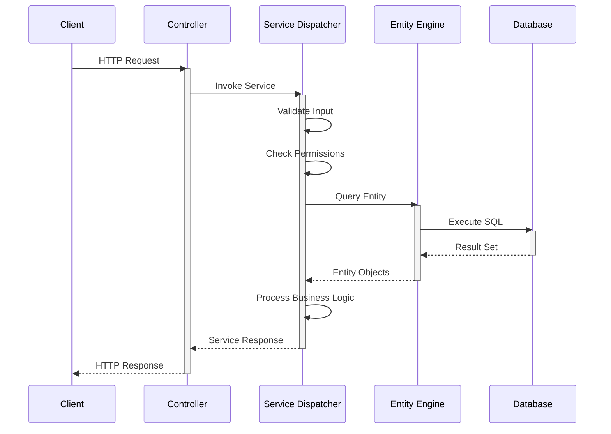
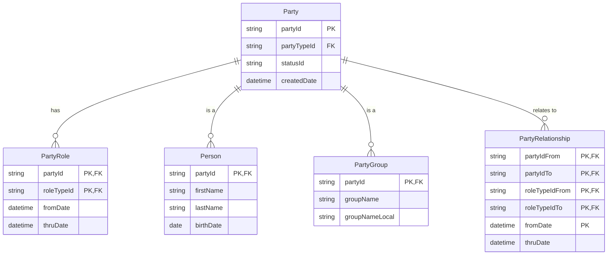
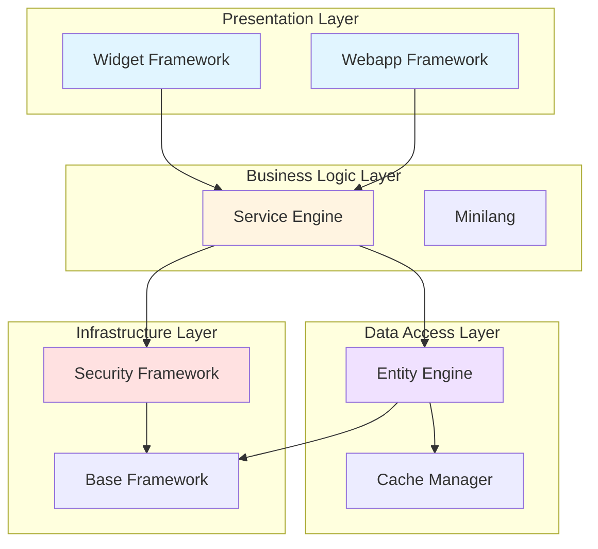
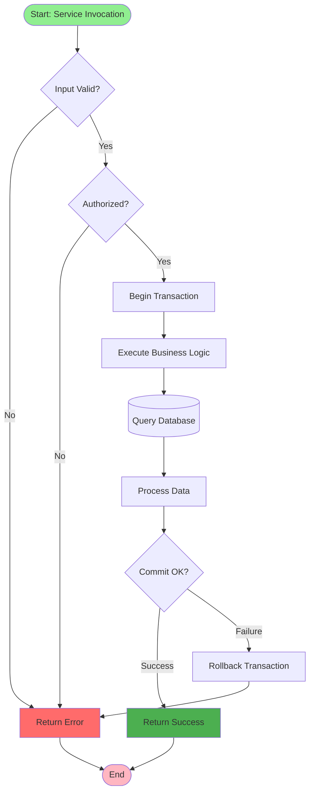
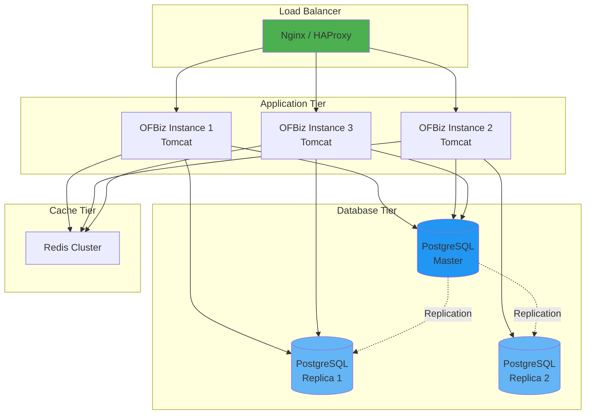
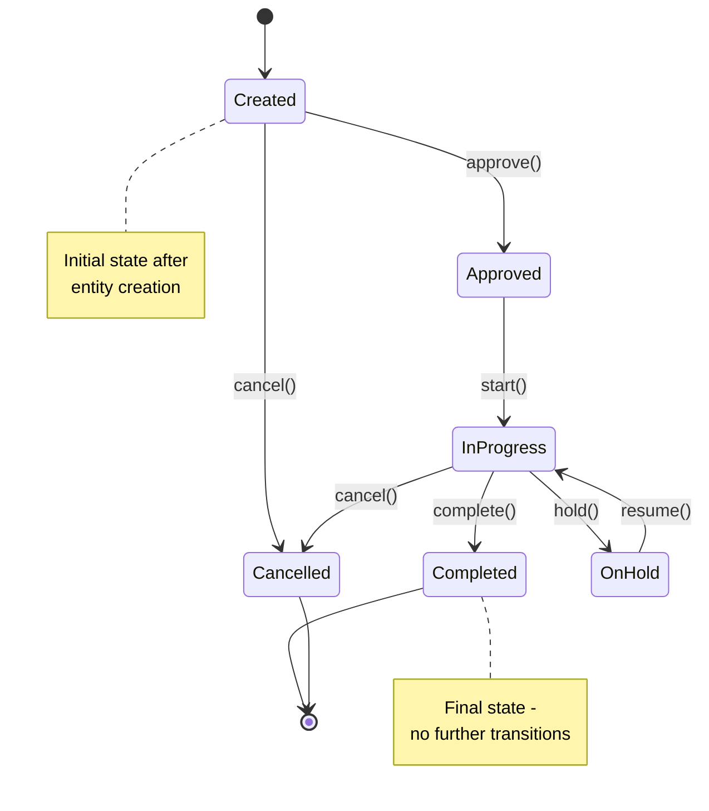

# Diagram Template Examples

This document provides template examples for different types of diagrams used in the architecture documentation.

---

## 1. Class Diagram (UML)

Use for: Framework components, interfaces, class hierarchies

**Description Template**: This class diagram shows the [component name] architecture. The [Interface] defines the contract for [purpose]. [Implementation class] provides the concrete implementation using [key dependencies]. [Related classes] represent [their role].

---

## 2. Sequence Diagram

Use for: Request flows, service invocation, transaction lifecycles

**Description Template**: This sequence diagram illustrates the [process name] flow. The process begins when [trigger]. [Component 1] handles [responsibility], then delegates to [Component 2] for [purpose]. [Key steps] occur in sequence, with [important interactions] between components.

---

## 3. Entity-Relationship Diagram (ERD)

Use for: Data models, domain models, entity relationships

**Description Template**: This ERD shows the [domain name] data model. The [main entity] represents [concept]. It has [relationship type] relationships with [related entities]. Key fields include [important fields]. The [specific relationship] enables [business capability].

---

## 4. Component Diagram

Use for: System architecture, module dependencies, component organization

**Description Template**: This component diagram shows the [system/module name] architecture organized by layers. The [layer name] contains [components] responsible for [purpose]. Dependencies flow [direction], with [component] depending on [other components] for [functionality].

---

## 5. Flowchart / Process Flow

Use for: Business processes, decision flows, algorithm flows

**Description Template**: This flowchart illustrates the [process name] workflow. The process starts with [initial step], then [key decision points] determine the flow. [Important branches] handle [scenarios]. The process completes with [outcomes].

---

## 6. Deployment Diagram

Use for: Deployment topologies, infrastructure architecture

**Description Template**: This deployment diagram shows the [deployment type] topology. [Load balancer] distributes traffic across [number] application instances. The [database tier] uses [replication strategy] for [purpose]. [Cache tier] provides [caching strategy].

---

## 7. State Diagram

Use for: Entity lifecycles, workflow states, status transitions

**Description Template**: This state diagram shows the lifecycle of [entity/process name]. The entity begins in [initial state] and can transition through [key states]. [Specific transitions] occur when [conditions/events]. Terminal states are [final states].

---

## Diagram Best Practices

### 1. Clarity
- Keep diagrams focused on one concept
- Use consistent naming conventions
- Label all relationships and flows
- Include legends when needed

### 2. Completeness
- Show all key components
- Include important relationships
- Label cardinality for ERDs
- Show direction of dependencies

### 3. Readability
- Use appropriate diagram type for the concept
- Limit complexity (split into multiple diagrams if needed)
- Use colors to group related elements
- Add notes for clarification

### 4. Consistency
- Use same notation across all documents
- Maintain consistent component names
- Follow OFBiz naming conventions
- Use standard Mermaid syntax

### 5. Description
- Always include a description after each diagram
- Explain what the diagram shows
- Highlight key elements and relationships
- Reference the diagram in the text

---

## Mermaid Syntax Quick Reference

**Class Diagram**:
- `class ClassName` - Define a class
- `<<interface>>` - Mark as interface
- `+method()` - Public method
- `-field` - Private field
- `<|--` - Inheritance
- `-->` - Association
- `*--` - Composition

**Sequence Diagram**:
- `participant Name` - Define participant
- `->>` - Synchronous message
- `-->>` - Return message
- `activate/deactivate` - Lifeline
- `Note right of` - Add notes

**ER Diagram**:
- `||--o{` - One to many
- `||--||` - One to one
- `}o--o{` - Many to many
- `PK` - Primary key
- `FK` - Foreign key

**Flowchart**:
- `[Text]` - Rectangle
- `{Text}` - Diamond (decision)
- `([Text])` - Rounded (start/end)
- `[(Text)]` - Cylinder (database)
- `-->` - Arrow

---

**For More Examples**: See [Mermaid Documentation](https://mermaid-js.github.io/)
