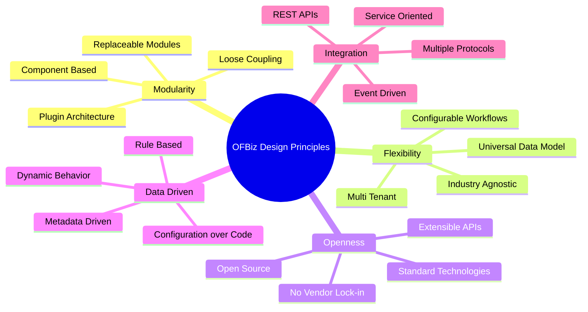
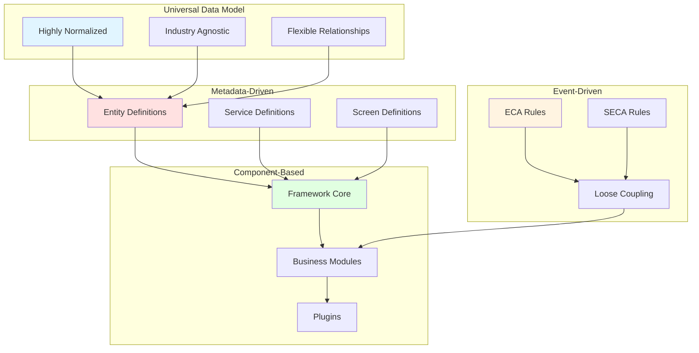
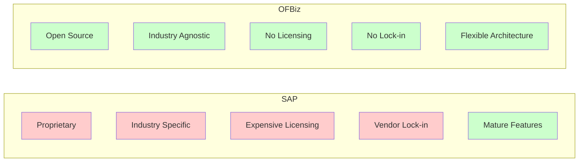

# Architecture Philosophy

**Purpose**: Explain OFBiz design principles, unique characteristics, and architectural philosophy  
**Audience**: Architects, Technical Decision Makers, Product Managers  
**Prerequisites**: [System Context](system-context.md), [Modular Architecture](modular-architecture.md)  
**Related Documents**: [Technology Stack](technology-stack.md), [Quality Attributes](../09-quality-attributes/README.md)

---

## Overview

Apache OFBiz embodies a distinct architectural philosophy that differentiates it from other ERP systems. Understanding these design principles is essential for evaluating OFBiz fit, making architectural decisions, and designing effective customizations. This document explains the core principles, unique characteristics, and trade-offs inherent in OFBiz architecture.

## Visual Architecture

### Design Principles Diagram

**Diagram Description**: Mind map showing OFBiz core design principles: Modularity (component-based, loose coupling), Flexibility (universal data model, configurable), Openness (open source, no lock-in), Data-Driven (metadata-driven, configuration), and Integration (service-oriented, event-driven).

### OFBiz Unique Characteristics

**Diagram Description**: OFBiz unique characteristics showing how universal data model, metadata-driven architecture, component-based design, and event-driven mechanisms work together to create a flexible, extensible system.

## Core Design Principles

### 1. Modularity and Loose Coupling

**Principle**: System organized into loosely-coupled components that can be independently developed, tested, and deployed.

**Implementation**:
- Component-based architecture with explicit dependencies
- Service-oriented communication between components
- Event-driven decoupling via ECA/SECA
- Plugin architecture for extensions

**Benefits**:
- ✅ Components can be replaced or disabled
- ✅ Easier to understand and maintain
- ✅ Parallel development possible
- ✅ Reduced blast radius of changes

**Trade-offs**:
- ❌ More complex than monolithic design
- ❌ Requires discipline to maintain boundaries
- ❌ Performance overhead from abstraction

**Example**: Accounting module can be replaced with QuickBooks while keeping order management in OFBiz.

### 2. Universal Data Model

**Principle**: Highly normalized, flexible data model that can represent diverse business scenarios without modification.

**Implementation**:
- Party model represents people, organizations, and relationships
- Product model supports physical goods, services, digital products
- Order model handles sales, purchases, quotes, returns
- Flexible relationship entities (PartyRole, OrderRole, etc.)

**Benefits**:
- ✅ Adapts to different industries without schema changes
- ✅ Supports complex business relationships
- ✅ Reduces customization needs
- ✅ Future-proof design

**Trade-offs**:
- ❌ Steeper learning curve
- ❌ More complex queries
- ❌ Requires understanding of abstraction
- ❌ Can be over-engineered for simple cases

**Example**: Same Party entity represents customers, suppliers, employees, and organizations with different roles.

### 3. Metadata-Driven Architecture

**Principle**: System behavior defined by metadata (XML/configuration) rather than hard-coded logic.

**Implementation**:
- Entity definitions in XML (entitymodel.xml)
- Service definitions in XML (services.xml)
- Screen definitions in XML (screens.xml)
- Form definitions in XML (forms.xml)
- Menu definitions in XML (menus.xml)

**Benefits**:
- ✅ Configuration changes without code compilation
- ✅ Easier to customize and extend
- ✅ Consistent patterns across system
- ✅ Tools can generate/validate metadata

**Trade-offs**:
- ❌ XML verbosity
- ❌ Harder to debug than code
- ❌ IDE support limited
- ❌ Learning curve for metadata formats

**Example**: Add new entity field by editing XML, no Java code required.

### 4. Configuration Over Code

**Principle**: Prefer configuration and declarative definitions over imperative code.

**Implementation**:
- Business rules in configuration files
- Workflows defined declaratively
- UI defined in widget XML
- Security rules in configuration

**Benefits**:
- ✅ Non-developers can configure system
- ✅ Faster customization
- ✅ Less code to maintain
- ✅ Easier to understand business logic

**Trade-offs**:
- ❌ Complex logic harder to express
- ❌ Limited by configuration capabilities
- ❌ Debugging more difficult
- ❌ Performance overhead

**Example**: Define form validation rules in XML rather than Java code.

### 5. Event-Driven Architecture

**Principle**: Components communicate via events rather than direct calls for loose coupling.

**Implementation**:
- ECA (Entity Condition Actions) for entity events
- SECA (Service Event Condition Actions) for service events
- Asynchronous service execution
- Message queue integration

**Benefits**:
- ✅ Loose coupling between modules
- ✅ Easy to add new behaviors
- ✅ Supports async processing
- ✅ Better scalability

**Trade-offs**:
- ❌ Harder to trace execution flow
- ❌ Debugging more complex
- ❌ Eventual consistency challenges
- ❌ Performance overhead

**Example**: When order is approved, ECA automatically triggers accounting entry without order module knowing about accounting.

### 6. Service-Oriented Architecture

**Principle**: Business logic encapsulated in services with well-defined interfaces.

**Implementation**:
- Service Engine for orchestration
- Service definitions with input/output parameters
- Transaction management at service level
- Permission checking at service level

**Benefits**:
- ✅ Reusable business logic
- ✅ Clear contracts between components
- ✅ Easy to test and mock
- ✅ Supports remote invocation

**Trade-offs**:
- ❌ Service granularity decisions
- ❌ Performance overhead
- ❌ More complex than direct calls
- ❌ Requires service design discipline

**Example**: `createOrder` service can be called from UI, API, or other services with consistent behavior.

### 7. Open Source and Vendor Independence

**Principle**: No vendor lock-in, use open standards and technologies.

**Implementation**:
- Apache 2.0 license
- Standard Java technologies
- Multiple database support
- Open APIs and protocols

**Benefits**:
- ✅ No licensing costs
- ✅ Full source code access
- ✅ Community contributions
- ✅ No vendor lock-in

**Trade-offs**:
- ❌ Community support vs commercial support
- ❌ Slower feature development
- ❌ Need in-house expertise
- ❌ Responsibility for maintenance

**Example**: Can switch from PostgreSQL to MySQL without code changes.

## OFBiz Unique Characteristics

### 1. Framework + Applications in One

**Characteristic**: OFBiz provides both framework (Entity Engine, Service Engine) and business applications (Order, Accounting).

**Comparison**:
- **Spring Framework**: Framework only, no business apps
- **SAP**: Applications only, proprietary framework
- **OFBiz**: Both framework and applications

**Implications**:
- Can use OFBiz as framework for custom apps
- Can use OFBiz applications out-of-box
- Can replace applications while keeping framework
- Flexibility in adoption approach

### 2. Industry-Agnostic Design

**Characteristic**: Not designed for specific industry, adapts to any business.

**Comparison**:
- **Industry-Specific ERPs**: Optimized for one industry (retail, manufacturing)
- **OFBiz**: Generic design adapts to any industry

**Implications**:
- More flexible but requires more configuration
- Suitable for diverse businesses
- Can support multiple industries in one instance
- Learning curve to understand abstractions

### 3. Total Cost of Ownership (TCO) Focus

**Characteristic**: Designed to minimize long-term costs.

**TCO Advantages**:
- No licensing fees (open source)
- No per-user fees
- No vendor lock-in
- Can self-host or use cloud
- Can customize without vendor approval
- Can integrate with any system

**TCO Considerations**:
- Need in-house expertise or consultants
- Responsibility for upgrades and maintenance
- Community support vs commercial support
- Initial learning curve investment

### 4. Extensibility Without Forking

**Characteristic**: Plugin architecture enables customization without modifying core code.

**Benefits**:
- Easier upgrades (plugins separate from core)
- Can contribute plugins to community
- Multiple customizations can coexist
- Clear separation of custom vs core

**Comparison**:
- **Forking**: Hard to upgrade, diverges from community
- **Plugins**: Easy to upgrade, stays with community

## Comparison with Other ERP Systems

### OFBiz vs SAP

**OFBiz Advantages**:
- ✅ No licensing costs
- ✅ Full source code access
- ✅ No vendor lock-in
- ✅ Flexible architecture

**SAP Advantages**:
- ✅ More mature features
- ✅ Industry-specific optimizations
- ✅ Larger ecosystem
- ✅ Commercial support

### OFBiz vs Odoo

**Similarities**:
- Both open source
- Both modular
- Both support multiple industries

**Differences**:

| Aspect | OFBiz | Odoo |
|--------|-------|------|
| Language | Java | Python |
| Architecture | Service-oriented | MVC |
| Data Model | Universal, normalized | Application-specific |
| Licensing | Apache 2.0 (fully open) | LGPL + Enterprise (dual) |
| Customization | Plugins, no fork | Modules, can fork |
| Target | Enterprise | SMB to Enterprise |

### OFBiz vs Custom Development

**When to Choose OFBiz**:
- Need ERP functionality out-of-box
- Want to avoid reinventing the wheel
- Need proven patterns and architecture
- Want community support and contributions

**When to Choose Custom**:
- Very specific requirements
- Simple use case
- Want full control
- Have strong development team

## Evolution and Extensibility

### Designed for Change

**Principle**: System designed to evolve over time without breaking changes.

**Mechanisms**:
- Plugin architecture for extensions
- Service interfaces for contracts
- Event-driven for loose coupling
- Metadata-driven for flexibility

**Upgrade Strategy**:
- Core framework evolves
- Plugins stay compatible
- Service contracts maintained
- Data model extends, doesn't break

### Customization Philosophy

**Extend, Don't Modify**:
- Add new entities, don't modify existing
- Override services, don't change core
- Use plugins, don't fork
- Contribute back to community

**Benefits**:
- Easier upgrades
- Can merge upstream changes
- Community benefits from contributions
- Clear separation of custom vs core

## Architecture Decision Records

### ADR-011: Universal Data Model

**Context**: Should we use industry-specific or universal data model?

**Decision**: Use universal, highly normalized data model

**Rationale**:
- Supports any industry without schema changes
- Flexible relationships
- Future-proof design
- Reduces customization needs

**Consequences**:
- ✅ Industry agnostic
- ✅ Flexible and extensible
- ❌ Steeper learning curve
- ❌ More complex queries

### ADR-012: Metadata-Driven Architecture

**Context**: Should behavior be defined in code or metadata?

**Decision**: Use metadata (XML) for entity, service, and UI definitions

**Rationale**:
- Configuration without compilation
- Consistent patterns
- Easier customization
- Tool support possible

**Consequences**:
- ✅ Flexible configuration
- ✅ Consistent patterns
- ❌ XML verbosity
- ❌ Limited IDE support

### ADR-013: Event-Driven Decoupling

**Context**: How should modules communicate?

**Decision**: Use ECA/SECA for event-driven communication

**Rationale**:
- Loose coupling between modules
- Easy to add behaviors
- Supports async processing
- Better modularity

**Consequences**:
- ✅ Loose coupling
- ✅ Extensible
- ❌ Harder to trace
- ❌ Debugging complexity

## Official References

- [Apache OFBiz Architecture Overview](https://cwiki.apache.org/confluence/display/OFBIZ/Architecture+Overview)
- [OFBiz Data Model](https://cwiki.apache.org/confluence/display/OFBIZ/Data+Model)
- [OFBiz Design Patterns](https://cwiki.apache.org/confluence/display/OFBIZ/Design+Patterns)
- [The Universal Data Model](https://www.amazon.com/Universal-Data-Models-Len-Silverston/dp/0471086185)

## Related Topics

- [Modular Architecture](modular-architecture.md) - Component organization
- [Technology Stack](technology-stack.md) - Technology choices
- [Module Replacement Patterns](../04-application-modules/module-replacement-patterns.md) - How to replace modules
- [Extension Points](../08-extension-points/README.md) - Customization mechanisms
- [Quality Attributes](../09-quality-attributes/README.md) - System qualities

---

**Previous**: [Technology Stack](technology-stack.md)  
**Up**: [System Overview](README.md)
