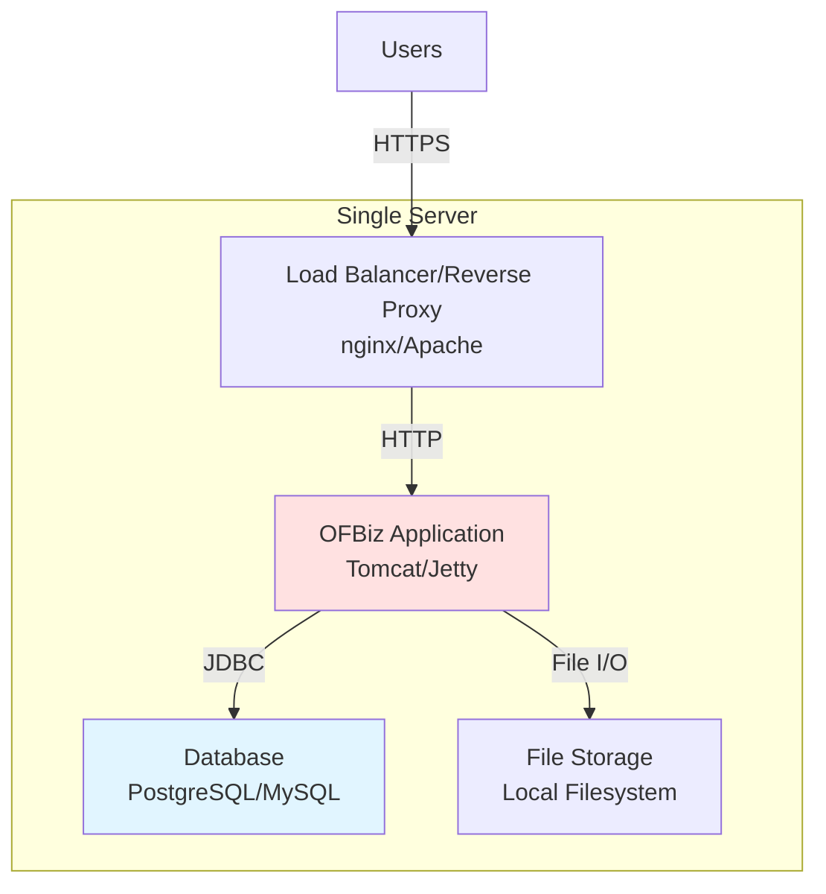
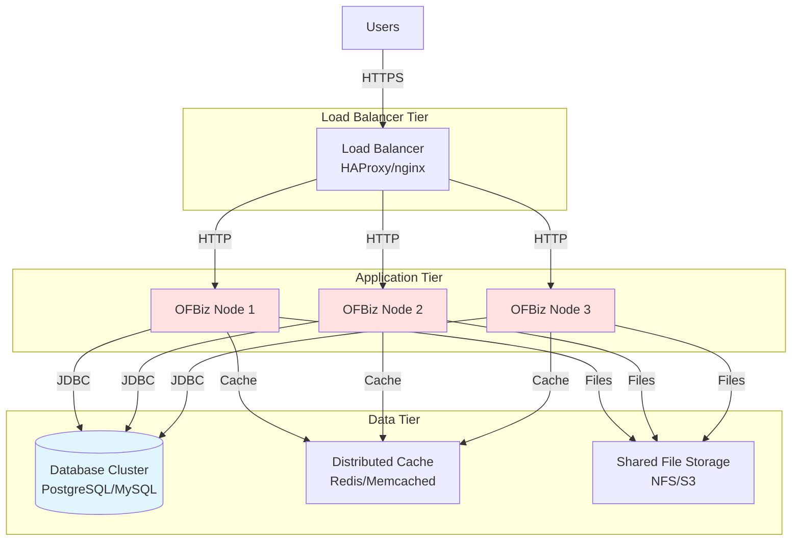
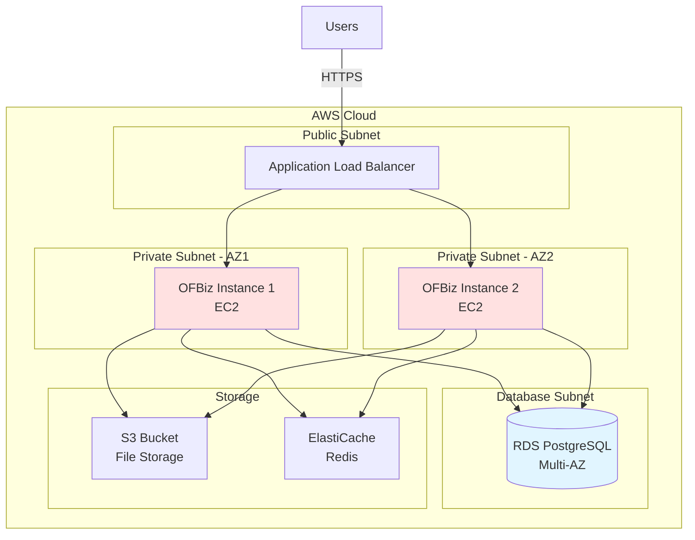
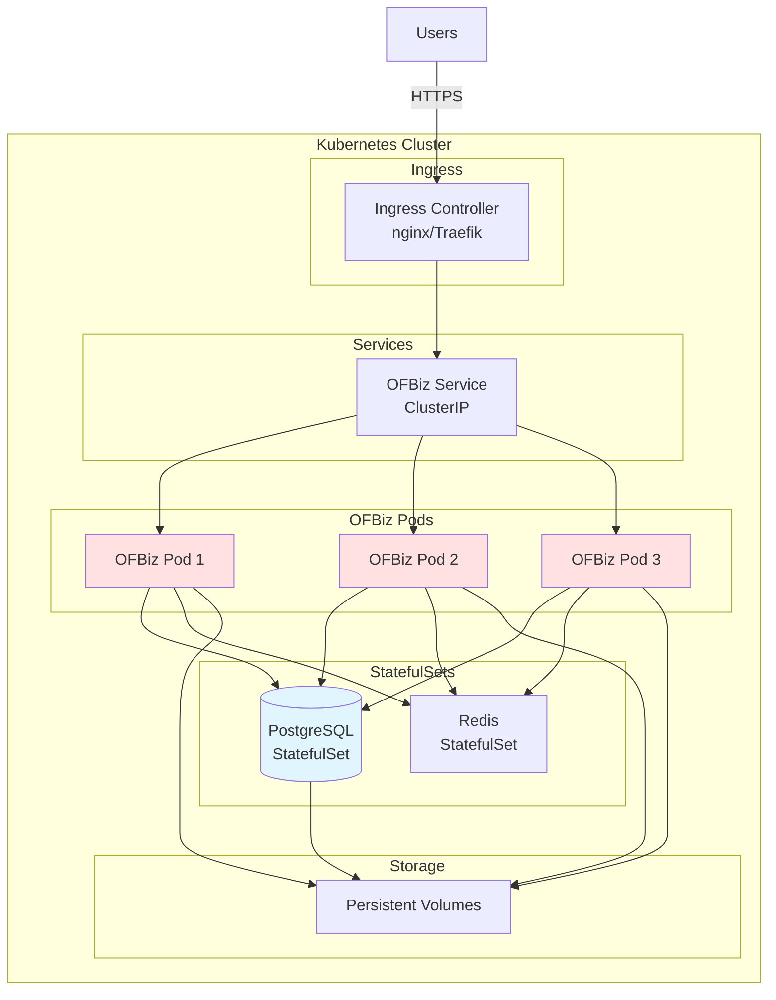

# Deployment Topologies

**Purpose**: Document OFBiz deployment patterns including standalone, clustered, cloud, and containerized deployments  
**Audience**: DevOps Engineers, System Administrators, Solution Architects  
**Prerequisites**: [System Context](system-context.md), [Modular Architecture](modular-architecture.md)  
**Related Documents**: [Runtime Architecture](../06-runtime-architecture/README.md), [Performance Characteristics](../09-quality-attributes/performance-characteristics.md)

---

## Overview

Apache OFBiz supports multiple deployment topologies to meet different scalability, availability, and operational requirements. This document covers standalone, clustered, cloud-native, and containerized deployment patterns with architecture diagrams and configuration guidance.

## Visual Architecture

### Standalone Deployment

**Diagram Description**: Standalone deployment runs all components on a single server. Users connect via load balancer/reverse proxy, which forwards to OFBiz application. OFBiz connects to local database and file storage. Suitable for development, testing, or small deployments.

### Clustered Deployment

**Diagram Description**: Clustered deployment distributes load across multiple OFBiz nodes. Load balancer routes requests to healthy nodes. All nodes share database cluster, distributed cache, and file storage. Provides high availability and horizontal scalability.

### Cloud Deployment (AWS Example)

**Diagram Description**: Cloud deployment on AWS uses managed services. Application Load Balancer distributes traffic across availability zones. OFBiz instances run on EC2 in private subnets. RDS provides managed database with multi-AZ failover. S3 for file storage, ElastiCache for distributed caching.

### Containerized Deployment (Kubernetes)

**Diagram Description**: Kubernetes deployment uses pods for OFBiz instances with horizontal pod autoscaling. Ingress controller handles external traffic. StatefulSets for database and Redis. Persistent volumes for data storage. Provides cloud-native scalability and resilience.

## Deployment Patterns

### 1. Standalone Deployment

**Use Cases**:
- Development and testing environments
- Small businesses with limited traffic
- Proof of concept deployments
- Single-tenant SaaS with dedicated instances

**Characteristics**:
- Single server runs all components
- Simplest to deploy and manage
- Limited scalability and availability
- Lower infrastructure costs

**Configuration**:
- OFBiz application server (Tomcat/Jetty)
- Database (PostgreSQL, MySQL, Derby)
- Local file storage
- Optional reverse proxy (nginx, Apache)

**Pros**:
- ✅ Simple setup and maintenance
- ✅ Low infrastructure costs
- ✅ Easy to backup and restore
- ✅ Suitable for small deployments

**Cons**:
- ❌ Single point of failure
- ❌ Limited scalability
- ❌ No high availability
- ❌ Downtime during upgrades

### 2. Clustered Deployment

**Use Cases**:
- Production environments requiring high availability
- Medium to large businesses
- Multi-tenant SaaS platforms
- Applications with variable load

**Characteristics**:
- Multiple OFBiz nodes behind load balancer
- Shared database and file storage
- Distributed caching for performance
- Horizontal scalability

**Configuration**:
- Load balancer (HAProxy, nginx, AWS ALB)
- Multiple OFBiz application servers
- Database cluster (PostgreSQL, MySQL with replication)
- Shared file storage (NFS, S3, Azure Blob)
- Distributed cache (Redis, Memcached)

**Pros**:
- ✅ High availability (no single point of failure)
- ✅ Horizontal scalability (add more nodes)
- ✅ Rolling upgrades (zero downtime)
- ✅ Better performance under load

**Cons**:
- ❌ More complex setup and management
- ❌ Higher infrastructure costs
- ❌ Requires session management
- ❌ Need distributed cache coordination

### 3. Cloud Deployment

**Use Cases**:
- Organizations using cloud infrastructure
- Global deployments across regions
- Variable workloads requiring elasticity
- Disaster recovery requirements

**Characteristics**:
- Leverages cloud-managed services
- Auto-scaling based on load
- Multi-region deployment possible
- Pay-as-you-go pricing

**AWS Configuration**:
- Application Load Balancer (ALB)
- EC2 instances with Auto Scaling Groups
- RDS for database (Multi-AZ)
- S3 for file storage
- ElastiCache for distributed caching
- CloudWatch for monitoring

**Azure Configuration**:
- Azure Load Balancer
- Virtual Machine Scale Sets
- Azure Database for PostgreSQL
- Azure Blob Storage
- Azure Cache for Redis
- Azure Monitor

**GCP Configuration**:
- Cloud Load Balancing
- Compute Engine with Managed Instance Groups
- Cloud SQL for PostgreSQL
- Cloud Storage
- Memorystore for Redis
- Cloud Monitoring

**Pros**:
- ✅ Managed services reduce operational burden
- ✅ Auto-scaling for variable load
- ✅ Global reach with multiple regions
- ✅ Built-in backup and disaster recovery

**Cons**:
- ❌ Vendor lock-in concerns
- ❌ Can be expensive at scale
- ❌ Requires cloud expertise
- ❌ Data sovereignty considerations

### 4. Containerized Deployment

**Use Cases**:
- Cloud-native architectures
- DevOps teams using containers
- Multi-environment deployments (dev, staging, prod)
- Organizations using Kubernetes

**Characteristics**:
- OFBiz packaged as Docker containers
- Orchestrated by Kubernetes
- Declarative configuration
- Immutable infrastructure

**Configuration**:
- Docker images for OFBiz
- Kubernetes Deployments for application
- StatefulSets for database
- Persistent Volumes for data
- Ingress for external access
- ConfigMaps and Secrets for configuration

**Pros**:
- ✅ Consistent environments (dev = prod)
- ✅ Fast deployment and rollback
- ✅ Efficient resource utilization
- ✅ Cloud-portable (runs anywhere)

**Cons**:
- ❌ Kubernetes complexity
- ❌ Requires container expertise
- ❌ Stateful applications challenging
- ❌ Debugging more difficult

## Deployment Considerations

### Session Management

**Sticky Sessions**:
- Load balancer routes user to same node
- Simpler implementation
- Node failure loses sessions

**Session Replication**:
- Sessions replicated across nodes
- No session loss on node failure
- Higher memory and network overhead

**External Session Store**:
- Sessions stored in Redis/database
- Best for cloud deployments
- Slight performance overhead

### File Storage

**Local Filesystem**:
- Simplest approach
- Only works for standalone
- Not suitable for clusters

**Network File System (NFS)**:
- Shared storage across nodes
- Works for on-premise clusters
- Performance bottleneck possible

**Object Storage (S3, Azure Blob)**:
- Cloud-native approach
- Highly scalable and durable
- Best for cloud deployments

### Database Considerations

**Single Database**:
- Simplest configuration
- Potential bottleneck
- Single point of failure

**Database Replication**:
- Master for writes, replicas for reads
- Improves read performance
- Adds complexity

**Database Clustering**:
- Multiple masters (PostgreSQL, MySQL Cluster)
- High availability
- More complex setup

### Caching Strategy

**Local Cache Only**:
- Each node has own cache
- Cache inconsistency across nodes
- Only for standalone

**Distributed Cache**:
- Redis or Memcached cluster
- Consistent cache across nodes
- Required for clusters

**Hybrid Caching**:
- Local L1 cache + distributed L2 cache
- Best performance
- More complex configuration

## Architecture Decision Records

### ADR-005: Clustering Support

**Context**: Need to support high availability and horizontal scaling

**Decision**: Support clustered deployment with shared database and distributed cache

**Rationale**:
- High availability requirement for production
- Horizontal scaling for growing businesses
- Industry standard pattern

**Consequences**:
- ✅ High availability
- ✅ Horizontal scalability
- ❌ Increased complexity
- ❌ Requires session management

### ADR-006: Container Support

**Context**: Growing adoption of containers and Kubernetes

**Decision**: Provide official Docker images and Kubernetes configurations

**Rationale**:
- Industry trend toward containers
- Enables cloud-native deployments
- Consistent environments

**Consequences**:
- ✅ Cloud-portable
- ✅ DevOps-friendly
- ❌ Additional maintenance burden
- ❌ Requires container expertise

## Official References

- [OFBiz Deployment Guide](https://cwiki.apache.org/confluence/display/OFBIZ/Deployment)
- [OFBiz Docker Documentation](https://github.com/apache/ofbiz-framework/blob/trunk/DOCKER.adoc)
- [Kubernetes Best Practices](https://kubernetes.io/docs/concepts/configuration/overview/)
- [AWS Well-Architected Framework](https://aws.amazon.com/architecture/well-architected/)

## Related Topics

- [Runtime Architecture](../06-runtime-architecture/README.md) - How OFBiz operates at runtime
- [Performance Characteristics](../09-quality-attributes/performance-characteristics.md) - Performance optimization
- [Reliability Patterns](../09-quality-attributes/reliability-patterns.md) - High availability patterns
- [JVM Tuning](../06-runtime-architecture/jvm-tuning.md) - JVM optimization for production

---

**Previous**: [Modular Architecture](modular-architecture.md)  
**Next**: [Technology Stack](technology-stack.md)  
**Up**: [System Overview](README.md)
