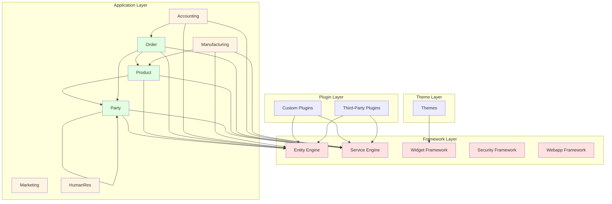
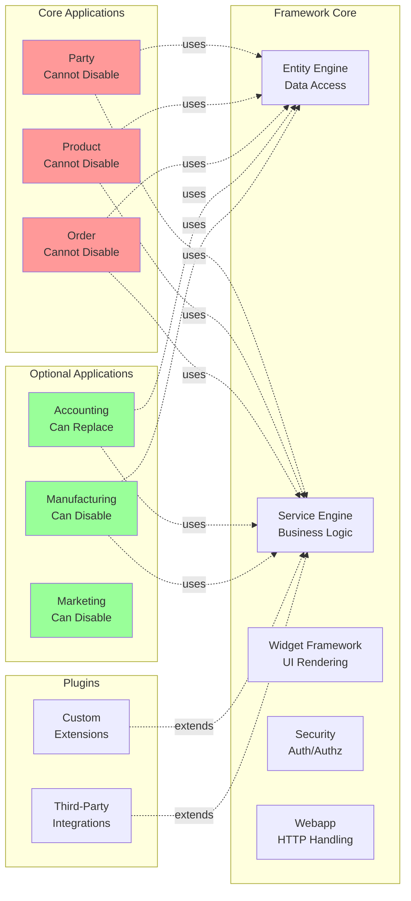
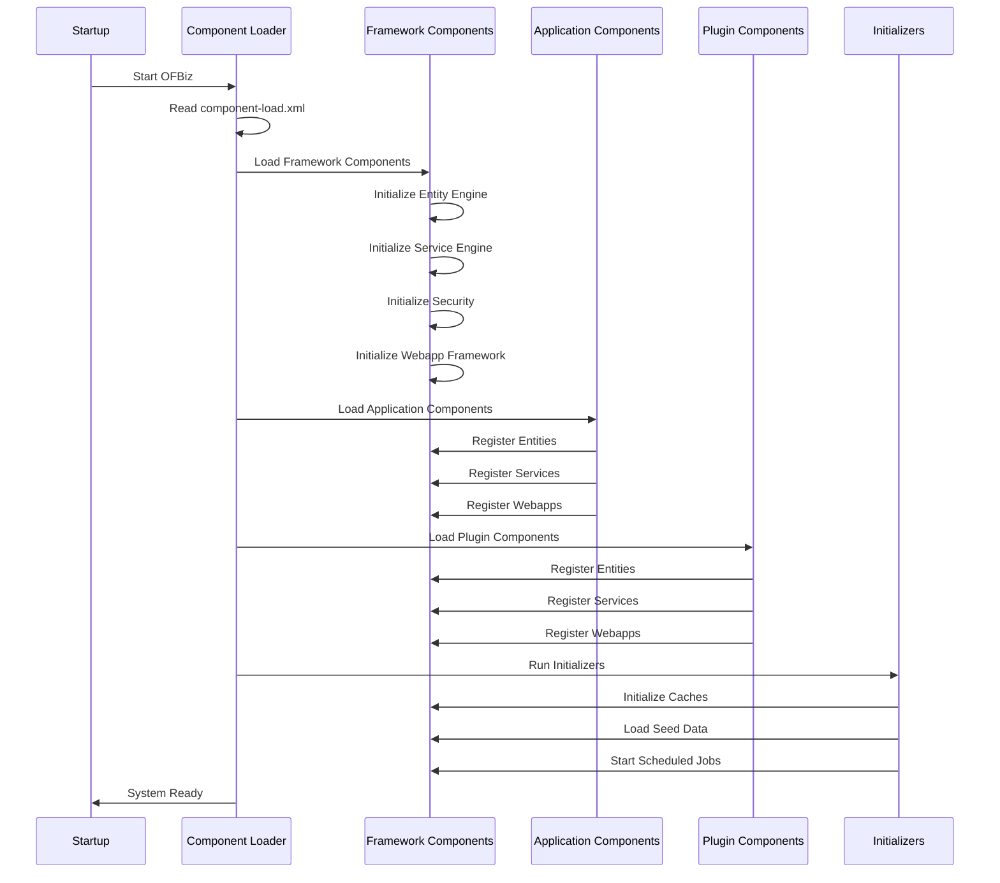
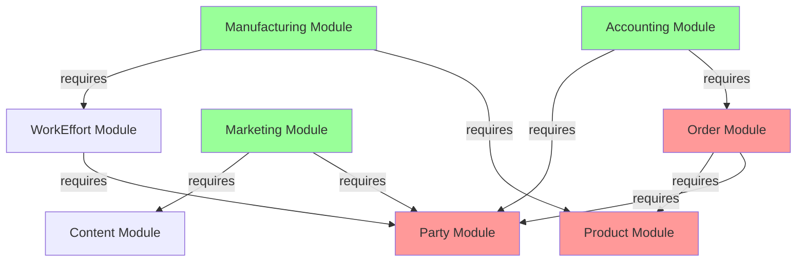

# Modular Architecture

**Purpose**: Explain OFBiz component-based architecture, module organization, and dependency management  
**Audience**: Architects, Technical Leads, Senior Developers  
**Prerequisites**: [System Context](system-context.md)  
**Related Documents**: [Application Modules](../04-application-modules/README.md), [Plugin Architecture](../08-extension-points/plugin-architecture.md)

---

## Overview

Apache OFBiz is built as a modular system where functionality is organized into loosely-coupled components. This architecture enables flexibility - components can be enabled, disabled, extended, or replaced based on business needs. Understanding the modular architecture is essential for customization, integration, and system design.

## Visual Architecture

### Component-Based Architecture Diagram



**Diagram Description**: OFBiz has four layers: Framework (red) provides core services, Application (green) contains core business modules, Application (yellow) contains optional modules, Plugin layer for extensions, and Theme layer for UI customization. Arrows show dependencies between components.

### Framework vs Applications vs Plugins



**Diagram Description**: Framework provides foundational services. Core applications (Party, Product, Order) cannot be disabled as they're fundamental to the system. Optional applications can be disabled or replaced. Plugins extend the system without modifying core code.

### Component Loading Sequence



**Diagram Description**: OFBiz startup loads components in sequence: Framework first (Entity Engine, Service Engine, etc.), then Application components (Party, Product, Order, etc.), then Plugins. Each component registers its entities, services, and webapps with the framework.

### Module Dependency Graph



**Diagram Description**: Module dependency graph shows that Party, Product, and Order (red) are core modules with many dependents. Optional modules (green) like Accounting, Manufacturing, and Marketing depend on core modules but can be disabled if not needed.

## Component Organization

### Directory Structure

```
ofbiz-framework/
├── framework/              # Framework components (cannot disable)
│   ├── base/              # Base utilities
│   ├── entity/            # Entity Engine
│   ├── service/           # Service Engine
│   ├── security/          # Security Framework
│   ├── webapp/            # Webapp Framework
│   ├── widget/            # Widget Framework
│   └── ...
├── applications/          # Business application components
│   ├── party/            # Party management (core)
│   ├── product/          # Product catalog (core)
│   ├── order/            # Order management (core)
│   ├── accounting/       # Accounting (optional)
│   ├── manufacturing/    # Manufacturing (optional)
│   ├── marketing/        # Marketing (optional)
│   └── ...
├── plugins/              # Plugin components (optional)
│   ├── custom-plugin/
│   └── ...
└── themes/               # UI themes
    ├── common-theme/
    └── ...
```

### Component Definition

Each component has an `ofbiz-component.xml` file defining:

<details>
<summary>View Component Definition Example</summary>

**File**: `applications/party/ofbiz-component.xml`

```xml
<?xml version="1.0" encoding="UTF-8"?>
<ofbiz-component name="party"
        xmlns:xsi="http://www.w3.org/2001/XMLSchema-instance"
        xsi:noNamespaceSchemaLocation="https://ofbiz.apache.org/dtds/ofbiz-component.xsd">
    
    <!-- Component metadata -->
    <resource-loader name="main" type="component"/>
    
    <!-- Classpath entries -->
    <classpath type="jar" location="build/lib/*"/>
    <classpath type="dir" location="config"/>
    
    <!-- Entity model definitions -->
    <entity-resource type="model" reader-name="main" loader="main" 
                     location="entitydef/entitymodel.xml"/>
    <entity-resource type="data" reader-name="seed" loader="main" 
                     location="data/PartyTypeData.xml"/>
    
    <!-- Service definitions -->
    <service-resource type="model" loader="main" 
                      location="servicedef/services.xml"/>
    
    <!-- Webapp definitions -->
    <webapp name="party"
            title="Party"
            server="default-server"
            location="webapp/party"
            base-permission="PARTYMGR"
            mount-point="/party"/>
    
</ofbiz-component>
```

</details>

## Benefits of Modularity

### 1. Flexibility

**Enable/Disable Components**:
- Optional modules can be disabled in `component-load.xml`
- Reduces memory footprint and startup time
- Simplifies deployment for specific use cases

**Example**: Disable manufacturing module if not needed:
```xml
<!-- component-load.xml -->
<load-component component-location="applications/party"/>
<load-component component-location="applications/product"/>
<load-component component-location="applications/order"/>
<!-- <load-component component-location="applications/manufacturing"/> -->
```

### 2. Maintainability

**Clear Boundaries**:
- Each component has defined responsibilities
- Changes isolated to specific components
- Easier to understand and modify

**Dependency Management**:
- Explicit dependencies in component definitions
- Prevents circular dependencies
- Enables impact analysis

### 3. Extensibility

**Plugin Architecture**:
- Add new functionality without modifying core
- Plugins can override or extend existing components
- Safe upgrade path (plugins separate from core)

**Custom Components**:
- Create custom components following same patterns
- Reuse framework services
- Integrate seamlessly with existing modules

### 4. Replaceability

**Service Adapter Pattern**:
- Replace entire modules with external systems
- Implement OFBiz service interfaces
- Delegate to external APIs

**Example**: Replace accounting module with QuickBooks while keeping order management in OFBiz.

## Core vs Optional Modules

### Core Modules (Cannot Disable)

**Party Module**:
- **Why Core**: Used throughout system for customers, suppliers, employees, organizations
- **Dependencies**: Nearly all modules depend on Party
- **Replacement**: Cannot disable, but can integrate with external CRM (hybrid approach)

**Product Module**:
- **Why Core**: Core to catalog, inventory, pricing, and most business operations
- **Dependencies**: Order, Manufacturing, Accounting all depend on Product
- **Replacement**: Cannot disable, but can sync with external PIM systems

**Order Module**:
- **Why Core**: Fundamental to sales, purchasing, and transaction processing
- **Dependencies**: Accounting, Fulfillment, Shipping depend on Order
- **Replacement**: Cannot disable, but can integrate with external OMS

### Optional Modules (Can Disable or Replace)

**Accounting Module**:
- **Can Disable**: Yes, if using external accounting system
- **Replacement Strategy**: Service adapters to QuickBooks, NetSuite, etc.
- **Data Sync**: Sync orders, invoices, payments to external system

**Manufacturing Module**:
- **Can Disable**: Yes, if not doing manufacturing
- **Replacement Strategy**: Integrate with specialized MES/MRP systems
- **Data Sync**: Sync BOMs, production orders, inventory

**Marketing Module**:
- **Can Disable**: Yes, if not using marketing automation
- **Replacement Strategy**: Integrate with marketing platforms (HubSpot, Marketo)
- **Data Sync**: Sync campaigns, contacts, activities

**Human Resources Module**:
- **Can Disable**: Yes, if using external HR system
- **Replacement Strategy**: Integrate with HR platforms (Workday, BambooHR)
- **Data Sync**: Sync employee data, timesheets

## Component Isolation Techniques

### 1. Service-Based Communication

Components communicate via Service Engine, not direct method calls:

```java
// Good: Service-based communication
Map<String, Object> result = dispatcher.runSync("createParty", context);

// Bad: Direct method calls between components
// PartyServices.createParty(context);  // Don't do this
```

### 2. Event-Driven Decoupling

Use ECA/SECA for loose coupling:

```xml
<!-- When order is created, trigger accounting entry -->
<eca entity-name="OrderHeader" operation="create" event="return">
    <condition field-name="statusId" operator="equals" value="ORDER_APPROVED"/>
    <action service="createAcctgTransForOrder" mode="sync"/>
</eca>
```

### 3. Interface Contracts

Define clear service interfaces that external systems can implement:

```xml
<!-- Service interface for payment processing -->
<service name="processPayment" engine="interface">
    <attribute name="orderId" type="String" mode="IN" optional="false"/>
    <attribute name="amount" type="BigDecimal" mode="IN" optional="false"/>
    <attribute name="paymentMethodId" type="String" mode="IN" optional="false"/>
    <attribute name="paymentId" type="String" mode="OUT" optional="false"/>
</service>
```

## Architecture Decision Records

### ADR-003: Component-Based vs Microservices

**Context**: Should OFBiz be refactored into microservices?

**Decision**: Maintain component-based monolith with well-defined boundaries

**Rationale**:
- Components provide modularity without microservices complexity
- Better transaction consistency across components
- Simpler deployment and operations
- Components can still be replaced via service adapters

**Consequences**:
- ✅ Simpler development and testing
- ✅ Better performance (no network overhead)
- ✅ Easier transaction management
- ❌ Must deploy all components together
- ❌ Scaling requires scaling entire application

**Mitigation**: Use clustering for horizontal scaling, service adapters for external integration

### ADR-004: Plugin Architecture

**Context**: How to enable customizations without modifying core?

**Decision**: Provide plugin mechanism that can override and extend core components

**Rationale**:
- Enables customization without forking
- Plugins separate from core for easier upgrades
- Can override entities, services, screens
- Industry standard pattern

**Consequences**:
- ✅ Safe customization path
- ✅ Easier upgrades
- ✅ Clear separation of custom vs core
- ❌ Plugin conflicts possible
- ❌ Need to manage plugin dependencies

## Official References

- [OFBiz Component Architecture](https://cwiki.apache.org/confluence/display/OFBIZ/Component+Architecture)
- [OFBiz Framework Documentation](https://ofbiz.apache.org/documentation.html)
- [Component Load Configuration](https://cwiki.apache.org/confluence/display/OFBIZ/Component+Load+Configuration)

## Related Topics

- [Application Modules](../04-application-modules/README.md) - Detailed module documentation
- [Module Isolation Techniques](../04-application-modules/module-isolation-techniques.md) - How to isolate modules
- [Module Replacement Patterns](../04-application-modules/module-replacement-patterns.md) - How to replace modules
- [Plugin Architecture](../08-extension-points/plugin-architecture.md) - Plugin system details

---

**Previous**: [System Context](system-context.md)  
**Next**: [Deployment Topologies](deployment-topologies.md)  
**Up**: [System Overview](README.md)
