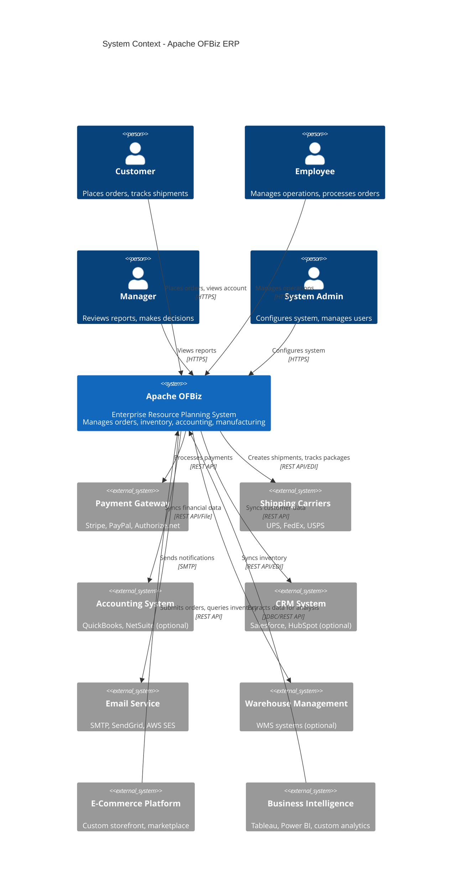
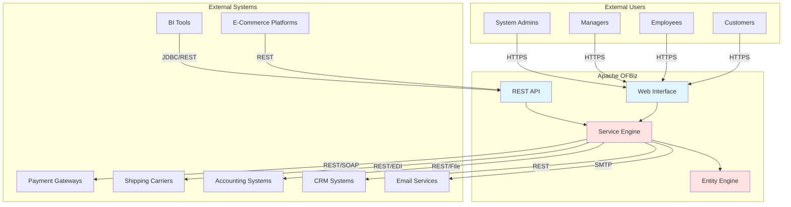

# System Context

**Purpose**: Define OFBiz system boundaries, external integrations, and stakeholder interactions  
**Audience**: Enterprise Architects, Solution Architects, Technical Decision Makers  
**Prerequisites**: None - this is a starting point  
**Related Documents**: [Modular Architecture](modular-architecture.md), [Integration Architecture](../05-integration-architecture/README.md)

---

## Overview

Apache OFBiz is an enterprise resource planning (ERP) system that manages business operations including order management, inventory, accounting, manufacturing, and customer relationships. This document defines the system context - what OFBiz does, its boundaries, and how it interacts with external systems and users.

## Visual Architecture

### System Context Diagram (C4 Level 1)

**Diagram Description**: This C4 context diagram shows OFBiz at the center, surrounded by users (customers, employees, managers, admins) and external systems. OFBiz integrates with payment gateways, shipping carriers, optional external accounting/CRM systems, email services, warehouse management systems, e-commerce platforms, and business intelligence tools.

### Integration Points Diagram

**Diagram Description**: This diagram shows the integration architecture. Users access OFBiz via web interface (HTTPS). External systems integrate via REST APIs, SOAP, EDI, or JDBC. All integrations flow through the Service Engine, which coordinates with the Entity Engine for data access.

## System Boundaries

### What OFBiz Does (Inside the Boundary)

**Core Capabilities**:
- **Order Management**: Sales orders, purchase orders, quotes, returns
- **Inventory Management**: Stock tracking, warehouse management, lot/serial tracking
- **Product Catalog**: Product information, categories, pricing, promotions
- **Party Management**: Customers, suppliers, employees, organizations, relationships
- **Accounting**: General ledger, accounts payable/receivable, invoicing
- **Manufacturing**: Bill of materials, production runs, MRP
- **Human Resources**: Employee management, timesheets, payroll integration
- **Content Management**: Documents, images, digital assets
- **Workflow & Automation**: Business process automation via ECA/SECA

**Technical Capabilities**:
- **Data Management**: Entity engine with caching and transaction management
- **Business Logic**: Service engine with sync/async execution
- **User Interface**: Widget-based UI framework with themes
- **Security**: Authentication, authorization, encryption
- **Integration**: REST APIs, web services, EDI
- **Reporting**: Built-in reports and BI tool integration

### What OFBiz Doesn't Do (Outside the Boundary)

**Typically External**:
- **Payment Processing**: Delegates to payment gateways (Stripe, PayPal)
- **Shipping Label Generation**: Integrates with carrier APIs (UPS, FedEx)
- **Email Delivery**: Uses SMTP servers or email services
- **Advanced Analytics**: Exports data to BI tools (Tableau, Power BI)
- **Customer-Facing E-Commerce**: Often uses separate storefront with API integration
- **Document Storage**: Can integrate with external document management systems
- **Identity Management**: Can integrate with enterprise SSO/LDAP

**Optionally External** (Can use OFBiz or external system):
- **Accounting**: Can use OFBiz accounting or integrate with QuickBooks/NetSuite
- **CRM**: Can use OFBiz party management or integrate with Salesforce
- **Warehouse Management**: Can use OFBiz inventory or integrate with specialized WMS
- **Manufacturing**: Can use OFBiz manufacturing or integrate with specialized MES

## Stakeholder Identification

### Primary Stakeholders

**Customers**:
- Place orders online or through sales representatives
- Track order status and shipments
- View account history and invoices
- Manage profile and preferences

**Employees**:
- Process orders and manage fulfillment
- Manage inventory and purchasing
- Handle customer service inquiries
- Execute business operations

**Managers**:
- Review operational reports and dashboards
- Approve workflows and exceptions
- Monitor KPIs and business metrics
- Make strategic decisions

**System Administrators**:
- Configure system settings and business rules
- Manage users, roles, and permissions
- Monitor system health and performance
- Perform backups and upgrades

### Secondary Stakeholders

**Developers**:
- Build customizations and extensions
- Integrate external systems
- Develop custom reports and workflows
- Maintain and upgrade the system

**Business Analysts**:
- Define business requirements
- Configure business rules and workflows
- Design reports and analytics
- Train end users

**IT Operations**:
- Deploy and maintain infrastructure
- Monitor system performance
- Ensure security and compliance
- Manage disaster recovery

**External Partners**:
- Suppliers receiving purchase orders
- Customers placing orders via API
- Third-party logistics providers
- Payment and shipping service providers

## Integration Patterns

### Inbound Integrations (External → OFBiz)

**E-Commerce Orders**:
- Pattern: REST API calls from storefront
- Data: Order details, customer information
- Frequency: Real-time per order
- Protocol: HTTPS/REST JSON

**Inventory Updates from WMS**:
- Pattern: REST API or file-based sync
- Data: Stock levels, locations, movements
- Frequency: Near real-time or scheduled
- Protocol: REST API or EDI

**Customer Data from CRM**:
- Pattern: REST API sync or event-driven
- Data: Customer profiles, contacts, activities
- Frequency: Real-time or scheduled
- Protocol: REST API

### Outbound Integrations (OFBiz → External)

**Payment Processing**:
- Pattern: REST API calls to payment gateway
- Data: Payment details, amounts, customer info
- Frequency: Real-time per transaction
- Protocol: HTTPS/REST

**Shipping Label Generation**:
- Pattern: REST API calls to carrier
- Data: Shipment details, addresses, weights
- Frequency: Real-time per shipment
- Protocol: REST API or EDI

**Financial Data to Accounting System**:
- Pattern: REST API sync or file export
- Data: Transactions, invoices, journal entries
- Frequency: Scheduled (daily/hourly)
- Protocol: REST API or CSV/XML files

**Data to BI Tools**:
- Pattern: JDBC connection or REST API
- Data: Operational and analytical data
- Frequency: Scheduled or on-demand
- Protocol: JDBC or REST API

## Deployment Context

### Typical Deployment Scenarios

**Scenario 1: All-in-One OFBiz**:
- Use OFBiz for all ERP functions
- Minimal external integrations
- Best for: Small to medium businesses, startups

**Scenario 2: OFBiz with External Accounting**:
- Use OFBiz for operations (orders, inventory)
- Integrate with QuickBooks/NetSuite for accounting
- Best for: Companies with established accounting systems

**Scenario 3: OFBiz as Backend for E-Commerce**:
- Custom storefront for customer experience
- OFBiz handles orders, inventory, fulfillment
- Best for: Companies needing custom customer experience

**Scenario 4: Hybrid Architecture**:
- OFBiz for core operations
- External CRM (Salesforce) for sales
- External accounting (QuickBooks) for finance
- Best for: Enterprises with best-of-breed strategy

## Architecture Decision Records

### ADR-001: OFBiz as Monolithic vs Microservices

**Context**: OFBiz is built as a modular monolith, not microservices

**Decision**: Maintain modular monolith architecture with well-defined component boundaries

**Rationale**:
- Simpler deployment and operations
- Better transaction consistency
- Lower operational complexity
- Components can still be replaced via service adapters

**Consequences**:
- ✅ Easier to develop and test
- ✅ Better performance (no network overhead)
- ✅ Simpler transaction management
- ❌ All components must be deployed together
- ❌ Scaling requires scaling entire application

**Mitigation**: Use clustering for horizontal scaling, service adapters for external system integration

### ADR-002: Integration via REST APIs

**Context**: Need standard integration mechanism for external systems

**Decision**: Provide REST APIs as primary integration mechanism

**Rationale**:
- Industry standard
- Language agnostic
- Easy to consume
- Good tooling support

**Consequences**:
- ✅ Wide compatibility
- ✅ Easy for partners to integrate
- ✅ Supports modern architectures
- ❌ Requires API versioning strategy
- ❌ Need to maintain backward compatibility

## Official References

- [Apache OFBiz Official Documentation](https://ofbiz.apache.org/documentation.html)
- [OFBiz Architecture Overview](https://cwiki.apache.org/confluence/display/OFBIZ/Architecture+Overview)
- [C4 Model for Architecture Diagrams](https://c4model.com/)
- [Enterprise Integration Patterns](https://www.enterpriseintegrationpatterns.com/)

## Related Topics

- [Modular Architecture](modular-architecture.md) - How OFBiz components are organized
- [Integration Architecture](../05-integration-architecture/README.md) - Detailed integration patterns
- [REST API Architecture](../05-integration-architecture/rest-api-architecture.md) - API design and implementation
- [External Integration Examples](../04-application-modules/external-integration-examples/) - Real-world integration patterns

---

**Next**: [Modular Architecture](modular-architecture.md)  
**Up**: [System Overview](README.md)
