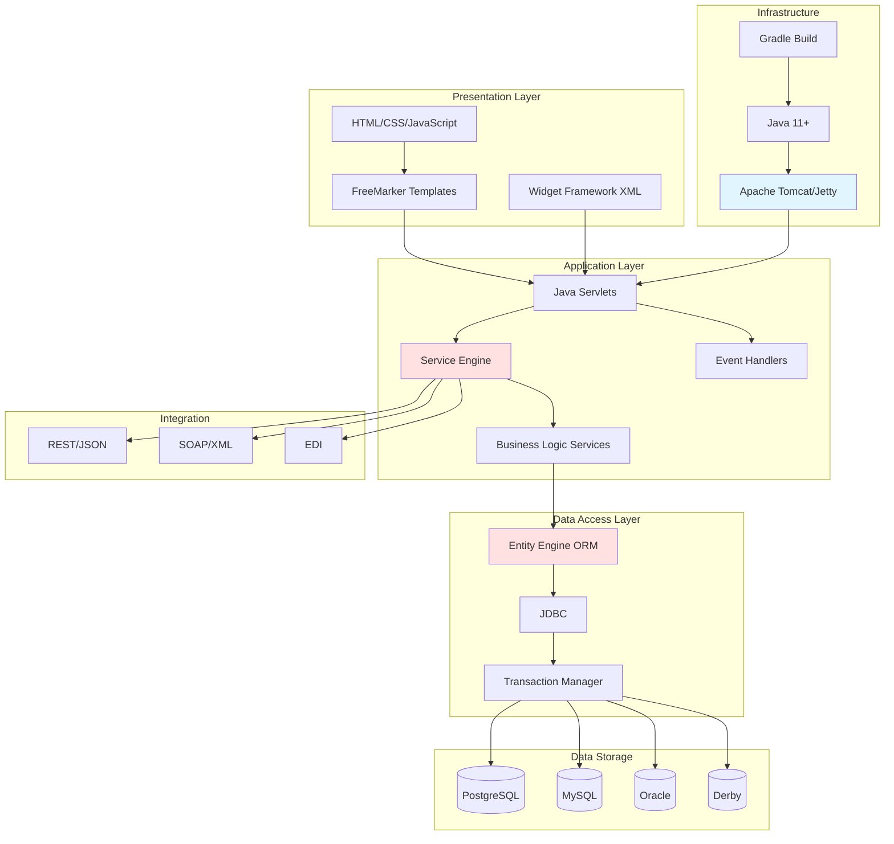
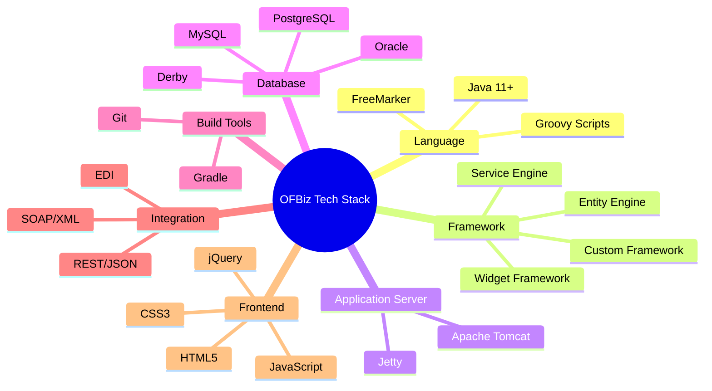

# Technology Stack

**Purpose**: Document OFBiz technology choices, rationale, and architecture decisions  
**Audience**: Architects, Technical Decision Makers, Developers  
**Prerequisites**: [System Context](system-context.md)  
**Related Documents**: [Architecture Philosophy](architecture-philosophy.md), [Framework Core](../02-framework-core/README.md)

---

## Overview

Apache OFBiz is built on mature, open-source Java technologies. This document explains the technology stack, rationale for each choice, and alternatives considered. Understanding the technology stack is essential for evaluating OFBiz fit, planning integrations, and making informed customization decisions.

## Visual Architecture

### Technology Stack Diagram



**Diagram Description**: OFBiz technology stack showing layers from presentation (FreeMarker, Widgets) through application (Services, Events) to data access (Entity Engine, JDBC) and infrastructure (Tomcat, Java). Supports multiple databases and integration protocols.

### Core Technologies Overview



**Diagram Description**: Mind map showing OFBiz core technologies organized by category: Language (Java, Groovy, FreeMarker), Framework (custom components), Application Server (Tomcat, Jetty), Database (multiple options), Build Tools (Gradle, Git), Integration (REST, SOAP, EDI), and Frontend (HTML5, CSS3, JavaScript).

## Technology Choices

### Programming Language: Java

**Choice**: Java 11+ (LTS versions)

**Rationale**:
- Enterprise-grade language with mature ecosystem
- Strong typing and compile-time checking
- Excellent performance and scalability
- Large talent pool
- Cross-platform compatibility
- Long-term support (LTS) versions

**Alternatives Considered**:
- **Python**: Easier to learn but slower performance, less enterprise adoption
- **C#/.NET**: Excellent but Windows-centric, licensing concerns
- **Node.js**: Good for I/O but less suitable for complex business logic

**Trade-offs**:
- ✅ Mature, stable, well-supported
- ✅ Excellent tooling and libraries
- ✅ Strong performance
- ❌ More verbose than modern languages
- ❌ Slower development than dynamic languages

### Application Server: Apache Tomcat

**Choice**: Apache Tomcat (default), Jetty (alternative)

**Rationale**:
- Industry-standard servlet container
- Lightweight and fast
- Excellent documentation and community
- Easy to deploy and manage
- No licensing costs

**Alternatives Considered**:
- **WildFly/JBoss**: Full Java EE but heavier, more complex
- **WebLogic**: Commercial, expensive licensing
- **WebSphere**: Commercial, complex, expensive

**Trade-offs**:
- ✅ Lightweight and fast
- ✅ Easy to configure
- ✅ Wide adoption
- ❌ Not full Java EE (but OFBiz doesn't need it)

### Database: Multi-Database Support

**Choice**: Support PostgreSQL, MySQL, Oracle, Derby

**Rationale**:
- Avoid vendor lock-in
- Support customer preferences
- Enable different databases for different use cases
- Derby for development/testing

**Primary Recommendation**: PostgreSQL

**Why PostgreSQL**:
- Open source, no licensing costs
- Excellent performance and reliability
- Advanced features (JSON, full-text search, partitioning)
- Strong community and commercial support
- ACID compliant with excellent transaction support

**Alternatives**:
- **MySQL**: Popular, good performance, Oracle ownership concerns
- **Oracle**: Enterprise features but expensive licensing
- **Derby**: Embedded database, good for development only

**Trade-offs**:
- ✅ Database portability
- ✅ Customer choice
- ❌ Must support multiple SQL dialects
- ❌ Testing complexity

### ORM: Custom Entity Engine

**Choice**: Custom Entity Engine (not Hibernate/JPA)

**Rationale**:
- Built specifically for OFBiz data model
- Optimized for OFBiz patterns
- Tight integration with caching and transactions
- No impedance mismatch
- Full control over implementation

**Alternatives Considered**:
- **Hibernate**: Industry standard but heavyweight, complex
- **JPA**: Standard but less flexible
- **MyBatis**: Lightweight but less abstraction

**Trade-offs**:
- ✅ Optimized for OFBiz
- ✅ Simpler than Hibernate
- ✅ Better performance for OFBiz patterns
- ❌ Custom learning curve
- ❌ Smaller community than Hibernate

**Note**: Entity Engine can be replaced with Hibernate/JPA if needed. See [Entity Engine Replacement Strategies](../02-framework-core/entity-engine/replacement-strategies.md).

### Template Engine: FreeMarker

**Choice**: FreeMarker for server-side templating

**Rationale**:
- Powerful and flexible
- Good performance
- Clear separation of logic and presentation
- Mature and stable
- Apache license

**Alternatives Considered**:
- **JSP**: Older technology, mixing Java and HTML
- **Thymeleaf**: Modern but less mature when OFBiz adopted FreeMarker
- **Velocity**: Similar to FreeMarker but less active

**Trade-offs**:
- ✅ Powerful template language
- ✅ Good performance
- ✅ Clean syntax
- ❌ Learning curve
- ❌ Server-side rendering (not SPA-friendly)

**Note**: Widget Framework can be replaced with modern frontend frameworks. See [Widget Replacement Strategies](../02-framework-core/widget-framework/replacement-strategies.md).

### Build Tool: Gradle

**Choice**: Gradle (migrated from Ant)

**Rationale**:
- Modern, flexible build system
- Better dependency management than Ant
- Groovy/Kotlin DSL for build scripts
- Incremental builds for faster development
- Industry standard for Java projects

**Alternatives Considered**:
- **Maven**: XML-based, less flexible
- **Ant**: Legacy, limited dependency management
- **Bazel**: Powerful but complex, overkill for OFBiz

**Trade-offs**:
- ✅ Modern and flexible
- ✅ Good dependency management
- ✅ Fast incremental builds
- ❌ Learning curve
- ❌ Build scripts can be complex

### Integration: REST/SOAP/EDI

**Choice**: Support multiple integration protocols

**Rationale**:
- REST for modern integrations
- SOAP for legacy enterprise systems
- EDI for supply chain integrations
- Flexibility for different integration scenarios

**Primary Recommendation**: REST with JSON

**Why REST**:
- Industry standard for modern APIs
- Simple and lightweight
- Language agnostic
- Good tooling support
- Stateless and scalable

**Trade-offs**:
- ✅ Multiple protocol support
- ✅ Flexibility
- ❌ Must maintain multiple integration paths
- ❌ More testing required

## Technology Dependencies

### Core Dependencies

<details>
<summary>View Core Dependencies</summary>

**Runtime Dependencies**:
- Java 11+ (OpenJDK or Oracle JDK)
- Apache Tomcat 9+ or Jetty 9+
- Database (PostgreSQL 10+, MySQL 5.7+, Oracle 12c+, Derby 10.14+)

**Build Dependencies**:
- Gradle 7+
- Git for version control

**Optional Dependencies**:
- Redis/Memcached for distributed caching
- SMTP server for email
- Payment gateway SDKs (Stripe, PayPal, etc.)
- Shipping carrier SDKs (UPS, FedEx, etc.)

</details>

### Library Dependencies

<details>
<summary>View Major Libraries</summary>

**File**: `dependencies.gradle`

```groovy
// Core Framework
freemarker: '2.3.31'
groovy: '3.0.9'
commons-collections: '4.4'
commons-lang: '3.12.0'

// Database
postgresql: '42.3.1'
mysql: '8.0.27'
derby: '10.14.2.0'

// Web
servlet-api: '4.0.1'
jsp-api: '2.3.3'

// Logging
log4j: '2.17.1'

// Testing
junit: '4.13.2'
mockito: '4.0.0'

// Security
bcrypt: '0.9.0'
owasp-encoder: '1.2.3'
```

</details>

## Technology Roadmap

### Current State (2024)

- Java 11+ (LTS)
- Gradle 7+
- Tomcat 9+
- PostgreSQL 10+
- FreeMarker 2.3+
- Modern JavaScript (ES6+)

### Future Considerations

**Java Version**:
- Migrate to Java 17 LTS (next LTS version)
- Evaluate Java 21 LTS when stable
- Maintain backward compatibility

**Frontend Modernization**:
- Support for React/Vue/Angular integration
- REST API improvements for SPA frontends
- GraphQL API consideration

**Cloud-Native**:
- Improved Kubernetes support
- Cloud-native configuration (12-factor app)
- Observability improvements (metrics, tracing)

**Performance**:
- GraalVM native image exploration
- Reactive programming patterns
- Async/non-blocking I/O

## Architecture Decision Records

### ADR-007: Java as Primary Language

**Context**: Need to choose primary programming language

**Decision**: Use Java as primary language with Groovy for scripting

**Rationale**:
- Enterprise-grade with mature ecosystem
- Strong typing and tooling
- Large talent pool
- Cross-platform
- Long-term support

**Consequences**:
- ✅ Mature, stable, well-supported
- ✅ Excellent performance
- ❌ More verbose than modern languages
- ❌ Slower development than dynamic languages

### ADR-008: Custom Entity Engine vs Hibernate

**Context**: Need ORM for database access

**Decision**: Build custom Entity Engine optimized for OFBiz

**Rationale**:
- OFBiz data model is unique (universal data model)
- Need tight integration with caching and transactions
- Hibernate is heavyweight and complex
- Full control over implementation

**Consequences**:
- ✅ Optimized for OFBiz patterns
- ✅ Simpler than Hibernate
- ✅ Better performance
- ❌ Custom learning curve
- ❌ Smaller community

**Mitigation**: Provide replacement strategy for Hibernate/JPA if needed

### ADR-009: Multi-Database Support

**Context**: Should we support multiple databases or standardize on one?

**Decision**: Support PostgreSQL, MySQL, Oracle, Derby

**Rationale**:
- Avoid vendor lock-in
- Support customer preferences
- Enable different databases for different use cases
- Competitive advantage

**Consequences**:
- ✅ Database portability
- ✅ Customer choice
- ❌ Must support multiple SQL dialects
- ❌ Testing complexity

**Mitigation**: Recommend PostgreSQL as primary, test thoroughly on all supported databases

### ADR-010: Gradle Migration

**Context**: Ant build system is outdated

**Decision**: Migrate from Ant to Gradle

**Rationale**:
- Modern build system
- Better dependency management
- Faster incremental builds
- Industry standard

**Consequences**:
- ✅ Modern and flexible
- ✅ Better dependency management
- ❌ Migration effort required
- ❌ Learning curve for existing developers

**Status**: Completed in OFBiz 17.12

## Official References

- [Apache OFBiz Technical Documentation](https://ofbiz.apache.org/documentation.html)
- [Java SE Documentation](https://docs.oracle.com/en/java/)
- [Apache Tomcat Documentation](https://tomcat.apache.org/tomcat-9.0-doc/)
- [PostgreSQL Documentation](https://www.postgresql.org/docs/)
- [FreeMarker Documentation](https://freemarker.apache.org/docs/)
- [Gradle Documentation](https://docs.gradle.org/)

## Related Topics

- [Architecture Philosophy](architecture-philosophy.md) - Design principles and rationale
- [Framework Core](../02-framework-core/README.md) - Framework component details
- [Runtime Architecture](../06-runtime-architecture/README.md) - How technologies work together at runtime
- [JVM Tuning](../06-runtime-architecture/jvm-tuning.md) - Java performance optimization

---

**Previous**: [Deployment Topologies](deployment-topologies.md)  
**Next**: [Architecture Philosophy](architecture-philosophy.md)  
**Up**: [System Overview](README.md)
