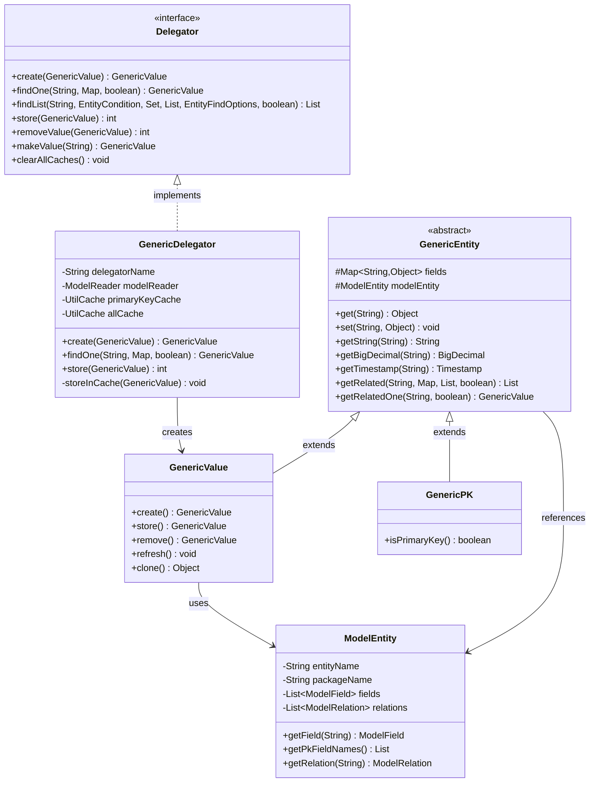
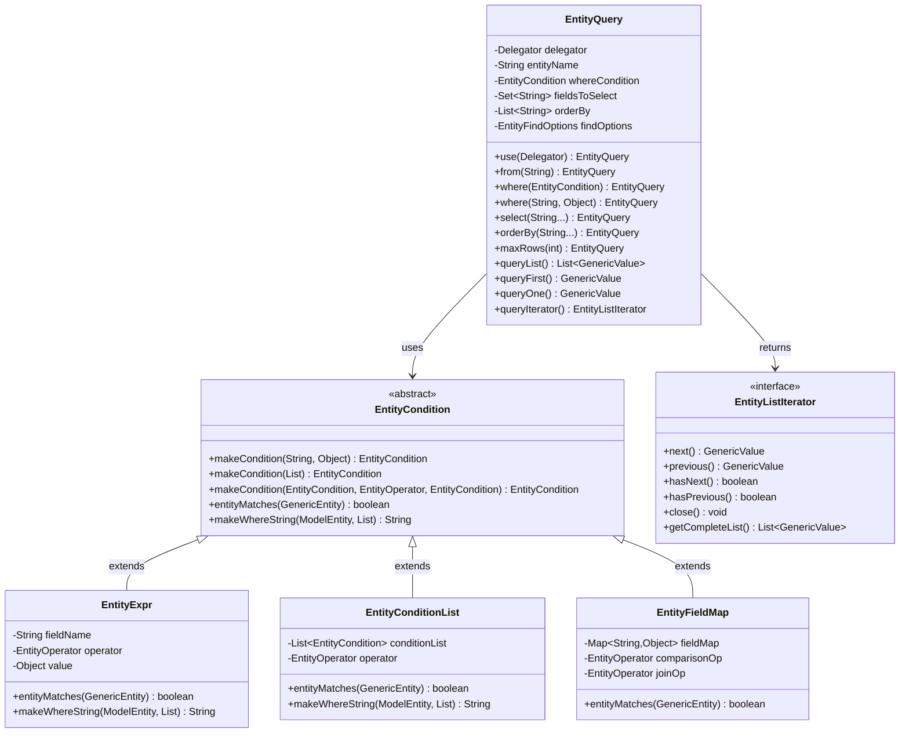
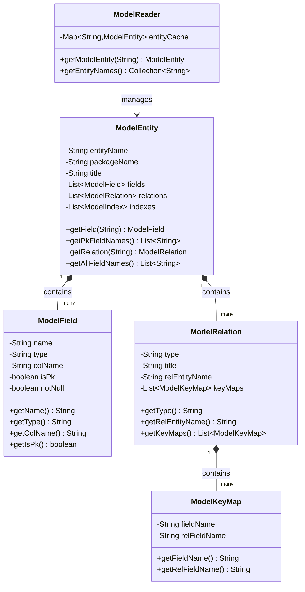

# Entity Engine Class Structure

**Purpose**: Document Entity Engine class hierarchy, interfaces, and design patterns  
**Audience**: Developers, Technical Architects  
**Prerequisites**: [Entity Engine Overview](overview.md)  
**Related Documents**: [Query Engine](query-engine.md), [Transaction Management](transaction-management.md)

---

## Overview

The Entity Engine uses well-defined class hierarchies and design patterns to provide flexible, maintainable data access. This document details the class structure with UML diagrams, key interfaces, and design patterns used.

## Visual Architecture

### Core Class Hierarchy



**Diagram Description**: Core Entity Engine class hierarchy showing Delegator interface implemented by GenericDelegator, GenericEntity as abstract base class extended by GenericValue and GenericPK, and ModelEntity containing metadata.

### Entity Query API Classes



**Diagram Description**: Entity Query API showing EntityQuery builder class, EntityCondition hierarchy for WHERE clauses (EntityExpr, EntityConditionList, EntityFieldMap), and EntityListIterator for result iteration.


### Model Classes



**Diagram Description**: Model classes representing entity metadata: ModelEntity contains ModelFields and ModelRelations, ModelRelation contains ModelKeyMaps for relationship mapping, ModelReader manages entity metadata cache.

## Key Interfaces and Classes

### Delegator Interface

The main interface for all Entity Engine operations.

<details>
<summary>View Delegator Interface Details</summary>

**File**: `framework/entity/src/main/java/org/apache/ofbiz/entity/Delegator.java`

**Key Methods**:

```java
public interface Delegator {
    // Factory methods
    GenericValue makeValue(String entityName);
    GenericPK makePK(String entityName);
    
    // Create operations
    GenericValue create(GenericValue value) throws GenericEntityException;
    GenericValue createSetNextSeqId(GenericValue value) throws GenericEntityException;
    List<GenericValue> storeAll(List<GenericValue> values) throws GenericEntityException;
    
    // Read operations
    GenericValue findOne(String entityName, Map<String, ?> fields, boolean useCache) 
        throws GenericEntityException;
    GenericValue findOne(String entityName, boolean useCache, Object... fields) 
        throws GenericEntityException;
    List<GenericValue> findByAnd(String entityName, Map<String, ?> fields, 
        List<String> orderBy, boolean useCache) throws GenericEntityException;
    List<GenericValue> findList(String entityName, EntityCondition condition, 
        Set<String> fieldsToSelect, List<String> orderBy, 
        EntityFindOptions findOptions, boolean useCache) throws GenericEntityException;
    EntityListIterator find(String entityName, EntityCondition condition, 
        EntityCondition havingCondition, Set<String> fieldsToSelect, 
        List<String> orderBy, EntityFindOptions findOptions) throws GenericEntityException;
    
    // Update operations
    int store(GenericValue value) throws GenericEntityException;
    int storeAll(List<GenericValue> values) throws GenericEntityException;
    
    // Delete operations
    int removeValue(GenericValue value) throws GenericEntityException;
    int removeByAnd(String entityName, Map<String, ?> fields) throws GenericEntityException;
    int removeByCondition(String entityName, EntityCondition condition) 
        throws GenericEntityException;
    
    // Cache operations
    void clearAllCaches();
    void clearCacheLine(String entityName, Map<String, ?> fields);
    void clearCacheLine(GenericValue value);
    void clearCacheLineFlexible(GenericEntity dummyPK);
    
    // Metadata
    ModelEntity getModelEntity(String entityName);
    ModelReader getModelReader();
    
    // Transaction
    TransactionUtil getTransactionUtil();
}
```

**Design Pattern**: Facade pattern - provides simplified interface to complex subsystem

</details>

### GenericEntity Abstract Class

Base class for all entity objects.

<details>
<summary>View GenericEntity Class Details</summary>

**File**: `framework/entity/src/main/java/org/apache/ofbiz/entity/GenericEntity.java`

**Key Methods**:

```java
public abstract class GenericEntity implements Map<String, Object>, Serializable, Cloneable {
    protected Map<String, Object> fields;
    protected ModelEntity modelEntity;
    
    // Field access
    public Object get(String name);
    public void set(String name, Object value);
    public String getString(String name);
    public Timestamp getTimestamp(String name);
    public BigDecimal getBigDecimal(String name);
    public Long getLong(String name);
    public Double getDouble(String name);
    
    // Relationship navigation
    public List<GenericValue> getRelated(String relationName, Map<String, ?> byAndFields, 
        List<String> orderBy, boolean useCache) throws GenericEntityException;
    public GenericValue getRelatedOne(String relationName, boolean useCache) 
        throws GenericEntityException;
    public List<GenericValue> getRelatedMulti(String relationName, boolean useCache) 
        throws GenericEntityException;
    
    // Utility
    public GenericPK getPrimaryKey();
    public boolean containsPrimaryKey();
    public Map<String, Object> getAllFields();
    public ModelEntity getModelEntity();
    public String getEntityName();
}
```

**Design Pattern**: Template Method pattern - defines skeleton of operations, subclasses provide specifics

</details>

### GenericValue Class

Represents a mutable entity instance.

<details>
<summary>View GenericValue Class Details</summary>

**File**: `framework/entity/src/main/java/org/apache/ofbiz/entity/GenericValue.java`

**Key Methods**:

```java
public class GenericValue extends GenericEntity {
    private Delegator internalDelegator;
    
    // CRUD operations
    public GenericValue create() throws GenericEntityException;
    public GenericValue store() throws GenericEntityException;
    public GenericValue remove() throws GenericEntityException;
    public void refresh() throws GenericEntityException;
    
    // Relationship operations
    public void setRelated(String relationName, List<GenericValue> relatedValues) 
        throws GenericEntityException;
    public void removeRelated(String relationName) throws GenericEntityException;
    
    // Utility
    public GenericValue clone();
    public boolean isModified();
    public void synchronizedWithDatasource();
}
```

**Usage Example**:

```java
// Create new entity
GenericValue party = delegator.makeValue("Party");
party.set("partyId", "10000");
party.set("partyTypeId", "PERSON");
party.create();

// Update entity
party.set("statusId", "PARTY_ENABLED");
party.store();

// Delete entity
party.remove();
```

</details>

### EntityQuery Builder

Fluent API for building queries.

<details>
<summary>View EntityQuery Class Details</summary>

**File**: `framework/entity/src/main/java/org/apache/ofbiz/entity/util/EntityQuery.java`

**Key Methods**:

```java
public final class EntityQuery {
    private Delegator delegator;
    private String entityName;
    private EntityCondition whereCondition;
    private Set<String> fieldsToSelect;
    private List<String> orderBy;
    private EntityFindOptions findOptions;
    
    // Factory
    public static EntityQuery use(Delegator delegator);
    
    // Builder methods
    public EntityQuery from(String entityName);
    public EntityQuery where(EntityCondition condition);
    public EntityQuery where(String fieldName, Object value);
    public EntityQuery where(Map<String, Object> fields);
    public EntityQuery select(String... fields);
    public EntityQuery select(Set<String> fields);
    public EntityQuery orderBy(String... orderBy);
    public EntityQuery orderBy(List<String> orderBy);
    public EntityQuery maxRows(int maxRows);
    public EntityQuery offset(int offset);
    public EntityQuery distinct();
    public EntityQuery cursorScrollInsensitive();
    public EntityQuery cursorForwardOnly();
    
    // Terminal operations
    public List<GenericValue> queryList() throws GenericEntityException;
    public GenericValue queryFirst() throws GenericEntityException;
    public GenericValue queryOne() throws GenericEntityException;
    public EntityListIterator queryIterator() throws GenericEntityException;
    public long queryCount() throws GenericEntityException;
}
```

**Usage Example**:

```java
// Simple query
List<GenericValue> parties = EntityQuery.use(delegator)
    .from("Party")
    .where("partyTypeId", "PERSON")
    .queryList();

// Complex query
List<GenericValue> orders = EntityQuery.use(delegator)
    .from("OrderHeader")
    .where(EntityCondition.makeCondition(
        EntityCondition.makeCondition("statusId", "ORDER_APPROVED"),
        EntityOperator.AND,
        EntityCondition.makeCondition("orderDate", EntityOperator.GREATER_THAN, yesterday)
    ))
    .select("orderId", "orderDate", "grandTotal")
    .orderBy("-orderDate")
    .maxRows(100)
    .queryList();
```

**Design Pattern**: Builder pattern - constructs complex objects step by step

</details>

## Design Patterns Used

### 1. Facade Pattern (Delegator)

**Purpose**: Provide simplified interface to Entity Engine subsystem

**Implementation**: Delegator interface hides complexity of:
- Cache management
- Transaction handling
- SQL generation
- Connection pooling
- Metadata reading

**Benefits**:
- Simpler API for clients
- Decouples clients from implementation
- Easier to change implementation

### 2. Factory Pattern (makeValue, makePK)

**Purpose**: Create entity objects without exposing creation logic

**Implementation**:
```java
GenericValue party = delegator.makeValue("Party");
GenericPK pk = delegator.makePK("Party", "partyId", "10000");
```

**Benefits**:
- Centralized object creation
- Can add caching or pooling
- Consistent initialization

### 3. Builder Pattern (EntityQuery)

**Purpose**: Construct complex queries step by step

**Implementation**:
```java
EntityQuery.use(delegator)
    .from("OrderHeader")
    .where("statusId", "ORDER_APPROVED")
    .orderBy("-orderDate")
    .maxRows(100)
    .queryList();
```

**Benefits**:
- Readable, fluent API
- Optional parameters easy to handle
- Immutable query objects

### 4. Template Method Pattern (GenericEntity)

**Purpose**: Define skeleton of operations, let subclasses provide specifics

**Implementation**: GenericEntity defines common operations, GenericValue and GenericPK provide specific implementations

**Benefits**:
- Code reuse
- Consistent behavior
- Easy to extend

### 5. Iterator Pattern (EntityListIterator)

**Purpose**: Traverse large result sets without loading all into memory

**Implementation**:
```java
EntityListIterator iterator = EntityQuery.use(delegator)
    .from("OrderHeader")
    .queryIterator();
try {
    GenericValue order;
    while ((order = iterator.next()) != null) {
        // Process order
    }
} finally {
    iterator.close();
}
```

**Benefits**:
- Memory efficient for large result sets
- Lazy loading
- Cursor-based navigation

### 6. Data Access Object (DAO) Pattern

**Purpose**: Abstract data access logic

**Implementation**: Entity Engine acts as DAO layer, hiding SQL and database specifics

**Benefits**:
- Database independence
- Centralized data access
- Easier testing (can mock Delegator)

## Code References

<details>
<summary>View Key Source Files</summary>

**Core Interfaces and Classes**:
- `framework/entity/src/main/java/org/apache/ofbiz/entity/Delegator.java` - Main interface
- `framework/entity/src/main/java/org/apache/ofbiz/entity/GenericDelegator.java` - Implementation
- `framework/entity/src/main/java/org/apache/ofbiz/entity/GenericEntity.java` - Base entity class
- `framework/entity/src/main/java/org/apache/ofbiz/entity/GenericValue.java` - Entity instance
- `framework/entity/src/main/java/org/apache/ofbiz/entity/GenericPK.java` - Primary key

**Query API**:
- `framework/entity/src/main/java/org/apache/ofbiz/entity/util/EntityQuery.java` - Query builder
- `framework/entity/src/main/java/org/apache/ofbiz/entity/condition/EntityCondition.java` - Condition base
- `framework/entity/src/main/java/org/apache/ofbiz/entity/util/EntityListIterator.java` - Result iterator

**Model Classes**:
- `framework/entity/src/main/java/org/apache/ofbiz/entity/model/ModelEntity.java` - Entity metadata
- `framework/entity/src/main/java/org/apache/ofbiz/entity/model/ModelField.java` - Field metadata
- `framework/entity/src/main/java/org/apache/ofbiz/entity/model/ModelRelation.java` - Relationship metadata
- `framework/entity/src/main/java/org/apache/ofbiz/entity/model/ModelReader.java` - Metadata reader

</details>

## Official References

- [Entity Engine API Documentation](https://ofbiz.apache.org/javadocs/)
- [Entity Engine Guide](https://cwiki.apache.org/confluence/display/OFBIZ/Entity+Engine+Guide)
- [Design Patterns (Gang of Four)](https://en.wikipedia.org/wiki/Design_Patterns)

## Related Topics

- [Entity Engine Overview](overview.md) - Architecture and capabilities
- [Query Engine](query-engine.md) - Query building and optimization
- [Transaction Management](transaction-management.md) - Transaction handling
- [Replacement Strategies](replacement-strategies.md) - Integrating other ORMs

---

**Previous**: [Entity Engine Overview](overview.md)  
**Next**: [Query Engine](query-engine.md)  
**Up**: [Framework Core](../README.md)
