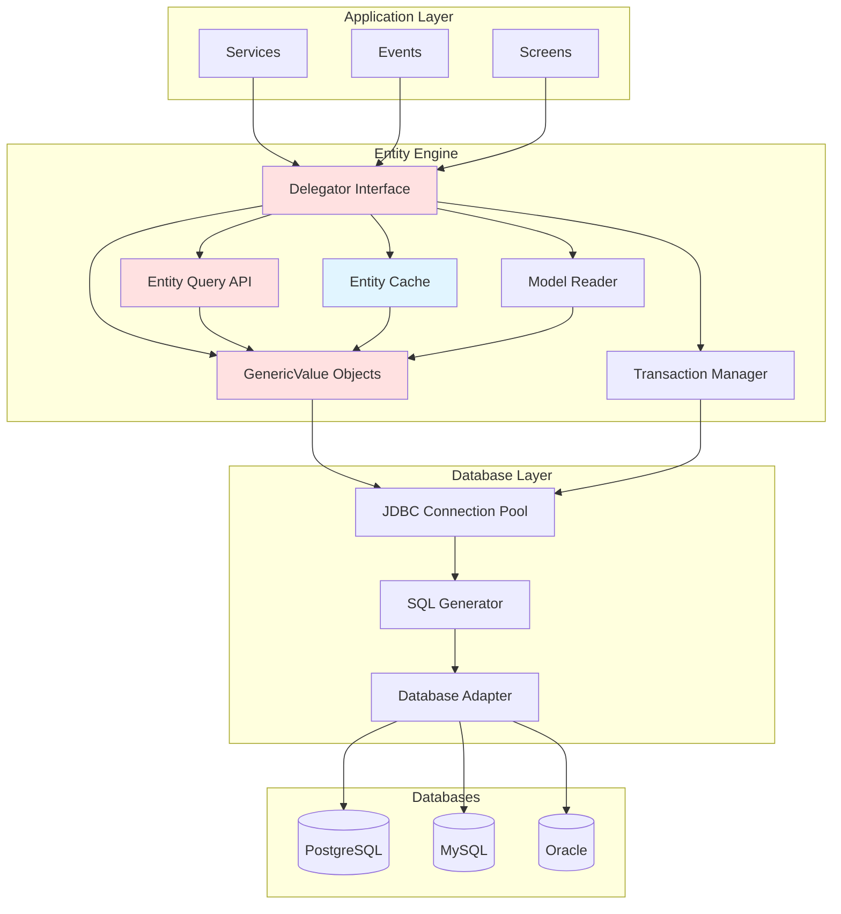
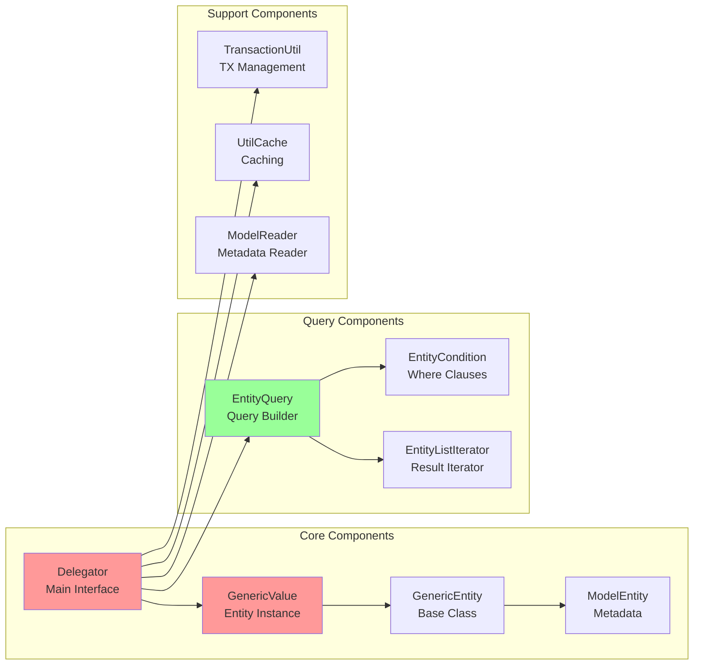
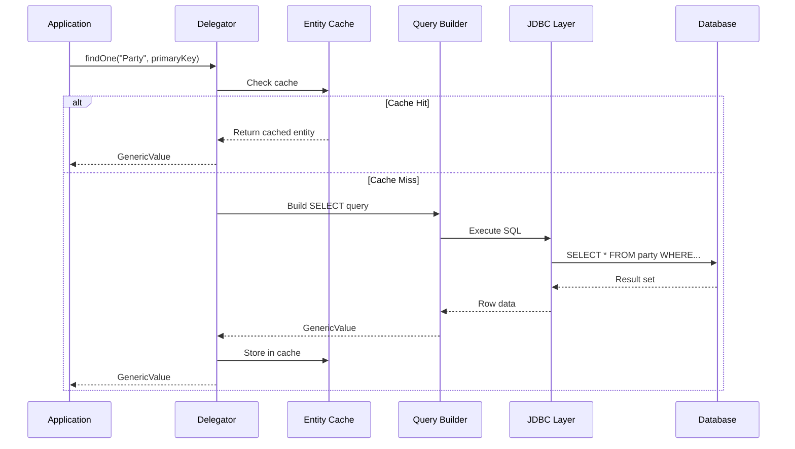

# Entity Engine Overview

**Purpose**: Introduce OFBiz Entity Engine architecture, capabilities, and key responsibilities  
**Audience**: Developers, Database Architects, Technical Leads  
**Prerequisites**: [System Overview](../../01-system-overview/README.md), [Data Architecture](../../03-data-architecture/README.md)  
**Related Documents**: [Class Structure](class-structure.md), [Query Engine](query-engine.md), [Transaction Management](transaction-management.md)

---

## Overview

The Entity Engine is OFBiz's Object-Relational Mapping (ORM) layer, providing database abstraction, caching, and transaction management. It's the foundation for all data access in OFBiz, enabling database-independent operations while optimizing performance through intelligent caching and query optimization.

## Visual Architecture

### Entity Engine Architecture



**Diagram Description**: Entity Engine architecture showing application layer accessing Delegator interface, which coordinates GenericValue objects, query API, transaction management, and caching. JDBC layer handles database-specific SQL generation and connection pooling.

### Entity Engine Components



**Diagram Description**: Entity Engine core components showing Delegator as main interface, GenericValue for entity instances, EntityQuery for building queries, and support components for transactions, caching, and metadata.

### Data Flow Diagram



**Diagram Description**: Data flow showing how Entity Engine handles a findOne request: checks cache first, if miss then builds SQL query, executes via JDBC, converts result to GenericValue, caches it, and returns to application.

## Key Responsibilities

### 1. Database Abstraction

**Capability**: Write database-independent code that works across PostgreSQL, MySQL, Oracle, Derby.

**How It Works**:
- Entity definitions in XML (database-agnostic)
- SQL generation based on database type
- Database-specific adapters handle dialect differences
- Field type mapping (String → VARCHAR, BigDecimal → NUMERIC)

**Example**:
```java
// Same code works on any database
GenericValue party = delegator.findOne("Party", 
    UtilMisc.toMap("partyId", "10000"), false);
```

### 2. Object-Relational Mapping

**Capability**: Map database tables to Java objects (GenericValue).

**How It Works**:
- Entity definitions define structure
- GenericValue represents entity instance
- Automatic type conversion (SQL types ↔ Java types)
- Relationship navigation (one-to-many, many-to-one)

**Example**:
```java
// GenericValue wraps database row
GenericValue order = delegator.findOne("OrderHeader", 
    UtilMisc.toMap("orderId", "10000"), false);
String status = order.getString("statusId");
BigDecimal total = order.getBigDecimal("grandTotal");
```

### 3. Caching

**Capability**: Multi-level caching for performance optimization.

**Cache Levels**:
- **Entity Cache**: Caches individual entities by primary key
- **Condition Cache**: Caches query results
- **View Entity Cache**: Caches view entity results

**How It Works**:
- Automatic cache population on read
- Automatic cache invalidation on write
- Configurable cache sizes and TTL
- Distributed cache support (Redis, Memcached)

**Example**:
```java
// Second call uses cache (if enabled)
GenericValue party1 = delegator.findOne("Party", pk, true); // Cache enabled
GenericValue party2 = delegator.findOne("Party", pk, true); // From cache
```

### 4. Transaction Management

**Capability**: ACID transactions with proper isolation and rollback.

**How It Works**:
- Automatic transaction management
- Nested transaction support
- Rollback on exceptions
- Integration with JTA for distributed transactions

**Example**:
```java
// Automatic transaction
try {
    delegator.create(orderHeader);
    delegator.create(orderItem);
    // Both committed together
} catch (GenericEntityException e) {
    // Both rolled back
}
```

### 5. Query Building

**Capability**: Type-safe, fluent API for building complex queries.

**How It Works**:
- EntityQuery builder pattern
- EntityCondition for WHERE clauses
- Support for joins, ordering, pagination
- Lazy loading with EntityListIterator

**Example**:
```java
// Fluent query API
List<GenericValue> orders = EntityQuery.use(delegator)
    .from("OrderHeader")
    .where("statusId", "ORDER_APPROVED")
    .orderBy("-orderDate")
    .maxRows(100)
    .queryList();
```

### 6. Relationship Navigation

**Capability**: Navigate entity relationships without writing joins.

**How It Works**:
- Relationships defined in entity model
- Automatic join generation
- Lazy loading of related entities
- Support for one-to-many, many-to-one, many-to-many

**Example**:
```java
// Navigate relationships
GenericValue order = delegator.findOne("OrderHeader", pk, false);
List<GenericValue> items = order.getRelated("OrderItem", null, null, false);
GenericValue party = order.getRelatedOne("Party", false);
```

## Delegator Interface

The Delegator is the main entry point for all Entity Engine operations.

### Core Operations

<details>
<summary>View Delegator Core Methods</summary>

**File**: `framework/entity/src/main/java/org/apache/ofbiz/entity/Delegator.java`

```java
public interface Delegator {
    // Create
    GenericValue create(GenericValue value) throws GenericEntityException;
    GenericValue createSetNextSeqId(GenericValue value) throws GenericEntityException;
    
    // Read
    GenericValue findOne(String entityName, Map<String, ?> fields, boolean useCache) 
        throws GenericEntityException;
    List<GenericValue> findByAnd(String entityName, Map<String, ?> fields, List<String> orderBy, boolean useCache) 
        throws GenericEntityException;
    List<GenericValue> findList(String entityName, EntityCondition condition, 
        Set<String> fieldsToSelect, List<String> orderBy, EntityFindOptions findOptions, boolean useCache) 
        throws GenericEntityException;
    
    // Update
    int store(GenericValue value) throws GenericEntityException;
    int storeAll(List<GenericValue> values) throws GenericEntityException;
    
    // Delete
    int removeValue(GenericValue value) throws GenericEntityException;
    int removeByAnd(String entityName, Map<String, ?> fields) throws GenericEntityException;
    int removeByCondition(String entityName, EntityCondition condition) throws GenericEntityException;
    
    // Utility
    GenericValue makeValue(String entityName);
    GenericPK makePK(String entityName);
    void clearAllCaches();
    void clearCacheLine(String entityName, Map<String, ?> fields);
}
```

</details>

### Getting Delegator Instance

```java
// In services
Delegator delegator = dctx.getDelegator();

// In events
Delegator delegator = (Delegator) request.getAttribute("delegator");

// In screens/FTL
${delegator} // Available as context variable
```

## Entity Definitions

Entities are defined in XML files (`entitymodel.xml`).

<details>
<summary>View Entity Definition Example</summary>

**File**: `applications/party/entitydef/entitymodel.xml`

```xml
<entity entity-name="Party" 
        package-name="org.apache.ofbiz.party.party"
        title="Party Entity">
    <field name="partyId" type="id"></field>
    <field name="partyTypeId" type="id"></field>
    <field name="externalId" type="id"></field>
    <field name="preferredCurrencyUomId" type="id"></field>
    <field name="description" type="description"></field>
    <field name="statusId" type="id"></field>
    <field name="createdDate" type="date-time"></field>
    <field name="createdByUserLogin" type="id-vlong"></field>
    <field name="lastModifiedDate" type="date-time"></field>
    <field name="lastModifiedByUserLogin" type="id-vlong"></field>
    
    <prim-key field="partyId"/>
    
    <relation type="one" fk-name="PARTY_PTY_TYP" rel-entity-name="PartyType">
        <key-map field-name="partyTypeId"/>
    </relation>
    <relation type="one" fk-name="PARTY_STATUS" rel-entity-name="StatusItem">
        <key-map field-name="statusId"/>
    </relation>
    <relation type="many" rel-entity-name="OrderRole">
        <key-map field-name="partyId"/>
    </relation>
</entity>
```

</details>

## Performance Characteristics

### Caching Impact

**Without Cache**:
- Every read hits database
- High database load
- Slower response times

**With Cache**:
- Frequently accessed entities cached
- Reduced database load (80-90% reduction typical)
- Faster response times (10-100x faster)

### Query Optimization

**Entity Engine Optimizations**:
- Prepared statement caching
- Connection pooling
- Batch operations
- Lazy loading with iterators
- View entities for complex joins

## Official References

- [Entity Engine Guide](https://cwiki.apache.org/confluence/display/OFBIZ/Entity+Engine+Guide)
- [Entity Definition Reference](https://cwiki.apache.org/confluence/display/OFBIZ/Entity+Definition)
- [Delegator API Documentation](https://ofbiz.apache.org/javadocs/)
- [Entity Engine Configuration](https://cwiki.apache.org/confluence/display/OFBIZ/Entity+Engine+Configuration)

## Related Topics

- [Class Structure](class-structure.md) - Detailed UML diagrams and class relationships
- [Query Engine](query-engine.md) - Query building and optimization
- [Transaction Management](transaction-management.md) - Transaction handling details
- [Replacement Strategies](replacement-strategies.md) - Integrating Hibernate or JPA
- [Data Architecture](../../03-data-architecture/README.md) - Entity models and domain ERDs
- [Caching Strategy](../../03-data-architecture/caching-strategy.md) - Caching details

---

**Next**: [Class Structure](class-structure.md)  
**Up**: [Framework Core](../README.md)
