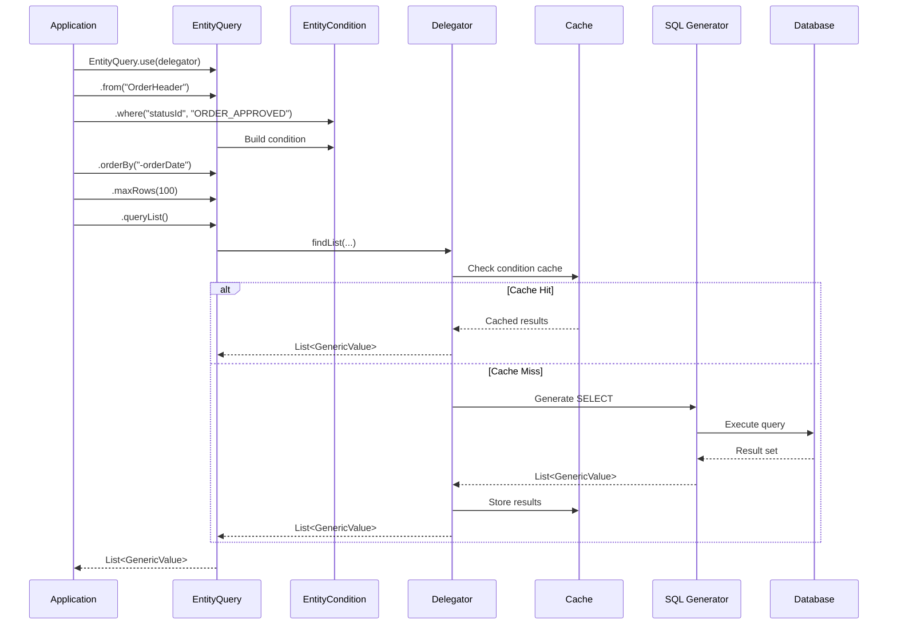
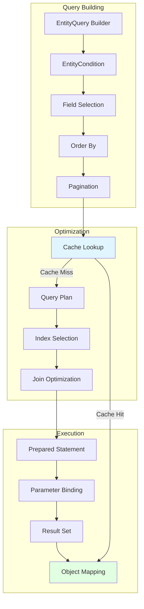

# Entity Engine Query Engine

**Purpose**: Document Entity Engine query building, optimization, and caching integration  
**Audience**: Developers, Performance Engineers, Database Architects  
**Prerequisites**: [Entity Engine Overview](overview.md), [Class Structure](class-structure.md)  
**Related Documents**: [Transaction Management](transaction-management.md), [Caching Strategy](../../03-data-architecture/caching-strategy.md)

---

## Overview

The Entity Engine Query Engine provides a fluent, type-safe API for building database queries without writing SQL. It handles query optimization, caching integration, and database-specific SQL generation. Understanding the query engine is essential for writing efficient data access code.

## Visual Architecture

### Query Building Flow



**Diagram Description**: Query building flow showing EntityQuery builder pattern, condition building, cache checking, SQL generation, and result caching. Cache hit avoids database access.

### Query Optimization Pipeline



**Diagram Description**: Query optimization pipeline showing query building, optimization (cache lookup, query plan, index selection), and execution (prepared statements, parameter binding, result mapping).

## EntityQuery API

### Basic Query Patterns

<details>
<summary>View Basic Query Examples</summary>

**Simple Find by Primary Key**:
```java
// Find single entity by primary key
GenericValue party = EntityQuery.use(delegator)
    .from("Party")
    .where("partyId", "10000")
    .queryOne();
```

**Find by Single Condition**:
```java
// Find all approved orders
List<GenericValue> orders = EntityQuery.use(delegator)
    .from("OrderHeader")
    .where("statusId", "ORDER_APPROVED")
    .queryList();
```

**Find by Multiple Conditions (AND)**:
```java
// Find orders for specific party with status
List<GenericValue> orders = EntityQuery.use(delegator)
    .from("OrderHeader")
    .where("partyId", "10000", "statusId", "ORDER_APPROVED")
    .queryList();

// Alternative using Map
Map<String, Object> fields = UtilMisc.toMap(
    "partyId", "10000",
    "statusId", "ORDER_APPROVED"
);
List<GenericValue> orders = EntityQuery.use(delegator)
    .from("OrderHeader")
    .where(fields)
    .queryList();
```

**Find with Ordering**:
```java
// Find orders ordered by date descending
List<GenericValue> orders = EntityQuery.use(delegator)
    .from("OrderHeader")
    .where("statusId", "ORDER_APPROVED")
    .orderBy("-orderDate")  // - prefix for descending
    .queryList();
```

**Find with Pagination**:
```java
// Find first 100 orders
List<GenericValue> orders = EntityQuery.use(delegator)
    .from("OrderHeader")
    .where("statusId", "ORDER_APPROVED")
    .orderBy("-orderDate")
    .maxRows(100)
    .queryList();

// Find orders 101-200 (pagination)
List<GenericValue> orders = EntityQuery.use(delegator)
    .from("OrderHeader")
    .where("statusId", "ORDER_APPROVED")
    .orderBy("-orderDate")
    .offset(100)
    .maxRows(100)
    .queryList();
```

**Find with Field Selection**:
```java
// Select only specific fields
List<GenericValue> orders = EntityQuery.use(delegator)
    .from("OrderHeader")
    .where("statusId", "ORDER_APPROVED")
    .select("orderId", "orderDate", "grandTotal")
    .queryList();
```

</details>

### Complex Query Patterns

<details>
<summary>View Complex Query Examples</summary>

**Multiple Conditions with OR**:
```java
// Find orders that are approved OR completed
EntityCondition condition = EntityCondition.makeCondition(
    EntityCondition.makeCondition("statusId", "ORDER_APPROVED"),
    EntityOperator.OR,
    EntityCondition.makeCondition("statusId", "ORDER_COMPLETED")
);

List<GenericValue> orders = EntityQuery.use(delegator)
    .from("OrderHeader")
    .where(condition)
    .queryList();
```

**Range Queries**:
```java
// Find orders with total between 100 and 1000
EntityCondition condition = EntityCondition.makeCondition(
    EntityCondition.makeCondition("grandTotal", EntityOperator.GREATER_THAN_EQUAL_TO, new BigDecimal("100")),
    EntityOperator.AND,
    EntityCondition.makeCondition("grandTotal", EntityOperator.LESS_THAN_EQUAL_TO, new BigDecimal("1000"))
);

List<GenericValue> orders = EntityQuery.use(delegator)
    .from("OrderHeader")
    .where(condition)
    .queryList();
```

**Date Range Queries**:
```java
// Find orders from last 30 days
Timestamp thirtyDaysAgo = UtilDateTime.getDayStart(UtilDateTime.nowTimestamp(), -30);

List<GenericValue> orders = EntityQuery.use(delegator)
    .from("OrderHeader")
    .where(EntityCondition.makeCondition("orderDate", EntityOperator.GREATER_THAN_EQUAL_TO, thirtyDaysAgo))
    .queryList();
```

**IN Clause**:
```java
// Find orders with specific statuses
List<String> statuses = Arrays.asList("ORDER_APPROVED", "ORDER_COMPLETED", "ORDER_SENT");

List<GenericValue> orders = EntityQuery.use(delegator)
    .from("OrderHeader")
    .where(EntityCondition.makeCondition("statusId", EntityOperator.IN, statuses))
    .queryList();
```

**LIKE Queries**:
```java
// Find parties with name containing "Smith"
List<GenericValue> parties = EntityQuery.use(delegator)
    .from("Person")
    .where(EntityCondition.makeCondition("lastName", EntityOperator.LIKE, "%Smith%"))
    .queryList();
```

**Complex Nested Conditions**:
```java
// Find orders: (approved OR completed) AND (total > 100) AND (date > yesterday)
EntityCondition statusCondition = EntityCondition.makeCondition(
    EntityCondition.makeCondition("statusId", "ORDER_APPROVED"),
    EntityOperator.OR,
    EntityCondition.makeCondition("statusId", "ORDER_COMPLETED")
);

EntityCondition amountCondition = EntityCondition.makeCondition(
    "grandTotal", EntityOperator.GREATER_THAN, new BigDecimal("100")
);

EntityCondition dateCondition = EntityCondition.makeCondition(
    "orderDate", EntityOperator.GREATER_THAN, yesterday
);

EntityCondition finalCondition = EntityCondition.makeCondition(
    statusCondition,
    EntityOperator.AND,
    amountCondition,
    EntityOperator.AND,
    dateCondition
);

List<GenericValue> orders = EntityQuery.use(delegator)
    .from("OrderHeader")
    .where(finalCondition)
    .queryList();
```

</details>

### Iterator Pattern for Large Result Sets

<details>
<summary>View Iterator Examples</summary>

**Basic Iterator Usage**:
```java
// Process large result set without loading all into memory
EntityListIterator iterator = EntityQuery.use(delegator)
    .from("OrderHeader")
    .where("statusId", "ORDER_APPROVED")
    .queryIterator();

try {
    GenericValue order;
    while ((order = iterator.next()) != null) {
        // Process each order
        processOrder(order);
    }
} finally {
    iterator.close();  // Always close iterator
}
```

**Batch Processing with Iterator**:
```java
// Process in batches of 100
EntityListIterator iterator = EntityQuery.use(delegator)
    .from("OrderHeader")
    .queryIterator();

try {
    List<GenericValue> batch;
    while ((batch = iterator.getPartialList(1, 100)).size() > 0) {
        // Process batch
        processBatch(batch);
    }
} finally {
    iterator.close();
}
```

**Why Use Iterator**:
- Memory efficient for large result sets
- Processes results as they're fetched
- Avoids OutOfMemoryError
- Database cursor stays open (faster for large sets)

**When to Use Iterator**:
- Result set > 1000 rows
- Processing each row individually
- Memory constraints
- Long-running batch jobs

</details>

## Query Optimization Techniques

### 1. Use Caching Effectively

```java
// Enable cache for frequently accessed data
GenericValue party = EntityQuery.use(delegator)
    .from("Party")
    .where("partyId", "10000")
    .cache(true)  // Use cache
    .queryOne();

// Disable cache for data that changes frequently
List<GenericValue> orders = EntityQuery.use(delegator)
    .from("OrderHeader")
    .where("statusId", "ORDER_APPROVED")
    .cache(false)  // Don't cache
    .queryList();
```

### 2. Select Only Needed Fields

```java
// Bad: Fetches all fields
List<GenericValue> orders = EntityQuery.use(delegator)
    .from("OrderHeader")
    .queryList();

// Good: Fetches only needed fields
List<GenericValue> orders = EntityQuery.use(delegator)
    .from("OrderHeader")
    .select("orderId", "orderDate", "grandTotal")
    .queryList();
```

### 3. Use Pagination for Large Results

```java
// Bad: Loads all results into memory
List<GenericValue> orders = EntityQuery.use(delegator)
    .from("OrderHeader")
    .queryList();  // Could be millions of rows

// Good: Use pagination
List<GenericValue> orders = EntityQuery.use(delegator)
    .from("OrderHeader")
    .maxRows(100)
    .queryList();

// Better: Use iterator for very large sets
EntityListIterator iterator = EntityQuery.use(delegator)
    .from("OrderHeader")
    .queryIterator();
```

### 4. Use Indexes Effectively

```java
// Good: Query on indexed field (primary key)
GenericValue party = EntityQuery.use(delegator)
    .from("Party")
    .where("partyId", "10000")
    .queryOne();

// Good: Query on indexed field (foreign key)
List<GenericValue> orders = EntityQuery.use(delegator)
    .from("OrderHeader")
    .where("partyId", "10000")
    .queryList();

// Bad: Query on non-indexed field (full table scan)
List<GenericValue> orders = EntityQuery.use(delegator)
    .from("OrderHeader")
    .where("externalId", "EXT-12345")  // If not indexed
    .queryList();
```

### 5. Avoid N+1 Query Problem

```java
// Bad: N+1 queries (1 for orders + N for items)
List<GenericValue> orders = EntityQuery.use(delegator)
    .from("OrderHeader")
    .queryList();

for (GenericValue order : orders) {
    List<GenericValue> items = order.getRelated("OrderItem", null, null, false);
    // This executes a query for each order!
}

// Good: Use view entity or batch fetch
List<GenericValue> orderItems = EntityQuery.use(delegator)
    .from("OrderItem")
    .where(EntityCondition.makeCondition("orderId", EntityOperator.IN, orderIds))
    .queryList();

// Group items by order
Map<String, List<GenericValue>> itemsByOrder = new HashMap<>();
for (GenericValue item : orderItems) {
    String orderId = item.getString("orderId");
    itemsByOrder.computeIfAbsent(orderId, k -> new ArrayList<>()).add(item);
}
```

## Caching Integration

### Cache Levels

**Entity Cache** (Primary Key Cache):
```java
// Cached by primary key
GenericValue party = EntityQuery.use(delegator)
    .from("Party")
    .where("partyId", "10000")
    .cache(true)
    .queryOne();
```

**Condition Cache** (Query Result Cache):
```java
// Cached by query conditions
List<GenericValue> orders = EntityQuery.use(delegator)
    .from("OrderHeader")
    .where("statusId", "ORDER_APPROVED")
    .cache(true)
    .queryList();
```

### Cache Invalidation

**Automatic Invalidation**:
```java
// Cache automatically invalidated on write
GenericValue party = delegator.findOne("Party", 
    UtilMisc.toMap("partyId", "10000"), true);  // Cached

party.set("statusId", "PARTY_DISABLED");
party.store();  // Cache invalidated automatically

// Next read fetches from database
GenericValue updated = delegator.findOne("Party", 
    UtilMisc.toMap("partyId", "10000"), true);  // Fresh from DB
```

**Manual Cache Clearing**:
```java
// Clear specific entity cache line
delegator.clearCacheLine("Party", UtilMisc.toMap("partyId", "10000"));

// Clear all cache for entity
delegator.clearCacheLine("Party");

// Clear all caches
delegator.clearAllCaches();
```

## Performance Characteristics

### Query Performance Comparison

| Operation | Without Cache | With Cache | Speedup |
|-----------|--------------|------------|---------|
| findOne by PK | 5-10ms | 0.1-0.5ms | 10-100x |
| findList (100 rows) | 20-50ms | 1-5ms | 10-20x |
| Complex query | 50-200ms | 5-20ms | 10x |

### Best Practices

1. **Enable caching for reference data** (rarely changes)
2. **Disable caching for transactional data** (changes frequently)
3. **Use field selection** to reduce data transfer
4. **Use pagination** for large result sets
5. **Use iterators** for very large result sets
6. **Query on indexed fields** when possible
7. **Avoid N+1 queries** by batching
8. **Use view entities** for complex joins

## Official References

- [Entity Engine Query Guide](https://cwiki.apache.org/confluence/display/OFBIZ/Entity+Engine+Query)
- [EntityQuery API Documentation](https://ofbiz.apache.org/javadocs/)
- [Entity Caching](https://cwiki.apache.org/confluence/display/OFBIZ/Entity+Caching)

## Related Topics

- [Entity Engine Overview](overview.md) - Architecture and capabilities
- [Class Structure](class-structure.md) - Query API classes
- [Transaction Management](transaction-management.md) - Transaction handling
- [Caching Strategy](../../03-data-architecture/caching-strategy.md) - Detailed caching documentation
- [Performance Characteristics](../../09-quality-attributes/performance-characteristics.md) - Performance optimization

---

**Previous**: [Class Structure](class-structure.md)  
**Next**: [Transaction Management](transaction-management.md)  
**Up**: [Framework Core](../README.md)
