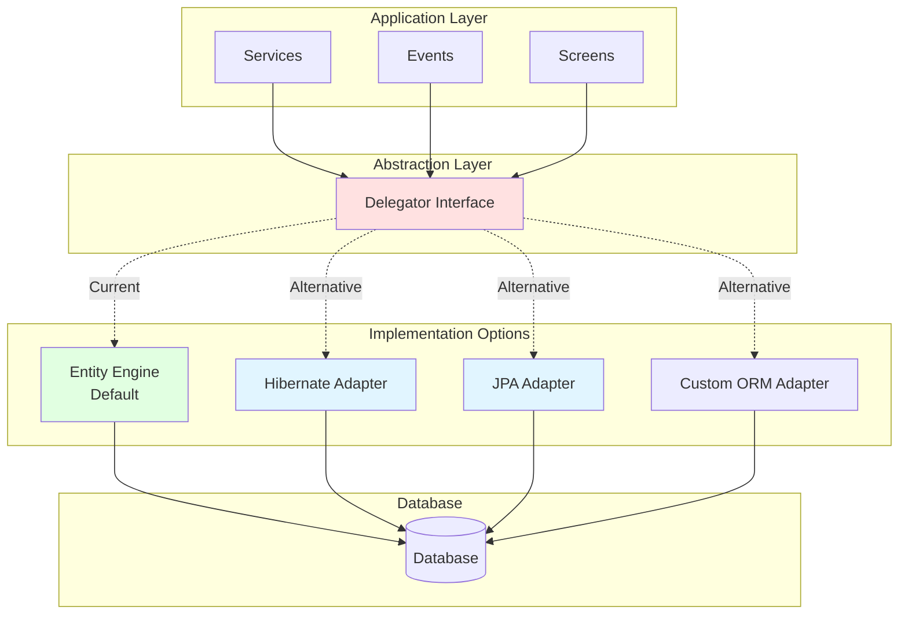
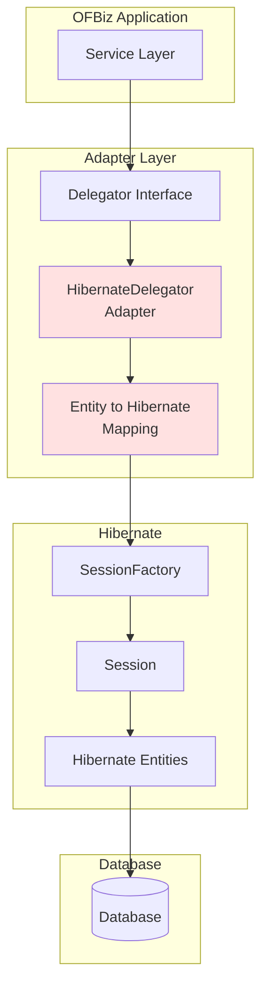

# Entity Engine Replacement Strategies

**Purpose**: Document strategies for replacing Entity Engine with Hibernate, JPA, or other ORMs  
**Audience**: Architects, Technical Leads, Senior Developers  
**Prerequisites**: [Entity Engine Overview](overview.md), [Class Structure](class-structure.md)  
**Related Documents**: [Module Replacement Patterns](../../04-application-modules/module-replacement-patterns.md)

---

## Overview

While the Entity Engine is optimized for OFBiz, some organizations prefer standard ORMs like Hibernate or JPA. This document explains strategies for replacing or integrating alternative ORMs, including architecture patterns, interface contracts, migration considerations, and trade-offs.

## Visual Architecture

### Entity Engine Abstraction Layer



**Diagram Description**: Abstraction layer showing Delegator interface that applications depend on. Multiple implementation options: default Entity Engine, Hibernate adapter, JPA adapter, or custom ORM. Applications remain unchanged when switching implementations.

### Hibernate Integration Pattern



**Diagram Description**: Hibernate integration showing adapter implementing Delegator interface, mapping between OFBiz entities and Hibernate entities, and Hibernate SessionFactory managing database access.


## Replacement Strategies

### Strategy 1: Adapter Pattern (Recommended)

**Approach**: Implement Delegator interface with Hibernate/JPA backend

**Architecture**:
```
Application Code (unchanged)
    ↓
Delegator Interface (unchanged)
    ↓
HibernateDelegator (new adapter)
    ↓
Hibernate SessionFactory
    ↓
Database
```

**Advantages**:
- ✅ No application code changes
- ✅ Gradual migration possible
- ✅ Can switch back if needed
- ✅ Maintains OFBiz patterns

**Disadvantages**:
- ❌ Significant adapter development effort
- ❌ May not leverage all Hibernate features
- ❌ Performance overhead from adaptation
- ❌ Ongoing maintenance burden

**Implementation Effort**: High (6-12 months)

### Strategy 2: Hybrid Approach

**Approach**: Use Entity Engine for some entities, Hibernate for others

**Architecture**:
```
Application Code
    ↓
    ├─→ Delegator (Entity Engine) → Core entities
    └─→ Hibernate Session → Custom entities
```

**Advantages**:
- ✅ Leverage both ORMs
- ✅ Use Hibernate for new features
- ✅ Keep Entity Engine for core
- ✅ Gradual transition

**Disadvantages**:
- ❌ Two ORMs to maintain
- ❌ Transaction coordination complex
- ❌ Developers need both skills
- ❌ Increased complexity

**Implementation Effort**: Medium (3-6 months)

### Strategy 3: Full Rewrite

**Approach**: Rewrite data access layer with Hibernate/JPA

**Architecture**:
```
Application Code (rewritten)
    ↓
Hibernate/JPA (direct usage)
    ↓
Database
```

**Advantages**:
- ✅ Full Hibernate feature access
- ✅ Standard JPA patterns
- ✅ Better IDE support
- ✅ Larger community

**Disadvantages**:
- ❌ Complete rewrite required
- ❌ Lose OFBiz patterns
- ❌ High risk
- ❌ Long timeline

**Implementation Effort**: Very High (12-24 months)

## Adapter Pattern Implementation

### Delegator Interface Contract

<details>
<summary>View Interface Contract to Implement</summary>

**Key Methods to Implement**:

```java
public class HibernateDelegator implements Delegator {
    private SessionFactory sessionFactory;
    private EntityMappingService mappingService;
    
    @Override
    public GenericValue create(GenericValue value) throws GenericEntityException {
        Session session = sessionFactory.getCurrentSession();
        
        // Convert GenericValue to Hibernate entity
        Object hibernateEntity = mappingService.toHibernateEntity(value);
        
        // Save via Hibernate
        session.save(hibernateEntity);
        
        // Convert back to GenericValue
        return mappingService.toGenericValue(hibernateEntity);
    }
    
    @Override
    public GenericValue findOne(String entityName, Map<String, ?> fields, boolean useCache) 
            throws GenericEntityException {
        Session session = sessionFactory.getCurrentSession();
        
        // Get Hibernate entity class
        Class<?> entityClass = mappingService.getHibernateClass(entityName);
        
        // Build Hibernate criteria
        CriteriaBuilder cb = session.getCriteriaBuilder();
        CriteriaQuery<?> query = cb.createQuery(entityClass);
        Root<?> root = query.from(entityClass);
        
        // Add where conditions
        List<Predicate> predicates = new ArrayList<>();
        for (Map.Entry<String, ?> entry : fields.entrySet()) {
            predicates.add(cb.equal(root.get(entry.getKey()), entry.getValue()));
        }
        query.where(predicates.toArray(new Predicate[0]));
        
        // Execute query
        Object result = session.createQuery(query).uniqueResult();
        
        // Convert to GenericValue
        return mappingService.toGenericValue(result);
    }
    
    @Override
    public int store(GenericValue value) throws GenericEntityException {
        Session session = sessionFactory.getCurrentSession();
        
        // Convert and update
        Object hibernateEntity = mappingService.toHibernateEntity(value);
        session.update(hibernateEntity);
        
        return 1;
    }
    
    @Override
    public int removeValue(GenericValue value) throws GenericEntityException {
        Session session = sessionFactory.getCurrentSession();
        
        // Convert and delete
        Object hibernateEntity = mappingService.toHibernateEntity(value);
        session.delete(hibernateEntity);
        
        return 1;
    }
    
    // Implement remaining Delegator methods...
}
```

</details>

### Entity Mapping Service

<details>
<summary>View Entity Mapping Implementation</summary>

**Bidirectional Mapping**:

```java
public class EntityMappingService {
    private Map<String, Class<?>> entityClassMap;
    private ModelReader modelReader;
    
    /**
     * Convert OFBiz GenericValue to Hibernate entity
     */
    public Object toHibernateEntity(GenericValue genericValue) {
        String entityName = genericValue.getEntityName();
        Class<?> hibernateClass = entityClassMap.get(entityName);
        
        try {
            Object hibernateEntity = hibernateClass.newInstance();
            
            // Copy fields
            ModelEntity modelEntity = modelReader.getModelEntity(entityName);
            for (ModelField field : modelEntity.getFieldsUnmodifiable()) {
                String fieldName = field.getName();
                Object value = genericValue.get(fieldName);
                
                // Set via reflection or setter
                BeanUtils.setProperty(hibernateEntity, fieldName, value);
            }
            
            return hibernateEntity;
            
        } catch (Exception e) {
            throw new RuntimeException("Error mapping to Hibernate entity", e);
        }
    }
    
    /**
     * Convert Hibernate entity to OFBiz GenericValue
     */
    public GenericValue toGenericValue(Object hibernateEntity) {
        if (hibernateEntity == null) return null;
        
        String entityName = getEntityName(hibernateEntity.getClass());
        GenericValue genericValue = GenericValue.create(
            DelegatorFactory.getDelegator("default"), 
            entityName, 
            new HashMap<>()
        );
        
        // Copy fields
        ModelEntity modelEntity = modelReader.getModelEntity(entityName);
        for (ModelField field : modelEntity.getFieldsUnmodifiable()) {
            String fieldName = field.getName();
            
            try {
                Object value = BeanUtils.getProperty(hibernateEntity, fieldName);
                genericValue.set(fieldName, value);
            } catch (Exception e) {
                // Handle missing fields
            }
        }
        
        return genericValue;
    }
    
    /**
     * Get Hibernate entity class for OFBiz entity name
     */
    public Class<?> getHibernateClass(String entityName) {
        return entityClassMap.get(entityName);
    }
    
    private String getEntityName(Class<?> hibernateClass) {
        // Get entity name from Hibernate @Entity annotation or mapping
        Entity entityAnnotation = hibernateClass.getAnnotation(Entity.class);
        return entityAnnotation != null ? entityAnnotation.name() : hibernateClass.getSimpleName();
    }
}
```

</details>

### Transaction Coordination

<details>
<summary>View Transaction Coordination</summary>

**Hibernate Transaction Management**:

```java
public class HibernateTransactionUtil {
    
    public static boolean begin() throws GenericTransactionException {
        Session session = sessionFactory.getCurrentSession();
        Transaction tx = session.getTransaction();
        
        if (!tx.isActive()) {
            tx.begin();
            return true;
        }
        return false;
    }
    
    public static void commit(boolean beganTransaction) throws GenericTransactionException {
        if (beganTransaction) {
            Session session = sessionFactory.getCurrentSession();
            Transaction tx = session.getTransaction();
            
            if (tx.isActive()) {
                tx.commit();
            }
        }
    }
    
    public static void rollback(boolean beganTransaction, String causeMessage, Throwable cause) {
        if (beganTransaction) {
            Session session = sessionFactory.getCurrentSession();
            Transaction tx = session.getTransaction();
            
            if (tx.isActive()) {
                tx.rollback();
            }
        }
    }
}
```

**JTA Integration** (for distributed transactions):

```java
// Configure Hibernate to use JTA
<property name="hibernate.transaction.coordinator_class">jta</property>
<property name="hibernate.transaction.jta.platform">
    org.hibernate.engine.transaction.jta.platform.internal.JBossStandAloneJtaPlatform
</property>

// Use same transaction manager as OFBiz
TransactionManager tm = TransactionFactoryLoader.getInstance().getTransactionManager();
```

</details>

## Integration Patterns

### Pattern 1: Hibernate for New Entities

**Use Case**: Add new features using Hibernate while keeping core on Entity Engine

**Implementation**:
```java
// Core entities use Entity Engine
GenericValue party = delegator.findOne("Party", 
    UtilMisc.toMap("partyId", "10000"), false);

// New custom entities use Hibernate
Session session = sessionFactory.getCurrentSession();
CustomEntity custom = session.get(CustomEntity.class, customId);
```

**Transaction Coordination**:
```java
boolean beganTransaction = TransactionUtil.begin();
try {
    // Entity Engine operations
    delegator.create(coreEntity);
    
    // Hibernate operations (same transaction via JTA)
    Session session = sessionFactory.getCurrentSession();
    session.save(customEntity);
    
    TransactionUtil.commit(beganTransaction);
} catch (Exception e) {
    TransactionUtil.rollback(beganTransaction, "Error", e);
}
```

### Pattern 2: JPA for Reporting

**Use Case**: Use JPA for complex reporting queries

**Implementation**:
```java
@PersistenceContext
private EntityManager entityManager;

public List<OrderSummary> getOrderSummary(String partyId) {
    // Use JPA for complex query
    String jpql = "SELECT NEW OrderSummary(o.orderId, o.orderDate, SUM(i.quantity * i.unitPrice)) " +
                  "FROM OrderHeader o JOIN o.items i " +
                  "WHERE o.partyId = :partyId " +
                  "GROUP BY o.orderId, o.orderDate";
    
    return entityManager.createQuery(jpql, OrderSummary.class)
        .setParameter("partyId", partyId)
        .getResultList();
}
```

### Pattern 3: Hibernate for Performance-Critical Paths

**Use Case**: Use Hibernate's advanced features for performance optimization

**Implementation**:
```java
// Use Hibernate batch processing
Session session = sessionFactory.getCurrentSession();
Transaction tx = session.beginTransaction();

for (int i = 0; i < 10000; i++) {
    Product product = new Product();
    product.setProductId("PROD-" + i);
    session.save(product);
    
    if (i % 50 == 0) {
        session.flush();
        session.clear();
    }
}

tx.commit();
```

## Migration Considerations

### Data Model Compatibility

**OFBiz Universal Data Model**:
- Highly normalized
- Generic relationships (PartyRole, OrderRole)
- Flexible field types

**Hibernate/JPA Expectations**:
- More concrete entity classes
- Explicit relationships (@OneToMany, @ManyToOne)
- Strongly typed fields

**Challenge**: Mapping OFBiz's flexible model to Hibernate's rigid structure

**Solution**: Generate Hibernate entities from OFBiz entity definitions

### Caching Strategy

**Entity Engine Caching**:
- Entity cache (by primary key)
- Condition cache (by query)
- Automatic invalidation

**Hibernate Caching**:
- First-level cache (session)
- Second-level cache (SessionFactory)
- Query cache

**Migration**: Configure Hibernate second-level cache to match Entity Engine behavior

### Query API Differences

**Entity Engine**:
```java
List<GenericValue> orders = EntityQuery.use(delegator)
    .from("OrderHeader")
    .where("statusId", "ORDER_APPROVED")
    .queryList();
```

**Hibernate Criteria API**:
```java
CriteriaBuilder cb = session.getCriteriaBuilder();
CriteriaQuery<OrderHeader> query = cb.createQuery(OrderHeader.class);
Root<OrderHeader> root = query.from(OrderHeader.class);
query.where(cb.equal(root.get("statusId"), "ORDER_APPROVED"));
List<OrderHeader> orders = session.createQuery(query).getResultList();
```

**Challenge**: Different query APIs require code changes or adapter layer

## Trade-offs Analysis

### Entity Engine vs Hibernate

| Aspect | Entity Engine | Hibernate |
|--------|--------------|-----------|
| **Learning Curve** | OFBiz-specific | Industry standard |
| **Community** | Smaller | Larger |
| **Documentation** | Limited | Extensive |
| **IDE Support** | Limited | Excellent |
| **Performance** | Optimized for OFBiz | General purpose |
| **Flexibility** | OFBiz patterns | Full JPA features |
| **Caching** | Built-in, optimized | Configurable |
| **Universal Data Model** | Native support | Requires mapping |
| **Migration Effort** | N/A | High |
| **Maintenance** | Part of OFBiz | Separate dependency |

### When to Consider Replacement

**Consider Hibernate/JPA if**:
- ✅ Team has strong Hibernate expertise
- ✅ Need advanced ORM features
- ✅ Want standard JPA patterns
- ✅ Building new application on OFBiz framework
- ✅ Have resources for migration

**Stick with Entity Engine if**:
- ✅ Using OFBiz applications (Party, Product, Order)
- ✅ Leveraging universal data model
- ✅ Need OFBiz-optimized performance
- ✅ Want simpler architecture
- ✅ Limited migration resources

## Implementation Roadmap

### Phase 1: Proof of Concept (1-2 months)
1. Implement basic Delegator adapter
2. Map 5-10 core entities
3. Test CRUD operations
4. Measure performance
5. Validate transaction handling

### Phase 2: Core Entity Migration (3-6 months)
1. Map all core entities (Party, Product, Order)
2. Implement full Delegator interface
3. Migrate caching strategy
4. Performance optimization
5. Integration testing

### Phase 3: Application Migration (6-12 months)
1. Migrate services to use adapter
2. Update custom code
3. Performance tuning
4. User acceptance testing
5. Production deployment

### Phase 4: Optimization (ongoing)
1. Leverage Hibernate-specific features
2. Optimize queries
3. Fine-tune caching
4. Monitor performance

## Official References

- [Hibernate Documentation](https://hibernate.org/orm/documentation/)
- [JPA Specification](https://jakarta.ee/specifications/persistence/)
- [OFBiz Entity Engine Guide](https://cwiki.apache.org/confluence/display/OFBIZ/Entity+Engine+Guide)
- [Adapter Pattern](https://en.wikipedia.org/wiki/Adapter_pattern)

## Related Topics

- [Entity Engine Overview](overview.md) - Current architecture
- [Class Structure](class-structure.md) - Interfaces to implement
- [Module Replacement Patterns](../../04-application-modules/module-replacement-patterns.md) - General replacement strategies
- [Service Engine Replacement](../service-engine/replacement-strategies.md) - Service layer alternatives

---

**Previous**: [Transaction Management](transaction-management.md)  
**Up**: [Framework Core](../README.md)
