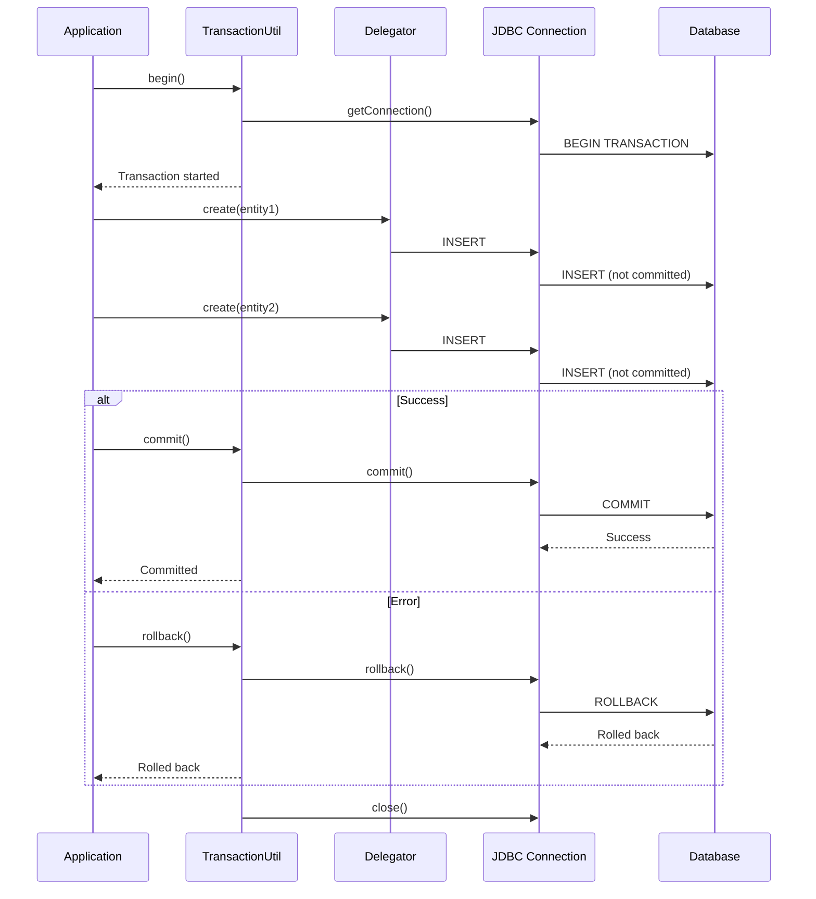
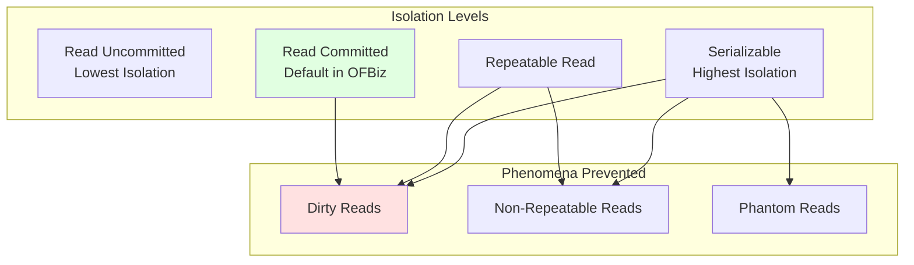
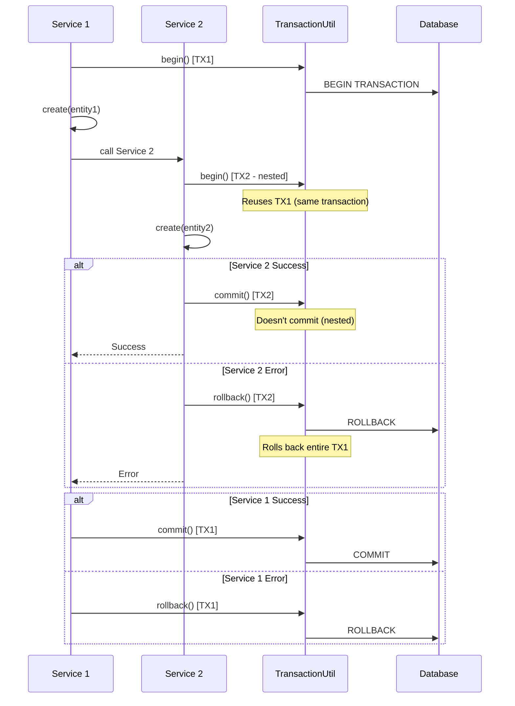

# Entity Engine Transaction Management

**Purpose**: Document Entity Engine transaction handling, isolation levels, and distributed transactions  
**Audience**: Developers, Technical Architects, Database Administrators  
**Prerequisites**: [Entity Engine Overview](overview.md), [Query Engine](query-engine.md)  
**Related Documents**: [Service Engine Transaction Handling](../service-engine/transaction-handling.md)

---

## Overview

The Entity Engine provides comprehensive transaction management with ACID guarantees, proper isolation levels, and support for distributed transactions. Understanding transaction management is critical for data consistency, concurrency control, and error handling.

## Visual Architecture

### Transaction Lifecycle



**Diagram Description**: Transaction lifecycle showing begin, multiple operations, and either commit (success) or rollback (error). All operations within transaction are atomic - either all succeed or all fail.

### Transaction Isolation Levels



**Diagram Description**: Transaction isolation levels and phenomena they prevent. OFBiz defaults to Read Committed, which prevents dirty reads. Higher isolation levels prevent more phenomena but reduce concurrency.


### Nested Transaction Handling



**Diagram Description**: Nested transaction handling showing Service 1 starting transaction, calling Service 2 which reuses same transaction. If Service 2 fails, entire transaction rolls back. Only outermost service commits.

## Transaction Management API

### Basic Transaction Operations

<details>
<summary>View Basic Transaction Examples</summary>

**Automatic Transaction (Recommended)**:
```java
// Entity Engine automatically manages transactions
try {
    GenericValue order = delegator.makeValue("OrderHeader");
    order.set("orderId", "10000");
    order.set("statusId", "ORDER_CREATED");
    order.create();
    
    GenericValue item = delegator.makeValue("OrderItem");
    item.set("orderId", "10000");
    item.set("orderItemSeqId", "00001");
    item.create();
    
    // Both committed automatically if no exception
} catch (GenericEntityException e) {
    // Both rolled back automatically on exception
    throw e;
}
```

**Manual Transaction Control**:
```java
boolean beganTransaction = false;
try {
    beganTransaction = TransactionUtil.begin();
    
    // Multiple operations
    delegator.create(order);
    delegator.create(item);
    delegator.store(inventory);
    
    TransactionUtil.commit(beganTransaction);
} catch (GenericEntityException e) {
    TransactionUtil.rollback(beganTransaction, "Error creating order", e);
    throw e;
}
```

**Transaction with Timeout**:
```java
boolean beganTransaction = false;
try {
    // 60 second timeout
    beganTransaction = TransactionUtil.begin(60);
    
    // Long-running operations
    processLargeDataSet();
    
    TransactionUtil.commit(beganTransaction);
} catch (GenericTransactionException e) {
    TransactionUtil.rollback(beganTransaction, "Transaction timeout", e);
    throw e;
}
```

</details>

### Transaction Isolation Levels

<details>
<summary>View Isolation Level Examples</summary>

**Default Isolation (Read Committed)**:
```java
// Uses default isolation level (Read Committed)
boolean beganTransaction = TransactionUtil.begin();
try {
    // Operations use Read Committed isolation
    List<GenericValue> orders = delegator.findList(...);
    TransactionUtil.commit(beganTransaction);
} catch (Exception e) {
    TransactionUtil.rollback(beganTransaction, "Error", e);
}
```

**Custom Isolation Level**:
```java
// Set custom isolation level
Connection conn = TransactionUtil.getConnection();
int originalIsolation = conn.getTransactionIsolation();

try {
    conn.setTransactionIsolation(Connection.TRANSACTION_SERIALIZABLE);
    
    // Operations use Serializable isolation
    // Prevents phantom reads but reduces concurrency
    
} finally {
    conn.setTransactionIsolation(originalIsolation);
}
```

**Isolation Levels**:
- `TRANSACTION_READ_UNCOMMITTED` - Lowest isolation, allows dirty reads
- `TRANSACTION_READ_COMMITTED` - Default, prevents dirty reads
- `TRANSACTION_REPEATABLE_READ` - Prevents non-repeatable reads
- `TRANSACTION_SERIALIZABLE` - Highest isolation, prevents phantom reads

</details>

### Distributed Transactions (JTA)

<details>
<summary>View Distributed Transaction Examples</summary>

**XA Transaction Across Multiple Databases**:
```java
// Configure multiple datasources with XA support
// In entityengine.xml:
// <datasource name="localpostgres" xa-datasource-class="org.postgresql.xa.PGXADataSource">
// <datasource name="remotemysql" xa-datasource-class="com.mysql.cj.jdbc.MysqlXADataSource">

boolean beganTransaction = false;
try {
    beganTransaction = TransactionUtil.begin();
    
    // Operations on first database
    Delegator delegator1 = DelegatorFactory.getDelegator("default");
    delegator1.create(entity1);
    
    // Operations on second database
    Delegator delegator2 = DelegatorFactory.getDelegator("remote");
    delegator2.create(entity2);
    
    // Both committed atomically via XA
    TransactionUtil.commit(beganTransaction);
} catch (Exception e) {
    // Both rolled back atomically
    TransactionUtil.rollback(beganTransaction, "XA transaction failed", e);
    throw e;
}
```

**Two-Phase Commit**:
- Phase 1: Prepare - All participants vote to commit or abort
- Phase 2: Commit - If all voted commit, coordinator commits all; otherwise rollback all

</details>

## Transaction Patterns

### 1. Single Operation Transaction

```java
// Simplest pattern - single operation
try {
    delegator.create(entity);  // Automatic transaction
} catch (GenericEntityException e) {
    // Automatic rollback
    throw e;
}
```

### 2. Multiple Operations Transaction

```java
// Multiple operations in one transaction
boolean beganTransaction = false;
try {
    beganTransaction = TransactionUtil.begin();
    
    delegator.create(order);
    delegator.create(item);
    delegator.store(inventory);
    
    TransactionUtil.commit(beganTransaction);
} catch (Exception e) {
    TransactionUtil.rollback(beganTransaction, "Error", e);
    throw e;
}
```

### 3. Nested Service Calls

```java
// Service 1 (outer transaction)
public static Map<String, Object> createOrder(DispatchContext dctx, Map<String, ?> context) {
    Delegator delegator = dctx.getDelegator();
    LocalDispatcher dispatcher = dctx.getDispatcher();
    
    boolean beganTransaction = false;
    try {
        beganTransaction = TransactionUtil.begin();
        
        // Create order
        GenericValue order = delegator.makeValue("OrderHeader");
        order.create();
        
        // Call another service (reuses transaction)
        Map<String, Object> result = dispatcher.runSync("createOrderItem", context);
        
        TransactionUtil.commit(beganTransaction);
        return ServiceUtil.returnSuccess();
    } catch (Exception e) {
        TransactionUtil.rollback(beganTransaction, "Error creating order", e);
        return ServiceUtil.returnError(e.getMessage());
    }
}
```

### 4. Suspend and Resume Transaction

```java
// Suspend current transaction to start independent transaction
Transaction suspendedTx = null;
boolean beganTransaction = false;

try {
    // Suspend current transaction
    suspendedTx = TransactionUtil.suspend();
    
    // Start new independent transaction
    beganTransaction = TransactionUtil.begin();
    
    // Operations in new transaction
    delegator.create(auditLog);
    
    TransactionUtil.commit(beganTransaction);
    
} finally {
    // Resume original transaction
    if (suspendedTx != null) {
        TransactionUtil.resume(suspendedTx);
    }
}
```

## Error Handling and Rollback

### Automatic Rollback

```java
// Exception triggers automatic rollback
try {
    delegator.create(order);
    delegator.create(item);
    
    if (invalidCondition) {
        throw new GenericEntityException("Invalid order");
    }
    
    // Commits if no exception
} catch (GenericEntityException e) {
    // Automatic rollback on exception
    throw e;
}
```

### Manual Rollback

```java
boolean beganTransaction = false;
try {
    beganTransaction = TransactionUtil.begin();
    
    delegator.create(order);
    
    if (!validateOrder(order)) {
        // Explicit rollback
        TransactionUtil.rollback(beganTransaction, "Order validation failed", null);
        return ServiceUtil.returnError("Invalid order");
    }
    
    delegator.create(item);
    TransactionUtil.commit(beganTransaction);
    
} catch (Exception e) {
    TransactionUtil.rollback(beganTransaction, "Error", e);
    throw e;
}
```

### Rollback with Savepoints

```java
boolean beganTransaction = false;
Savepoint savepoint = null;

try {
    beganTransaction = TransactionUtil.begin();
    Connection conn = TransactionUtil.getConnection();
    
    delegator.create(order);
    
    // Create savepoint
    savepoint = conn.setSavepoint("afterOrder");
    
    try {
        delegator.create(item);
    } catch (Exception e) {
        // Rollback to savepoint (keeps order)
        conn.rollback(savepoint);
        Debug.logWarning("Item creation failed, continuing without item", module);
    }
    
    TransactionUtil.commit(beganTransaction);
    
} catch (Exception e) {
    TransactionUtil.rollback(beganTransaction, "Error", e);
    throw e;
}
```

## Concurrency Control

### Optimistic Locking

```java
// Read entity with version
GenericValue product = delegator.findOne("Product", 
    UtilMisc.toMap("productId", "10000"), false);
Long originalVersion = product.getLong("lastUpdatedStamp");

// Modify entity
product.set("productName", "New Name");

// Store with version check
try {
    product.store();
} catch (GenericEntityException e) {
    // Check if concurrent modification
    GenericValue current = delegator.findOne("Product", 
        UtilMisc.toMap("productId", "10000"), false);
    
    if (!originalVersion.equals(current.getLong("lastUpdatedStamp"))) {
        throw new GenericEntityException("Concurrent modification detected");
    }
    throw e;
}
```

### Pessimistic Locking

```java
// Lock row for update (database-specific)
boolean beganTransaction = false;
try {
    beganTransaction = TransactionUtil.begin();
    
    // SELECT ... FOR UPDATE (locks row)
    GenericValue product = EntityQuery.use(delegator)
        .from("Product")
        .where("productId", "10000")
        .queryOne();
    
    // Row is locked, other transactions wait
    product.set("quantityOnHand", product.getBigDecimal("quantityOnHand").subtract(quantity));
    product.store();
    
    TransactionUtil.commit(beganTransaction);
} catch (Exception e) {
    TransactionUtil.rollback(beganTransaction, "Error", e);
    throw e;
}
```

## Performance Considerations

### Transaction Size

**Small Transactions (Recommended)**:
```java
// Good: Small, focused transaction
try {
    delegator.create(order);
    delegator.create(item);
} catch (Exception e) {
    // Quick rollback
}
```

**Large Transactions (Avoid)**:
```java
// Bad: Large transaction holds locks too long
boolean beganTransaction = TransactionUtil.begin();
try {
    for (int i = 0; i < 10000; i++) {
        delegator.create(entity);  // Holds locks for entire loop
    }
    TransactionUtil.commit(beganTransaction);
} catch (Exception e) {
    TransactionUtil.rollback(beganTransaction, "Error", e);
}
```

### Deadlock Prevention

**Consistent Lock Order**:
```java
// Good: Always lock in same order (by ID)
List<String> productIds = Arrays.asList("PROD-001", "PROD-002", "PROD-003");
Collections.sort(productIds);  // Consistent order

for (String productId : productIds) {
    GenericValue product = delegator.findOne("Product", 
        UtilMisc.toMap("productId", productId), false);
    product.set("quantityOnHand", newQuantity);
    product.store();
}
```

**Deadlock Detection and Retry**:
```java
int maxRetries = 3;
for (int retry = 0; retry < maxRetries; retry++) {
    boolean beganTransaction = false;
    try {
        beganTransaction = TransactionUtil.begin();
        
        // Operations that might deadlock
        updateInventory();
        
        TransactionUtil.commit(beganTransaction);
        break;  // Success
        
    } catch (GenericEntityException e) {
        TransactionUtil.rollback(beganTransaction, "Error", e);
        
        if (isDeadlock(e) && retry < maxRetries - 1) {
            Thread.sleep(100 * (retry + 1));  // Exponential backoff
            continue;  // Retry
        }
        throw e;
    }
}
```

## Official References

- [Transaction Management Guide](https://cwiki.apache.org/confluence/display/OFBIZ/Transaction+Management)
- [JTA Specification](https://jcp.org/en/jsr/detail?id=907)
- [ACID Properties](https://en.wikipedia.org/wiki/ACID)
- [Transaction Isolation Levels](https://en.wikipedia.org/wiki/Isolation_(database_systems))

## Related Topics

- [Entity Engine Overview](overview.md) - Architecture and capabilities
- [Query Engine](query-engine.md) - Query building and optimization
- [Service Engine Transaction Handling](../service-engine/transaction-handling.md) - Service-level transactions
- [Reliability Patterns](../../09-quality-attributes/reliability-patterns.md) - Error handling and recovery

---

**Previous**: [Query Engine](query-engine.md)  
**Next**: [Replacement Strategies](replacement-strategies.md)  
**Up**: [Framework Core](../README.md)
