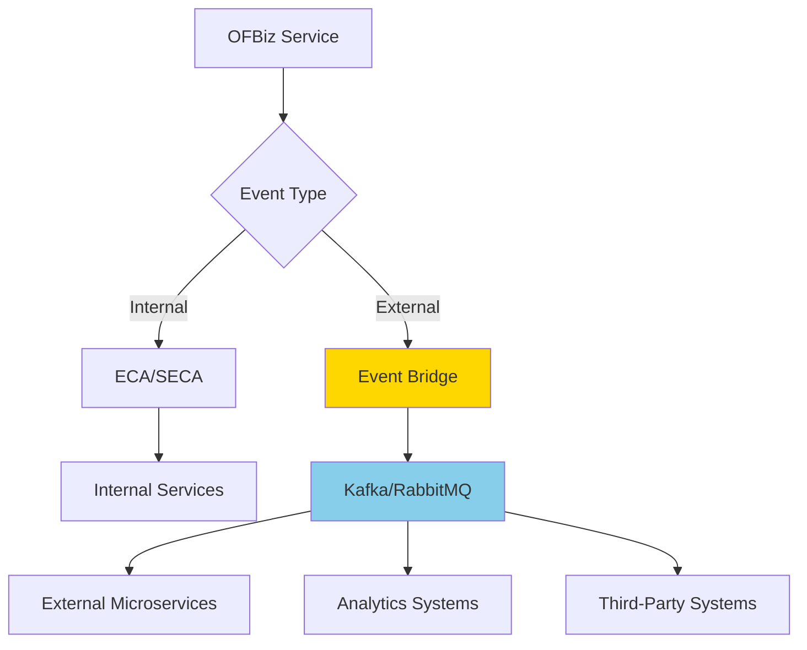

# Alternative Event Systems

**Purpose**: Guide for replacing or augmenting OFBiz ECA/SECA with modern event-driven systems like Apache Kafka, RabbitMQ, or Spring Events.

**Audience**: Enterprise Architects, Integration Architects, Senior Developers

**Prerequisites**: 
- [ECA/SECA Overview](./eca-seca-overview.md)
- [Service Engine](../service-engine/overview.md)

**Related Documents**: 
- [Event-Driven Integration](../../05-integration-architecture/event-driven-integration.md)
- [Microservices Architecture](../service-engine/replacement-strategies.md)

---

## Overview

While ECA/SECA provides event-driven capabilities within OFBiz, modern distributed systems often require more robust event streaming platforms. This document outlines strategies for integrating Apache Kafka, RabbitMQ, Spring Events, or other event systems while preserving or replacing ECA/SECA functionality.

## Visual Architecture

### Hybrid Event Architecture



**Diagram Description**: Hybrid architecture where internal events use ECA/SECA while external events are published to Kafka/RabbitMQ for consumption by external systems.

### Kafka Integration Pattern

```mermaid
graph LR
    A[OFBiz Service] --> B[Event Publisher]
    B --> C[Kafka Topic]
    C --> D[Consumer 1<br/>Analytics]
    C --> E[Consumer 2<br/>Notifications]
    C --> F[Consumer 3<br/>External System]
    C --> G[OFBiz Consumer<br/>Internal Processing]
    
    style C fill:#231F20
    style B fill:#FFD700
```



**Diagram Description**: Kafka integration showing OFBiz publishing events to Kafka topics, consumed by multiple systems including external services and OFBiz itself for async processing.

## Integration Strategies

### Strategy 1: Kafka Event Streaming

**Approach**: Publish OFBiz events to Kafka topics for external consumption

**Architecture**:
```
OFBiz Service
    ↓
SECA Rule
    ↓
Kafka Publisher Service
    ↓
Kafka Topic (order-events)
    ↓
Multiple Consumers
```

**Implementation**:

**Kafka Publisher Service**:
```java
@Service
public class KafkaEventPublisher {
    
    @Autowired
    private KafkaTemplate<String, OrderEvent> kafkaTemplate;
    
    public static Map<String, Object> publishOrderEvent(DispatchContext dctx, Map<String, ?> context) {
        String orderId = (String) context.get("orderId");
        String eventType = (String) context.get("eventType");
        
        OrderEvent event = new OrderEvent();
        event.setOrderId(orderId);
        event.setEventType(eventType);
        event.setTimestamp(System.currentTimeMillis());
        event.setData(context);
        
        kafkaTemplate.send("order-events", orderId, event);
        
        return ServiceUtil.returnSuccess();
    }
}
```

**SECA Integration**:
```xml
<service-eca service-name="createOrder" event="return">
    <condition field-name="responseMessage" operator="equals" value="success"/>
    <action service="publishOrderEvent" mode="async">
        <field-map field-name="eventType" value="ORDER_CREATED"/>
    </action>
</service-eca>

<service-eca service-name="approveOrder" event="return">
    <condition field-name="responseMessage" operator="equals" value="success"/>
    <action service="publishOrderEvent" mode="async">
        <field-map field-name="eventType" value="ORDER_APPROVED"/>
    </action>
</service-eca>
```

**Kafka Consumer (External System)**:
```java
@Service
public class OrderEventConsumer {
    
    @KafkaListener(topics = "order-events", groupId = "analytics-service")
    public void handleOrderEvent(OrderEvent event) {
        switch (event.getEventType()) {
            case "ORDER_CREATED":
                updateAnalytics(event);
                break;
            case "ORDER_APPROVED":
                triggerFulfillment(event);
                break;
        }
    }
}
```

### Strategy 2: RabbitMQ Message Queue

**Approach**: Use RabbitMQ for reliable message delivery with routing

**Architecture**:
```
OFBiz Service
    ↓
RabbitMQ Publisher
    ↓
Exchange (order-exchange)
    ↓
Queues (order-created, order-approved, order-shipped)
    ↓
Consumers
```

**RabbitMQ Configuration**:
```java
@Configuration
public class RabbitMQConfig {
    
    @Bean
    public TopicExchange orderExchange() {
        return new TopicExchange("order-exchange");
    }
    
    @Bean
    public Queue orderCreatedQueue() {
        return new Queue("order-created-queue");
    }
    
    @Bean
    public Binding orderCreatedBinding() {
        return BindingBuilder
            .bind(orderCreatedQueue())
            .to(orderExchange())
            .with("order.created");
    }
}
```

**Publisher Service**:
```java
public static Map<String, Object> publishToRabbitMQ(DispatchContext dctx, Map<String, ?> context) {
    RabbitTemplate rabbitTemplate = getRabbitTemplate();
    String routingKey = (String) context.get("routingKey");
    
    OrderEvent event = createEvent(context);
    rabbitTemplate.convertAndSend("order-exchange", routingKey, event);
    
    return ServiceUtil.returnSuccess();
}
```

**SECA Integration**:
```xml
<service-eca service-name="createOrder" event="return">
    <action service="publishToRabbitMQ" mode="async">
        <field-map field-name="routingKey" value="order.created"/>
    </action>
</service-eca>
```

### Strategy 3: Spring Events (Internal)

**Approach**: Replace ECA/SECA with Spring's event system for internal events

**Event Definition**:
```java
public class OrderCreatedEvent extends ApplicationEvent {
    private final String orderId;
    private final Map<String, Object> orderData;
    
    public OrderCreatedEvent(Object source, String orderId, Map<String, Object> orderData) {
        super(source);
        this.orderId = orderId;
        this.orderData = orderData;
    }
}
```

**Event Publisher**:
```java
@Service
public class OrderService {
    
    @Autowired
    private ApplicationEventPublisher eventPublisher;
    
    public Map<String, Object> createOrder(Map<String, Object> context) {
        // Create order logic
        String orderId = createOrderInDatabase(context);
        
        // Publish event
        OrderCreatedEvent event = new OrderCreatedEvent(this, orderId, context);
        eventPublisher.publishEvent(event);
        
        return ServiceUtil.returnSuccess("orderId", orderId);
    }
}
```

**Event Listeners**:
```java
@Component
public class OrderEventListeners {
    
    @EventListener
    @Async
    public void handleOrderCreated(OrderCreatedEvent event) {
        // Send confirmation email
        sendOrderConfirmation(event.getOrderId());
    }
    
    @EventListener
    @Async
    public void updateInventory(OrderCreatedEvent event) {
        // Reserve inventory
        reserveInventory(event.getOrderData());
    }
    
    @EventListener
    @Async
    public void updateAnalytics(OrderCreatedEvent event) {
        // Update analytics
        recordOrderMetrics(event.getOrderId());
    }
}
```

### Strategy 4: Event Sourcing Pattern

**Approach**: Store all events in event store for replay and audit

**Event Store**:
```java
@Entity
@Table(name = "event_store")
public class StoredEvent {
    @Id
    private String eventId;
    private String aggregateId;
    private String eventType;
    private String eventData;
    private Timestamp occurredOn;
    private String userId;
}
```

**Event Publisher with Storage**:
```java
public static Map<String, Object> publishAndStoreEvent(DispatchContext dctx, Map<String, ?> context) {
    Delegator delegator = dctx.getDelegator();
    
    // Store event
    GenericValue storedEvent = delegator.makeValue("StoredEvent");
    storedEvent.set("eventId", delegator.getNextSeqId("StoredEvent"));
    storedEvent.set("aggregateId", context.get("orderId"));
    storedEvent.set("eventType", context.get("eventType"));
    storedEvent.set("eventData", JSON.toJSONString(context));
    storedEvent.set("occurredOn", UtilDateTime.nowTimestamp());
    storedEvent.create();
    
    // Publish to Kafka
    publishToKafka(context);
    
    return ServiceUtil.returnSuccess();
}
```

**Event Replay**:
```java
public static Map<String, Object> replayEvents(DispatchContext dctx, Map<String, ?> context) {
    Delegator delegator = dctx.getDelegator();
    String aggregateId = (String) context.get("aggregateId");
    
    List<GenericValue> events = delegator.findByAnd("StoredEvent",
        UtilMisc.toMap("aggregateId", aggregateId),
        UtilMisc.toList("occurredOn"), false);
    
    for (GenericValue event : events) {
        replayEvent(event);
    }
    
    return ServiceUtil.returnSuccess();
}
```

## Migration Strategies

### Phase 1: Parallel Operation

**Approach**: Run ECA/SECA and new event system in parallel

**Implementation**:
```xml
<!-- Keep existing SECA -->
<service-eca service-name="createOrder" event="return">
    <action service="sendOrderEmail" mode="async"/>
</service-eca>

<!-- Add Kafka publishing -->
<service-eca service-name="createOrder" event="return">
    <action service="publishOrderEventToKafka" mode="async"/>
</service-eca>
```

### Phase 2: Gradual Migration

**Approach**: Migrate events one by one

**Week 1-2**: Order events to Kafka
**Week 3-4**: Product events to Kafka
**Week 5-6**: Party events to Kafka

### Phase 3: ECA/SECA Retirement

**Approach**: Remove ECA/SECA rules after migration complete

**Validation**:
- Verify all events published to new system
- Confirm all consumers working
- Remove old SECA rules

## Comparison Matrix

| Feature | ECA/SECA | Kafka | RabbitMQ | Spring Events |
|---------|----------|-------|----------|---------------|
| **Scope** | Internal | Distributed | Distributed | Internal |
| **Persistence** | No | Yes | Optional | No |
| **Replay** | No | Yes | No | No |
| **Scalability** | Limited | High | Medium | Limited |
| **Complexity** | Low | High | Medium | Low |
| **External Integration** | No | Yes | Yes | No |
| **Transaction Support** | Yes | No | No | Yes |
| **Learning Curve** | Low | High | Medium | Low |

## Architecture Decisions

### Decision: Hybrid Event Architecture

**Context**: Need both internal event handling and external event streaming.

**Decision**: Use ECA/SECA for internal events, Kafka for external events.

**Consequences**:
- ✅ **Positive**: Best of both worlds
- ✅ **Positive**: Gradual migration path
- ❌ **Negative**: Two event systems to maintain
- **Mitigation**: Clear boundaries, documentation

### Decision: Event Store for Audit

**Context**: Need complete audit trail of all events.

**Decision**: Store all events in event store before publishing.

**Consequences**:
- ✅ **Positive**: Complete audit trail
- ✅ **Positive**: Event replay capability
- ❌ **Negative**: Storage overhead
- **Mitigation**: Event archival strategy

## Official References

**Apache Kafka**:
- [Kafka Documentation](https://kafka.apache.org/documentation/)
- [Spring Kafka](https://spring.io/projects/spring-kafka)

**RabbitMQ**:
- [RabbitMQ Documentation](https://www.rabbitmq.com/documentation.html)
- [Spring AMQP](https://spring.io/projects/spring-amqp)

**Spring Events**:
- [Spring Events](https://docs.spring.io/spring-framework/docs/current/reference/html/core.html#context-functionality-events)

**Event Sourcing**:
- [Event Sourcing Pattern](https://martinfowler.com/eaaDev/EventSourcing.html)
- [CQRS Pattern](https://martinfowler.com/bliki/CQRS.html)

## Related Topics

**Within This Section**:
- [ECA/SECA Overview](./eca-seca-overview.md)

**Other Sections**:
- [Event-Driven Integration](../../05-integration-architecture/event-driven-integration.md)
- [Service Engine Replacement](../service-engine/replacement-strategies.md)
- [Microservices Architecture](../../01-system-overview/modular-architecture.md)

**Role-Based Guides**:
- [Architect Guide](../../role-based-guides/architect-guide.md)
- [Integrator Guide](../../role-based-guides/integrator-guide.md)

---

**Next**: [Data Architecture](../../03-data-architecture/README.md)

**Up**: [Framework Core](../README.md)

**Home**: [Master Index](../../00-INDEX.md)

---

**Document Metadata**:
- **Version**: 1.0
- **Last Updated**: December 2024
- **OFBiz Version**: Trunk (Latest)
- **Status**: Complete
