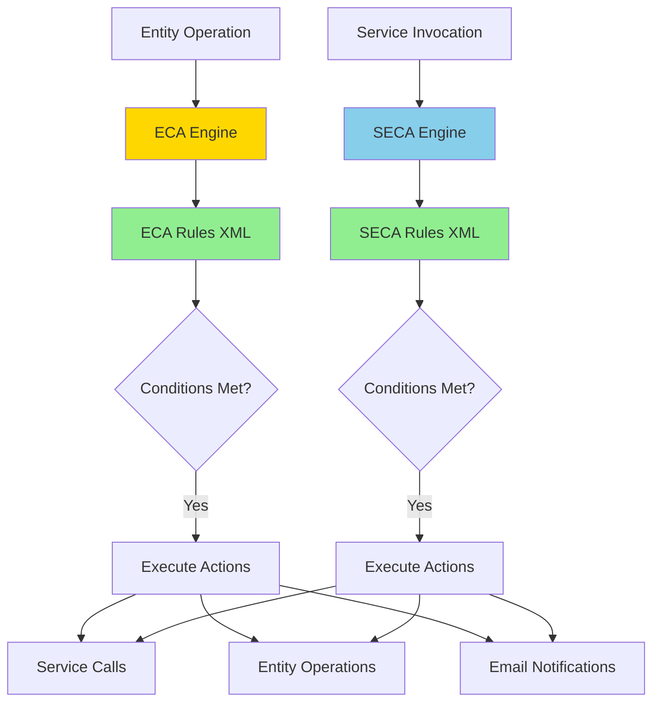
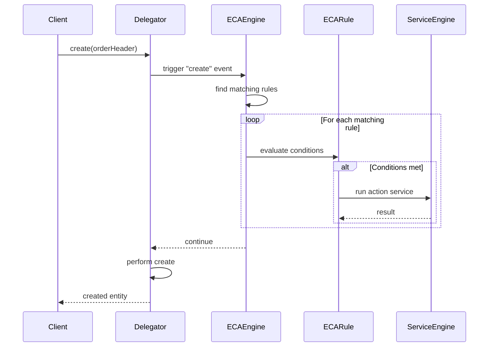
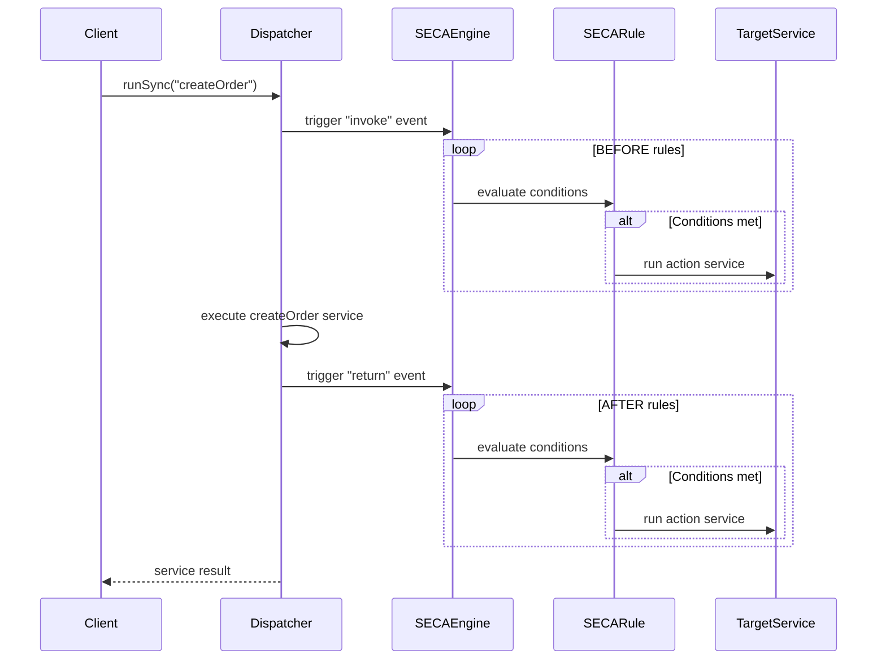

# ECA/SECA Event-Driven Architecture Overview

**Purpose**: Comprehensive overview of OFBiz's Entity Condition Action (ECA) and Service Engine Condition Action (SECA) event-driven architecture, which enables loose coupling and extensibility.

**Audience**: Enterprise Architects, Senior Developers

**Prerequisites**: 
- [Entity Engine Overview](../entity-engine/overview.md)
- [Service Engine Overview](../service-engine/overview.md)

**Related Documents**: 
- [Alternative Event Systems](./alternative-event-systems.md)
- [Module Isolation](../../04-application-modules/module-isolation-techniques.md)

---

## Overview

ECA (Entity Condition Action) and SECA (Service Engine Condition Action) provide event-driven programming capabilities in OFBiz, allowing actions to be triggered automatically when entities are modified or services are invoked. This mechanism is **essential for decoupling** modules and enabling extensibility without modifying core code. ECA/SECA can be replaced with alternative event systems, but **cannot be disabled** as it's fundamental to OFBiz's modular architecture.

## Visual Architecture

### ECA/SECA Architecture



**Diagram Description**: ECA/SECA architecture showing how entity operations and service invocations trigger rule evaluation, which conditionally executes actions like service calls, entity operations, or notifications.

### ECA Event Flow



**Diagram Description**: ECA event flow showing how entity operations trigger ECA rules, which evaluate conditions and execute actions before or after the entity operation completes.

### SECA Event Flow



**Diagram Description**: SECA event flow showing how service invocations trigger SECA rules at "invoke" (before) and "return" (after) events, enabling pre/post-processing without modifying service code.

## ECA (Entity Condition Action)

### ECA Events

**Supported Events**:
- `create`: Before/after entity creation
- `store`: Before/after entity update
- `remove`: Before/after entity deletion
- `find`: Before/after entity query
- `find-one`: Before/after single entity retrieval

### ECA Rule Structure

**Example ECA Rule**:
```xml
<entity-eca entity-name="OrderHeader" operation="create" event="return">
    <condition field-name="statusId" operator="equals" value="ORDER_CREATED"/>
    <condition field-name="orderTypeId" operator="equals" value="SALES_ORDER"/>
    <action service="sendOrderConfirmationEmail" mode="async"/>
    <action service="reserveInventory" mode="sync"/>
    <action service="updateOrderMetrics" mode="async"/>
</entity-eca>
```

**Components**:
- **entity-name**: Target entity
- **operation**: Entity operation (create/store/remove)
- **event**: When to trigger (invoke/return/commit)
- **condition**: Conditions that must be met
- **action**: Services to execute

### ECA Use Cases

**1. Audit Logging**:
```xml
<entity-eca entity-name="Product" operation="store" event="return">
    <action service="createAuditLog" mode="async">
        <field-map field-name="entityName" value="Product"/>
        <field-map field-name="operation" value="UPDATE"/>
    </action>
</entity-eca>
```

**2. Data Synchronization**:
```xml
<entity-eca entity-name="Party" operation="create" event="return">
    <action service="syncPartyToExternalSystem" mode="async"/>
</entity-eca>
```

**3. Cascade Operations**:
```xml
<entity-eca entity-name="OrderHeader" operation="remove" event="invoke">
    <action service="removeOrderItems" mode="sync"/>
    <action service="releaseInventoryReservations" mode="sync"/>
</entity-eca>
```

**4. Validation**:
```xml
<entity-eca entity-name="Product" operation="create" event="invoke">
    <action service="validateProductData" mode="sync"/>
</entity-eca>
```

## SECA (Service Engine Condition Action)

### SECA Events

**Supported Events**:
- `invoke`: Before service execution
- `in-validate`: After input validation
- `out-validate`: After output validation
- `return`: After service execution
- `commit`: After transaction commit
- `global-commit`: After global transaction commit

### SECA Rule Structure

**Example SECA Rule**:
```xml
<service-eca service-name="createOrder" event="return">
    <condition field-name="responseMessage" operator="equals" value="success"/>
    <action service="sendOrderConfirmationEmail" mode="async"/>
    <action service="updateInventoryMetrics" mode="async"/>
    <action service="notifyWarehouse" mode="async"/>
</service-eca>
```

### SECA Use Cases

**1. Workflow Orchestration**:
```xml
<service-eca service-name="approveOrder" event="return">
    <condition field-name="responseMessage" operator="equals" value="success"/>
    <action service="processPayment" mode="sync"/>
    <action service="createShipment" mode="async"/>
    <action service="sendApprovalNotification" mode="async"/>
</service-eca>
```

**2. Event Notification**:
```xml
<service-eca service-name="updateProductPrice" event="return">
    <condition field-name="responseMessage" operator="equals" value="success"/>
    <action service="notifyPriceChange" mode="async"/>
    <action service="updatePriceIndex" mode="async"/>
</service-eca>
```

**3. Cross-Module Integration**:
```xml
<service-eca service-name="createParty" event="return">
    <condition field-name="responseMessage" operator="equals" value="success"/>
    <!-- Trigger actions in other modules -->
    <action service="createAccountingParty" mode="async"/>
    <action service="createMarketingContact" mode="async"/>
</service-eca>
```

**4. Error Handling**:
```xml
<service-eca service-name="processPayment" event="return" run-on-error="true">
    <condition field-name="responseMessage" operator="equals" value="error"/>
    <action service="logPaymentFailure" mode="async"/>
    <action service="notifyAdminOfFailure" mode="async"/>
</service-eca>
```

## Why ECA/SECA is Essential

### 1. Module Decoupling

**Without ECA/SECA** (Tight Coupling):
```java
public static Map<String, Object> createOrder(DispatchContext dctx, Map<String, ?> context) {
    // Create order
    GenericValue order = createOrderHeader(context);
    
    // Tightly coupled to other modules
    sendEmail(order);  // Email module
    reserveInventory(order);  // Inventory module
    updateAccounting(order);  // Accounting module
    notifyWarehouse(order);  // Warehouse module
    
    return ServiceUtil.returnSuccess();
}
```

**With ECA/SECA** (Loose Coupling):
```java
public static Map<String, Object> createOrder(DispatchContext dctx, Map<String, ?> context) {
    // Create order
    GenericValue order = createOrderHeader(context);
    
    // Other modules react via SECA rules
    // No direct dependencies!
    
    return ServiceUtil.returnSuccess();
}
```

```xml
<!-- Other modules define their own reactions -->
<service-eca service-name="createOrder" event="return">
    <action service="sendOrderEmail" mode="async"/>
    <action service="reserveInventory" mode="sync"/>
    <action service="createAccountingTransaction" mode="async"/>
    <action service="notifyWarehouse" mode="async"/>
</service-eca>
```

### 2. Extensibility Without Code Changes

**Adding New Functionality**:
```xml
<!-- Add new behavior without modifying createOrder service -->
<service-eca service-name="createOrder" event="return">
    <action service="updateAnalyticsDashboard" mode="async"/>
    <action service="triggerMarketingCampaign" mode="async"/>
    <action service="syncToExternalCRM" mode="async"/>
</service-eca>
```

### 3. Module Isolation

**Disabling Optional Modules**:
- Remove SECA rules for disabled modules
- Core services continue to work
- No code changes required

**Example**: Disabling marketing module
```xml
<!-- Remove or comment out marketing SECA rules -->
<!-- <service-eca service-name="createOrder" event="return">
    <action service="triggerMarketingCampaign" mode="async"/>
</service-eca> -->
```

## ECA/SECA Configuration

### Rule Location

**ECA Rules**:
```
framework/entityext/entitydef/eecas.xml
applications/*/entitydef/eecas.xml
```

**SECA Rules**:
```
framework/service/servicedef/secas.xml
applications/*/servicedef/secas.xml
```

### Rule Loading

**Automatic Loading**:
- Rules loaded at startup
- Cached in memory
- Hot-reload in development mode

### Rule Priority

**Execution Order**:
1. Rules executed in definition order
2. `mode="sync"` blocks until complete
3. `mode="async"` executes in background

## Code References

<details>
<summary>View Source Code References</summary>

**EntityEcaHandler**:
`framework/entityext/src/main/java/org/apache/ofbiz/entityext/eca/EntityEcaHandler.java`

```java
public class EntityEcaHandler implements DelegatorEcaHandler {
    public void evalRules(String event, Map<String, ? extends EntityEcaRule> eventMap, 
            String currentOperation, GenericEntity value, boolean isError) {
        
        Collection<EntityEcaRule> rules = eventMap.values();
        for (EntityEcaRule rule : rules) {
            if (rule.eval(currentOperation, value)) {
                rule.runActions(currentOperation, value, isError);
            }
        }
    }
}
```

**ServiceEcaUtil**:
`framework/service/src/main/java/org/apache/ofbiz/service/eca/ServiceEcaUtil.java`

```java
public class ServiceEcaUtil {
    public static Map<String, Object> evalRules(String serviceName, Map<String, ? extends ServiceEcaRule> eventMap,
            String event, DispatchContext dctx, Map<String, Object> context, Map<String, Object> result,
            boolean isError, boolean isFailure) {
        
        for (ServiceEcaRule rule : eventMap.values()) {
            if (rule.eval(serviceName, dctx, context, result)) {
                rule.runActions(serviceName, dctx, context, result);
            }
        }
        
        return result;
    }
}
```

</details>

## Architecture Decisions

### Decision: Event-Driven Decoupling

**Context**: Need to decouple modules while maintaining integration.

**Decision**: Use ECA/SECA for event-driven integration between modules.

**Consequences**:
- ✅ **Positive**: Loose coupling between modules
- ✅ **Positive**: Easy to add/remove functionality
- ✅ **Positive**: No code changes for extensions
- ❌ **Negative**: Workflow logic spread across XML files
- ❌ **Negative**: Harder to trace execution flow
- **Mitigation**: Documentation, visualization tools, logging

### Decision: Cannot Disable ECA/SECA

**Context**: ECA/SECA is fundamental to OFBiz's modular architecture.

**Decision**: ECA/SECA mechanism is always active, but individual rules can be removed.

**Consequences**:
- ✅ **Positive**: Consistent integration mechanism
- ✅ **Positive**: Modules can rely on events
- ❌ **Negative**: Cannot completely disable event processing
- **Mitigation**: Can replace with alternative event systems (Kafka, RabbitMQ)

## Official References

**Apache OFBiz Documentation**:
- [Entity ECA Guide](https://cwiki.apache.org/confluence/display/OFBIZ/Entity+Engine+Guide#EntityEngineGuide-EntityECA)
- [Service ECA Guide](https://cwiki.apache.org/confluence/display/OFBIZ/Service+Engine+Guide#ServiceEngineGuide-ServiceECA)
- [GitHub Source - ECA](https://github.com/apache/ofbiz-framework/tree/trunk/framework/entityext/src/main/java/org/apache/ofbiz/entityext/eca)
- [GitHub Source - SECA](https://github.com/apache/ofbiz-framework/tree/trunk/framework/service/src/main/java/org/apache/ofbiz/service/eca)

## Related Topics

**Within This Section**:
- [Alternative Event Systems](./alternative-event-systems.md)

**Other Sections**:
- [Entity Engine](../entity-engine/overview.md)
- [Service Engine](../service-engine/overview.md)
- [Module Isolation](../../04-application-modules/module-isolation-techniques.md)

**Role-Based Guides**:
- [Architect Guide](../../role-based-guides/architect-guide.md)
- [Developer Guide](../../role-based-guides/developer-guide.md)

---

**Next**: [Alternative Event Systems](./alternative-event-systems.md)

**Up**: [Framework Core](../README.md)

**Home**: [Master Index](../../00-INDEX.md)

---

**Document Metadata**:
- **Version**: 1.0
- **Last Updated**: December 2024
- **OFBiz Version**: Trunk (Latest)
- **Status**: Complete
