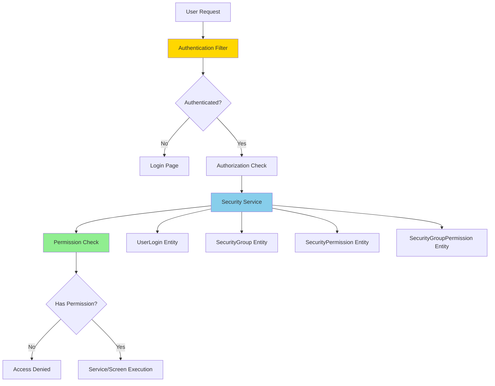
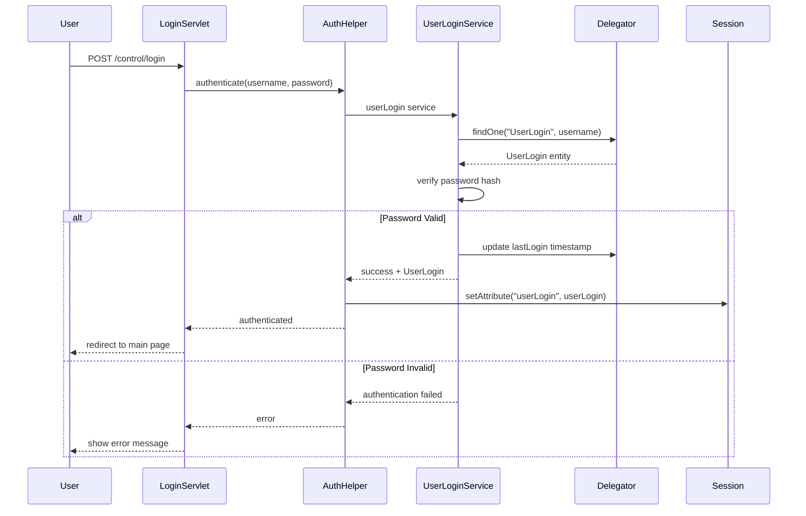
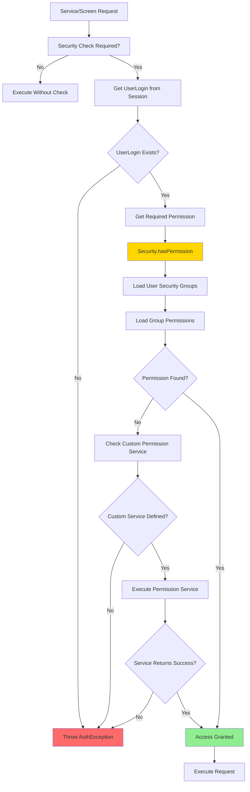

# Security Framework Overview

**Purpose**: Comprehensive overview of the OFBiz Security Framework, covering authentication, authorization, permission management, and security patterns.

**Audience**: Security Architects, Senior Developers, System Administrators

**Prerequisites**: 
- [System Overview](../../01-system-overview/system-context.md)
- [Service Engine Overview](../service-engine/overview.md)

**Related Documents**: 
- [Security Replacement Strategies](./replacement-strategies.md)
- [Access Control (RBAC/ABAC)](../../10-governance-compliance/access-control-rbac-abac.md)

---

## Overview

The OFBiz Security Framework provides comprehensive authentication and authorization capabilities through a flexible permission-based system. It supports user authentication, role-based access control (RBAC), permission checking at multiple levels (service, screen, entity), and integration with external security systems. The framework is deeply integrated with the Service Engine and Widget Framework to enforce security policies consistently across the application.

## Visual Architecture

### Security Architecture Overview



**Diagram Description**: Security architecture showing authentication filter, authorization checks, and permission evaluation using UserLogin, SecurityGroup, and SecurityPermission entities.

### Authentication Flow



**Diagram Description**: Authentication flow showing login request processing, password verification, session creation, and redirect on success or error display on failure.

### Authorization and Permission Check



**Diagram Description**: Authorization decision flow showing permission checking through security groups, with fallback to custom permission services for complex authorization logic.

## Core Components

### 1. Authentication

**UserLogin Entity**:
- Stores user credentials
- Password hashing (SHA-256 by default)
- Account status (enabled/disabled)
- Login tracking (last login, failed attempts)

**Authentication Methods**:
- Username/password (default)
- External authentication (LDAP, OAuth, SAML)
- API key authentication
- Certificate-based authentication

**Password Security**:
```java
// Password hashing
String hashedPassword = HashCrypt.cryptUTF8(LoginServices.getHashType(), null, password);

// Password verification
boolean isValid = HashCrypt.comparePassword(hashedPassword, LoginServices.getHashType(), password);
```

### 2. Authorization (RBAC)

**Security Model**:
```
UserLogin
    ├── UserLoginSecurityGroup (many-to-many)
    │   └── SecurityGroup
    │       └── SecurityGroupPermission (many-to-many)
    │           └── SecurityPermission
```

**Permission Structure**:
- **SecurityPermission**: Defines a permission (e.g., "CATALOG_ADMIN")
- **SecurityGroup**: Groups permissions (e.g., "CATALOG_MANAGERS")
- **UserLoginSecurityGroup**: Assigns users to groups

**Permission Naming Convention**:
```
[MODULE]_[ACTION]
Examples:
- CATALOG_ADMIN: Full catalog administration
- CATALOG_VIEW: View catalog data
- CATALOG_CREATE: Create catalog entries
- ORDERMGR_CREATE: Create orders
- ACCOUNTING_ADMIN: Full accounting access
```

### 3. Permission Checking

**Service-Level Security**:
```xml
<service name="createProduct" engine="java" auth="true">
    <permission-service service-name="catalogPermissionCheck" main-action="CREATE"/>
    <attribute name="productId" type="String" mode="OUT"/>
    <attribute name="productName" type="String" mode="IN"/>
</service>
```

**Permission Service Implementation**:
```java
public static Map<String, Object> catalogPermissionCheck(DispatchContext dctx, Map<String, ?> context) {
    GenericValue userLogin = (GenericValue) context.get("userLogin");
    String mainAction = (String) context.get("mainAction");
    Security security = dctx.getSecurity();
    
    if (!security.hasPermission("CATALOG_" + mainAction, userLogin)) {
        return ServiceUtil.returnError("Permission denied: CATALOG_" + mainAction);
    }
    
    return ServiceUtil.returnSuccess();
}
```

**Screen-Level Security**:
```xml
<screen name="EditProduct">
    <section>
        <condition>
            <if-has-permission permission="CATALOG" action="_ADMIN"/>
        </condition>
        <widgets>
            <!-- Screen content -->
        </widgets>
    </section>
</screen>
```

**Programmatic Security Check**:
```java
Security security = (Security) request.getAttribute("security");
GenericValue userLogin = (GenericValue) session.getAttribute("userLogin");

if (!security.hasPermission("CATALOG_ADMIN", userLogin)) {
    return "error";
}
```

### 4. Entity-Level Security

**Entity Group Permissions**:
```xml
<entity-group group="org.apache.ofbiz" entity="Product"/>
<entity-group group="org.apache.ofbiz" entity="ProductPrice"/>

<security-group group-id="CATALOG_ADMIN">
    <group-permission permission-id="ENTITY_MAINT"/>
</security-group>
```

**Row-Level Security**:
```java
// Custom authorization for specific records
public static Map<String, Object> checkProductOwnership(DispatchContext dctx, Map<String, ?> context) {
    Delegator delegator = dctx.getDelegator();
    GenericValue userLogin = (GenericValue) context.get("userLogin");
    String productId = (String) context.get("productId");
    
    try {
        GenericValue product = delegator.findOne("Product", 
            UtilMisc.toMap("productId", productId), false);
        
        if (!product.getString("createdByUserLogin").equals(userLogin.getString("userLoginId"))) {
            return ServiceUtil.returnError("You can only edit your own products");
        }
        
        return ServiceUtil.returnSuccess();
    } catch (GenericEntityException e) {
        return ServiceUtil.returnError(e.getMessage());
    }
}
```

## Security Patterns

### Pattern 1: Permission Hierarchy

**Implementation**:
```
CATALOG_ADMIN (full access)
    ├── CATALOG_CREATE
    ├── CATALOG_UPDATE
    ├── CATALOG_DELETE
    └── CATALOG_VIEW
```

**Code**:
```java
public boolean hasPermission(String permission, GenericValue userLogin) {
    // Check exact permission
    if (hasExactPermission(permission, userLogin)) {
        return true;
    }
    
    // Check admin permission (hierarchy)
    String module = permission.substring(0, permission.lastIndexOf('_'));
    if (hasExactPermission(module + "_ADMIN", userLogin)) {
        return true;
    }
    
    // Check super admin
    if (hasExactPermission("SUPER_ADMIN", userLogin)) {
        return true;
    }
    
    return false;
}
```

### Pattern 2: Context-Based Authorization

**Use Case**: Authorization depends on request context (e.g., user can only edit their own data)

**Implementation**:
```java
public static Map<String, Object> updateOrder(DispatchContext dctx, Map<String, ?> context) {
    GenericValue userLogin = (GenericValue) context.get("userLogin");
    String orderId = (String) context.get("orderId");
    
    // Check if user is order owner or has admin permission
    if (!isOrderOwner(orderId, userLogin) && 
        !hasPermission("ORDERMGR_ADMIN", userLogin)) {
        return ServiceUtil.returnError("You can only update your own orders");
    }
    
    // Proceed with update
    return ServiceUtil.returnSuccess();
}
```

### Pattern 3: Temporary Permission Elevation

**Use Case**: Grant temporary elevated permissions for specific operations

**Implementation**:
```java
public static Map<String, Object> performAdminTask(DispatchContext dctx, Map<String, ?> context) {
    GenericValue userLogin = (GenericValue) context.get("userLogin");
    GenericValue systemUserLogin = getSystemUserLogin(dctx.getDelegator());
    
    // Temporarily use system user for privileged operation
    context.put("userLogin", systemUserLogin);
    Map<String, Object> result = dctx.getDispatcher().runSync("privilegedService", context);
    
    // Restore original user
    context.put("userLogin", userLogin);
    
    return result;
}
```

## Code References

<details>
<summary>View Source Code References</summary>

**Security Interface**:
`framework/security/src/main/java/org/apache/ofbiz/security/Security.java`

```java
public interface Security {
    boolean hasPermission(String permission, GenericValue userLogin);
    boolean hasEntityPermission(String entity, String action, GenericValue userLogin);
    boolean hasRolePermission(String application, String action, String primaryKey, 
        String role, GenericValue userLogin);
}
```

**SecurityFactory**:
`framework/security/src/main/java/org/apache/ofbiz/security/SecurityFactory.java`

**LoginServices**:
`framework/common/src/main/java/org/apache/ofbiz/common/login/LoginServices.java`

```java
public class LoginServices {
    public static Map<String, Object> userLogin(DispatchContext ctx, Map<String, ?> context) {
        Delegator delegator = ctx.getDelegator();
        String username = (String) context.get("login.username");
        String password = (String) context.get("login.password");
        
        try {
            GenericValue userLogin = delegator.findOne("UserLogin", 
                UtilMisc.toMap("userLoginId", username), false);
            
            if (userLogin == null) {
                return ServiceUtil.returnError("User not found");
            }
            
            String hashedPassword = userLogin.getString("currentPassword");
            if (!HashCrypt.comparePassword(hashedPassword, getHashType(), password)) {
                return ServiceUtil.returnError("Invalid password");
            }
            
            // Update last login
            userLogin.set("lastTimeZone", context.get("timeZone"));
            userLogin.set("lastLocale", context.get("locale"));
            userLogin.store();
            
            Map<String, Object> result = ServiceUtil.returnSuccess();
            result.put("userLogin", userLogin);
            return result;
            
        } catch (GenericEntityException e) {
            return ServiceUtil.returnError(e.getMessage());
        }
    }
}
```

</details>

## Architecture Decisions

### Decision: Permission-Based Authorization

**Context**: Need flexible authorization that can be configured without code changes.

**Decision**: Use permission-based RBAC with security groups and permission entities.

**Consequences**:
- ✅ **Positive**: Flexible permission management
- ✅ **Positive**: No code changes for permission updates
- ✅ **Positive**: Supports complex authorization scenarios
- ❌ **Negative**: Database queries for permission checks
- **Mitigation**: Permission caching, efficient queries

### Decision: Service-Level Security Integration

**Context**: Need consistent security enforcement across all service invocations.

**Decision**: Integrate security checks into Service Engine with declarative permission requirements.

**Consequences**:
- ✅ **Positive**: Consistent security enforcement
- ✅ **Positive**: Declarative security configuration
- ✅ **Positive**: Cannot bypass security checks
- ❌ **Negative**: Performance overhead for permission checks
- **Mitigation**: Permission caching, lazy evaluation

## Official References

**Apache OFBiz Documentation**:
- [Security Guide](https://cwiki.apache.org/confluence/display/OFBIZ/Security+Guide)
- [Authentication](https://cwiki.apache.org/confluence/display/OFBIZ/Authentication)
- [Authorization](https://cwiki.apache.org/confluence/display/OFBIZ/Authorization)
- [GitHub Source](https://github.com/apache/ofbiz-framework/tree/trunk/framework/security)

**Security Standards**:
- [OWASP Top 10](https://owasp.org/www-project-top-ten/)
- [RBAC Standard](https://csrc.nist.gov/projects/role-based-access-control)

## Related Topics

**Within This Section**:
- [Security Replacement Strategies](./replacement-strategies.md)

**Other Sections**:
- [Service Engine](../service-engine/overview.md)
- [Access Control (RBAC/ABAC)](../../10-governance-compliance/access-control-rbac-abac.md)
- [Security Architecture](../../09-quality-attributes/security-architecture.md)

**Role-Based Guides**:
- [Architect Guide](../../role-based-guides/architect-guide.md)
- [Developer Guide](../../role-based-guides/developer-guide.md)

---

**Next**: [Security Replacement Strategies](./replacement-strategies.md)

**Up**: [Framework Core](../README.md)

**Home**: [Master Index](../../00-INDEX.md)

---

**Document Metadata**:
- **Version**: 1.0
- **Last Updated**: December 2024
- **OFBiz Version**: Trunk (Latest)
- **Status**: Complete
