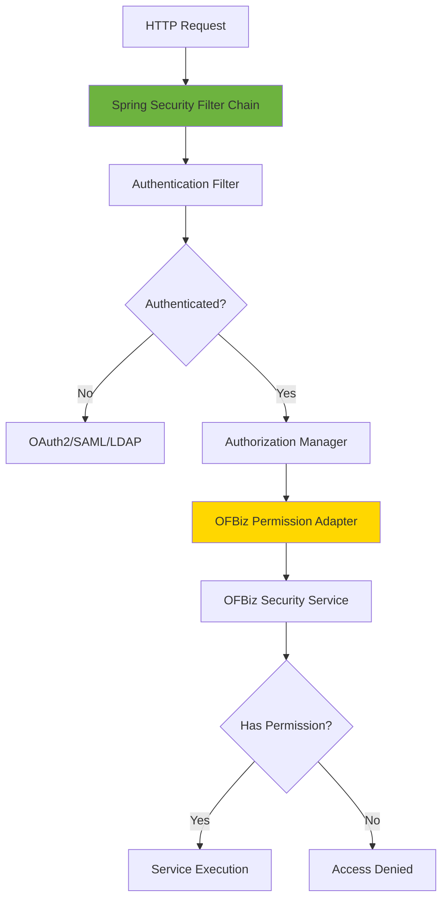

# Security Framework Replacement Strategies

**Purpose**: Guide for replacing or integrating the OFBiz Security Framework with modern security solutions like Spring Security, OAuth2, and enterprise SSO systems.

**Audience**: Security Architects, Senior Developers, System Integrators

**Prerequisites**: 
- [Security Framework Overview](./overview.md)
- [Service Engine Replacement](../service-engine/replacement-strategies.md)

**Related Documents**: 
- [REST API Architecture](../../05-integration-architecture/rest-api-architecture.md)

---

## Overview

Modern applications often require integration with enterprise identity providers, OAuth2/OIDC authentication, or SAML-based SSO. This document outlines strategies for replacing or augmenting the OFBiz Security Framework while maintaining backward compatibility and preserving authorization logic.

## Visual Architecture

### Spring Security Integration



**Diagram Description**: Spring Security integration showing filter chain, authentication providers, and adapter to OFBiz permission system for authorization.

## Replacement Strategies

### Strategy 1: Spring Security with OFBiz Authorization

**Approach**: Use Spring Security for authentication, keep OFBiz for authorization

**Spring Security Configuration**:
```java
@Configuration
@EnableWebSecurity
public class SecurityConfig {
    
    @Bean
    public SecurityFilterChain filterChain(HttpSecurity http) throws Exception {
        http
            .authorizeHttpRequests(auth -> auth
                .requestMatchers("/api/public/**").permitAll()
                .anyRequest().authenticated()
            )
            .oauth2Login(oauth2 -> oauth2
                .userInfoEndpoint(userInfo -> userInfo
                    .userService(customOAuth2UserService())
                )
            )
            .sessionManagement(session -> session
                .sessionCreationPolicy(SessionCreationPolicy.STATELESS)
            );
        
        return http.build();
    }
    
    @Bean
    public OAuth2UserService<OAuth2UserRequest, OAuth2User> customOAuth2UserService() {
        return new OFBizOAuth2UserService();
    }
}
```

**OFBiz Permission Adapter**:
```java
@Component
public class OFBizPermissionEvaluator implements PermissionEvaluator {
    
    @Autowired
    private Security ofbizSecurity;
    
    @Override
    public boolean hasPermission(Authentication authentication, Object targetDomainObject, Object permission) {
        GenericValue userLogin = getUserLogin(authentication);
        String permissionStr = permission.toString();
        
        return ofbizSecurity.hasPermission(permissionStr, userLogin);
    }
    
    private GenericValue getUserLogin(Authentication authentication) {
        // Map Spring Security user to OFBiz UserLogin
        String username = authentication.getName();
        return delegator.findOne("UserLogin", UtilMisc.toMap("userLoginId", username), false);
    }
}
```

**Method Security**:
```java
@RestController
@RequestMapping("/api/products")
public class ProductController {
    
    @PreAuthorize("hasPermission(null, 'CATALOG_ADMIN')")
    @PostMapping
    public ProductDTO createProduct(@RequestBody ProductDTO product) {
        // Create product
        return product;
    }
    
    @PreAuthorize("hasPermission(#productId, 'CATALOG_VIEW')")
    @GetMapping("/{productId}")
    public ProductDTO getProduct(@PathVariable String productId) {
        // Get product
        return product;
    }
}
```

### Strategy 2: OAuth2/OIDC Integration

**Approach**: Integrate with enterprise OAuth2/OIDC provider

**OAuth2 Configuration**:
```yaml
spring:
  security:
    oauth2:
      client:
        registration:
          okta:
            client-id: ${OKTA_CLIENT_ID}
            client-secret: ${OKTA_CLIENT_SECRET}
            scope: openid, profile, email
        provider:
          okta:
            issuer-uri: https://dev-123456.okta.com/oauth2/default
```

**User Synchronization**:
```java
@Service
public class OFBizOAuth2UserService extends DefaultOAuth2UserService {
    
    @Autowired
    private Delegator delegator;
    
    @Override
    public OAuth2User loadUser(OAuth2UserRequest userRequest) throws OAuth2AuthenticationException {
        OAuth2User oauth2User = super.loadUser(userRequest);
        
        // Sync user to OFBiz
        syncUserToOFBiz(oauth2User);
        
        return oauth2User;
    }
    
    private void syncUserToOFBiz(OAuth2User oauth2User) {
        String username = oauth2User.getAttribute("email");
        String firstName = oauth2User.getAttribute("given_name");
        String lastName = oauth2User.getAttribute("family_name");
        
        try {
            GenericValue userLogin = delegator.findOne("UserLogin", 
                UtilMisc.toMap("userLoginId", username), false);
            
            if (userLogin == null) {
                // Create new user
                userLogin = delegator.makeValue("UserLogin");
                userLogin.set("userLoginId", username);
                userLogin.set("enabled", "Y");
                userLogin.set("externalAuthId", oauth2User.getAttribute("sub"));
                userLogin.create();
                
                // Create Person
                GenericValue person = delegator.makeValue("Person");
                person.set("partyId", delegator.getNextSeqId("Party"));
                person.set("firstName", firstName);
                person.set("lastName", lastName);
                person.create();
                
                // Link UserLogin to Person
                GenericValue userLoginParty = delegator.makeValue("UserLoginParty");
                userLoginParty.set("userLoginId", username);
                userLoginParty.set("partyId", person.get("partyId"));
                userLoginParty.create();
            }
        } catch (GenericEntityException e) {
            throw new OAuth2AuthenticationException("Failed to sync user");
        }
    }
}
```

### Strategy 3: SAML SSO Integration

**Approach**: Integrate with enterprise SAML identity provider

**SAML Configuration**:
```java
@Configuration
@EnableWebSecurity
public class SAMLSecurityConfig {
    
    @Bean
    public SecurityFilterChain filterChain(HttpSecurity http) throws Exception {
        http
            .authorizeHttpRequests(auth -> auth
                .anyRequest().authenticated()
            )
            .saml2Login(saml2 -> saml2
                .relyingPartyRegistrationRepository(relyingPartyRegistrations())
            );
        
        return http.build();
    }
    
    @Bean
    public RelyingPartyRegistrationRepository relyingPartyRegistrations() {
        RelyingPartyRegistration registration = RelyingPartyRegistrations
            .fromMetadataLocation("https://idp.example.com/metadata")
            .registrationId("okta")
            .build();
        
        return new InMemoryRelyingPartyRegistrationRepository(registration);
    }
}
```

### Strategy 4: JWT Token-Based Authentication

**Approach**: Use JWT tokens for stateless authentication

**JWT Configuration**:
```java
@Configuration
public class JWTSecurityConfig {
    
    @Bean
    public SecurityFilterChain filterChain(HttpSecurity http) throws Exception {
        http
            .csrf().disable()
            .authorizeHttpRequests(auth -> auth
                .requestMatchers("/api/auth/**").permitAll()
                .anyRequest().authenticated()
            )
            .sessionManagement(session -> session
                .sessionCreationPolicy(SessionCreationPolicy.STATELESS)
            )
            .addFilterBefore(jwtAuthenticationFilter(), UsernamePasswordAuthenticationFilter.class);
        
        return http.build();
    }
    
    @Bean
    public JWTAuthenticationFilter jwtAuthenticationFilter() {
        return new JWTAuthenticationFilter();
    }
}
```

**JWT Filter**:
```java
public class JWTAuthenticationFilter extends OncePerRequestFilter {
    
    @Autowired
    private JWTTokenProvider tokenProvider;
    
    @Override
    protected void doFilterInternal(HttpServletRequest request, HttpServletResponse response, 
            FilterChain filterChain) throws ServletException, IOException {
        
        String token = extractToken(request);
        
        if (token != null && tokenProvider.validateToken(token)) {
            String username = tokenProvider.getUsernameFromToken(token);
            GenericValue userLogin = getUserLogin(username);
            
            Authentication authentication = new OFBizAuthenticationToken(userLogin);
            SecurityContextHolder.getContext().setAuthentication(authentication);
        }
        
        filterChain.doFilter(request, response);
    }
    
    private String extractToken(HttpServletRequest request) {
        String bearerToken = request.getHeader("Authorization");
        if (bearerToken != null && bearerToken.startsWith("Bearer ")) {
            return bearerToken.substring(7);
        }
        return null;
    }
}
```

## Migration Roadmap

### Phase 1: Assessment (Week 1)
- Identify authentication requirements
- Choose security solution (OAuth2/SAML/JWT)
- Plan user migration strategy

### Phase 2: Spring Security Setup (Weeks 2-3)
- Configure Spring Security
- Implement authentication provider
- Create OFBiz permission adapter
- Test authentication flow

### Phase 3: User Migration (Weeks 4-5)
- Implement user synchronization
- Migrate existing users
- Test user access

### Phase 4: Authorization Integration (Weeks 6-7)
- Integrate OFBiz permissions with Spring Security
- Implement method security
- Test authorization rules

### Phase 5: Testing & Rollout (Week 8)
- End-to-end testing
- Security audit
- Production deployment

## Architecture Decisions

### Decision: Keep OFBiz Authorization

**Context**: OFBiz has complex permission logic that would be expensive to rewrite.

**Decision**: Use modern authentication (OAuth2/SAML) but keep OFBiz authorization system.

**Consequences**:
- ✅ **Positive**: Preserve existing permission logic
- ✅ **Positive**: Modern authentication experience
- ❌ **Negative**: Two security systems to maintain
- **Mitigation**: Clear adapter layer, comprehensive testing

## Official References

**Spring Security**:
- [Spring Security Documentation](https://spring.io/projects/spring-security)
- [OAuth2 Login](https://docs.spring.io/spring-security/reference/servlet/oauth2/login/index.html)
- [SAML2 Login](https://docs.spring.io/spring-security/reference/servlet/saml2/index.html)

**OAuth2/OIDC**:
- [OAuth 2.0 Specification](https://oauth.net/2/)
- [OpenID Connect](https://openid.net/connect/)

## Related Topics

**Within This Section**:
- [Security Framework Overview](./overview.md)

**Other Sections**:
- [Service Engine Replacement](../service-engine/replacement-strategies.md)
- [REST API Architecture](../../05-integration-architecture/rest-api-architecture.md)

**Role-Based Guides**:
- [Architect Guide](../../role-based-guides/architect-guide.md)
- [Integrator Guide](../../role-based-guides/integrator-guide.md)

---

**Next**: [Webapp Framework Overview](../webapp-framework/overview.md)

**Up**: [Framework Core](../README.md)

**Home**: [Master Index](../../00-INDEX.md)

---

**Document Metadata**:
- **Version**: 1.0
- **Last Updated**: December 2024
- **OFBiz Version**: Trunk (Latest)
- **Status**: Complete
