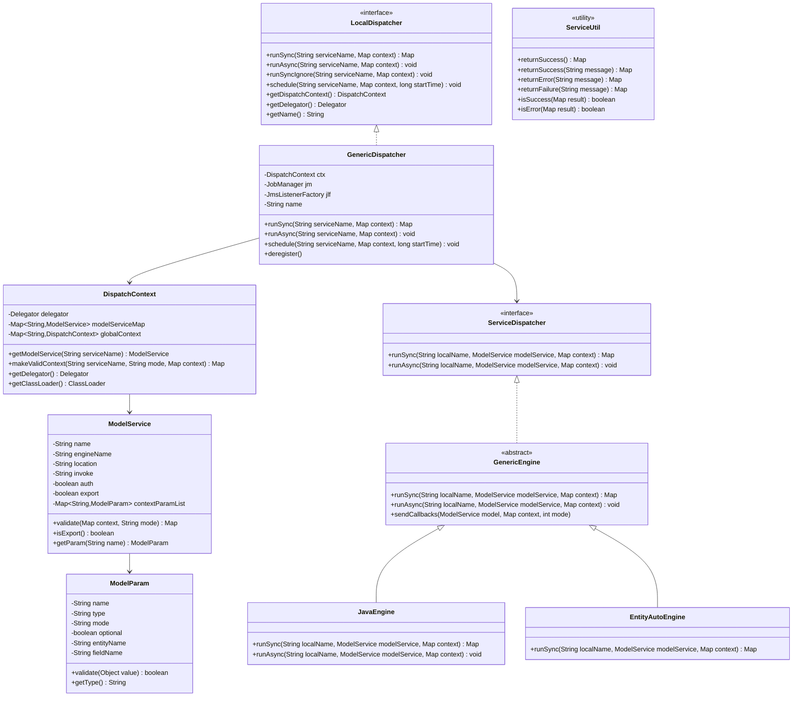
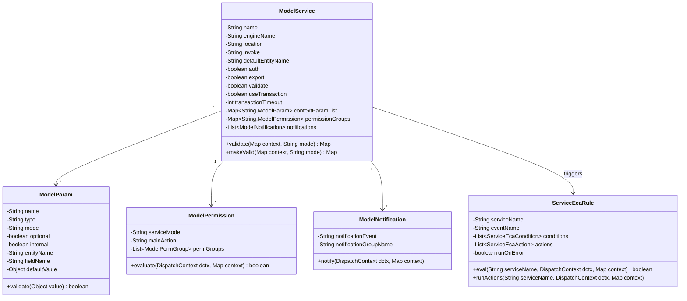
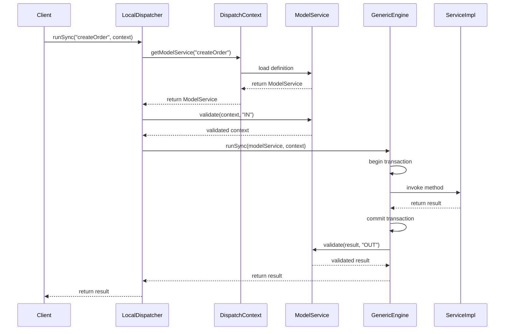

# Service Engine Class Structure

**Purpose**: Detailed documentation of the Service Engine's class hierarchy, interfaces, and design patterns used in OFBiz's service orchestration framework.

**Audience**: Senior Developers, Framework Architects, System Integrators

**Prerequisites**: 
- [Service Engine Overview](./overview.md)
- [Entity Engine Class Structure](../entity-engine/class-structure.md)

**Related Documents**: 
- [Service Invocation Patterns](./service-invocation.md)
- [Service Transaction Handling](./transaction-handling.md)

---

## Overview

The Service Engine's class structure is built around a sophisticated orchestration framework that manages service definitions, execution contexts, and invocation patterns. The architecture uses several design patterns including Factory, Strategy, and Command patterns to provide flexible service execution while maintaining type safety and transaction integrity.

## Visual Architecture

### Core Class Hierarchy



**Diagram Description**: This class diagram shows the core Service Engine architecture. LocalDispatcher is the main interface for service invocation, implemented by GenericDispatcher. DispatchContext manages service definitions (ModelService) and provides validation. GenericEngine is the abstract base for all service engines (Java, Entity-Auto, Script, etc.).

### Service Definition Model



**Diagram Description**: This diagram shows the ModelService structure that defines service metadata. Each service has parameters (ModelParam), permissions (ModelPermission), notifications, and can trigger ECA rules. This metadata-driven approach enables runtime validation and orchestration.

### Service Execution Flow



**Diagram Description**: This sequence diagram illustrates the complete service execution flow from client invocation through validation, engine selection, execution, and result return. Note the validation of both input and output parameters.

## Core Components

### LocalDispatcher Interface

**Purpose**: Primary interface for service invocation and orchestration

**Responsibilities**:
- Service invocation (sync, async, scheduled)
- Access to DispatchContext and Delegator
- Service lifecycle management
- Transaction coordination

**Key Methods**:
- `runSync()`: Synchronous service execution with result return
- `runAsync()`: Asynchronous service execution (fire-and-forget)
- `runSyncIgnore()`: Synchronous execution ignoring errors
- `schedule()`: Scheduled service execution via Job Scheduler

**Interactions**: Works with DispatchContext for service definitions, JobManager for scheduling, and Delegator for data access

### GenericDispatcher Implementation

**Purpose**: Concrete implementation of LocalDispatcher

**Responsibilities**:
- Service routing to appropriate engine
- Transaction management coordination
- Job scheduling integration
- JMS listener management for distributed services

**Key Features**:
- Thread-safe service execution
- Connection pooling for distributed calls
- Service result caching
- Error handling and recovery

### DispatchContext

**Purpose**: Service definition registry and validation context

**Responsibilities**:
- Service definition loading and caching
- Service parameter validation
- Context preparation and validation
- ClassLoader management for service implementations

**Key Methods**:
- `getModelService()`: Retrieve service definition
- `makeValidContext()`: Validate and prepare service context
- `getDelegator()`: Access to Entity Engine

**Interactions**: Central registry accessed by all dispatchers, loads ModelService definitions from XML

### ModelService

**Purpose**: Service definition metadata model

**Responsibilities**:
- Service metadata storage (name, engine, location, invoke method)
- Parameter definitions and validation rules
- Permission requirements
- Transaction settings
- ECA rule associations

**Key Attributes**:
- `name`: Unique service identifier
- `engineName`: Execution engine (java, entity-auto, script, etc.)
- `location`: Service implementation location
- `invoke`: Method/function to invoke
- `auth`: Authentication required flag
- `useTransaction`: Transaction management flag

### ModelParam

**Purpose**: Service parameter definition and validation

**Responsibilities**:
- Parameter metadata (name, type, mode)
- Type validation
- Optional/required enforcement
- Default value handling
- Entity field mapping

**Modes**:
- `IN`: Input parameter
- `OUT`: Output parameter
- `INOUT`: Both input and output

### GenericEngine Abstract Class

**Purpose**: Base class for all service execution engines

**Responsibilities**:
- Common execution logic
- Transaction management
- Callback handling
- Error handling patterns

**Implementations**:
- `JavaEngine`: Java method invocation
- `EntityAutoEngine`: Automatic CRUD operations
- `ScriptEngine`: Groovy/JavaScript execution
- `RouteEngine`: Service routing
- `HttpEngine`: HTTP/REST service calls

## Design Patterns

### 1. Factory Pattern

**Usage**: Service engine creation and management

**Implementation**:
```java
// ServiceDispatcher acts as factory for engines
GenericEngine engine = ServiceDispatcher.getGenericEngine(engineName);
```

**Benefits**:
- Decouples service invocation from engine implementation
- Enables runtime engine selection
- Simplifies adding new engine types

### 2. Strategy Pattern

**Usage**: Different service execution strategies (sync, async, scheduled)

**Implementation**:
```java
// Different execution strategies
dispatcher.runSync(serviceName, context);      // Synchronous strategy
dispatcher.runAsync(serviceName, context);     // Asynchronous strategy
dispatcher.schedule(serviceName, context, time); // Scheduled strategy
```

**Benefits**:
- Flexible execution modes
- Consistent interface across strategies
- Easy to add new execution patterns

### 3. Command Pattern

**Usage**: Service invocation encapsulation

**Implementation**:
- ModelService encapsulates service execution as command
- Parameters and metadata define command structure
- Engines execute commands

**Benefits**:
- Service invocations can be queued, logged, undone
- Supports job scheduling and async execution
- Enables service composition

### 4. Template Method Pattern

**Usage**: GenericEngine defines execution template

**Implementation**:
```java
// GenericEngine template
public Map<String, Object> runSync(String localName, ModelService modelService, Map<String, Object> context) {
    // Pre-execution hooks
    sendCallbacks(modelService, context, GenericEngine.EVENT_BEFORE);
    
    // Actual execution (implemented by subclasses)
    Map<String, Object> result = executeService(modelService, context);
    
    // Post-execution hooks
    sendCallbacks(modelService, context, GenericEngine.EVENT_AFTER);
    
    return result;
}
```

**Benefits**:
- Consistent execution lifecycle
- Extensible through callbacks
- Enforces best practices

### 5. Registry Pattern

**Usage**: DispatchContext as service registry

**Implementation**:
- Central registry of all service definitions
- Services registered at startup from XML
- Runtime lookup by service name

**Benefits**:
- Centralized service management
- Dynamic service discovery
- Supports service versioning

### 6. Proxy Pattern

**Usage**: LocalDispatcher as proxy to actual service implementations

**Implementation**:
- Client interacts with LocalDispatcher interface
- Dispatcher delegates to appropriate engine
- Transparent transaction and security handling

**Benefits**:
- Separation of concerns
- Cross-cutting concerns (security, transactions) handled transparently
- Enables distributed service calls

## Code References

<details>
<summary>View Source Code References</summary>

**LocalDispatcher Interface**:
`framework/service/src/main/java/org/apache/ofbiz/service/LocalDispatcher.java`

```java
public interface LocalDispatcher {
    /**
     * Run a service synchronously and return the result
     */
    Map<String, Object> runSync(String serviceName, Map<String, ? extends Object> context) 
        throws ServiceAuthException, ServiceValidationException, GenericServiceException;
    
    /**
     * Run a service asynchronously
     */
    void runAsync(String serviceName, Map<String, ? extends Object> context) 
        throws GenericServiceException;
    
    /**
     * Schedule a service to run at a specific time
     */
    void schedule(String serviceName, Map<String, ? extends Object> context, long startTime) 
        throws GenericServiceException;
    
    /**
     * Get the DispatchContext for this dispatcher
     */
    DispatchContext getDispatchContext();
    
    /**
     * Get the Delegator associated with this dispatcher
     */
    Delegator getDelegator();
}
```

**GenericDispatcher Implementation**:
`framework/service/src/main/java/org/apache/ofbiz/service/GenericDispatcher.java`

**DispatchContext**:
`framework/service/src/main/java/org/apache/ofbiz/service/DispatchContext.java`

```java
public class DispatchContext implements Serializable {
    private Delegator delegator;
    private Map<String, ModelService> modelServiceMap;
    
    public ModelService getModelService(String serviceName) throws GenericServiceException {
        ModelService model = modelServiceMap.get(serviceName);
        if (model == null) {
            throw new GenericServiceException("Cannot find service: " + serviceName);
        }
        return model;
    }
    
    public Map<String, Object> makeValidContext(String serviceName, String mode, Map<String, ?> context) 
        throws GenericServiceException {
        ModelService model = getModelService(serviceName);
        return model.makeValid(context, mode);
    }
}
```

**ModelService**:
`framework/service/src/main/java/org/apache/ofbiz/service/ModelService.java`

```java
public class ModelService implements Serializable {
    private String name;
    private String engineName;
    private String location;
    private String invoke;
    private boolean auth = true;
    private boolean export = false;
    private boolean validate = true;
    private boolean useTransaction = true;
    private Map<String, ModelParam> contextParamList;
    
    public Map<String, Object> validate(Map<String, ?> context, String mode) 
        throws ServiceValidationException {
        // Validate all parameters based on mode (IN, OUT, INOUT)
        for (ModelParam param : contextParamList.values()) {
            if (param.mode.equals(mode) || param.mode.equals("INOUT")) {
                param.validate(context.get(param.name));
            }
        }
        return validatedContext;
    }
}
```

**GenericEngine**:
`framework/service/src/main/java/org/apache/ofbiz/service/engine/GenericEngine.java`

**JavaEngine**:
`framework/service/src/main/java/org/apache/ofbiz/service/engine/JavaEngine.java`

**ServiceUtil**:
`framework/service/src/main/java/org/apache/ofbiz/service/ServiceUtil.java`

```java
public class ServiceUtil {
    public static Map<String, Object> returnSuccess() {
        return returnSuccess(null);
    }
    
    public static Map<String, Object> returnSuccess(String successMessage) {
        Map<String, Object> result = new HashMap<>();
        result.put(ModelService.RESPONSE_MESSAGE, ModelService.RESPOND_SUCCESS);
        if (successMessage != null) {
            result.put(ModelService.SUCCESS_MESSAGE, successMessage);
        }
        return result;
    }
    
    public static Map<String, Object> returnError(String errorMessage) {
        Map<String, Object> result = new HashMap<>();
        result.put(ModelService.RESPONSE_MESSAGE, ModelService.RESPOND_ERROR);
        result.put(ModelService.ERROR_MESSAGE, errorMessage);
        return result;
    }
    
    public static boolean isSuccess(Map<String, Object> results) {
        return ModelService.RESPOND_SUCCESS.equals(results.get(ModelService.RESPONSE_MESSAGE));
    }
}
```

**Key Classes**:
- `LocalDispatcher`: Main service invocation interface
- `GenericDispatcher`: Concrete dispatcher implementation
- `DispatchContext`: Service registry and validation context
- `ModelService`: Service definition metadata
- `ModelParam`: Parameter definition and validation
- `GenericEngine`: Abstract base for execution engines
- `JavaEngine`: Java method invocation engine
- `EntityAutoEngine`: Automatic CRUD service engine
- `ServiceUtil`: Utility methods for service results

**Package Structure**:
```
org.apache.ofbiz.service
├── LocalDispatcher (interface)
├── GenericDispatcher
├── DispatchContext
├── ModelService
├── ModelParam
├── ServiceUtil
├── engine
│   ├── GenericEngine (abstract)
│   ├── JavaEngine
│   ├── EntityAutoEngine
│   ├── ScriptEngine
│   ├── RouteEngine
│   └── HttpEngine
├── eca
│   ├── ServiceEcaRule
│   ├── ServiceEcaCondition
│   └── ServiceEcaAction
└── job
    ├── JobManager
    └── Job
```

</details>

## Architecture Decisions

### Decision: Interface-Based Dispatcher Design

**Context**: Need flexible service invocation that supports multiple execution modes and can be extended without breaking existing code.

**Decision**: Use LocalDispatcher interface with GenericDispatcher implementation, allowing multiple dispatcher types and execution strategies.

**Consequences**:
- ✅ **Positive**: Easy to add new dispatcher types, supports testing with mock dispatchers, clean separation of concerns
- ✅ **Positive**: Enables distributed service calls through different dispatcher implementations
- ❌ **Negative**: Additional abstraction layer adds slight complexity
- **Mitigation**: Comprehensive documentation and clear naming conventions

**Alternatives Considered**:
- **Concrete Dispatcher Class**: Would be simpler but less flexible for extensions
- **Static Service Methods**: Would be easier to use but impossible to test and extend

### Decision: Metadata-Driven Service Definitions

**Context**: Need to support service validation, permissions, transactions, and ECA rules without hardcoding in service implementations.

**Decision**: Use ModelService to define all service metadata in XML, loaded at runtime into DispatchContext registry.

**Consequences**:
- ✅ **Positive**: Declarative service definitions, runtime validation, easy to modify without code changes
- ✅ **Positive**: Supports service introspection and documentation generation
- ✅ **Positive**: Enables dynamic service composition and routing
- ❌ **Negative**: XML parsing overhead at startup, potential for XML/code mismatch
- **Mitigation**: Validation scripts to check XML consistency, caching of parsed definitions

**Alternatives Considered**:
- **Annotation-Based Definitions**: More modern but requires code changes for metadata updates
- **Code-Based Definitions**: Simpler but less flexible and harder to maintain

### Decision: Multiple Service Engines

**Context**: Services need to be implemented in different ways (Java, Groovy, entity operations, HTTP calls) with consistent invocation interface.

**Decision**: Abstract GenericEngine base class with specialized implementations for each execution type.

**Consequences**:
- ✅ **Positive**: Supports multiple implementation languages and patterns
- ✅ **Positive**: Easy to add new engine types
- ✅ **Positive**: Consistent transaction and security handling across engines
- ❌ **Negative**: Engine selection logic adds complexity
- **Mitigation**: Clear engine naming and documentation

**Alternatives Considered**:
- **Single Java Engine**: Simpler but limits implementation flexibility
- **Plugin-Based Engines**: More flexible but adds deployment complexity

### Decision: ServiceUtil Result Convention

**Context**: Need consistent way to return success/error results from services with messages.

**Decision**: Standardize on Map-based results with RESPONSE_MESSAGE, SUCCESS_MESSAGE, ERROR_MESSAGE keys, with ServiceUtil helper methods.

**Consequences**:
- ✅ **Positive**: Consistent result handling across all services
- ✅ **Positive**: Easy to check success/failure with utility methods
- ✅ **Positive**: Supports internationalized messages
- ❌ **Negative**: Map-based results are not type-safe
- **Mitigation**: Clear documentation and validation of result structure

**Alternatives Considered**:
- **Exception-Based Error Handling**: More Java-idiomatic but harder to handle partial success
- **Result Object**: More type-safe but requires additional classes

## Official References

**Apache OFBiz Documentation**:
- [Service Engine Documentation](https://cwiki.apache.org/confluence/display/OFBIZ/Service+Engine+Guide)
- [Service Definition Reference](https://cwiki.apache.org/confluence/display/OFBIZ/Service+Reference)
- [GitHub Source - Service Framework](https://github.com/apache/ofbiz-framework/tree/trunk/framework/service)

**Design Patterns**:
- [Factory Pattern](https://refactoring.guru/design-patterns/factory-method)
- [Strategy Pattern](https://refactoring.guru/design-patterns/strategy)
- [Command Pattern](https://refactoring.guru/design-patterns/command)
- [Template Method Pattern](https://refactoring.guru/design-patterns/template-method)

## Related Topics

**Within This Section**:
- [Service Engine Overview](./overview.md)
- [Service Invocation Patterns](./service-invocation.md)
- [Service Transaction Handling](./transaction-handling.md)
- [Service Replacement Strategies](./replacement-strategies.md)

**Other Sections**:
- [Entity Engine Class Structure](../entity-engine/class-structure.md)
- [ECA/SECA Event-Driven Architecture](../event-driven-architecture/eca-seca-overview.md)
- [Security Framework](../security-framework/overview.md)

**Role-Based Guides**:
- [Developer Guide](../../role-based-guides/developer-guide.md)
- [Architect Guide](../../role-based-guides/architect-guide.md)

---

**Next**: [Service Invocation Patterns](./service-invocation.md)

**Up**: [Framework Core](../README.md)

**Home**: [Master Index](../../00-INDEX.md)

---

**Document Metadata**:
- **Version**: 1.0
- **Last Updated**: December 2024
- **OFBiz Version**: Trunk (Latest)
- **Status**: Complete
