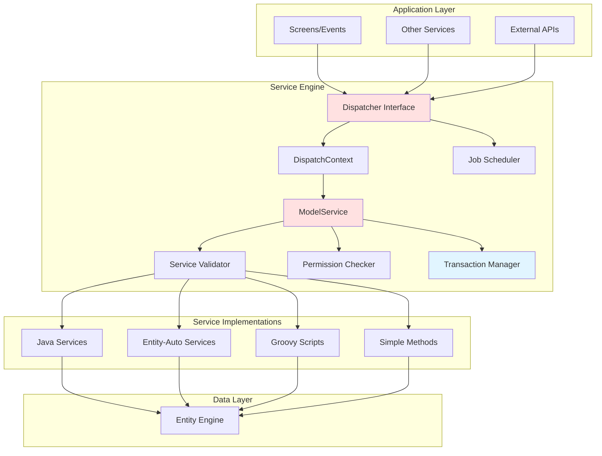
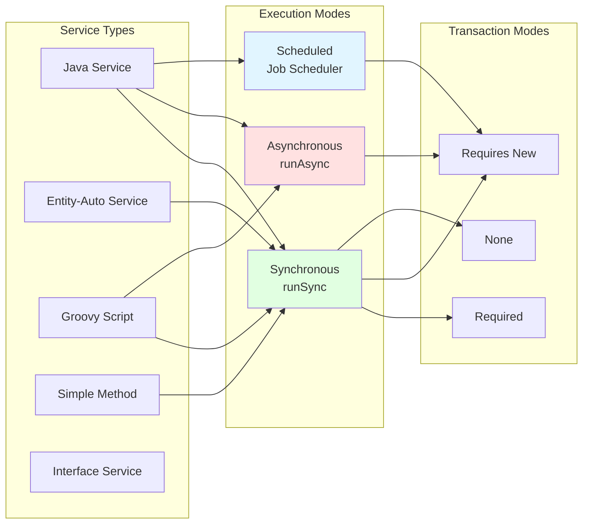
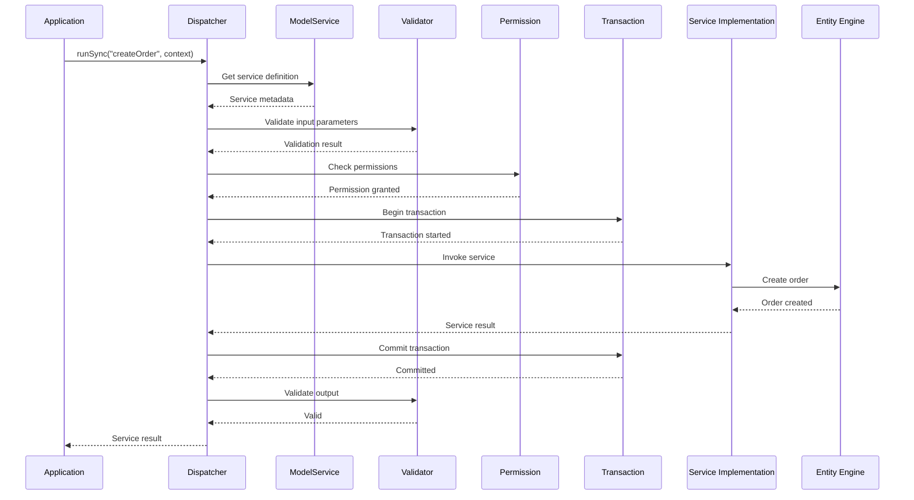

# Service Engine Overview

**Purpose**: Introduce OFBiz Service Engine architecture, capabilities, and execution modes  
**Audience**: Developers, Technical Architects, Integration Specialists  
**Prerequisites**: [System Overview](../../01-system-overview/README.md), [Entity Engine Overview](../entity-engine/overview.md)  
**Related Documents**: [Class Structure](class-structure.md), [Service Invocation](service-invocation.md), [Transaction Handling](transaction-handling.md)

---

## Overview

The Service Engine is OFBiz's business logic orchestration layer, providing a framework for defining, invoking, and managing services. It handles synchronous and asynchronous execution, transaction management, permission checking, and service chaining. Understanding the Service Engine is essential for implementing business logic in OFBiz.

## Visual Architecture

### Service Engine Architecture



**Diagram Description**: Service Engine architecture showing Dispatcher as main interface, DispatchContext managing service definitions, validation and permission checking, and multiple service implementation types (Java, Entity-Auto, Groovy, Simple Methods) accessing Entity Engine.

### Service Types and Execution Modes



**Diagram Description**: Service types (Java, Entity-Auto, Groovy, Simple Method, Interface) can be executed in different modes (Sync, Async, Scheduled) with different transaction behaviors (Required, Requires New, None).

### Service Invocation Flow



**Diagram Description**: Service invocation flow showing validation, permission checking, transaction management, service execution, and result validation. All steps coordinated by Dispatcher.

## Key Responsibilities

### 1. Service Definition and Registration

**Capability**: Define services declaratively in XML with metadata

**Service Definition**:
<details>
<summary>View Service Definition Example</summary>

**File**: `applications/order/servicedef/services.xml`

```xml
<service name="createOrder" engine="java"
         location="org.apache.ofbiz.order.order.OrderServices" 
         invoke="createOrder">
    <description>Create a new order</description>
    <permission-service service-name="orderPermissionCheck" main-action="CREATE"/>
    <auto-attributes entity-name="OrderHeader" include="nonpk" mode="IN" optional="true"/>
    <attribute name="orderId" type="String" mode="OUT" optional="false"/>
    <attribute name="orderItems" type="List" mode="IN" optional="false"/>
</service>
```

**Key Elements**:
- `name`: Service identifier
- `engine`: Implementation type (java, entity-auto, groovy, simple)
- `location`: Class or script location
- `invoke`: Method name
- `permission-service`: Permission check
- `auto-attributes`: Inherit entity fields
- `attribute`: Input/output parameters

</details>

### 2. Service Invocation

**Capability**: Invoke services synchronously or asynchronously

**Synchronous Invocation**:
```java
// Blocks until service completes
Map<String, Object> context = UtilMisc.toMap(
    "partyId", "10000",
    "productId", "PROD-001",
    "quantity", BigDecimal.ONE
);

Map<String, Object> result = dispatcher.runSync("createOrder", context);

if (ServiceUtil.isError(result)) {
    String errorMessage = ServiceUtil.getErrorMessage(result);
    throw new GenericServiceException(errorMessage);
}

String orderId = (String) result.get("orderId");
```

**Asynchronous Invocation**:
```java
// Returns immediately, service runs in background
dispatcher.runAsync("sendOrderConfirmationEmail", context);

// With callback
dispatcher.runAsync("processLargeDataSet", context, new GenericServiceCallback() {
    @Override
    public void receiveResult(Map<String, Object> result) {
        // Handle result when service completes
    }
});
```

### 3. Input/Output Validation

**Capability**: Automatic validation of service parameters

**Validation Rules**:
- Type checking (String, Integer, BigDecimal, etc.)
- Required vs optional parameters
- Min/max values for numbers
- String length constraints
- Custom validators

**Example**:
```xml
<service name="updateProduct" engine="java">
    <attribute name="productId" type="String" mode="IN" optional="false"/>
    <attribute name="productName" type="String" mode="IN" optional="true">
        <type-validate>
            <fail-property resource="ProductUiLabels" property="ProductNameTooLong"/>
            <string-length max="100"/>
        </type-validate>
    </attribute>
    <attribute name="listPrice" type="BigDecimal" mode="IN" optional="true">
        <type-validate>
            <fail-property resource="ProductUiLabels" property="ProductPriceInvalid"/>
            <number-range min="0.01" max="999999.99"/>
        </type-validate>
    </attribute>
</service>
```

### 4. Permission Checking

**Capability**: Declarative permission checking before service execution

**Permission Service**:
```xml
<service name="createOrder" engine="java">
    <permission-service service-name="orderPermissionCheck" main-action="CREATE"/>
    <!-- Service definition -->
</service>

<service name="orderPermissionCheck" engine="simple"
         location="component://order/minilang/order/OrderPermissionServices.xml" 
         invoke="orderPermissionCheck">
    <implements service="permissionInterface"/>
    <attribute name="mainAction" type="String" mode="IN" optional="true"/>
</service>
```

**Permission Check Implementation**:
```java
public static Map<String, Object> orderPermissionCheck(DispatchContext dctx, Map<String, ?> context) {
    GenericValue userLogin = (GenericValue) context.get("userLogin");
    String mainAction = (String) context.get("mainAction");
    
    Security security = dctx.getSecurity();
    
    if (security.hasPermission("ORDERMGR_" + mainAction, userLogin)) {
        return ServiceUtil.returnSuccess();
    }
    
    return ServiceUtil.returnError("Permission denied");
}
```

### 5. Transaction Management

**Capability**: Declarative transaction control

**Transaction Attributes**:
```xml
<service name="createOrder" engine="java" transaction-timeout="300">
    <!-- require: Service must run in transaction (default) -->
    <attribute name="orderId" type="String" mode="OUT"/>
</service>

<service name="sendEmail" engine="java" use-transaction="false">
    <!-- No transaction needed for email -->
</service>

<service name="importData" engine="java" require-new-transaction="true">
    <!-- Always start new transaction -->
</service>
```

### 6. Service Chaining

**Capability**: Call services from other services

**Service Chaining Example**:
```java
public static Map<String, Object> createOrderAndShip(DispatchContext dctx, Map<String, ?> context) {
    LocalDispatcher dispatcher = dctx.getDispatcher();
    
    try {
        // Call first service
        Map<String, Object> createResult = dispatcher.runSync("createOrder", context);
        if (ServiceUtil.isError(createResult)) {
            return createResult;
        }
        
        String orderId = (String) createResult.get("orderId");
        
        // Call second service with result from first
        Map<String, Object> shipContext = UtilMisc.toMap("orderId", orderId);
        Map<String, Object> shipResult = dispatcher.runSync("createShipment", shipContext);
        if (ServiceUtil.isError(shipResult)) {
            return shipResult;
        }
        
        // Return combined results
        Map<String, Object> result = ServiceUtil.returnSuccess();
        result.put("orderId", orderId);
        result.put("shipmentId", shipResult.get("shipmentId"));
        return result;
        
    } catch (GenericServiceException e) {
        return ServiceUtil.returnError(e.getMessage());
    }
}
```

### 7. Job Scheduling

**Capability**: Schedule services to run at specific times or intervals

**Scheduled Job Definition**:
```xml
<service name="processExpiredOrders" engine="java"
         location="org.apache.ofbiz.order.order.OrderServices" 
         invoke="processExpiredOrders">
    <description>Process expired orders daily</description>
</service>

<!-- Schedule in JobSandbox entity -->
<JobSandbox jobId="EXPIRE_ORDERS" jobName="Process Expired Orders"
            runTime="2024-01-01 02:00:00" serviceName="processExpiredOrders"
            recurrenceInfoId="DAILY_2AM"/>
```

**Programmatic Scheduling**:
```java
// Schedule one-time job
dispatcher.schedule("sendReminderEmail", context, startTime);

// Schedule recurring job
dispatcher.schedule("dailyReport", context, startTime, frequency, interval, count);
```

## Service Implementation Types

### 1. Java Services

**Most Common**: Full Java implementation with complete control

```java
public static Map<String, Object> createOrder(DispatchContext dctx, Map<String, ?> context) {
    Delegator delegator = dctx.getDelegator();
    LocalDispatcher dispatcher = dctx.getDispatcher();
    GenericValue userLogin = (GenericValue) context.get("userLogin");
    
    try {
        // Business logic
        GenericValue order = delegator.makeValue("OrderHeader");
        order.set("orderId", delegator.getNextSeqId("OrderHeader"));
        order.set("orderDate", UtilDateTime.nowTimestamp());
        order.create();
        
        // Return success with output
        Map<String, Object> result = ServiceUtil.returnSuccess("Order created successfully");
        result.put("orderId", order.getString("orderId"));
        return result;
        
    } catch (GenericEntityException e) {
        return ServiceUtil.returnError("Error creating order: " + e.getMessage());
    }
}
```

### 2. Entity-Auto Services

**Automatic CRUD**: Generated from entity definitions

```xml
<service name="createParty" engine="entity-auto" invoke="create" default-entity-name="Party">
    <description>Create a Party</description>
    <permission-service service-name="partyPermissionCheck" main-action="CREATE"/>
    <auto-attributes include="pk" mode="OUT" optional="false"/>
    <auto-attributes include="nonpk" mode="IN" optional="true"/>
</service>
```

**No Java code needed** - Service Engine generates implementation

### 3. Groovy Scripts

**Scripting**: Groovy for simpler services

```groovy
// File: component://order/groovyScripts/order/CreateOrder.groovy

import org.apache.ofbiz.entity.GenericValue

orderId = delegator.getNextSeqId("OrderHeader")

order = delegator.makeValue("OrderHeader", [
    orderId: orderId,
    orderDate: nowTimestamp,
    statusId: "ORDER_CREATED"
])
order.create()

return success([orderId: orderId])
```

### 4. Simple Methods (Legacy)

**XML-based**: Declarative service implementation (being phased out)

```xml
<simple-method method-name="createOrder">
    <make-value entity-name="OrderHeader" value-field="order"/>
    <sequenced-id sequence-name="OrderHeader" field="order.orderId"/>
    <set field="order.orderDate" from-field="nowTimestamp"/>
    <create-value value-field="order"/>
    <field-to-result field="order.orderId" result-name="orderId"/>
</simple-method>
```

## Dispatcher Interface

The Dispatcher is the main entry point for service invocation.

<details>
<summary>View Dispatcher Interface</summary>

**File**: `framework/service/src/main/java/org/apache/ofbiz/service/LocalDispatcher.java`

```java
public interface LocalDispatcher {
    // Synchronous invocation
    Map<String, Object> runSync(String serviceName, Map<String, ?> context) 
        throws GenericServiceException;
    Map<String, Object> runSync(String serviceName, Map<String, ?> context, int transactionTimeout, boolean requireNewTransaction) 
        throws GenericServiceException;
    
    // Asynchronous invocation
    void runAsync(String serviceName, Map<String, ?> context) 
        throws GenericServiceException;
    void runAsync(String serviceName, Map<String, ?> context, GenericServiceCallback callback) 
        throws GenericServiceException;
    void runAsync(String serviceName, Map<String, ?> context, boolean persist) 
        throws GenericServiceException;
    
    // Scheduled invocation
    void schedule(String serviceName, Map<String, ?> context, long startTime) 
        throws GenericServiceException;
    void schedule(String serviceName, Map<String, ?> context, long startTime, int frequency, int interval, int count) 
        throws GenericServiceException;
    
    // Service information
    ModelService getModelService(String serviceName) throws GenericServiceException;
    DispatchContext getDispatchContext();
    Delegator getDelegator();
}
```

</details>

## Performance Characteristics

### Service Invocation Overhead

| Operation | Time | Notes |
|-----------|------|-------|
| Service lookup | 0.1-0.5ms | Cached after first lookup |
| Validation | 0.5-2ms | Depends on parameter count |
| Permission check | 1-5ms | Depends on complexity |
| Transaction begin/commit | 1-10ms | Depends on database |
| Service execution | Varies | Depends on business logic |

### Optimization Tips

1. **Use entity-auto services** for simple CRUD operations
2. **Batch operations** instead of calling service in loop
3. **Use async services** for non-critical operations
4. **Cache service definitions** (automatic)
5. **Minimize service chaining** depth

## Official References

- [Service Engine Guide](https://cwiki.apache.org/confluence/display/OFBIZ/Service+Engine+Guide)
- [Service Definition Reference](https://cwiki.apache.org/confluence/display/OFBIZ/Service+Definition)
- [Service Engine API Documentation](https://ofbiz.apache.org/javadocs/)

## Related Topics

- [Class Structure](class-structure.md) - Detailed class diagrams
- [Service Invocation](service-invocation.md) - Invocation patterns and flows
- [Transaction Handling](transaction-handling.md) - Transaction management details
- [Replacement Strategies](replacement-strategies.md) - Spring Services integration
- [Entity Engine Overview](../entity-engine/overview.md) - Data access layer

---

**Next**: [Class Structure](class-structure.md)  
**Up**: [Framework Core](../README.md)
