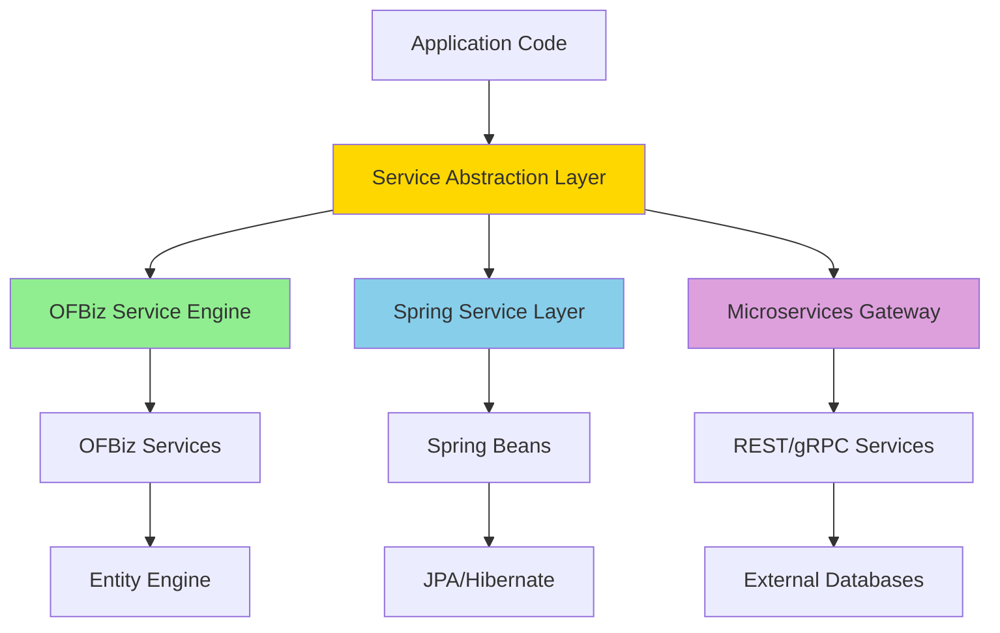
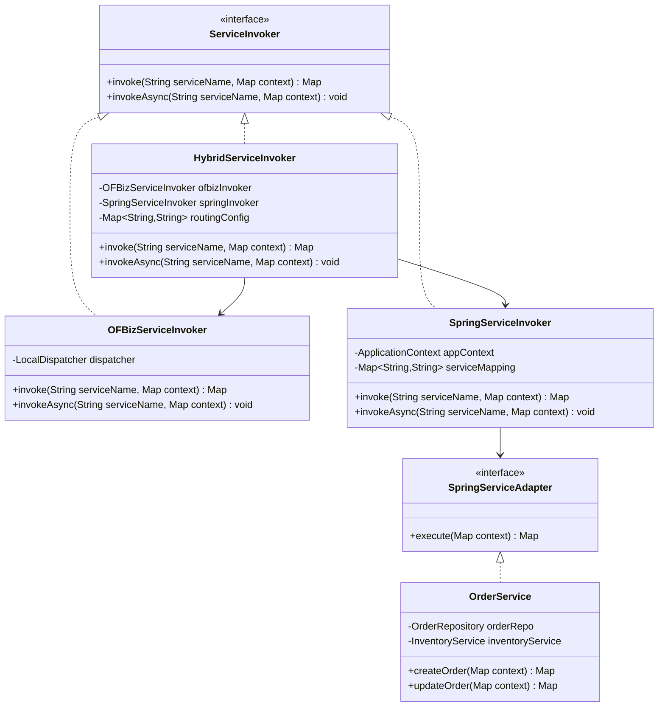
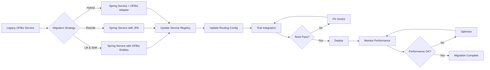
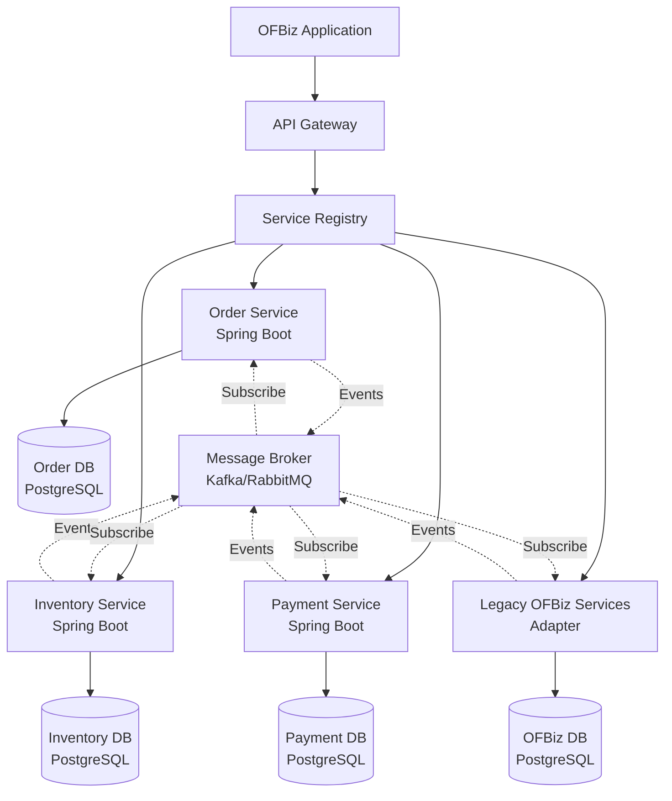

# Service Engine Replacement Strategies

**Purpose**: Comprehensive guide for replacing or integrating the OFBiz Service Engine with alternative service orchestration frameworks like Spring Services, while maintaining system functionality.

**Audience**: Enterprise Architects, Senior Developers, System Integrators

**Prerequisites**: 
- [Service Engine Overview](./overview.md)
- [Service Engine Class Structure](./class-structure.md)
- [Service Invocation Patterns](./service-invocation.md)

**Related Documents**: 
- [Entity Engine Replacement Strategies](../entity-engine/replacement-strategies.md)
- [Integration Architecture](../../05-integration-architecture/rest-api-architecture.md)

---

## Overview

While the OFBiz Service Engine is deeply integrated into the framework, it's possible to replace or augment it with alternative service orchestration frameworks. This document outlines strategies for integrating Spring Services, microservices architectures, and other orchestration frameworks while preserving OFBiz's business logic and maintaining backward compatibility where needed.

## Visual Architecture

### Service Engine Abstraction Layer



**Diagram Description**: Service abstraction layer that allows application code to invoke services through a unified interface, with implementations backed by OFBiz Service Engine, Spring Services, or external microservices. This enables gradual migration and hybrid architectures.

### Spring Services Integration Pattern



**Diagram Description**: Integration pattern showing how to create a service abstraction layer that supports both OFBiz and Spring services. HybridServiceInvoker routes service calls based on configuration, enabling gradual migration.

### Service Migration Flow



**Diagram Description**: Migration workflow for converting OFBiz services to Spring services. Shows decision points and validation steps to ensure successful migration.

### Microservices Architecture Pattern



**Diagram Description**: Microservices architecture showing how to decompose OFBiz services into independent microservices while maintaining integration through API Gateway and event-driven communication. Legacy OFBiz services remain accessible through an adapter.

## Integration Strategies

### Strategy 1: Spring Services with OFBiz Entity Engine

**Approach**: Replace Service Engine with Spring but keep Entity Engine for data access

**Benefits**:
- Modern Spring ecosystem (dependency injection, AOP, testing)
- Keep existing data model and entity definitions
- Gradual migration path
- Leverage Spring Boot for microservices

**Implementation**:

**Spring Service Configuration**:
```java
@Configuration
@ComponentScan("com.company.services")
public class ServiceConfig {
    
    @Bean
    public Delegator delegator() {
        return DelegatorFactory.getDelegator("default");
    }
    
    @Bean
    public ServiceInvoker serviceInvoker(Delegator delegator) {
        return new HybridServiceInvoker(delegator);
    }
}
```

**Spring Service Implementation**:
```java
@Service
@Transactional
public class OrderService implements SpringServiceAdapter {
    
    @Autowired
    private Delegator delegator;
    
    @Autowired
    private InventoryService inventoryService;
    
    public Map<String, Object> createOrder(Map<String, Object> context) {
        try {
            // Use OFBiz Entity Engine for data access
            GenericValue orderHeader = delegator.makeValue("OrderHeader");
            orderHeader.set("orderId", delegator.getNextSeqId("OrderHeader"));
            orderHeader.set("orderTypeId", context.get("orderTypeId"));
            orderHeader.set("orderDate", UtilDateTime.nowTimestamp());
            orderHeader.create();
            
            // Call other Spring services
            Map<String, Object> inventoryResult = inventoryService.reserveInventory(context);
            
            Map<String, Object> result = new HashMap<>();
            result.put("orderId", orderHeader.get("orderId"));
            result.put("responseMessage", "success");
            return result;
            
        } catch (GenericEntityException e) {
            Map<String, Object> error = new HashMap<>();
            error.put("responseMessage", "error");
            error.put("errorMessage", e.getMessage());
            return error;
        }
    }
    
    @Override
    public Map<String, Object> execute(Map<String, Object> context) {
        return createOrder(context);
    }
}
```

**Hybrid Service Invoker**:
```java
public class HybridServiceInvoker implements ServiceInvoker {
    
    private LocalDispatcher ofbizDispatcher;
    private ApplicationContext springContext;
    private Map<String, String> serviceRouting;
    
    public HybridServiceInvoker(Delegator delegator) {
        this.ofbizDispatcher = ServiceContainer.getLocalDispatcher("default", delegator);
        this.springContext = new AnnotationConfigApplicationContext(ServiceConfig.class);
        this.serviceRouting = loadRoutingConfig();
    }
    
    @Override
    public Map<String, Object> invoke(String serviceName, Map<String, Object> context) {
        String provider = serviceRouting.getOrDefault(serviceName, "ofbiz");
        
        if ("spring".equals(provider)) {
            return invokeSpringService(serviceName, context);
        } else {
            return invokeOFBizService(serviceName, context);
        }
    }
    
    private Map<String, Object> invokeSpringService(String serviceName, Map<String, Object> context) {
        SpringServiceAdapter service = springContext.getBean(serviceName, SpringServiceAdapter.class);
        return service.execute(context);
    }
    
    private Map<String, Object> invokeOFBizService(String serviceName, Map<String, Object> context) {
        try {
            return ofbizDispatcher.runSync(serviceName, context);
        } catch (GenericServiceException e) {
            Map<String, Object> error = new HashMap<>();
            error.put("responseMessage", "error");
            error.put("errorMessage", e.getMessage());
            return error;
        }
    }
}
```

**Service Routing Configuration** (`service-routing.properties`):
```properties
# Route to Spring services
createOrder=spring
updateOrder=spring
processPayment=spring

# Route to OFBiz services (legacy)
createParty=ofbiz
updateProduct=ofbiz
```

### Strategy 2: Complete Spring Migration with JPA

**Approach**: Replace both Service Engine and Entity Engine with Spring + JPA/Hibernate

**Benefits**:
- Full Spring ecosystem
- Standard JPA for data access
- Better IDE support and tooling
- Easier to find developers

**Challenges**:
- Must migrate entity definitions to JPA entities
- Lose OFBiz's dynamic entity features
- More complex migration

**JPA Entity Example**:
```java
@Entity
@Table(name = "order_header")
public class OrderHeader {
    
    @Id
    @Column(name = "order_id")
    private String orderId;
    
    @Column(name = "order_type_id")
    private String orderTypeId;
    
    @Column(name = "order_date")
    private Timestamp orderDate;
    
    @Column(name = "status_id")
    private String statusId;
    
    @OneToMany(mappedBy = "orderHeader", cascade = CascadeType.ALL)
    private List<OrderItem> orderItems;
    
    // Getters and setters
}

@Entity
@Table(name = "order_item")
public class OrderItem {
    
    @Id
    @Column(name = "order_item_seq_id")
    private String orderItemSeqId;
    
    @ManyToOne
    @JoinColumn(name = "order_id")
    private OrderHeader orderHeader;
    
    @Column(name = "product_id")
    private String productId;
    
    @Column(name = "quantity")
    private BigDecimal quantity;
    
    // Getters and setters
}
```

**Spring Data Repository**:
```java
@Repository
public interface OrderRepository extends JpaRepository<OrderHeader, String> {
    
    List<OrderHeader> findByStatusId(String statusId);
    
    @Query("SELECT o FROM OrderHeader o WHERE o.orderDate >= :startDate AND o.orderDate <= :endDate")
    List<OrderHeader> findOrdersByDateRange(
        @Param("startDate") Timestamp startDate,
        @Param("endDate") Timestamp endDate
    );
}
```

**Spring Service with JPA**:
```java
@Service
@Transactional
public class OrderService {
    
    @Autowired
    private OrderRepository orderRepository;
    
    @Autowired
    private InventoryService inventoryService;
    
    public OrderHeader createOrder(OrderRequest request) {
        OrderHeader order = new OrderHeader();
        order.setOrderId(generateOrderId());
        order.setOrderTypeId(request.getOrderTypeId());
        order.setOrderDate(new Timestamp(System.currentTimeMillis()));
        order.setStatusId("ORDER_CREATED");
        
        // Create order items
        List<OrderItem> items = new ArrayList<>();
        for (OrderItemRequest itemRequest : request.getItems()) {
            OrderItem item = new OrderItem();
            item.setOrderHeader(order);
            item.setProductId(itemRequest.getProductId());
            item.setQuantity(itemRequest.getQuantity());
            items.add(item);
        }
        order.setOrderItems(items);
        
        // Reserve inventory
        inventoryService.reserveInventory(order);
        
        return orderRepository.save(order);
    }
}
```

### Strategy 3: Microservices with Event-Driven Integration

**Approach**: Decompose OFBiz into microservices with event-driven communication

**Benefits**:
- Independent scaling and deployment
- Technology diversity
- Better fault isolation
- Modern cloud-native architecture

**Challenges**:
- Distributed transaction complexity
- Eventual consistency
- Increased operational complexity

**Order Microservice (Spring Boot)**:
```java
@RestController
@RequestMapping("/api/orders")
public class OrderController {
    
    @Autowired
    private OrderService orderService;
    
    @Autowired
    private KafkaTemplate<String, OrderEvent> kafkaTemplate;
    
    @PostMapping
    public ResponseEntity<OrderResponse> createOrder(@RequestBody OrderRequest request) {
        OrderHeader order = orderService.createOrder(request);
        
        // Publish order created event
        OrderEvent event = new OrderEvent();
        event.setOrderId(order.getOrderId());
        event.setEventType("ORDER_CREATED");
        event.setTimestamp(System.currentTimeMillis());
        kafkaTemplate.send("order-events", event);
        
        return ResponseEntity.ok(new OrderResponse(order));
    }
}
```

**Inventory Microservice Event Listener**:
```java
@Service
public class InventoryEventListener {
    
    @Autowired
    private InventoryService inventoryService;
    
    @KafkaListener(topics = "order-events", groupId = "inventory-service")
    public void handleOrderEvent(OrderEvent event) {
        if ("ORDER_CREATED".equals(event.getEventType())) {
            // Reserve inventory for order
            inventoryService.reserveInventoryForOrder(event.getOrderId());
            
            // Publish inventory reserved event
            InventoryEvent inventoryEvent = new InventoryEvent();
            inventoryEvent.setOrderId(event.getOrderId());
            inventoryEvent.setEventType("INVENTORY_RESERVED");
            kafkaTemplate.send("inventory-events", inventoryEvent);
        }
    }
}
```

**OFBiz Adapter Service**:
```java
@Service
public class OFBizAdapterService {
    
    private LocalDispatcher dispatcher;
    
    @KafkaListener(topics = "order-events", groupId = "ofbiz-adapter")
    public void handleOrderEvent(OrderEvent event) {
        if ("ORDER_CREATED".equals(event.getEventType())) {
            // Call legacy OFBiz service
            Map<String, Object> context = new HashMap<>();
            context.put("orderId", event.getOrderId());
            
            try {
                dispatcher.runAsync("legacyOrderProcessing", context);
            } catch (GenericServiceException e) {
                // Handle error
            }
        }
    }
}
```

## Migration Roadmap

### Phase 1: Preparation (Weeks 1-2)

**Tasks**:
1. Analyze service dependencies
2. Identify services for migration
3. Set up Spring Boot project structure
4. Configure hybrid service invoker
5. Create service routing configuration

**Deliverables**:
- Service dependency graph
- Migration priority list
- Spring Boot skeleton project
- Hybrid invoker implementation

### Phase 2: Pilot Migration (Weeks 3-4)

**Tasks**:
1. Select 2-3 simple services for pilot
2. Implement Spring versions
3. Configure routing to Spring services
4. Test thoroughly
5. Monitor performance

**Deliverables**:
- 2-3 migrated Spring services
- Test results
- Performance comparison
- Lessons learned document

### Phase 3: Incremental Migration (Weeks 5-12)

**Tasks**:
1. Migrate services in priority order
2. Update routing configuration
3. Test each migration
4. Monitor and optimize
5. Update documentation

**Deliverables**:
- Migrated services (batch by batch)
- Updated routing configuration
- Test reports
- Performance metrics

### Phase 4: Legacy Service Adapter (Weeks 13-14)

**Tasks**:
1. Identify remaining OFBiz services
2. Create adapter layer
3. Implement backward compatibility
4. Test integration
5. Document adapter usage

**Deliverables**:
- OFBiz service adapter
- Integration tests
- Adapter documentation

### Phase 5: Validation & Optimization (Weeks 15-16)

**Tasks**:
1. End-to-end testing
2. Performance optimization
3. Security audit
4. Documentation update
5. Training materials

**Deliverables**:
- Test results
- Performance report
- Security audit report
- Complete documentation
- Training materials

## Code References

<details>
<summary>View Source Code References</summary>

**Service Abstraction Interface**:
```java
package com.company.service;

public interface ServiceInvoker {
    /**
     * Invoke a service synchronously
     */
    Map<String, Object> invoke(String serviceName, Map<String, Object> context) 
        throws ServiceException;
    
    /**
     * Invoke a service asynchronously
     */
    void invokeAsync(String serviceName, Map<String, Object> context) 
        throws ServiceException;
    
    /**
     * Schedule a service for future execution
     */
    void schedule(String serviceName, Map<String, Object> context, long startTime) 
        throws ServiceException;
}
```

**Spring Service Adapter Interface**:
```java
package com.company.service;

public interface SpringServiceAdapter {
    /**
     * Execute service with context map (OFBiz-style)
     */
    Map<String, Object> execute(Map<String, Object> context);
}
```

**Service Result Utilities**:
```java
package com.company.service.util;

public class ServiceResultUtil {
    
    public static Map<String, Object> success() {
        return success(null);
    }
    
    public static Map<String, Object> success(String message) {
        Map<String, Object> result = new HashMap<>();
        result.put("responseMessage", "success");
        if (message != null) {
            result.put("successMessage", message);
        }
        return result;
    }
    
    public static Map<String, Object> error(String message) {
        Map<String, Object> result = new HashMap<>();
        result.put("responseMessage", "error");
        result.put("errorMessage", message);
        return result;
    }
    
    public static boolean isSuccess(Map<String, Object> result) {
        return "success".equals(result.get("responseMessage"));
    }
    
    public static boolean isError(Map<String, Object> result) {
        return "error".equals(result.get("responseMessage"));
    }
}
```

**Configuration Files**:

`application.yml` (Spring Boot):
```yaml
spring:
  application:
    name: ofbiz-services
  datasource:
    url: jdbc:postgresql://localhost:5432/ofbiz
    username: ofbiz
    password: ofbiz
  jpa:
    hibernate:
      ddl-auto: validate
    show-sql: false
  kafka:
    bootstrap-servers: localhost:9092
    consumer:
      group-id: ofbiz-services
      auto-offset-reset: earliest

ofbiz:
  service:
    routing:
      config-file: classpath:service-routing.properties
    hybrid:
      enabled: true
```

</details>

## Architecture Decisions

### Decision: Hybrid Service Invoker Pattern

**Context**: Need to support gradual migration from OFBiz Service Engine to Spring Services without breaking existing functionality.

**Decision**: Implement a hybrid service invoker that routes service calls to either OFBiz or Spring based on configuration.

**Consequences**:
- ✅ **Positive**: Enables gradual migration without big-bang rewrite
- ✅ **Positive**: Maintains backward compatibility
- ✅ **Positive**: Allows testing Spring services in production alongside OFBiz
- ❌ **Negative**: Additional abstraction layer adds complexity
- ❌ **Negative**: Routing configuration must be maintained
- **Mitigation**: Clear routing configuration, comprehensive testing, monitoring

**Alternatives Considered**:
- **Big-Bang Migration**: Risky, high chance of failure
- **Parallel Systems**: Expensive, data synchronization challenges

### Decision: Keep Entity Engine During Service Migration

**Context**: Migrating both Service Engine and Entity Engine simultaneously is high risk.

**Decision**: Migrate Service Engine to Spring first while keeping Entity Engine for data access.

**Consequences**:
- ✅ **Positive**: Reduces migration risk
- ✅ **Positive**: Preserves existing data model
- ✅ **Positive**: Faster migration timeline
- ❌ **Negative**: Still dependent on OFBiz Entity Engine
- ❌ **Negative**: May need second migration phase for JPA
- **Mitigation**: Plan Entity Engine migration as separate phase if needed

**Alternatives Considered**:
- **Migrate Both Together**: Higher risk, longer timeline
- **Keep Both Forever**: Technical debt, maintenance burden

### Decision: Event-Driven Microservices Integration

**Context**: Microservices need to communicate without tight coupling, and some OFBiz services must remain accessible.

**Decision**: Use event-driven architecture with Kafka/RabbitMQ for microservices communication, with adapter for legacy OFBiz services.

**Consequences**:
- ✅ **Positive**: Loose coupling between services
- ✅ **Positive**: Independent scaling and deployment
- ✅ **Positive**: Legacy services remain accessible
- ❌ **Negative**: Eventual consistency challenges
- ❌ **Negative**: Increased operational complexity
- **Mitigation**: Saga pattern for distributed transactions, comprehensive monitoring

**Alternatives Considered**:
- **Synchronous REST APIs**: Simpler but creates tight coupling
- **Keep Monolithic**: Easier but limits scalability

## Official References

**Spring Framework**:
- [Spring Framework Documentation](https://spring.io/projects/spring-framework)
- [Spring Boot Documentation](https://spring.io/projects/spring-boot)
- [Spring Data JPA](https://spring.io/projects/spring-data-jpa)
- [Spring Cloud](https://spring.io/projects/spring-cloud)

**Microservices Patterns**:
- [Microservices.io Patterns](https://microservices.io/patterns/index.html)
- [Event-Driven Architecture](https://martinfowler.com/articles/201701-event-driven.html)
- [Saga Pattern](https://microservices.io/patterns/data/saga.html)

**Apache Kafka**:
- [Apache Kafka Documentation](https://kafka.apache.org/documentation/)
- [Spring Kafka](https://spring.io/projects/spring-kafka)

**OFBiz Integration**:
- [OFBiz Service Engine](https://cwiki.apache.org/confluence/display/OFBIZ/Service+Engine+Guide)
- [GitHub Source](https://github.com/apache/ofbiz-framework/tree/trunk/framework/service)

## Related Topics

**Within This Section**:
- [Service Engine Overview](./overview.md)
- [Service Engine Class Structure](./class-structure.md)
- [Service Invocation Patterns](./service-invocation.md)
- [Service Transaction Handling](./transaction-handling.md)

**Other Sections**:
- [Entity Engine Replacement Strategies](../entity-engine/replacement-strategies.md)
- [REST API Architecture](../../05-integration-architecture/rest-api-architecture.md)
- [Event-Driven Integration](../../05-integration-architecture/event-driven-integration.md)
- [Module Replacement Patterns](../../04-application-modules/module-replacement-patterns.md)

**Role-Based Guides**:
- [Architect Guide](../../role-based-guides/architect-guide.md)
- [Integrator Guide](../../role-based-guides/integrator-guide.md)

---

**Next**: [Widget Framework Overview](../widget-framework/overview.md)

**Up**: [Framework Core](../README.md)

**Home**: [Master Index](../../00-INDEX.md)

---

**Document Metadata**:
- **Version**: 1.0
- **Last Updated**: December 2024
- **OFBiz Version**: Trunk (Latest)
- **Status**: Complete
