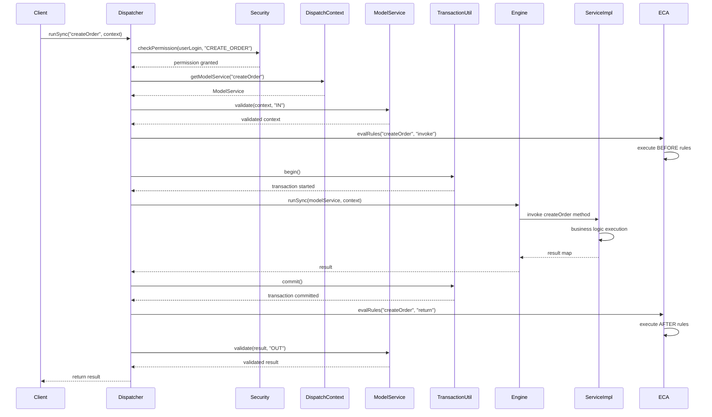
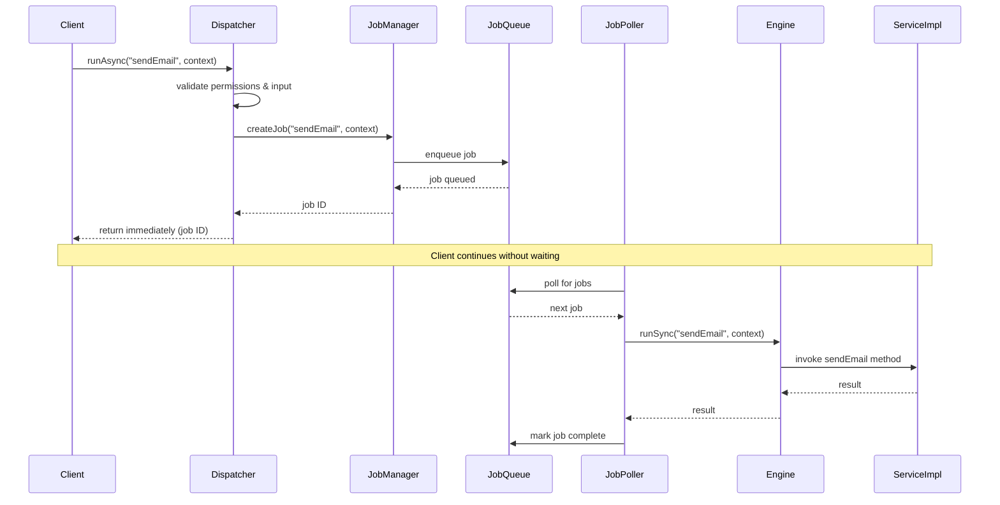
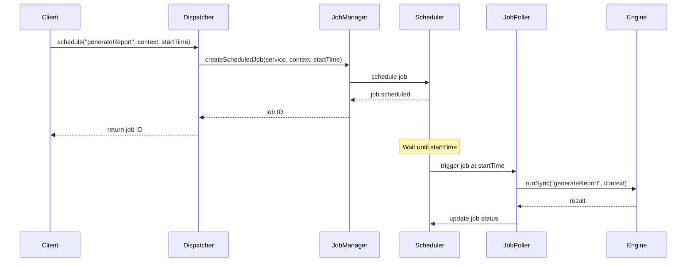
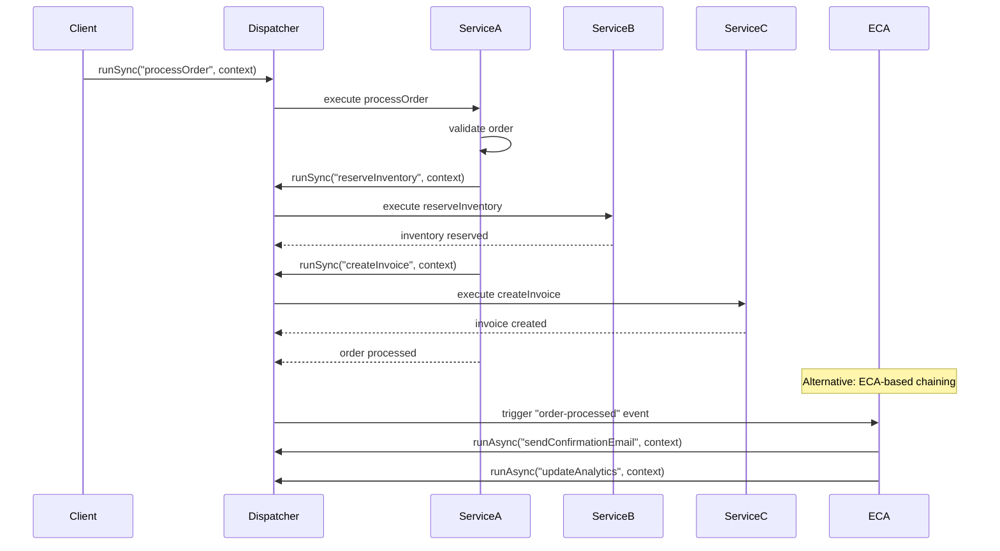
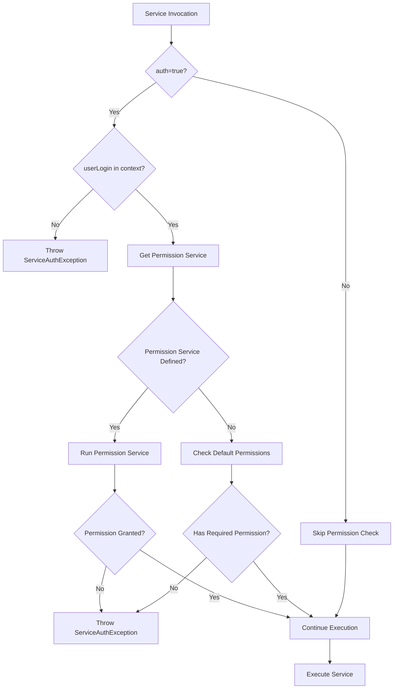

# Service Invocation Patterns

**Purpose**: Comprehensive documentation of service invocation patterns, execution modes, and orchestration flows in the OFBiz Service Engine.

**Audience**: Senior Developers, Integration Architects, System Designers

**Prerequisites**: 
- [Service Engine Overview](./overview.md)
- [Service Engine Class Structure](./class-structure.md)

**Related Documents**: 
- [Service Transaction Handling](./transaction-handling.md)
- [ECA/SECA Event-Driven Architecture](../event-driven-architecture/eca-seca-overview.md)

---

## Overview

The OFBiz Service Engine supports multiple invocation patterns to accommodate different use cases: synchronous execution for immediate results, asynchronous execution for fire-and-forget operations, scheduled execution for time-based processing, and service chaining for complex workflows. Understanding these patterns is essential for building efficient and scalable OFBiz applications.

## Visual Architecture

### Synchronous Service Invocation Flow



**Diagram Description**: Complete synchronous service invocation flow showing permission checking, input validation, ECA rule execution (before/after), transaction management, service execution, and output validation. This is the most common invocation pattern.

### Asynchronous Service Invocation Flow



**Diagram Description**: Asynchronous invocation pattern where the client receives immediate response while the service executes in background. Jobs are queued and processed by job poller threads. Ideal for long-running operations or when immediate result is not needed.

### Scheduled Service Invocation



**Diagram Description**: Scheduled service execution pattern for time-based processing. Services can be scheduled for one-time execution at a specific time or recurring execution with cron-like expressions.

### Service Chaining Pattern



**Diagram Description**: Service chaining patterns showing both explicit chaining (service A calls service B) and event-driven chaining (ECA rules trigger subsequent services). Event-driven chaining provides better decoupling.

### Permission Checking Flow



**Diagram Description**: Permission checking flow diagram showing how the Service Engine validates user permissions before service execution. Services with auth=true require userLogin in context and permission validation.

## Invocation Patterns

### 1. Synchronous Invocation (runSync)

**Use Case**: When immediate result is required

**Characteristics**:
- Blocks until service completes
- Returns result map directly
- Executes in caller's thread
- Participates in caller's transaction (if any)

**Example Usage**:
```java
Map<String, Object> context = new HashMap<>();
context.put("orderId", orderId);
context.put("userLogin", userLogin);

try {
    Map<String, Object> result = dispatcher.runSync("processOrder", context);
    if (ServiceUtil.isSuccess(result)) {
        String invoiceId = (String) result.get("invoiceId");
        // Use result immediately
    } else {
        String errorMessage = (String) result.get("errorMessage");
        // Handle error
    }
} catch (GenericServiceException e) {
    // Handle exception
}
```

**Best Practices**:
- Use for operations requiring immediate feedback
- Keep execution time short (< 5 seconds)
- Handle exceptions appropriately
- Always check result status with ServiceUtil

### 2. Asynchronous Invocation (runAsync)

**Use Case**: Fire-and-forget operations, long-running tasks

**Characteristics**:
- Returns immediately with job ID
- Executes in background thread pool
- No direct result return
- Independent transaction

**Example Usage**:
```java
Map<String, Object> context = new HashMap<>();
context.put("orderId", orderId);
context.put("userLogin", userLogin);

try {
    dispatcher.runAsync("sendOrderConfirmation", context);
    // Continue without waiting for email to send
} catch (GenericServiceException e) {
    // Handle exception (job creation failure)
}
```

**Best Practices**:
- Use for non-critical operations
- Use for long-running tasks (> 5 seconds)
- Don't rely on immediate execution
- Monitor job queue for failures

### 3. Synchronous Ignore (runSyncIgnore)

**Use Case**: When service errors should not stop execution

**Characteristics**:
- Blocks until service completes
- Ignores service errors
- Returns empty map on error
- Useful for optional operations

**Example Usage**:
```java
// Log activity but don't fail if logging fails
dispatcher.runSyncIgnore("logUserActivity", context);
```

**Best Practices**:
- Use sparingly for truly optional operations
- Still log errors for monitoring
- Don't use for critical business logic

### 4. Scheduled Invocation (schedule)

**Use Case**: Time-based or recurring operations

**Characteristics**:
- Executes at specified time
- Can be one-time or recurring
- Managed by Job Scheduler
- Persisted across restarts

**Example Usage**:
```java
// Schedule report generation for midnight
long startTime = UtilDateTime.getNextDayStart().getTime();
dispatcher.schedule("generateDailyReport", context, startTime);

// Schedule recurring job (via JobSandbox entity)
Map<String, Object> jobContext = new HashMap<>();
jobContext.put("serviceName", "cleanupOldData");
jobContext.put("tempExprId", "0 0 2 * * ?"); // 2 AM daily
dispatcher.runSync("scheduleService", jobContext);
```

**Best Practices**:
- Use for batch processing
- Use for maintenance tasks
- Set appropriate recurrence patterns
- Monitor scheduled job execution

### 5. Service Chaining

**Use Case**: Complex workflows requiring multiple services

**Explicit Chaining**:
```java
public static Map<String, Object> processOrder(DispatchContext dctx, Map<String, ?> context) {
    LocalDispatcher dispatcher = dctx.getDispatcher();
    
    // Step 1: Validate order
    Map<String, Object> validateResult = dispatcher.runSync("validateOrder", context);
    if (ServiceUtil.isError(validateResult)) {
        return validateResult;
    }
    
    // Step 2: Reserve inventory
    Map<String, Object> reserveResult = dispatcher.runSync("reserveInventory", context);
    if (ServiceUtil.isError(reserveResult)) {
        return reserveResult;
    }
    
    // Step 3: Create invoice
    Map<String, Object> invoiceResult = dispatcher.runSync("createInvoice", context);
    if (ServiceUtil.isError(invoiceResult)) {
        return invoiceResult;
    }
    
    return ServiceUtil.returnSuccess("Order processed successfully");
}
```

**ECA-Based Chaining** (Preferred):
```xml
<!-- services/eca.xml -->
<eca>
    <service name="processOrder" event="return">
        <condition field-name="responseMessage" operator="equals" value="success"/>
        <action service="sendOrderConfirmation" mode="async"/>
        <action service="updateInventoryMetrics" mode="async"/>
        <action service="notifyWarehouse" mode="async"/>
    </service>
</eca>
```

**Best Practices**:
- Prefer ECA-based chaining for better decoupling
- Use explicit chaining for sequential dependencies
- Handle errors at each step
- Consider transaction boundaries

## Permission Checking

### Permission Service Pattern

**Definition in service XML**:
```xml
<service name="createOrder" engine="java" 
         location="org.apache.ofbiz.order.OrderServices" 
         invoke="createOrder" auth="true">
    <permission-service service-name="orderPermissionCheck" main-action="CREATE"/>
    <attribute name="orderId" type="String" mode="OUT"/>
    <attribute name="orderTypeId" type="String" mode="IN" optional="false"/>
</service>
```

**Permission Service Implementation**:
```java
public static Map<String, Object> orderPermissionCheck(DispatchContext dctx, Map<String, ?> context) {
    GenericValue userLogin = (GenericValue) context.get("userLogin");
    String mainAction = (String) context.get("mainAction");
    
    Security security = dctx.getSecurity();
    if (!security.hasPermission("ORDERMGR_" + mainAction, userLogin)) {
        return ServiceUtil.returnError("Permission denied: ORDERMGR_" + mainAction);
    }
    
    return ServiceUtil.returnSuccess();
}
```

### Built-in Permission Checking

**Using Security Service**:
```java
public static Map<String, Object> sensitiveOperation(DispatchContext dctx, Map<String, ?> context) {
    GenericValue userLogin = (GenericValue) context.get("userLogin");
    Security security = dctx.getSecurity();
    
    if (!security.hasPermission("ADMIN_PERMISSION", userLogin)) {
        return ServiceUtil.returnError("Administrator permission required");
    }
    
    // Proceed with sensitive operation
    return ServiceUtil.returnSuccess();
}
```

## Code References

<details>
<summary>View Source Code References</summary>

**Synchronous Invocation**:
`framework/service/src/main/java/org/apache/ofbiz/service/GenericDispatcher.java`

```java
public Map<String, Object> runSync(String serviceName, Map<String, ? extends Object> context) 
        throws ServiceAuthException, ServiceValidationException, GenericServiceException {
    ModelService model = ctx.getModelService(serviceName);
    return runSync(serviceName, model, context);
}

private Map<String, Object> runSync(String localName, ModelService modelService, Map<String, ? extends Object> context) 
        throws ServiceAuthException, ServiceValidationException, GenericServiceException {
    // Permission checking
    if (modelService.auth) {
        checkPermission(modelService, context);
    }
    
    // Input validation
    Map<String, Object> validContext = modelService.makeValid(context, ModelService.IN_PARAM);
    
    // ECA rules - invoke event
    ServiceEcaUtil.evalRules(localName, modelService, "invoke", ctx, validContext);
    
    // Get engine and execute
    GenericEngine engine = getGenericEngine(modelService.engineName);
    Map<String, Object> result = engine.runSync(localName, modelService, validContext);
    
    // ECA rules - return event
    ServiceEcaUtil.evalRules(localName, modelService, "return", ctx, result);
    
    // Output validation
    modelService.validate(result, ModelService.OUT_PARAM);
    
    return result;
}
```

**Asynchronous Invocation**:
`framework/service/src/main/java/org/apache/ofbiz/service/GenericDispatcher.java`

```java
public void runAsync(String serviceName, Map<String, ? extends Object> context) 
        throws GenericServiceException {
    ModelService model = ctx.getModelService(serviceName);
    
    // Create job
    Map<String, Object> jobContext = new HashMap<>();
    jobContext.put("serviceName", serviceName);
    jobContext.put("serviceContext", context);
    jobContext.put("userLogin", context.get("userLogin"));
    
    // Queue job
    jm.runJob(jobContext);
}
```

**Scheduled Invocation**:
`framework/service/src/main/java/org/apache/ofbiz/service/GenericDispatcher.java`

```java
public void schedule(String serviceName, Map<String, ? extends Object> context, long startTime) 
        throws GenericServiceException {
    Map<String, Object> jobContext = new HashMap<>();
    jobContext.put("serviceName", serviceName);
    jobContext.put("serviceContext", context);
    jobContext.put("startTime", new Timestamp(startTime));
    jobContext.put("userLogin", context.get("userLogin"));
    
    // Create scheduled job
    jm.schedule(jobContext);
}
```

**Permission Checking**:
`framework/service/src/main/java/org/apache/ofbiz/service/GenericDispatcher.java`

```java
private void checkPermission(ModelService model, Map<String, ?> context) 
        throws ServiceAuthException {
    if (!model.auth) {
        return;
    }
    
    GenericValue userLogin = (GenericValue) context.get("userLogin");
    if (userLogin == null) {
        throw new ServiceAuthException("User login required for service: " + model.name);
    }
    
    // Check permission service if defined
    if (model.permissionServiceName != null) {
        Map<String, Object> permContext = new HashMap<>();
        permContext.put("userLogin", userLogin);
        permContext.put("mainAction", model.permissionMainAction);
        
        Map<String, Object> permResult = runSync(model.permissionServiceName, permContext);
        if (ServiceUtil.isError(permResult)) {
            throw new ServiceAuthException("Permission denied: " + permResult.get("errorMessage"));
        }
    }
}
```

**Key Classes**:
- `GenericDispatcher`: Main dispatcher implementation with all invocation methods
- `JobManager`: Manages asynchronous and scheduled jobs
- `ServiceEcaUtil`: Evaluates and executes ECA rules
- `Security`: Permission checking service

**Package Structure**:
```
org.apache.ofbiz.service
├── GenericDispatcher
├── job
│   ├── JobManager
│   ├── JobPoller
│   └── Job
├── eca
│   ├── ServiceEcaUtil
│   └── ServiceEcaRule
└── security
    └── Security
```

</details>

## Architecture Decisions

### Decision: Multiple Invocation Modes

**Context**: Different use cases require different execution patterns (immediate results, background processing, scheduled execution).

**Decision**: Provide multiple invocation methods (runSync, runAsync, schedule) through single LocalDispatcher interface.

**Consequences**:
- ✅ **Positive**: Flexible execution patterns for different use cases
- ✅ **Positive**: Consistent interface regardless of execution mode
- ✅ **Positive**: Easy to change execution mode without major code changes
- ❌ **Negative**: Developers must understand when to use each mode
- **Mitigation**: Clear documentation and naming conventions

**Alternatives Considered**:
- **Single Invocation Method with Flags**: More complex API, harder to use
- **Separate Dispatcher Types**: Would fragment the API

### Decision: ECA-Based Service Chaining

**Context**: Complex workflows require multiple services to execute in sequence or parallel, but tight coupling makes maintenance difficult.

**Decision**: Support both explicit service chaining and declarative ECA-based chaining, with ECA as the preferred approach.

**Consequences**:
- ✅ **Positive**: Loose coupling between services
- ✅ **Positive**: Easy to add/remove workflow steps without code changes
- ✅ **Positive**: Supports both synchronous and asynchronous chaining
- ❌ **Negative**: Workflow logic spread across XML and code
- **Mitigation**: Clear documentation of ECA rules, tools to visualize workflows

**Alternatives Considered**:
- **Only Explicit Chaining**: Simpler but creates tight coupling
- **Workflow Engine**: More powerful but adds complexity

### Decision: Permission Service Pattern

**Context**: Different services require different permission checks, and permission logic should be reusable.

**Decision**: Allow services to specify permission-service for custom permission checking, with fallback to default security checks.

**Consequences**:
- ✅ **Positive**: Flexible permission checking
- ✅ **Positive**: Reusable permission logic
- ✅ **Positive**: Declarative permission requirements
- ❌ **Negative**: Additional service call overhead for permission checking
- **Mitigation**: Cache permission results where appropriate

**Alternatives Considered**:
- **Inline Permission Checks**: Less reusable, harder to maintain
- **Annotation-Based Permissions**: More modern but requires code changes

## Official References

**Apache OFBiz Documentation**:
- [Service Engine Guide](https://cwiki.apache.org/confluence/display/OFBIZ/Service+Engine+Guide)
- [Service Invocation](https://cwiki.apache.org/confluence/display/OFBIZ/Service+Invocation)
- [Job Scheduler](https://cwiki.apache.org/confluence/display/OFBIZ/Job+Scheduler)
- [GitHub Source - Service Framework](https://github.com/apache/ofbiz-framework/tree/trunk/framework/service)

**Related Patterns**:
- [Enterprise Integration Patterns](https://www.enterpriseintegrationpatterns.com/)
- [Asynchronous Processing Patterns](https://docs.microsoft.com/en-us/azure/architecture/patterns/async-request-reply)

## Related Topics

**Within This Section**:
- [Service Engine Overview](./overview.md)
- [Service Engine Class Structure](./class-structure.md)
- [Service Transaction Handling](./transaction-handling.md)
- [Service Replacement Strategies](./replacement-strategies.md)

**Other Sections**:
- [ECA/SECA Event-Driven Architecture](../event-driven-architecture/eca-seca-overview.md)
- [Job Scheduler](../../06-runtime-architecture/job-scheduler.md)
- [Security Framework](../security-framework/overview.md)

**Role-Based Guides**:
- [Developer Guide](../../role-based-guides/developer-guide.md)
- [Integrator Guide](../../role-based-guides/integrator-guide.md)

---

**Next**: [Service Transaction Handling](./transaction-handling.md)

**Up**: [Framework Core](../README.md)

**Home**: [Master Index](../../00-INDEX.md)

---

**Document Metadata**:
- **Version**: 1.0
- **Last Updated**: December 2024
- **OFBiz Version**: Trunk (Latest)
- **Status**: Complete
