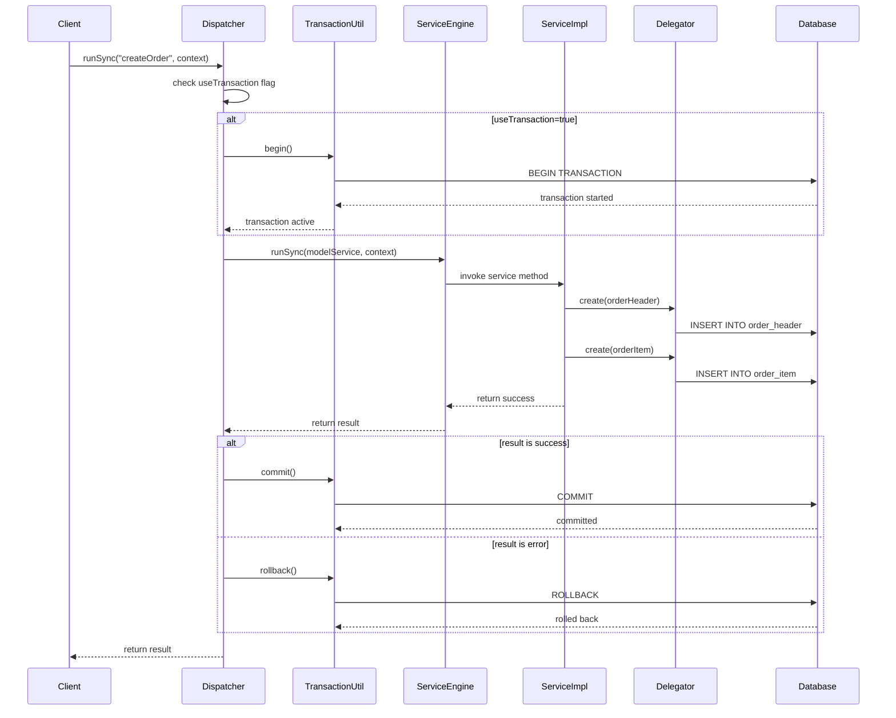
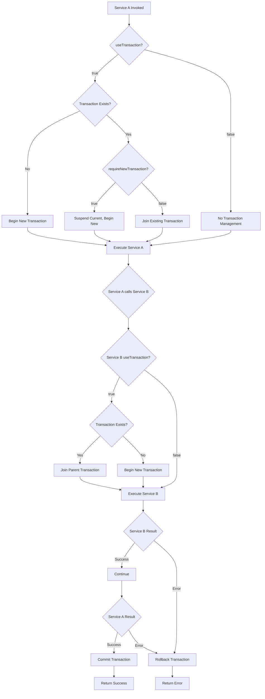
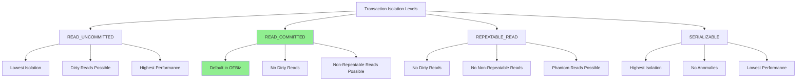
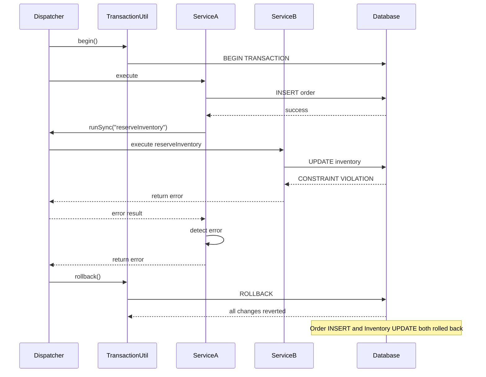
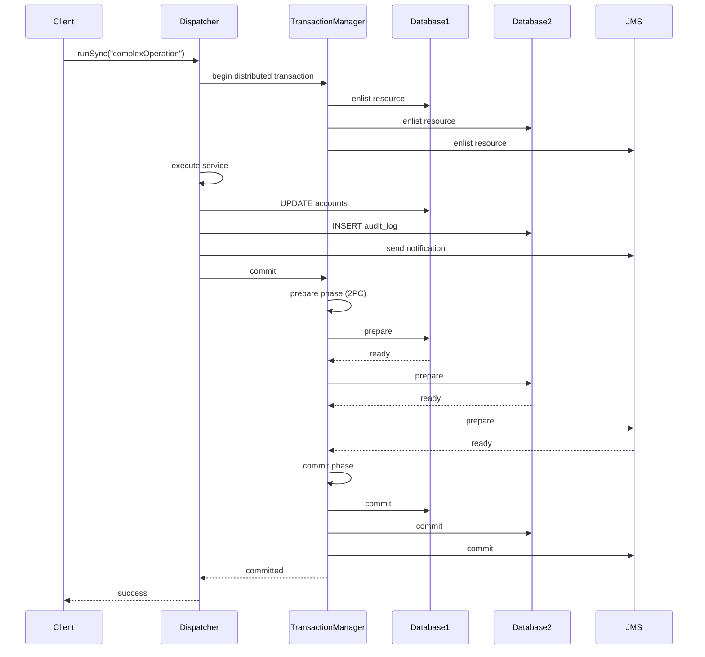

# Service Transaction Handling

**Purpose**: Comprehensive documentation of transaction management in the OFBiz Service Engine, including transaction lifecycle, propagation patterns, and error handling.

**Audience**: Senior Developers, Database Architects, System Integrators

**Prerequisites**: 
- [Service Engine Overview](./overview.md)
- [Service Invocation Patterns](./service-invocation.md)
- [Entity Engine Transaction Management](../entity-engine/transaction-management.md)

**Related Documents**: 
- [Service Engine Class Structure](./class-structure.md)
- [Entity Engine Overview](../entity-engine/overview.md)

---

## Overview

Transaction management in the OFBiz Service Engine ensures data consistency and integrity across service invocations. The Service Engine integrates with the Entity Engine's transaction management to provide declarative transaction control, automatic rollback on errors, and support for distributed transactions. Understanding transaction boundaries and propagation is critical for building reliable OFBiz applications.

## Visual Architecture

### Service Transaction Lifecycle



**Diagram Description**: Complete service transaction lifecycle showing transaction begin, service execution with database operations, and commit/rollback based on service result. The useTransaction flag controls whether a transaction is created.

### Transaction Propagation Patterns



**Diagram Description**: Transaction propagation flow showing how transactions are managed when services call other services. Demonstrates transaction joining, suspension, and nested transaction handling.

### Transaction Isolation Levels



**Diagram Description**: Transaction isolation levels supported by OFBiz with their characteristics. READ_COMMITTED is the default, providing good balance between consistency and performance.

### Error Handling and Rollback Flow



**Diagram Description**: Error handling flow showing automatic rollback when a service returns an error. All database changes within the transaction are reverted, maintaining data consistency.

### Distributed Transaction Coordination



**Diagram Description**: Distributed transaction coordination using two-phase commit (2PC) protocol. Ensures atomicity across multiple resources (databases, JMS queues). All resources must agree to commit or all rollback.

## Transaction Configuration

### Service-Level Transaction Settings

**Service Definition XML**:
```xml
<service name="createOrder" engine="java" 
         location="org.apache.ofbiz.order.OrderServices" 
         invoke="createOrder">
    <!-- Transaction control attributes -->
    <attribute name="use-transaction" type="Boolean" default-value="true"/>
    <attribute name="transaction-timeout" type="Integer" default-value="600"/>
    <attribute name="require-new-transaction" type="Boolean" default-value="false"/>
    
    <!-- Service parameters -->
    <attribute name="orderTypeId" type="String" mode="IN" optional="false"/>
    <attribute name="orderId" type="String" mode="OUT"/>
</service>
```

**Transaction Attributes**:
- `use-transaction`: Whether to use transaction management (default: true)
- `transaction-timeout`: Timeout in seconds (default: 600)
- `require-new-transaction`: Always create new transaction, suspending existing (default: false)

### Programmatic Transaction Control

**Manual Transaction Management**:
```java
public static Map<String, Object> complexOperation(DispatchContext dctx, Map<String, ?> context) {
    Delegator delegator = dctx.getDelegator();
    boolean beganTransaction = false;
    
    try {
        // Begin transaction if not already in one
        beganTransaction = TransactionUtil.begin();
        
        // Perform database operations
        GenericValue order = delegator.makeValue("OrderHeader");
        order.set("orderId", delegator.getNextSeqId("OrderHeader"));
        order.create();
        
        // More operations...
        
        // Commit transaction
        TransactionUtil.commit(beganTransaction);
        
        return ServiceUtil.returnSuccess();
    } catch (GenericEntityException e) {
        // Rollback on error
        TransactionUtil.rollback(beganTransaction, "Error in complexOperation", e);
        return ServiceUtil.returnError("Operation failed: " + e.getMessage());
    }
}
```

### Transaction Timeout Configuration

**Global Configuration** (`framework/service/config/serviceengine.xml`):
```xml
<service-config>
    <transaction-timeout>600</transaction-timeout> <!-- 10 minutes default -->
</service-config>
```

**Per-Service Override**:
```xml
<service name="longRunningReport" engine="java" 
         location="org.apache.ofbiz.report.ReportServices" 
         invoke="generateReport"
         transaction-timeout="3600"> <!-- 1 hour -->
    <attribute name="reportId" type="String" mode="IN"/>
</service>
```

## Transaction Propagation Scenarios

### Scenario 1: Service with Transaction Calls Service with Transaction

**Configuration**:
```xml
<service name="serviceA" use-transaction="true"/>
<service name="serviceB" use-transaction="true"/>
```

**Behavior**:
- Service A begins transaction
- Service A calls Service B
- Service B joins Service A's transaction
- If Service B fails, entire transaction rolls back
- If Service A fails after Service B succeeds, entire transaction rolls back

**Use Case**: Atomic operations that must succeed or fail together

### Scenario 2: Service with Transaction Calls Service without Transaction

**Configuration**:
```xml
<service name="serviceA" use-transaction="true"/>
<service name="serviceB" use-transaction="false"/>
```

**Behavior**:
- Service A begins transaction
- Service A calls Service B
- Service B executes without transaction management
- Service B's database operations auto-commit immediately
- If Service A fails, Service B's changes are NOT rolled back

**Use Case**: Logging or audit operations that should persist regardless of main transaction outcome

### Scenario 3: Service Requires New Transaction

**Configuration**:
```xml
<service name="serviceA" use-transaction="true"/>
<service name="serviceB" use-transaction="true" require-new-transaction="true"/>
```

**Behavior**:
- Service A begins transaction
- Service A calls Service B
- Service B suspends Service A's transaction
- Service B begins new independent transaction
- Service B commits/rolls back independently
- Service A's transaction resumes
- Service A can still fail without affecting Service B's committed changes

**Use Case**: Audit logging that must persist even if main operation fails

### Scenario 4: Nested Service Calls

**Configuration**:
```xml
<service name="serviceA" use-transaction="true"/>
<service name="serviceB" use-transaction="true"/>
<service name="serviceC" use-transaction="true"/>
```

**Call Chain**: A → B → C

**Behavior**:
- Service A begins transaction
- Service B joins A's transaction
- Service C joins A's transaction
- All three services share same transaction
- Any failure rolls back all changes

## Error Handling Patterns

### Pattern 1: Automatic Rollback on Error

**Service Implementation**:
```java
public static Map<String, Object> createOrderWithItems(DispatchContext dctx, Map<String, ?> context) {
    LocalDispatcher dispatcher = dctx.getDispatcher();
    Delegator delegator = dctx.getDelegator();
    
    try {
        // Create order header
        Map<String, Object> orderResult = dispatcher.runSync("createOrderHeader", context);
        if (ServiceUtil.isError(orderResult)) {
            return orderResult; // Automatic rollback
        }
        String orderId = (String) orderResult.get("orderId");
        
        // Create order items
        List<Map<String, Object>> items = (List) context.get("items");
        for (Map<String, Object> item : items) {
            item.put("orderId", orderId);
            Map<String, Object> itemResult = dispatcher.runSync("createOrderItem", item);
            if (ServiceUtil.isError(itemResult)) {
                return itemResult; // Automatic rollback of all changes
            }
        }
        
        return ServiceUtil.returnSuccess("Order created with " + items.size() + " items");
    } catch (GenericServiceException e) {
        return ServiceUtil.returnError("Failed to create order: " + e.getMessage());
    }
}
```

### Pattern 2: Explicit Rollback with Cleanup

**Service Implementation**:
```java
public static Map<String, Object> processPayment(DispatchContext dctx, Map<String, ?> context) {
    Delegator delegator = dctx.getDelegator();
    boolean beganTransaction = false;
    
    try {
        beganTransaction = TransactionUtil.begin();
        
        // Reserve inventory
        GenericValue inventory = delegator.findOne("InventoryItem", 
            UtilMisc.toMap("inventoryItemId", inventoryItemId), false);
        inventory.set("quantityOnHandTotal", 
            inventory.getBigDecimal("quantityOnHandTotal").subtract(quantity));
        inventory.store();
        
        // Process payment with external gateway
        PaymentGatewayResponse response = paymentGateway.charge(amount);
        
        if (!response.isSuccess()) {
            // Explicit rollback
            TransactionUtil.rollback(beganTransaction, "Payment failed", null);
            return ServiceUtil.returnError("Payment declined: " + response.getMessage());
        }
        
        // Record payment
        GenericValue payment = delegator.makeValue("Payment");
        payment.set("paymentId", delegator.getNextSeqId("Payment"));
        payment.set("amount", amount);
        payment.set("gatewayResponse", response.getTransactionId());
        payment.create();
        
        TransactionUtil.commit(beganTransaction);
        return ServiceUtil.returnSuccess();
        
    } catch (Exception e) {
        TransactionUtil.rollback(beganTransaction, "Error processing payment", e);
        return ServiceUtil.returnError("Payment processing failed: " + e.getMessage());
    }
}
```

### Pattern 3: Savepoints for Partial Rollback

**Service Implementation**:
```java
public static Map<String, Object> batchImport(DispatchContext dctx, Map<String, ?> context) {
    Delegator delegator = dctx.getDelegator();
    List<Map<String, Object>> records = (List) context.get("records");
    int successCount = 0;
    int errorCount = 0;
    
    for (Map<String, Object> record : records) {
        Savepoint savepoint = null;
        try {
            // Create savepoint for this record
            savepoint = TransactionUtil.setSavepoint();
            
            // Import record
            GenericValue entity = delegator.makeValue("Product", record);
            entity.create();
            successCount++;
            
        } catch (GenericEntityException e) {
            // Rollback just this record, continue with others
            if (savepoint != null) {
                TransactionUtil.rollbackToSavepoint(savepoint);
            }
            errorCount++;
            Debug.logError("Failed to import record: " + e.getMessage(), module);
        }
    }
    
    Map<String, Object> result = ServiceUtil.returnSuccess();
    result.put("successCount", successCount);
    result.put("errorCount", errorCount);
    return result;
}
```

## Code References

<details>
<summary>View Source Code References</summary>

**TransactionUtil**:
`framework/entity/src/main/java/org/apache/ofbiz/entity/transaction/TransactionUtil.java`

```java
public class TransactionUtil {
    /**
     * Begin a transaction if not already in one
     * @return true if transaction was begun, false if already in transaction
     */
    public static boolean begin() throws GenericTransactionException {
        return begin(getDefaultTimeout());
    }
    
    public static boolean begin(int timeout) throws GenericTransactionException {
        UserTransaction ut = getUserTransaction();
        if (ut.getStatus() == Status.STATUS_NO_TRANSACTION) {
            ut.setTransactionTimeout(timeout);
            ut.begin();
            return true;
        }
        return false;
    }
    
    /**
     * Commit transaction if we began it
     */
    public static void commit(boolean beganTransaction) throws GenericTransactionException {
        if (beganTransaction) {
            UserTransaction ut = getUserTransaction();
            ut.commit();
        }
    }
    
    /**
     * Rollback transaction if we began it
     */
    public static void rollback(boolean beganTransaction, String causeMessage, Throwable causeThrowable) 
            throws GenericTransactionException {
        if (beganTransaction) {
            UserTransaction ut = getUserTransaction();
            ut.rollback();
            Debug.logError(causeMessage, causeThrowable, module);
        }
    }
    
    /**
     * Set a savepoint
     */
    public static Savepoint setSavepoint() throws GenericTransactionException {
        Connection con = getConnection();
        return con.setSavepoint();
    }
    
    /**
     * Rollback to savepoint
     */
    public static void rollbackToSavepoint(Savepoint savepoint) throws GenericTransactionException {
        Connection con = getConnection();
        con.rollback(savepoint);
    }
}
```

**Service Transaction Management**:
`framework/service/src/main/java/org/apache/ofbiz/service/GenericDispatcher.java`

```java
private Map<String, Object> runSync(String localName, ModelService modelService, Map<String, ? extends Object> context) 
        throws GenericServiceException {
    boolean beganTransaction = false;
    
    try {
        // Begin transaction if required
        if (modelService.useTransaction) {
            beganTransaction = TransactionUtil.begin(modelService.transactionTimeout);
        }
        
        // Execute service
        GenericEngine engine = getGenericEngine(modelService.engineName);
        Map<String, Object> result = engine.runSync(localName, modelService, context);
        
        // Check result and commit/rollback
        if (ServiceUtil.isError(result) || ServiceUtil.isFailure(result)) {
            TransactionUtil.rollback(beganTransaction, "Service returned error", null);
        } else {
            TransactionUtil.commit(beganTransaction);
        }
        
        return result;
        
    } catch (Exception e) {
        TransactionUtil.rollback(beganTransaction, "Service execution failed", e);
        throw new GenericServiceException("Error in service execution", e);
    }
}
```

**Key Classes**:
- `TransactionUtil`: Core transaction management utilities
- `UserTransaction`: JTA transaction interface
- `GenericDispatcher`: Service-level transaction coordination
- `TransactionFactory`: Creates transaction manager instances

**Package Structure**:
```
org.apache.ofbiz.entity.transaction
├── TransactionUtil
├── TransactionFactory
├── JNDIFactory
└── GenericTransactionException

org.apache.ofbiz.service
├── GenericDispatcher (transaction coordination)
└── ModelService (transaction configuration)
```

</details>

## Architecture Decisions

### Decision: Declarative Transaction Management

**Context**: Services need transaction management, but hardcoding transaction logic in every service is error-prone and inflexible.

**Decision**: Use declarative transaction configuration in service definitions with automatic transaction management by the Service Engine.

**Consequences**:
- ✅ **Positive**: Consistent transaction handling across all services
- ✅ **Positive**: Easy to change transaction behavior without code changes
- ✅ **Positive**: Reduces boilerplate code in service implementations
- ❌ **Negative**: Less explicit control in service code
- **Mitigation**: Provide programmatic transaction control for complex scenarios

**Alternatives Considered**:
- **Programmatic Only**: More control but error-prone and verbose
- **Annotation-Based**: More modern but requires code changes for configuration

### Decision: Automatic Rollback on Error

**Context**: Services that return error results should automatically rollback their transactions to maintain data consistency.

**Decision**: Service Engine automatically rolls back transactions when service returns error or failure response.

**Consequences**:
- ✅ **Positive**: Prevents partial updates and data inconsistency
- ✅ **Positive**: Developers don't need to remember to rollback
- ✅ **Positive**: Consistent error handling across all services
- ❌ **Negative**: Cannot commit partial results on error
- **Mitigation**: Use savepoints for partial rollback scenarios

**Alternatives Considered**:
- **Manual Rollback**: More flexible but error-prone
- **Exception-Based Rollback**: More Java-idiomatic but doesn't work with Map-based results

### Decision: Transaction Joining by Default

**Context**: When a service with transaction calls another service with transaction, need to decide transaction boundary.

**Decision**: By default, called service joins caller's transaction unless require-new-transaction is set.

**Consequences**:
- ✅ **Positive**: Atomic operations across multiple services
- ✅ **Positive**: Simpler transaction management
- ✅ **Positive**: Better performance (fewer transaction boundaries)
- ❌ **Negative**: Longer transaction duration increases lock contention
- **Mitigation**: Provide require-new-transaction for independent operations

**Alternatives Considered**:
- **Always New Transaction**: More isolation but worse performance and atomicity
- **No Transaction Propagation**: Simpler but loses atomicity guarantees

### Decision: Support for Distributed Transactions

**Context**: Some operations span multiple databases or JMS queues and need atomic commit/rollback.

**Decision**: Support JTA distributed transactions with two-phase commit protocol.

**Consequences**:
- ✅ **Positive**: Atomicity across multiple resources
- ✅ **Positive**: Standards-based approach (JTA)
- ✅ **Positive**: Supports complex enterprise scenarios
- ❌ **Negative**: Performance overhead of 2PC
- ❌ **Negative**: Increased complexity and failure modes
- **Mitigation**: Use only when truly needed, prefer eventual consistency for non-critical operations

**Alternatives Considered**:
- **No Distributed Transactions**: Simpler but loses atomicity across resources
- **Saga Pattern**: More scalable but more complex to implement

## Official References

**Apache OFBiz Documentation**:
- [Service Engine Transaction Management](https://cwiki.apache.org/confluence/display/OFBIZ/Service+Engine+Transaction+Management)
- [Entity Engine Transactions](https://cwiki.apache.org/confluence/display/OFBIZ/Entity+Engine+Transaction+Management)
- [GitHub Source - Transaction Utilities](https://github.com/apache/ofbiz-framework/tree/trunk/framework/entity/src/main/java/org/apache/ofbiz/entity/transaction)

**JTA Specification**:
- [Java Transaction API (JTA)](https://jcp.org/en/jsr/detail?id=907)
- [Two-Phase Commit Protocol](https://en.wikipedia.org/wiki/Two-phase_commit_protocol)

**Transaction Patterns**:
- [Transaction Management Patterns](https://www.enterpriseintegrationpatterns.com/patterns/messaging/TransactionalClient.html)
- [Saga Pattern](https://microservices.io/patterns/data/saga.html)

## Related Topics

**Within This Section**:
- [Service Engine Overview](./overview.md)
- [Service Engine Class Structure](./class-structure.md)
- [Service Invocation Patterns](./service-invocation.md)
- [Service Replacement Strategies](./replacement-strategies.md)

**Other Sections**:
- [Entity Engine Transaction Management](../entity-engine/transaction-management.md)
- [Data Consistency Patterns](../../03-data-architecture/consistency-patterns.md)
- [Error Handling Framework](../../07-cross-cutting-concerns/error-handling.md)

**Role-Based Guides**:
- [Developer Guide](../../role-based-guides/developer-guide.md)
- [Architect Guide](../../role-based-guides/architect-guide.md)

---

**Next**: [Service Replacement Strategies](./replacement-strategies.md)

**Up**: [Framework Core](../README.md)

**Home**: [Master Index](../../00-INDEX.md)

---

**Document Metadata**:
- **Version**: 1.0
- **Last Updated**: December 2024
- **OFBiz Version**: Trunk (Latest)
- **Status**: Complete
