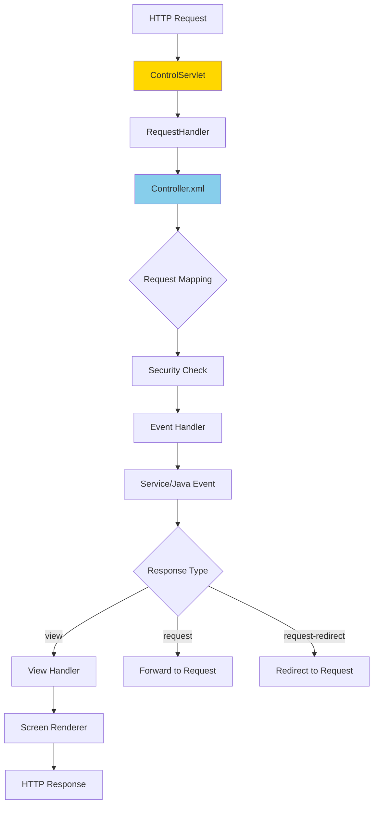
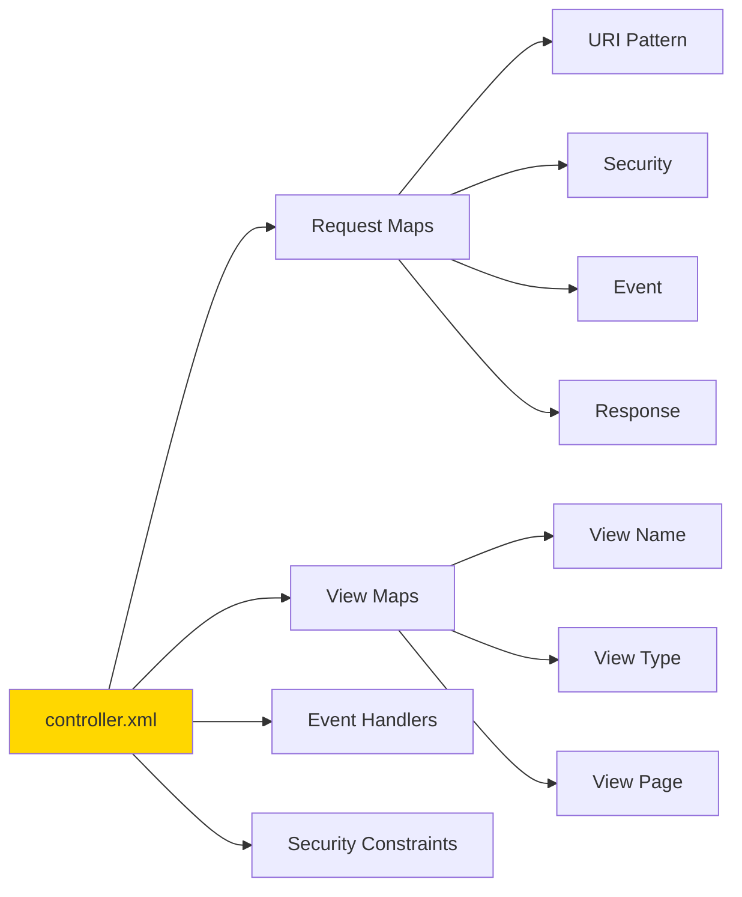

# Webapp Framework Overview

**Purpose**: Overview of the OFBiz Webapp Framework, which handles HTTP request routing, controller configuration, and web application lifecycle.

**Audience**: Full-Stack Developers, System Architects

**Prerequisites**: 
- [System Overview](../../01-system-overview/system-context.md)
- [Widget Framework](../widget-framework/overview.md)

**Related Documents**: 
- [Request Pipeline](./request-pipeline.md)
- [Service Engine](../service-engine/overview.md)

---

## Overview

The OFBiz Webapp Framework provides the foundation for web application development, handling HTTP request routing, event processing, view rendering, and session management. It uses a controller-based architecture with XML configuration for request mappings, security constraints, and view definitions.

## Visual Architecture

### Webapp Architecture



**Diagram Description**: Webapp request flow from HTTP request through ControlServlet, controller configuration, security checks, event handling, and view rendering.

### Controller Configuration Structure



**Diagram Description**: Controller.xml structure showing request maps, view maps, event handlers, and security constraints that define web application behavior.

## Core Components

### ControlServlet

**Purpose**: Main entry point for all HTTP requests

**Responsibilities**:
- Request routing
- Session management
- Context preparation
- Response handling

### RequestHandler

**Purpose**: Processes requests based on controller configuration

**Responsibilities**:
- Load controller.xml
- Match request URI to request-map
- Execute security checks
- Invoke event handlers
- Render views

### Controller Configuration

**Example controller.xml**:
```xml
<site-conf xmlns:xsi="http://www.w3.org/2001/XMLSchema-instance">
    <!-- Request mappings -->
    <request-map uri="EditProduct">
        <security https="true" auth="true"/>
        <event type="java" path="org.apache.ofbiz.product.ProductEvents" invoke="updateProduct"/>
        <response name="success" type="view" value="EditProduct"/>
        <response name="error" type="view" value="EditProduct"/>
    </request-map>
    
    <!-- View mappings -->
    <view-map name="EditProduct" type="screen" 
              page="component://product/widget/catalog/ProductScreens.xml#EditProduct"/>
    
    <!-- Event handlers -->
    <handler name="java" type="request" class="org.apache.ofbiz.webapp.event.JavaEventHandler"/>
    <handler name="service" type="request" class="org.apache.ofbiz.webapp.event.ServiceEventHandler"/>
    
    <!-- Security constraints -->
    <security-constraint>
        <web-resource-collection>
            <web-resource-name>Admin</web-resource-name>
            <url-pattern>/admin/*</url-pattern>
        </web-resource-collection>
        <auth-constraint>
            <role-name>ADMIN</role-name>
        </auth-constraint>
    </security-constraint>
</site-conf>
```

## Request Processing

### Request Types

**1. View Request**: Display a screen
```xml
<request-map uri="FindProduct">
    <security https="true" auth="true"/>
    <response name="success" type="view" value="FindProduct"/>
</request-map>
```

**2. Event Request**: Process data then display
```xml
<request-map uri="updateProduct">
    <security https="true" auth="true"/>
    <event type="service" invoke="updateProduct"/>
    <response name="success" type="view" value="EditProduct"/>
    <response name="error" type="view" value="EditProduct"/>
</request-map>
```

**3. Forward Request**: Internal forward
```xml
<response name="success" type="request" value="EditProduct"/>
```

**4. Redirect Request**: Client-side redirect
```xml
<response name="success" type="request-redirect" value="EditProduct"/>
```

### Event Types

**Service Event**:
```xml
<event type="service" invoke="createProduct"/>
```

**Java Event**:
```xml
<event type="java" path="org.apache.ofbiz.product.ProductEvents" invoke="createProduct"/>
```

**Simple Event**:
```xml
<event type="simple" path="component://product/minilang/product/ProductEvents.xml" invoke="createProduct"/>
```

## Code References

<details>
<summary>View Source Code References</summary>

**ControlServlet**:
`framework/webapp/src/main/java/org/apache/ofbiz/webapp/control/ControlServlet.java`

**RequestHandler**:
`framework/webapp/src/main/java/org/apache/ofbiz/webapp/control/RequestHandler.java`

```java
public class RequestHandler {
    public void doRequest(HttpServletRequest request, HttpServletResponse response) {
        // Get request URI
        String requestUri = RequestHandler.getRequestUri(request.getPathInfo());
        
        // Get request map from controller
        ConfigXMLReader.RequestMap requestMap = controllerConfig.getRequestMapMap().get(requestUri);
        
        // Security check
        if (!checkSecurity(request, requestMap)) {
            response.sendError(HttpServletResponse.SC_FORBIDDEN);
            return;
        }
        
        // Execute event
        String eventReturn = runEvent(request, response, requestMap);
        
        // Render response
        renderResponse(request, response, requestMap, eventReturn);
    }
}
```

</details>

## Architecture Decisions

### Decision: XML-Based Controller Configuration

**Context**: Need flexible request routing without code changes.

**Decision**: Use XML controller configuration for request/view mappings.

**Consequences**:
- ✅ **Positive**: No code changes for routing updates
- ✅ **Positive**: Declarative configuration
- ❌ **Negative**: XML verbosity
- **Mitigation**: Clear documentation, validation tools

## Official References

**Apache OFBiz Documentation**:
- [Webapp Framework](https://cwiki.apache.org/confluence/display/OFBIZ/Webapp+Framework)
- [Controller Configuration](https://cwiki.apache.org/confluence/display/OFBIZ/Controller+Configuration)
- [GitHub Source](https://github.com/apache/ofbiz-framework/tree/trunk/framework/webapp)

## Related Topics

**Within This Section**:
- [Request Pipeline](./request-pipeline.md)

**Other Sections**:
- [Widget Framework](../widget-framework/overview.md)
- [Service Engine](../service-engine/overview.md)

**Role-Based Guides**:
- [Developer Guide](../../role-based-guides/developer-guide.md)

---

**Next**: [Request Pipeline](./request-pipeline.md)

**Up**: [Framework Core](../README.md)

**Home**: [Master Index](../../00-INDEX.md)

---

**Document Metadata**:
- **Version**: 1.0
- **Last Updated**: December 2024
- **OFBiz Version**: Trunk (Latest)
- **Status**: Complete
