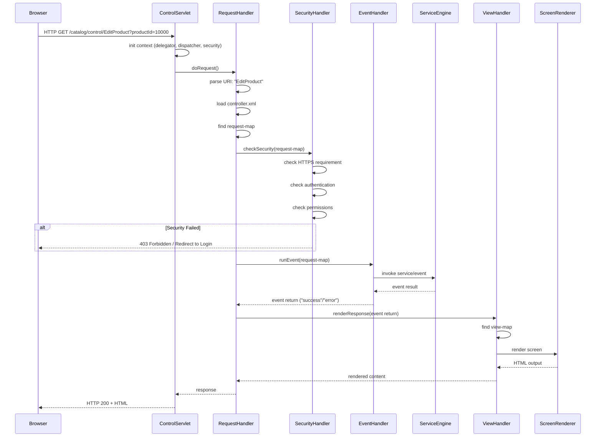
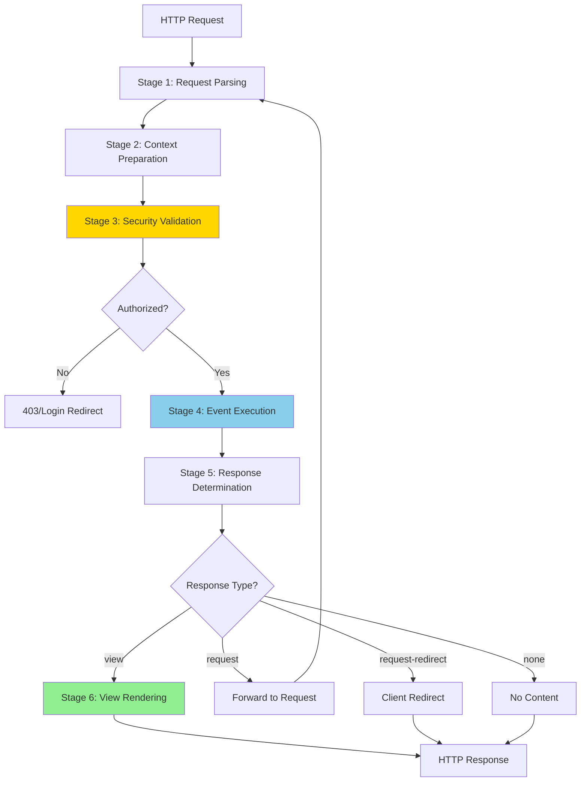

# Request Pipeline

**Purpose**: Detailed documentation of the complete HTTP request-to-response pipeline in OFBiz, from initial request through event processing to final response rendering.

**Audience**: Full-Stack Developers, System Architects

**Prerequisites**: 
- [Webapp Framework Overview](./overview.md)
- [Widget Rendering Pipeline](../widget-framework/rendering-pipeline.md)

**Related Documents**: 
- [Service Engine](../service-engine/overview.md)
- [Security Framework](../security-framework/overview.md)

---

## Overview

The OFBiz request pipeline transforms HTTP requests into responses through a series of well-defined stages: request parsing, security validation, event execution, and view rendering. Understanding this pipeline is essential for debugging, performance optimization, and custom request handling.

## Visual Architecture

### Complete Request-to-Response Pipeline



**Diagram Description**: Complete request pipeline showing all stages from HTTP request through security checks, event processing, and view rendering to final HTTP response.

### Request Processing Stages



**Diagram Description**: Request processing stages showing the flow from request parsing through security, event execution, and response rendering with different response type paths.

## Pipeline Stages

### Stage 1: Request Parsing

**Process**:
1. Extract request URI from path
2. Parse query parameters
3. Extract form data (POST)
4. Determine request method (GET/POST)

**Code**:
```java
String requestUri = RequestHandler.getRequestUri(request.getPathInfo());
// Example: "/catalog/control/EditProduct" -> "EditProduct"
```

### Stage 2: Context Preparation

**Process**:
1. Create request context Map
2. Add framework objects (delegator, dispatcher, security)
3. Add request attributes
4. Add session attributes
5. Add parameters

**Context Contents**:
```java
Map<String, Object> context = new HashMap<>();
context.put("delegator", delegator);
context.put("dispatcher", dispatcher);
context.put("security", security);
context.put("request", request);
context.put("response", response);
context.put("session", request.getSession());
context.put("userLogin", session.getAttribute("userLogin"));
context.put("parameters", UtilHttp.getParameterMap(request));
context.put("locale", UtilHttp.getLocale(request));
context.put("timeZone", UtilHttp.getTimeZone(request));
```

### Stage 3: Security Validation

**Checks**:
1. HTTPS requirement
2. Authentication requirement
3. Permission requirements
4. Certificate requirements

**Configuration**:
```xml
<request-map uri="EditProduct">
    <security https="true" auth="true" cert="false"/>
    <response name="success" type="view" value="EditProduct"/>
</request-map>
```

**Security Check Flow**:
```java
if (requestMap.securityHttps && !request.isSecure()) {
    // Redirect to HTTPS
    return "error";
}

if (requestMap.securityAuth) {
    GenericValue userLogin = (GenericValue) session.getAttribute("userLogin");
    if (userLogin == null) {
        // Redirect to login
        return "error";
    }
}
```

### Stage 4: Event Execution

**Event Types**:

**Service Event**:
```xml
<event type="service" invoke="updateProduct"/>
```
```java
Map<String, Object> serviceContext = extractServiceParameters(request);
Map<String, Object> result = dispatcher.runSync("updateProduct", serviceContext);
return ServiceUtil.isSuccess(result) ? "success" : "error";
```

**Java Event**:
```xml
<event type="java" path="org.apache.ofbiz.product.ProductEvents" invoke="updateProduct"/>
```
```java
public static String updateProduct(HttpServletRequest request, HttpServletResponse response) {
    // Process request
    return "success"; // or "error"
}
```

### Stage 5: Response Determination

**Response Types**:

**View Response**:
```xml
<response name="success" type="view" value="EditProduct"/>
```

**Request Forward**:
```xml
<response name="success" type="request" value="EditProduct"/>
```

**Request Redirect**:
```xml
<response name="success" type="request-redirect" value="EditProduct">
    <redirect-parameter name="productId"/>
</response>
```

**URL Redirect**:
```xml
<response name="success" type="url" value="https://example.com/success"/>
```

### Stage 6: View Rendering

**Process**:
1. Find view-map by name
2. Determine view type (screen, ftl, jsp)
3. Render view
4. Write to response

**View Types**:

**Screen View**:
```xml
<view-map name="EditProduct" type="screen" 
          page="component://product/widget/catalog/ProductScreens.xml#EditProduct"/>
```

**FreeMarker View**:
```xml
<view-map name="ProductList" type="ftl" 
          page="component://product/template/ProductList.ftl"/>
```

**JSP View**:
```xml
<view-map name="LegacyPage" type="jsp" 
          page="/WEB-INF/jsp/legacy.jsp"/>
```

## Performance Optimization

### Controller Caching

**Strategy**: Cache parsed controller.xml

**Implementation**:
```java
private static final Map<String, ControllerConfig> controllerCache = new ConcurrentHashMap<>();

public static ControllerConfig getControllerConfig(ServletContext context) {
    String cacheKey = context.getContextPath();
    return controllerCache.computeIfAbsent(cacheKey, k -> loadController(context));
}
```

### Request Attribute Caching

**Strategy**: Cache expensive computations in request attributes

**Implementation**:
```java
// Check cache first
Object cachedValue = request.getAttribute("expensiveData");
if (cachedValue == null) {
    cachedValue = computeExpensiveData();
    request.setAttribute("expensiveData", cachedValue);
}
```

## Code References

<details>
<summary>View Source Code References</summary>

**ControlServlet**:
`framework/webapp/src/main/java/org/apache/ofbiz/webapp/control/ControlServlet.java`

```java
@Override
public void doGet(HttpServletRequest request, HttpServletResponse response) {
    doPost(request, response);
}

@Override
public void doPost(HttpServletRequest request, HttpServletResponse response) {
    RequestHandler requestHandler = RequestHandler.getRequestHandler(getServletContext());
    requestHandler.doRequest(request, response);
}
```

**RequestHandler.doRequest()**:
`framework/webapp/src/main/java/org/apache/ofbiz/webapp/control/RequestHandler.java`

```java
public void doRequest(HttpServletRequest request, HttpServletResponse response) {
    // Stage 1: Parse request
    String requestUri = getRequestUri(request.getPathInfo());
    
    // Stage 2: Prepare context
    Map<String, Object> context = prepareContext(request, response);
    
    // Get request map
    ConfigXMLReader.RequestMap requestMap = controllerConfig.getRequestMapMap().get(requestUri);
    
    // Stage 3: Security check
    if (!checkSecurity(request, response, requestMap)) {
        return;
    }
    
    // Stage 4: Execute event
    String eventReturn = runEvent(request, response, requestMap, context);
    
    // Stage 5 & 6: Render response
    renderResponse(request, response, requestMap, eventReturn, context);
}
```

</details>

## Architecture Decisions

### Decision: Centralized Request Handling

**Context**: Need consistent request processing across all web applications.

**Decision**: Use single ControlServlet with RequestHandler for all requests.

**Consequences**:
- ✅ **Positive**: Consistent request processing
- ✅ **Positive**: Centralized security enforcement
- ✅ **Positive**: Easy to add cross-cutting concerns
- ❌ **Negative**: Single point of failure
- **Mitigation**: Robust error handling, monitoring

## Official References

**Apache OFBiz Documentation**:
- [Request Handling](https://cwiki.apache.org/confluence/display/OFBIZ/Request+Handling)
- [Controller Configuration](https://cwiki.apache.org/confluence/display/OFBIZ/Controller+Configuration)
- [GitHub Source](https://github.com/apache/ofbiz-framework/tree/trunk/framework/webapp)

## Related Topics

**Within This Section**:
- [Webapp Framework Overview](./overview.md)

**Other Sections**:
- [Widget Rendering Pipeline](../widget-framework/rendering-pipeline.md)
- [Service Engine](../service-engine/overview.md)
- [Security Framework](../security-framework/overview.md)

**Role-Based Guides**:
- [Developer Guide](../../role-based-guides/developer-guide.md)

---

**Next**: [Event-Driven Architecture](../event-driven-architecture/eca-seca-overview.md)

**Up**: [Framework Core](../README.md)

**Home**: [Master Index](../../00-INDEX.md)

---

**Document Metadata**:
- **Version**: 1.0
- **Last Updated**: December 2024
- **OFBiz Version**: Trunk (Latest)
- **Status**: Complete
