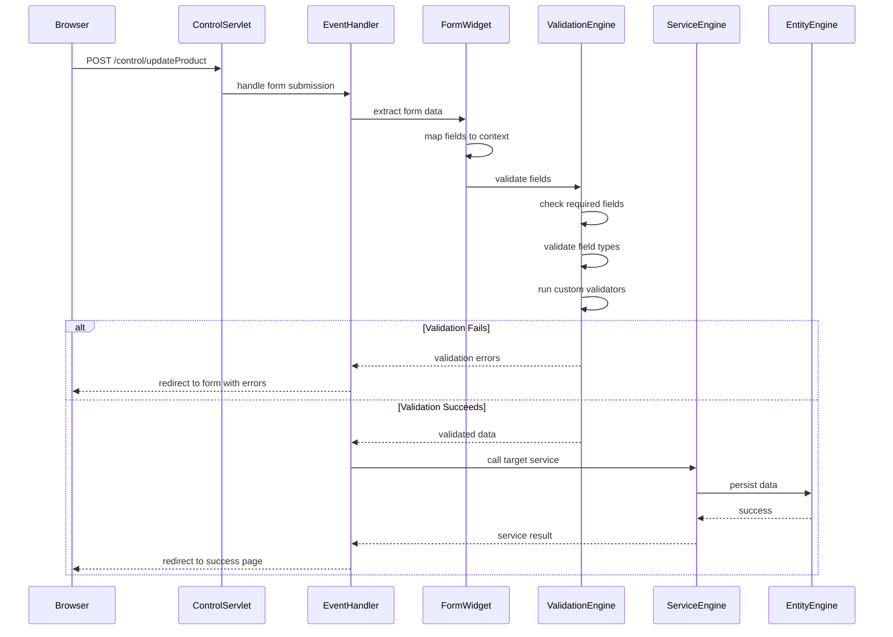
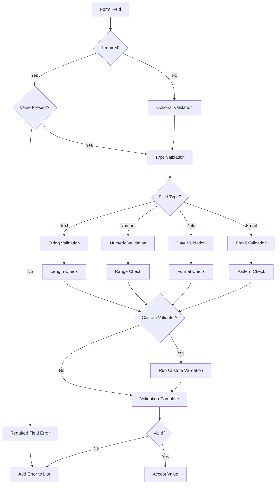
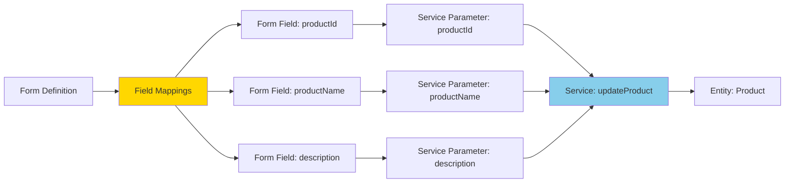

# Form Processing

**Purpose**: Comprehensive documentation of form submission, validation, and processing in the OFBiz Widget Framework.

**Audience**: UI/UX Developers, Full-Stack Developers

**Prerequisites**: 
- [Widget Framework Overview](./overview.md)
- [Widget Rendering Pipeline](./rendering-pipeline.md)

**Related Documents**: 
- [Service Engine](../service-engine/overview.md)
- [Event Handling](../webapp-framework/request-pipeline.md)

---

## Overview

Form processing in OFBiz handles the complete lifecycle from form rendering through user input, validation, submission, and server-side processing. The framework provides automatic form-to-service binding, field validation, error handling, and success/failure feedback, enabling rapid development of data entry interfaces.

## Visual Architecture

### Form Submission Flow



**Diagram Description**: Complete form submission flow showing data extraction, validation, service invocation, and error handling with conditional paths for success and failure scenarios.

### Form Field Validation



**Diagram Description**: Field validation decision tree showing required field checks, type-specific validation, length/range/format checks, and custom validator execution.

### Form-to-Service Binding



**Diagram Description**: Form-to-service binding showing how form fields map to service parameters, which then map to entity fields for automatic CRUD operations.

## Form Types and Processing

### Single Form Processing

**Use Case**: Create or update a single record

**Form Definition**:
```xml
<form name="EditProduct" type="single" target="updateProduct" 
      default-entity-name="Product">
    <alt-target use-when="product==null" target="createProduct"/>
    
    <field name="productId" use-when="product!=null">
        <display/>
    </field>
    <field name="productId" use-when="product==null" required-field="true">
        <text size="20" maxlength="20"/>
    </field>
    
    <field name="productName" required-field="true">
        <text size="50" maxlength="255"/>
    </field>
    
    <field name="description">
        <textarea cols="60" rows="4"/>
    </field>
    
    <field name="submitButton" title="${uiLabelMap.CommonUpdate}">
        <submit/>
    </field>
</form>
```

**Processing Flow**:
1. User submits form
2. Form data extracted from request
3. Fields validated
4. Service called (updateProduct or createProduct)
5. Redirect to success/error page

### List Form Processing

**Use Case**: Display and interact with multiple records

**Form Definition**:
```xml
<form name="ListProducts" type="list" list-name="products" 
      paginate-target="FindProduct">
    <field name="productId">
        <display-entity entity-name="Product"/>
    </field>
    
    <field name="productName">
        <display/>
    </field>
    
    <field name="productTypeId">
        <display-entity entity-name="ProductType" description="${description}"/>
    </field>
    
    <field name="editLink" title=" ">
        <hyperlink target="EditProduct" description="Edit">
            <parameter param-name="productId"/>
        </hyperlink>
    </field>
    
    <field name="deleteLink" title=" ">
        <hyperlink target="deleteProduct" description="Delete" 
                   also-hidden="false" confirmation-message="Delete this product?">
            <parameter param-name="productId"/>
        </hyperlink>
    </field>
</form>
```

**Features**:
- Pagination support
- Row actions (edit, delete)
- Sorting by column
- Bulk selection

### Multi Form Processing

**Use Case**: Edit multiple records simultaneously

**Form Definition**:
```xml
<form name="UpdateProductPrices" type="multi" target="updateProductPrices" 
      list-name="productPrices">
    <field name="productPriceId">
        <hidden/>
    </field>
    
    <field name="productId">
        <display-entity entity-name="Product"/>
    </field>
    
    <field name="price">
        <text size="10"/>
    </field>
    
    <field name="fromDate">
        <display/>
    </field>
    
    <field name="thruDate">
        <date-time type="date"/>
    </field>
    
    <field name="submitButton" title="${uiLabelMap.CommonUpdate}">
        <submit/>
    </field>
</form>
```

**Processing**:
- All rows submitted together
- Service called once per row
- Transaction wraps all updates
- Partial success handling

## Field Validation

### Built-in Validators

**Required Field Validation**:
```xml
<field name="productName" required-field="true">
    <text size="50"/>
</field>
```

**Type Validation**:
```xml
<!-- Email validation -->
<field name="email">
    <text size="50"/>
    <validate>
        <email/>
    </validate>
</field>

<!-- Numeric validation -->
<field name="quantity">
    <text size="10"/>
    <validate>
        <number/>
    </validate>
</field>

<!-- Date validation -->
<field name="orderDate">
    <date-time type="date"/>
    <validate>
        <date-time/>
    </validate>
</field>
```

**Length Validation**:
```xml
<field name="productId">
    <text size="20" maxlength="20"/>
    <validate>
        <length min="5" max="20"/>
    </validate>
</field>
```

**Pattern Validation**:
```xml
<field name="zipCode">
    <text size="10"/>
    <validate>
        <regex pattern="^\d{5}(-\d{4})?$" message="Invalid ZIP code format"/>
    </validate>
</field>
```

### Custom Validators

**Java Validator**:
```xml
<field name="productId">
    <text size="20"/>
    <validate>
        <custom-validator class="com.company.validator.ProductIdValidator" 
                         method="validateProductId"/>
    </validate>
</field>
```

**Validator Implementation**:
```java
package com.company.validator;

public class ProductIdValidator {
    public static boolean validateProductId(String productId, String fieldName, 
            Locale locale, List<String> errorMessages) {
        if (productId.startsWith("PROD-")) {
            return true;
        } else {
            errorMessages.add("Product ID must start with 'PROD-'");
            return false;
        }
    }
}
```

## Error Handling

### Error Display

**Error Message Rendering**:
```ftl
<#if errorMessage?has_content>
    <div class="alert alert-danger">
        ${errorMessage}
    </div>
</#if>

<#if errorMessageList?has_content>
    <div class="alert alert-danger">
        <ul>
            <#list errorMessageList as error>
                <li>${error}</li>
            </#list>
        </ul>
    </div>
</#if>
```

**Field-Level Errors**:
```xml
<field name="productName">
    <text size="50"/>
    <on-field-error-message>Product name is required</on-field-error-message>
</field>
```

### Error Recovery

**Preserve Form Data on Error**:
```java
// In event handler
if (ServiceUtil.isError(result)) {
    request.setAttribute("_ERROR_MESSAGE_", result.get("errorMessage"));
    request.setAttribute("preserveParameters", "Y");
    return "error";
}
```

**Repopulate Form**:
```xml
<field name="productName">
    <text size="50" default-value="${parameters.productName}"/>
</field>
```

## Code References

<details>
<summary>View Source Code References</summary>

**FormRenderer**:
`framework/widget/src/main/java/org/apache/ofbiz/widget/renderer/FormRenderer.java`

**ModelFormField Validation**:
`framework/widget/src/main/java/org/apache/ofbiz/widget/model/ModelFormField.java`

```java
public class ModelFormField {
    public boolean validate(Map<String, Object> context, List<String> errorMessages) {
        String value = (String) context.get(this.name);
        
        // Required field check
        if (this.requiredField && UtilValidate.isEmpty(value)) {
            errorMessages.add("Field " + this.name + " is required");
            return false;
        }
        
        // Run validators
        for (Validator validator : this.validators) {
            if (!validator.validate(value, context, errorMessages)) {
                return false;
            }
        }
        
        return true;
    }
}
```

**Event Handler**:
`framework/webapp/src/main/java/org/apache/ofbiz/webapp/event/ServiceEventHandler.java`

```java
public class ServiceEventHandler implements EventHandler {
    public String invoke(Event event, RequestMap requestMap, HttpServletRequest request, 
            HttpServletResponse response) throws EventHandlerException {
        LocalDispatcher dispatcher = (LocalDispatcher) request.getAttribute("dispatcher");
        
        // Extract form parameters
        Map<String, Object> serviceContext = new HashMap<>();
        for (String paramName : request.getParameterMap().keySet()) {
            serviceContext.put(paramName, request.getParameter(paramName));
        }
        
        // Add userLogin
        serviceContext.put("userLogin", request.getSession().getAttribute("userLogin"));
        
        // Call service
        try {
            Map<String, Object> result = dispatcher.runSync(event.getServiceName(), serviceContext);
            
            if (ServiceUtil.isError(result)) {
                request.setAttribute("_ERROR_MESSAGE_", result.get("errorMessage"));
                return "error";
            }
            
            return "success";
        } catch (GenericServiceException e) {
            throw new EventHandlerException("Service invocation failed", e);
        }
    }
}
```

</details>

## Architecture Decisions

### Decision: Declarative Form Validation

**Context**: Need consistent validation across forms without duplicating validation logic.

**Decision**: Define validation rules in form XML with support for custom validators.

**Consequences**:
- ✅ **Positive**: Consistent validation patterns
- ✅ **Positive**: Easy to modify without code changes
- ✅ **Positive**: Reusable validators
- ❌ **Negative**: Limited to predefined validator types
- **Mitigation**: Custom validator support for complex cases

### Decision: Automatic Form-to-Service Binding

**Context**: Reduce boilerplate code for form processing.

**Decision**: Automatically map form fields to service parameters based on naming convention.

**Consequences**:
- ✅ **Positive**: Minimal code for CRUD operations
- ✅ **Positive**: Consistent patterns
- ❌ **Negative**: Less explicit, harder to debug
- **Mitigation**: Clear naming conventions, documentation

## Official References

**Apache OFBiz Documentation**:
- [Form Widget Reference](https://cwiki.apache.org/confluence/display/OFBIZ/Form+Widget+Reference)
- [Form Validation](https://cwiki.apache.org/confluence/display/OFBIZ/Form+Validation)
- [GitHub Source](https://github.com/apache/ofbiz-framework/tree/trunk/framework/widget)

## Related Topics

**Within This Section**:
- [Widget Framework Overview](./overview.md)
- [Widget Rendering Pipeline](./rendering-pipeline.md)
- [Widget Replacement Strategies](./replacement-strategies.md)

**Other Sections**:
- [Service Engine](../service-engine/overview.md)
- [Event Handling](../webapp-framework/request-pipeline.md)

**Role-Based Guides**:
- [UI/UX Developer Guide](../../role-based-guides/ui-ux-developer-guide.md)
- [Developer Guide](../../role-based-guides/developer-guide.md)

---

**Next**: [Widget Replacement Strategies](./replacement-strategies.md)

**Up**: [Framework Core](../README.md)

**Home**: [Master Index](../../00-INDEX.md)

---

**Document Metadata**:
- **Version**: 1.0
- **Last Updated**: December 2024
- **OFBiz Version**: Trunk (Latest)
- **Status**: Complete
