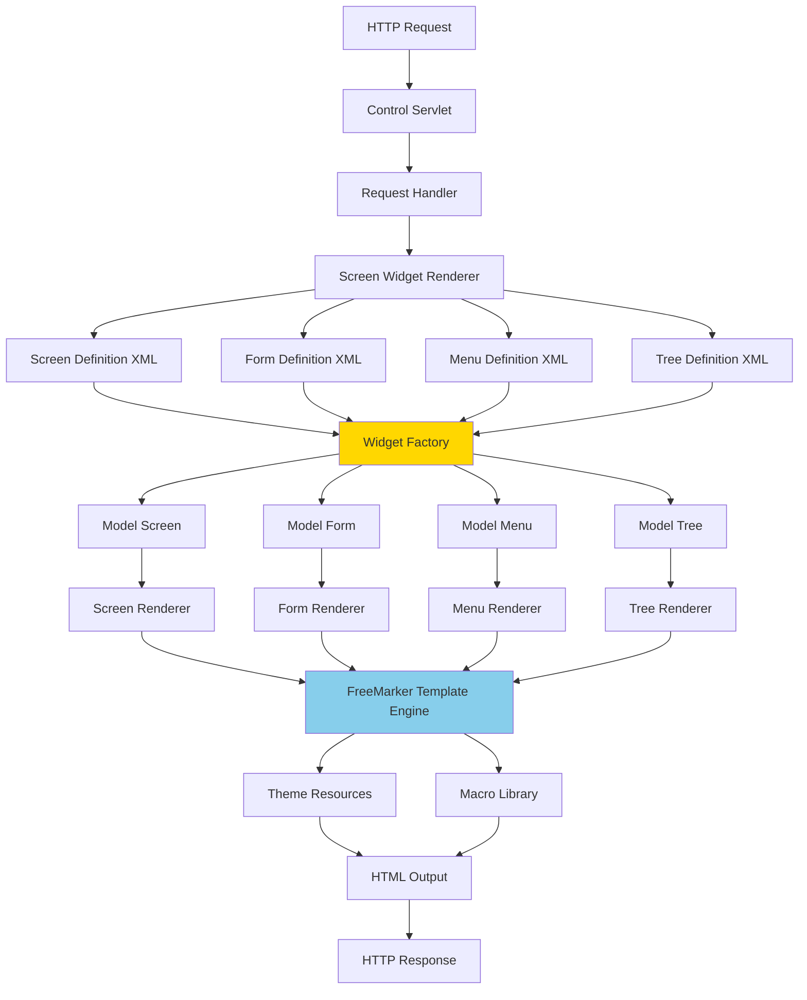
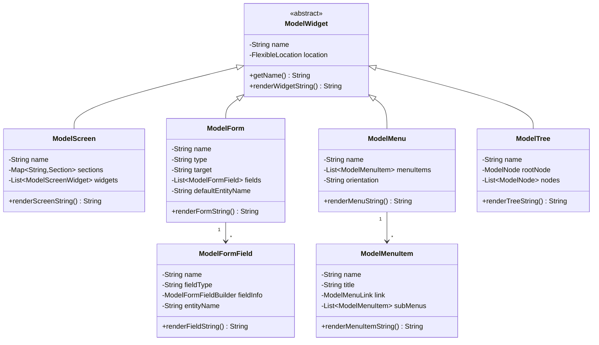
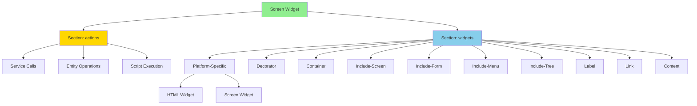
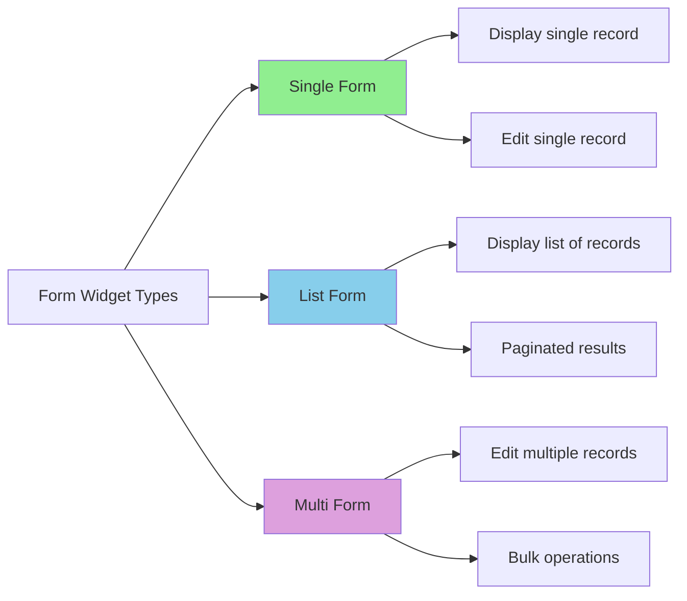
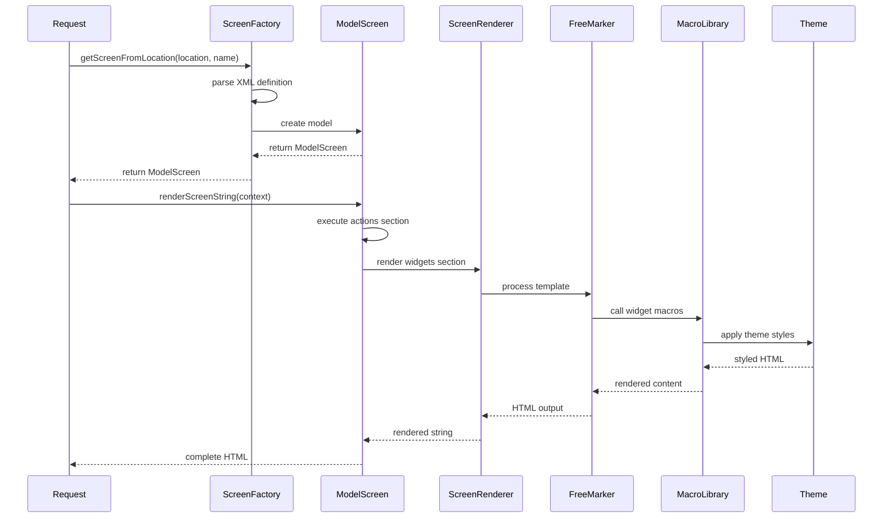

# Widget Framework Overview

**Purpose**: Comprehensive overview of the OFBiz Widget Framework, which provides a declarative, XML-based approach to building user interfaces including screens, forms, menus, and trees.

**Audience**: UI/UX Developers, Frontend Architects, Full-Stack Developers

**Prerequisites**: 
- [System Overview](../../01-system-overview/system-context.md)
- [Service Engine Overview](../service-engine/overview.md)

**Related Documents**: 
- [Widget Rendering Pipeline](./rendering-pipeline.md)
- [Form Processing](./form-processing.md)
- [Webapp Framework](../webapp-framework/overview.md)

---

## Overview

The OFBiz Widget Framework is a declarative UI framework that separates presentation logic from business logic through XML-based widget definitions. It supports four primary widget types: Screens, Forms, Menus, and Trees. The framework renders these widgets server-side using FreeMarker templates, generating HTML that can be styled with themes. This approach enables rapid UI development, consistent look-and-feel, and easy customization without modifying Java code.

## Visual Architecture

### Widget Framework Architecture



**Diagram Description**: Complete Widget Framework architecture showing the flow from HTTP request through widget definition loading, model creation, rendering with FreeMarker, and HTML output generation. The Widget Factory creates model objects from XML definitions, which are then rendered using FreeMarker templates and theme resources.

### Widget Type Hierarchy



**Diagram Description**: Widget type hierarchy showing the abstract ModelWidget base class and its four concrete implementations (Screen, Form, Menu, Tree). Forms contain fields, menus contain menu items, demonstrating the compositional structure of widgets.

### Screen Widget Structure



**Diagram Description**: Screen widget structure showing the two main sections: actions (for data preparation) and widgets (for UI rendering). The actions section executes services and scripts, while the widgets section contains various UI components that can be nested.

### Form Widget Types



**Diagram Description**: Three main form types in OFBiz: Single forms for individual record display/edit, List forms for displaying multiple records with pagination, and Multi forms for bulk editing operations.

## Widget Types

### 1. Screen Widgets

**Purpose**: Define complete page layouts and screen flows

**Key Features**:
- Declarative screen structure
- Section-based organization (actions, widgets)
- Screen decoration (headers, footers, navigation)
- Screen inclusion and composition
- Conditional rendering

**XML Example**:
```xml
<screen name="EditProduct">
    <section>
        <actions>
            <entity-one entity-name="Product" value-field="product"/>
            <set field="titleProperty" value="ProductEditProduct"/>
        </actions>
        <widgets>
            <decorator-screen name="CommonProductDecorator" location="${parameters.mainDecoratorLocation}">
                <decorator-section name="body">
                    <screenlet title="${uiLabelMap.ProductEditProduct}">
                        <include-form name="EditProduct" location="component://product/widget/catalog/ProductForms.xml"/>
                    </screenlet>
                </decorator-section>
            </decorator-screen>
        </widgets>
    </section>
</screen>
```

**Use Cases**:
- Page layouts
- Dashboard screens
- Detail views
- List views
- Wizard flows

### 2. Form Widgets

**Purpose**: Define data entry forms and data display grids

**Key Features**:
- Single, list, and multi form types
- Field-level validation
- Auto-complete and lookup fields
- Conditional field display
- Form actions (submit, cancel, delete)
- Entity-auto integration

**XML Example**:
```xml
<form name="EditProduct" type="single" target="updateProduct" default-entity-name="Product">
    <alt-target use-when="product==null" target="createProduct"/>
    
    <field name="productId" use-when="product!=null">
        <display/>
    </field>
    <field name="productId" use-when="product==null">
        <text size="20" maxlength="20"/>
    </field>
    
    <field name="productTypeId">
        <drop-down allow-empty="false">
            <entity-options entity-name="ProductType" description="${description}">
                <entity-order-by field-name="description"/>
            </entity-options>
        </drop-down>
    </field>
    
    <field name="productName">
        <text size="50" maxlength="255"/>
    </field>
    
    <field name="description">
        <textarea cols="60" rows="4"/>
    </field>
    
    <field name="submitButton" title="${uiLabelMap.CommonUpdate}" use-when="product!=null">
        <submit button-type="button"/>
    </field>
    <field name="submitButton" title="${uiLabelMap.CommonCreate}" use-when="product==null">
        <submit button-type="button"/>
    </field>
</form>
```

**Form Types**:
- **Single**: Display/edit one record
- **List**: Display multiple records in table format
- **Multi**: Edit multiple records simultaneously

### 3. Menu Widgets

**Purpose**: Define navigation menus and action buttons

**Key Features**:
- Hierarchical menu structure
- Conditional menu items
- Permission-based visibility
- Dynamic menu generation
- Multiple menu styles (tabs, buttons, sidebar)

**XML Example**:
```xml
<menu name="ProductTabBar" type="simple" menu-container-style="button-bar tab-bar">
    <menu-item name="EditProduct" title="${uiLabelMap.ProductProduct}">
        <link target="EditProduct">
            <parameter param-name="productId"/>
        </link>
    </menu-item>
    
    <menu-item name="EditProductContent" title="${uiLabelMap.ProductContent}">
        <link target="EditProductContent">
            <parameter param-name="productId"/>
        </link>
    </menu-item>
    
    <menu-item name="EditProductPrices" title="${uiLabelMap.ProductPrices}">
        <condition>
            <if-has-permission permission="CATALOG" action="_PRICE_MAINT"/>
        </condition>
        <link target="EditProductPrices">
            <parameter param-name="productId"/>
        </link>
    </menu-item>
</menu>
```

**Use Cases**:
- Navigation bars
- Tab bars
- Action buttons
- Context menus
- Breadcrumbs

### 4. Tree Widgets

**Purpose**: Define hierarchical tree structures

**Key Features**:
- Recursive node rendering
- Lazy loading
- Expand/collapse functionality
- Node actions
- Custom node rendering

**XML Example**:
```xml
<tree name="ProductCategoryTree" root-node-name="rootNode">
    <node name="rootNode">
        <entity-one entity-name="ProductCategory" value-field="productCategory">
            <field-map field-name="productCategoryId" from-field="parameters.productCategoryId"/>
        </entity-one>
        <label text="${productCategory.categoryName}"/>
        <sub-node node-name="childNode">
            <entity-and entity-name="ProductCategoryRollup" list="childCategories">
                <field-map field-name="parentProductCategoryId" from-field="productCategory.productCategoryId"/>
            </entity-and>
        </sub-node>
    </node>
    
    <node name="childNode">
        <entity-one entity-name="ProductCategory" value-field="productCategory">
            <field-map field-name="productCategoryId" from-field="childCategory.productCategoryId"/>
        </entity-one>
        <label text="${productCategory.categoryName}"/>
        <link target="EditCategory">
            <parameter param-name="productCategoryId" from-field="productCategory.productCategoryId"/>
        </link>
    </node>
</tree>
```

**Use Cases**:
- Category hierarchies
- Organization charts
- File browsers
- Navigation trees

## Widget Rendering Process

### Rendering Flow



**Diagram Description**: Widget rendering sequence showing XML parsing, model creation, action execution, FreeMarker template processing, and final HTML generation with theme styling.

## Key Components

### WidgetFactory

**Purpose**: Factory for creating widget model objects from XML definitions

**Responsibilities**:
- Parse widget XML files
- Cache parsed widget definitions
- Create ModelScreen, ModelForm, ModelMenu, ModelTree instances
- Handle widget inheritance and overrides

### ModelWidget Classes

**Purpose**: In-memory representation of widget definitions

**Key Classes**:
- `ModelScreen`: Screen widget model
- `ModelForm`: Form widget model
- `ModelMenu`: Menu widget model
- `ModelTree`: Tree widget model
- `ModelFormField`: Form field model
- `ModelMenuItem`: Menu item model

### Widget Renderers

**Purpose**: Convert widget models to HTML output

**Key Classes**:
- `ScreenRenderer`: Renders screen widgets
- `FormRenderer`: Renders form widgets
- `MenuRenderer`: Renders menu widgets
- `TreeRenderer`: Renders tree widgets
- `MacroFormRenderer`: FreeMarker macro-based form rendering

### FreeMarker Integration

**Purpose**: Template engine for generating HTML

**Features**:
- Macro-based rendering
- Theme support
- Custom directives
- Context variable access
- Template inheritance

## Code References

<details>
<summary>View Source Code References</summary>

**ScreenFactory**:
`framework/widget/src/main/java/org/apache/ofbiz/widget/model/ScreenFactory.java`

```java
public class ScreenFactory {
    private static final Map<String, ModelScreen> screenLocationCache = new HashMap<>();
    
    public static ModelScreen getScreenFromLocation(String resourceName, String screenName) 
            throws IOException, SAXException, ParserConfigurationException {
        String cacheKey = resourceName + "#" + screenName;
        ModelScreen modelScreen = screenLocationCache.get(cacheKey);
        
        if (modelScreen == null) {
            URL screenFileUrl = FlexibleLocation.resolveLocation(resourceName);
            Document screenFileDoc = UtilXml.readXmlDocument(screenFileUrl, true, true);
            modelScreen = createModelScreen(screenFileDoc, screenName);
            screenLocationCache.put(cacheKey, modelScreen);
        }
        
        return modelScreen;
    }
}
```

**ModelScreen**:
`framework/widget/src/main/java/org/apache/ofbiz/widget/model/ModelScreen.java`

```java
public class ModelScreen extends ModelWidget {
    private final String name;
    private final Map<String, ModelScreenWidget.Section> sectionMap;
    
    public void renderScreenString(Appendable writer, Map<String, Object> context, ScreenRenderer renderer) 
            throws IOException, GeneralException {
        // Execute actions section
        ModelScreenWidget.Section actionsSection = sectionMap.get("actions");
        if (actionsSection != null) {
            actionsSection.renderWidgetString(writer, context, renderer);
        }
        
        // Render widgets section
        ModelScreenWidget.Section widgetsSection = sectionMap.get("widgets");
        if (widgetsSection != null) {
            widgetsSection.renderWidgetString(writer, context, renderer);
        }
    }
}
```

**FormFactory**:
`framework/widget/src/main/java/org/apache/ofbiz/widget/model/FormFactory.java`

**ModelForm**:
`framework/widget/src/main/java/org/apache/ofbiz/widget/model/ModelForm.java`

**ScreenRenderer**:
`framework/widget/src/main/java/org/apache/ofbiz/widget/renderer/ScreenRenderer.java`

**MacroFormRenderer**:
`framework/widget/src/main/java/org/apache/ofbiz/widget/renderer/macro/MacroFormRenderer.java`

**Key Classes**:
- `ScreenFactory`: Factory for creating screen models
- `FormFactory`: Factory for creating form models
- `MenuFactory`: Factory for creating menu models
- `TreeFactory`: Factory for creating tree models
- `ModelScreen`: Screen widget model
- `ModelForm`: Form widget model
- `ScreenRenderer`: Renders screens to HTML
- `MacroFormRenderer`: FreeMarker-based form renderer

**Package Structure**:
```
org.apache.ofbiz.widget
├── model
│   ├── ScreenFactory
│   ├── FormFactory
│   ├── MenuFactory
│   ├── TreeFactory
│   ├── ModelScreen
│   ├── ModelForm
│   ├── ModelMenu
│   ├── ModelTree
│   └── ModelFormField
├── renderer
│   ├── ScreenRenderer
│   ├── FormRenderer
│   ├── MenuRenderer
│   ├── TreeRenderer
│   └── macro
│       ├── MacroFormRenderer
│       └── MacroScreenRenderer
└── cache
    └── WidgetCache
```

</details>

## Architecture Decisions

### Decision: XML-Based Declarative UI

**Context**: Need to separate UI definition from business logic and enable rapid UI development without Java code changes.

**Decision**: Use XML-based declarative widget definitions that are parsed at runtime and rendered server-side.

**Consequences**:
- ✅ **Positive**: Clear separation of concerns between UI and business logic
- ✅ **Positive**: Non-developers can modify UI without Java knowledge
- ✅ **Positive**: Consistent UI patterns across application
- ✅ **Positive**: Easy to override and extend widgets
- ❌ **Negative**: XML verbosity, less IDE support than code
- ❌ **Negative**: Runtime parsing overhead (mitigated by caching)
- **Mitigation**: Widget caching, XML validation tools, comprehensive documentation

**Alternatives Considered**:
- **JSP/Servlets**: More flexible but mixes presentation and logic
- **Java-Based UI Frameworks**: Type-safe but requires compilation for changes

### Decision: Server-Side Rendering with FreeMarker

**Context**: Need to generate HTML from widget definitions with theme support and customization.

**Decision**: Use FreeMarker template engine with macro-based rendering for server-side HTML generation.

**Consequences**:
- ✅ **Positive**: Full control over HTML output
- ✅ **Positive**: Theme support through macro libraries
- ✅ **Positive**: No JavaScript framework dependency
- ✅ **Positive**: Works without JavaScript enabled
- ❌ **Negative**: Full page reloads for interactions
- ❌ **Negative**: Less interactive than modern SPAs
- **Mitigation**: AJAX support for partial updates, can integrate with modern frontends

**Alternatives Considered**:
- **Client-Side Rendering**: More interactive but requires JavaScript framework
- **JSP**: Simpler but less flexible for theming

### Decision: Four Widget Types (Screen, Form, Menu, Tree)

**Context**: Need to cover common UI patterns while keeping framework manageable.

**Decision**: Provide four core widget types that cover most UI needs, with extensibility for custom widgets.

**Consequences**:
- ✅ **Positive**: Covers 90% of UI needs
- ✅ **Positive**: Consistent patterns across application
- ✅ **Positive**: Easy to learn and use
- ❌ **Negative**: Custom widgets require Java code
- ❌ **Negative**: May not fit all UI patterns
- **Mitigation**: Widget extensibility, ability to include custom HTML

**Alternatives Considered**:
- **More Widget Types**: More complex framework
- **Fewer Widget Types**: Less functionality out of box

## Official References

**Apache OFBiz Documentation**:
- [Widget Framework Documentation](https://cwiki.apache.org/confluence/display/OFBIZ/Widget+Framework)
- [Screen Widget Reference](https://cwiki.apache.org/confluence/display/OFBIZ/Screen+Widget+Reference)
- [Form Widget Reference](https://cwiki.apache.org/confluence/display/OFBIZ/Form+Widget+Reference)
- [Menu Widget Reference](https://cwiki.apache.org/confluence/display/OFBIZ/Menu+Widget+Reference)
- [GitHub Source - Widget Framework](https://github.com/apache/ofbiz-framework/tree/trunk/framework/widget)

**FreeMarker**:
- [FreeMarker Documentation](https://freemarker.apache.org/docs/)
- [FreeMarker Template Language](https://freemarker.apache.org/docs/dgui.html)

## Related Topics

**Within This Section**:
- [Widget Rendering Pipeline](./rendering-pipeline.md)
- [Form Processing](./form-processing.md)
- [Widget Replacement Strategies](./replacement-strategies.md)

**Other Sections**:
- [Webapp Framework](../webapp-framework/overview.md)
- [Service Engine](../service-engine/overview.md)
- [Theme Architecture](../../08-extension-points/theme-architecture.md)

**Role-Based Guides**:
- [UI/UX Developer Guide](../../role-based-guides/ui-ux-developer-guide.md)
- [Developer Guide](../../role-based-guides/developer-guide.md)

---

**Next**: [Widget Rendering Pipeline](./rendering-pipeline.md)

**Up**: [Framework Core](../README.md)

**Home**: [Master Index](../../00-INDEX.md)

---

**Document Metadata**:
- **Version**: 1.0
- **Last Updated**: December 2024
- **OFBiz Version**: Trunk (Latest)
- **Status**: Complete
