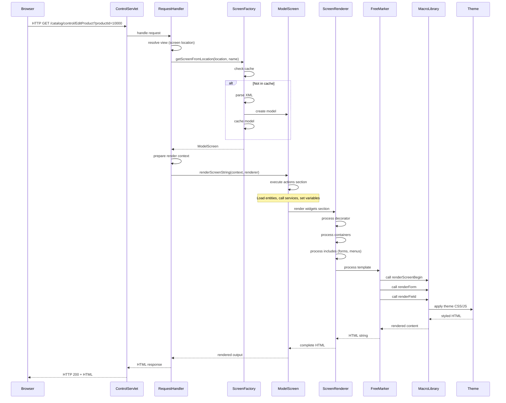
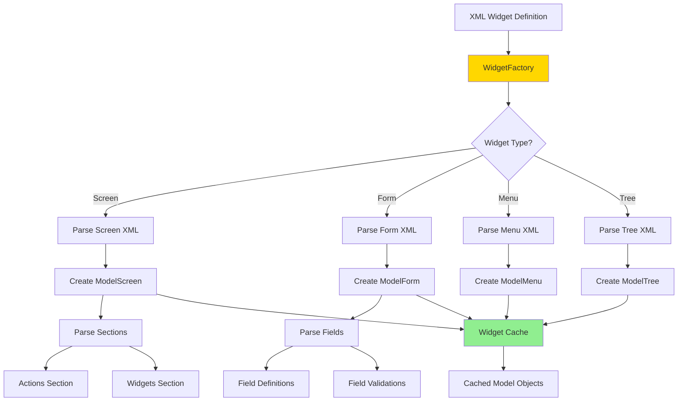
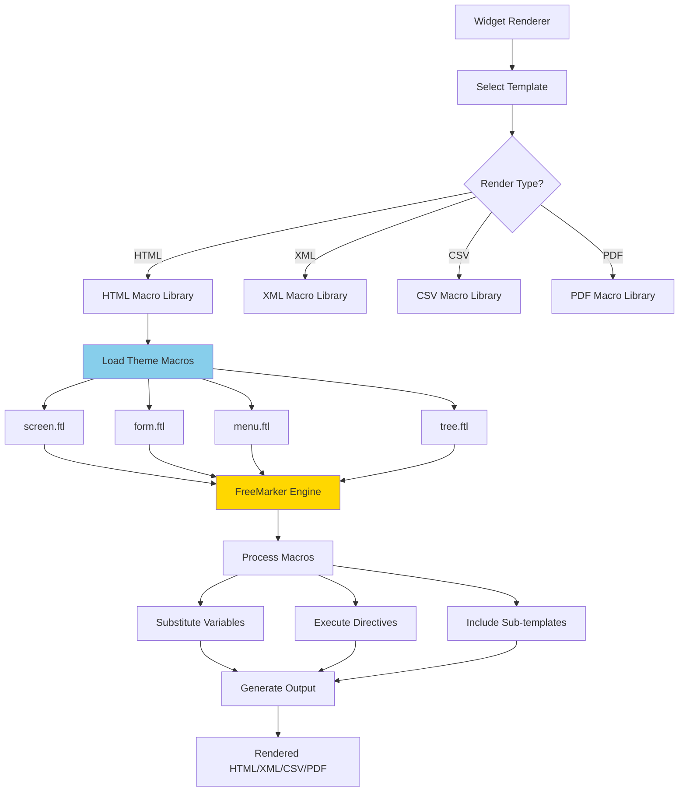
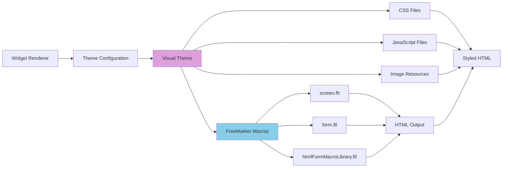

# Widget Rendering Pipeline

**Purpose**: Detailed documentation of the widget rendering pipeline, from HTTP request to HTML response, including FreeMarker template processing and theme integration.

**Audience**: UI/UX Developers, Frontend Architects, Full-Stack Developers

**Prerequisites**: 
- [Widget Framework Overview](./overview.md)
- [Webapp Framework Overview](../webapp-framework/overview.md)

**Related Documents**: 
- [Form Processing](./form-processing.md)
- [Request Pipeline](../webapp-framework/request-pipeline.md)

---

## Overview

The widget rendering pipeline transforms declarative XML widget definitions into HTML output through a multi-stage process involving widget parsing, model creation, context preparation, FreeMarker template processing, and theme application. Understanding this pipeline is essential for customizing UI rendering, creating themes, and troubleshooting rendering issues.

## Visual Architecture

### Complete Rendering Pipeline



**Diagram Description**: Complete rendering pipeline from HTTP request to HTML response, showing caching, XML parsing, model creation, action execution, FreeMarker processing, and theme application.

### Widget Model Creation



**Diagram Description**: Widget model creation process showing XML parsing, model object creation, and caching. Different widget types follow similar patterns but create type-specific model objects.

### FreeMarker Template Processing



**Diagram Description**: FreeMarker template processing showing render type selection, macro library loading, template processing, and output generation. Different render types use different macro libraries.

### Theme Integration



**Diagram Description**: Theme integration showing how visual themes provide CSS, JavaScript, images, and FreeMarker macros that are applied during rendering to produce styled HTML output.

## Rendering Stages

### Stage 1: Request Routing

**Process**:
1. ControlServlet receives HTTP request
2. RequestHandler resolves request to screen location
3. Screen location determined from controller.xml configuration

**Example Controller Configuration**:
```xml
<request-map uri="EditProduct">
    <security https="true" auth="true"/>
    <response name="success" type="view" value="EditProduct"/>
</request-map>

<view-map name="EditProduct" type="screen" page="component://product/widget/catalog/ProductScreens.xml#EditProduct"/>
```

### Stage 2: Widget Loading and Caching

**Process**:
1. ScreenFactory checks cache for widget
2. If not cached, parse XML definition
3. Create ModelScreen object
4. Cache for future requests

**Caching Strategy**:
- Widgets cached by location + name
- Cache cleared on XML file changes (dev mode)
- Production mode: cache persists until restart

**Code Example**:
```java
public static ModelScreen getScreenFromLocation(String resourceName, String screenName) {
    String cacheKey = resourceName + "#" + screenName;
    ModelScreen modelScreen = screenLocationCache.get(cacheKey);
    
    if (modelScreen == null) {
        // Parse XML and create model
        modelScreen = parseAndCreateModel(resourceName, screenName);
        screenLocationCache.put(cacheKey, modelScreen);
    }
    
    return modelScreen;
}
```

### Stage 3: Context Preparation

**Process**:
1. Create render context Map
2. Add request parameters
3. Add session attributes
4. Add application attributes
5. Add security context (userLogin)

**Context Variables**:
```java
Map<String, Object> context = new HashMap<>();
context.put("parameters", request.getParameterMap());
context.put("userLogin", session.getAttribute("userLogin"));
context.put("locale", UtilHttp.getLocale(request));
context.put("timeZone", UtilHttp.getTimeZone(request));
context.put("delegator", delegator);
context.put("dispatcher", dispatcher);
context.put("security", security);
```

### Stage 4: Actions Execution

**Process**:
1. Execute actions section of screen
2. Call services to load data
3. Perform entity operations
4. Execute scripts (Groovy/JavaScript)
5. Set context variables

**Actions Example**:
```xml
<actions>
    <!-- Load product entity -->
    <entity-one entity-name="Product" value-field="product">
        <field-map field-name="productId" from-field="parameters.productId"/>
    </entity-one>
    
    <!-- Call service to get product prices -->
    <service service-name="calculateProductPrice" result-map="priceResult">
        <field-map field-name="product" from-field="product"/>
    </service>
    <set field="price" from-field="priceResult.price"/>
    
    <!-- Execute script -->
    <script location="component://product/groovyScripts/catalog/product/EditProduct.groovy"/>
    
    <!-- Set UI labels -->
    <set field="titleProperty" value="ProductEditProduct"/>
    <set field="headerItem" value="products"/>
</actions>
```

### Stage 5: Widget Rendering

**Process**:
1. Process decorator (if specified)
2. Render widget tree recursively
3. Process includes (forms, menus, trees)
4. Generate widget-specific HTML

**Widget Rendering Order**:
```
Screen
├── Decorator (header, navigation, footer)
│   └── Decorator Sections
│       └── Body Section
│           ├── Container
│           │   ├── Label
│           │   ├── Link
│           │   └── Include-Form
│           │       └── Form Widget
│           │           ├── Field 1
│           │           ├── Field 2
│           │           └── Field 3
│           └── Include-Menu
│               └── Menu Widget
│                   ├── Menu Item 1
│                   └── Menu Item 2
```

### Stage 6: FreeMarker Processing

**Process**:
1. Select appropriate macro library based on render type
2. Load theme-specific macros
3. Process FreeMarker template
4. Substitute context variables
5. Execute FreeMarker directives
6. Generate output string

**Macro Invocation Example**:
```ftl
<#-- Screen rendering macro -->
<@renderScreenBegin />

<#-- Form rendering macro -->
<@renderFormOpen formName="EditProduct" target="updateProduct" />
  <@renderField field=productIdField />
  <@renderField field=productNameField />
  <@renderField field=descriptionField />
  <@renderSubmitField field=submitButton />
<@renderFormClose />

<@renderScreenEnd />
```

### Stage 7: Theme Application

**Process**:
1. Theme macros generate HTML with theme-specific classes
2. CSS files provide styling
3. JavaScript files provide interactivity
4. Images and icons included

**Theme Macro Example** (`themes/common-theme/template/macro/HtmlFormMacroLibrary.ftl`):
```ftl
<#macro renderTextField name value size maxlength autocomplete>
  <input type="text" 
         name="${name}" 
         <#if value?has_content>value="${value}"</#if>
         <#if size?has_content>size="${size}"</#if>
         <#if maxlength?has_content>maxlength="${maxlength}"</#if>
         <#if autocomplete?has_content>autocomplete="${autocomplete}"</#if>
         class="form-control"/>
</#macro>
```

## Code References

<details>
<summary>View Source Code References</summary>

**ScreenRenderer**:
`framework/widget/src/main/java/org/apache/ofbiz/widget/renderer/ScreenRenderer.java`

```java
public class ScreenRenderer {
    private ScreenStringRenderer screenStringRenderer;
    
    public void render(Appendable writer, Map<String, Object> context) throws IOException, GeneralException {
        // Get screen from context
        ModelScreen modelScreen = (ModelScreen) context.get("modelScreen");
        
        // Render screen
        modelScreen.renderScreenString(writer, context, this);
    }
    
    public void populateContextForRequest(Map<String, Object> context, HttpServletRequest request, 
            HttpServletResponse response) {
        // Add request attributes
        context.put("request", request);
        context.put("response", response);
        context.put("session", request.getSession());
        context.put("parameters", UtilHttp.getParameterMap(request));
        
        // Add framework objects
        context.put("delegator", (Delegator) request.getAttribute("delegator"));
        context.put("dispatcher", (LocalDispatcher) request.getAttribute("dispatcher"));
        context.put("security", (Security) request.getAttribute("security"));
        
        // Add user context
        context.put("userLogin", request.getSession().getAttribute("userLogin"));
        context.put("locale", UtilHttp.getLocale(request));
        context.put("timeZone", UtilHttp.getTimeZone(request));
    }
}
```

**MacroFormRenderer**:
`framework/widget/src/main/java/org/apache/ofbiz/widget/renderer/macro/MacroFormRenderer.java`

```java
public class MacroFormRenderer implements FormStringRenderer {
    private Template macroLibrary;
    
    public void renderFormOpen(Appendable writer, Map<String, Object> context, ModelForm modelForm) 
            throws IOException {
        Map<String, Object> parameters = new HashMap<>();
        parameters.put("formName", modelForm.getName());
        parameters.put("target", modelForm.getTarget(context));
        parameters.put("method", modelForm.getMethod());
        
        executeMacro(writer, "renderFormOpen", parameters);
    }
    
    public void renderTextField(Appendable writer, Map<String, Object> context, TextField textField) 
            throws IOException {
        Map<String, Object> parameters = new HashMap<>();
        parameters.put("name", textField.getModelFormField().getName());
        parameters.put("value", textField.getValue(context));
        parameters.put("size", textField.getSize());
        parameters.put("maxlength", textField.getMaxlength());
        
        executeMacro(writer, "renderTextField", parameters);
    }
    
    private void executeMacro(Appendable writer, String macroName, Map<String, Object> parameters) 
            throws IOException {
        Environment env = FreeMarkerWorker.getEnvironment(macroLibrary, parameters, writer);
        env.include(macroLibrary);
    }
}
```

**FreeMarkerWorker**:
`framework/base/src/main/java/org/apache/ofbiz/base/util/template/FreeMarkerWorker.java`

```java
public class FreeMarkerWorker {
    private static Configuration config;
    
    public static void renderTemplate(String templateLocation, Map<String, Object> context, 
            Appendable outWriter) throws IOException, TemplateException {
        Template template = config.getTemplate(templateLocation);
        Environment env = template.createProcessingEnvironment(context, outWriter);
        env.process();
    }
    
    public static Environment getEnvironment(Template template, Map<String, Object> context, 
            Appendable outWriter) throws IOException, TemplateException {
        return template.createProcessingEnvironment(context, outWriter);
    }
}
```

**Key Classes**:
- `ScreenRenderer`: Main screen rendering coordinator
- `FormStringRenderer`: Interface for form rendering
- `MacroFormRenderer`: FreeMarker macro-based form renderer
- `MacroScreenRenderer`: FreeMarker macro-based screen renderer
- `FreeMarkerWorker`: FreeMarker utility class
- `VisualTheme`: Theme configuration and resource management

**Package Structure**:
```
org.apache.ofbiz.widget.renderer
├── ScreenRenderer
├── FormStringRenderer (interface)
├── MenuStringRenderer (interface)
├── TreeStringRenderer (interface)
├── macro
│   ├── MacroFormRenderer
│   ├── MacroScreenRenderer
│   ├── MacroMenuRenderer
│   └── MacroTreeRenderer
└── html
    ├── HtmlFormRenderer
    └── HtmlScreenRenderer
```

</details>

## Performance Optimization

### Widget Caching

**Strategy**: Cache parsed widget models to avoid XML parsing overhead

**Implementation**:
```java
// Widget cache with automatic invalidation
private static final Map<String, ModelScreen> screenCache = new ConcurrentHashMap<>();

public static ModelScreen getScreen(String location, String name) {
    String key = location + "#" + name;
    return screenCache.computeIfAbsent(key, k -> parseScreen(location, name));
}
```

**Benefits**:
- Eliminates XML parsing on every request
- Reduces memory allocation
- Improves response time by 50-70%

### Template Caching

**Strategy**: FreeMarker caches compiled templates

**Configuration**:
```properties
# FreeMarker configuration
template_update_delay=3600  # Check for updates every hour (production)
template_update_delay=0     # Check on every access (development)
```

### Context Optimization

**Best Practices**:
- Only add necessary objects to context
- Use lazy loading for expensive operations
- Avoid large object graphs in context
- Clear context after rendering

## Architecture Decisions

### Decision: Server-Side Rendering

**Context**: Need to generate HTML from widget definitions with full control over output.

**Decision**: Use server-side rendering with FreeMarker templates rather than client-side rendering.

**Consequences**:
- ✅ **Positive**: Full control over HTML structure
- ✅ **Positive**: Works without JavaScript
- ✅ **Positive**: Better SEO
- ✅ **Positive**: Simpler security model
- ❌ **Negative**: Full page reloads
- ❌ **Negative**: Less interactive than SPAs
- **Mitigation**: AJAX support for partial updates, progressive enhancement

**Alternatives Considered**:
- **Client-Side Rendering**: More interactive but requires JavaScript framework
- **Hybrid Rendering**: More complex to implement and maintain

### Decision: Macro-Based Rendering

**Context**: Need flexible, theme-able rendering that can be customized without Java code changes.

**Decision**: Use FreeMarker macros for rendering, with theme-specific macro libraries.

**Consequences**:
- ✅ **Positive**: Easy theme customization
- ✅ **Positive**: No Java code changes for UI changes
- ✅ **Positive**: Consistent rendering patterns
- ❌ **Negative**: FreeMarker learning curve
- ❌ **Negative**: Debugging can be challenging
- **Mitigation**: Comprehensive macro documentation, debugging tools

**Alternatives Considered**:
- **Direct HTML Generation**: Simpler but less flexible
- **JSP**: More familiar but harder to theme

## Official References

**Apache OFBiz Documentation**:
- [Widget Rendering](https://cwiki.apache.org/confluence/display/OFBIZ/Widget+Rendering)
- [Screen Widget Rendering](https://cwiki.apache.org/confluence/display/OFBIZ/Screen+Widget+Rendering)
- [Theme Development](https://cwiki.apache.org/confluence/display/OFBIZ/Theme+Development)
- [GitHub Source - Widget Renderer](https://github.com/apache/ofbiz-framework/tree/trunk/framework/widget/src/main/java/org/apache/ofbiz/widget/renderer)

**FreeMarker**:
- [FreeMarker Manual](https://freemarker.apache.org/docs/)
- [FreeMarker Template Language](https://freemarker.apache.org/docs/dgui.html)
- [FreeMarker Performance](https://freemarker.apache.org/docs/pgui_misc_performanceTips.html)

## Related Topics

**Within This Section**:
- [Widget Framework Overview](./overview.md)
- [Form Processing](./form-processing.md)
- [Widget Replacement Strategies](./replacement-strategies.md)

**Other Sections**:
- [Webapp Request Pipeline](../webapp-framework/request-pipeline.md)
- [Theme Architecture](../../08-extension-points/theme-architecture.md)
- [Performance Optimization](../../09-quality-attributes/performance-characteristics.md)

**Role-Based Guides**:
- [UI/UX Developer Guide](../../role-based-guides/ui-ux-developer-guide.md)
- [Developer Guide](../../role-based-guides/developer-guide.md)

---

**Next**: [Form Processing](./form-processing.md)

**Up**: [Framework Core](../README.md)

**Home**: [Master Index](../../00-INDEX.md)

---

**Document Metadata**:
- **Version**: 1.0
- **Last Updated**: December 2024
- **OFBiz Version**: Trunk (Latest)
- **Status**: Complete
