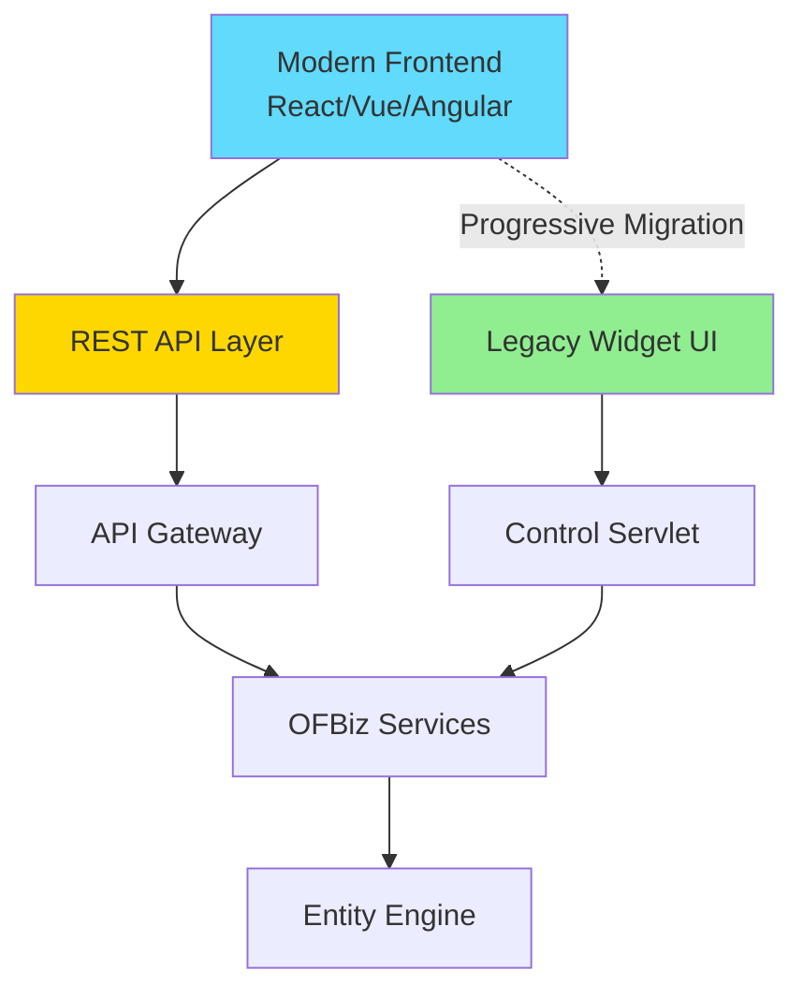
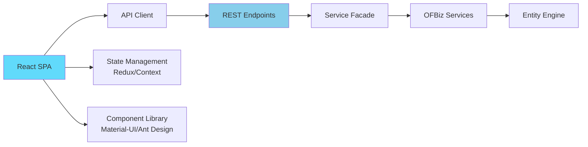

# Widget Framework Replacement Strategies

**Purpose**: Comprehensive guide for replacing or integrating the OFBiz Widget Framework with modern frontend frameworks like React, Vue, or Angular.

**Audience**: Frontend Architects, UI/UX Developers, Full-Stack Developers

**Prerequisites**: 
- [Widget Framework Overview](./overview.md)
- [Widget Rendering Pipeline](./rendering-pipeline.md)

**Related Documents**: 
- [REST API Architecture](../../05-integration-architecture/rest-api-architecture.md)
- [Service Engine Replacement](../service-engine/replacement-strategies.md)

---

## Overview

While the OFBiz Widget Framework provides rapid development capabilities, modern applications often require richer client-side interactivity. This document outlines strategies for replacing or augmenting the Widget Framework with modern JavaScript frameworks while preserving OFBiz business logic and data access capabilities.

## Visual Architecture

### Modern Frontend Integration Pattern



**Diagram Description**: Integration pattern showing modern frontend consuming REST APIs while legacy widget UI remains accessible during migration. Both paths access the same OFBiz services and data.

### REST API + React Architecture



**Diagram Description**: React SPA architecture with API client, state management, and component library consuming OFBiz REST APIs backed by service facade pattern.

## Replacement Strategies

### Strategy 1: REST API + Modern SPA

**Approach**: Build new frontend with React/Vue/Angular consuming OFBiz REST APIs

**Architecture**:
```
┌─────────────────────────────────────┐
│   React/Vue/Angular SPA             │
│   - Component-based UI              │
│   - Client-side routing             │
│   - State management                │
└──────────────┬──────────────────────┘
               │ HTTP/JSON
┌──────────────▼──────────────────────┐
│   REST API Layer                    │
│   - RESTful endpoints               │
│   - JSON serialization              │
│   - Authentication (JWT/OAuth)      │
└──────────────┬──────────────────────┘
               │
┌──────────────▼──────────────────────┐
│   OFBiz Services                    │
│   - Business logic                  │
│   - Data validation                 │
│   - Transaction management          │
└──────────────┬──────────────────────┘
               │
┌──────────────▼──────────────────────┐
│   Entity Engine                     │
│   - Data persistence                │
└─────────────────────────────────────┘
```

**REST API Implementation**:
```java
@RestController
@RequestMapping("/api/products")
public class ProductApiController {
    
    @Autowired
    private LocalDispatcher dispatcher;
    
    @GetMapping("/{productId}")
    public ResponseEntity<ProductDTO> getProduct(@PathVariable String productId) {
        Map<String, Object> context = new HashMap<>();
        context.put("productId", productId);
        
        try {
            Map<String, Object> result = dispatcher.runSync("getProduct", context);
            GenericValue product = (GenericValue) result.get("product");
            
            ProductDTO dto = ProductDTO.fromGenericValue(product);
            return ResponseEntity.ok(dto);
        } catch (GenericServiceException e) {
            return ResponseEntity.status(500).build();
        }
    }
    
    @PostMapping
    public ResponseEntity<ProductDTO> createProduct(@RequestBody ProductDTO productDTO) {
        Map<String, Object> context = productDTO.toServiceContext();
        context.put("userLogin", SecurityContextHolder.getContext().getAuthentication());
        
        try {
            Map<String, Object> result = dispatcher.runSync("createProduct", context);
            if (ServiceUtil.isSuccess(result)) {
                String productId = (String) result.get("productId");
                return ResponseEntity.created(URI.create("/api/products/" + productId))
                    .body(productDTO);
            } else {
                return ResponseEntity.badRequest().build();
            }
        } catch (GenericServiceException e) {
            return ResponseEntity.status(500).build();
        }
    }
}
```

**React Component Example**:
```jsx
import React, { useState, useEffect } from 'react';
import { productApi } from './api/productApi';

function ProductEdit({ productId }) {
    const [product, setProduct] = useState(null);
    const [loading, setLoading] = useState(true);
    
    useEffect(() => {
        productApi.getProduct(productId)
            .then(data => {
                setProduct(data);
                setLoading(false);
            });
    }, [productId]);
    
    const handleSubmit = async (e) => {
        e.preventDefault();
        await productApi.updateProduct(productId, product);
        // Show success message
    };
    
    if (loading) return <div>Loading...</div>;
    
    return (
        <form onSubmit={handleSubmit}>
            <input 
                value={product.productName}
                onChange={e => setProduct({...product, productName: e.target.value})}
            />
            <textarea 
                value={product.description}
                onChange={e => setProduct({...product, description: e.target.value})}
            />
            <button type="submit">Save</button>
        </form>
    );
}
```

### Strategy 2: Hybrid Approach (Progressive Enhancement)

**Approach**: Gradually replace widget screens with modern components

**Benefits**:
- Incremental migration
- Reduced risk
- Coexistence of old and new UI

**Implementation**:
```html
<!-- Widget-based page with React component embedded -->
<screen name="ProductList">
    <section>
        <widgets>
            <decorator-screen name="CommonDecorator">
                <decorator-section name="body">
                    <!-- React component mount point -->
                    <platform-specific>
                        <html>
                            <html-template location="component://product/template/ProductListReact.ftl"/>
                        </html>
                    </platform-specific>
                </decorator-section>
            </decorator-screen>
        </widgets>
    </section>
</screen>
```

**FreeMarker Template**:
```ftl
<div id="product-list-root"></div>

<script src="/static/js/react-product-list.bundle.js"></script>
<script>
    ReactDOM.render(
        React.createElement(ProductList, {
            apiEndpoint: '/api/products',
            userPermissions: '${userPermissions}'
        }),
        document.getElementById('product-list-root')
    );
</script>
```

### Strategy 3: Micro-Frontends

**Approach**: Decompose UI into independent micro-frontends

**Architecture**:
```
┌─────────────────────────────────────┐
│   Shell Application                 │
│   - Routing                         │
│   - Authentication                  │
│   - Layout                          │
└──────────┬──────────────────────────┘
           │
    ┌──────┴──────┬──────────┬────────┐
    │             │          │        │
┌───▼───┐   ┌────▼────┐ ┌───▼───┐ ┌──▼──┐
│Product│   │ Order   │ │Catalog│ │Party│
│  MFE  │   │   MFE   │ │  MFE  │ │ MFE │
└───┬───┘   └────┬────┘ └───┬───┘ └──┬──┘
    │            │          │        │
    └────────────┴──────────┴────────┘
                 │
         ┌───────▼────────┐
         │  OFBiz APIs    │
         └────────────────┘
```

**Module Federation (Webpack 5)**:
```javascript
// Shell app webpack config
module.exports = {
    plugins: [
        new ModuleFederationPlugin({
            name: 'shell',
            remotes: {
                productMfe: 'productMfe@http://localhost:3001/remoteEntry.js',
                orderMfe: 'orderMfe@http://localhost:3002/remoteEntry.js',
            },
            shared: ['react', 'react-dom']
        })
    ]
};

// Product MFE webpack config
module.exports = {
    plugins: [
        new ModuleFederationPlugin({
            name: 'productMfe',
            filename: 'remoteEntry.js',
            exposes: {
                './ProductList': './src/ProductList',
                './ProductEdit': './src/ProductEdit',
            },
            shared: ['react', 'react-dom']
        })
    ]
};
```

## Migration Roadmap

### Phase 1: API Development (Weeks 1-4)

**Tasks**:
1. Design REST API structure
2. Implement service facade layer
3. Create DTOs for data transfer
4. Implement authentication (JWT/OAuth)
5. Document APIs (OpenAPI/Swagger)

**Deliverables**:
- REST API endpoints
- API documentation
- Authentication mechanism

### Phase 2: Pilot Screen Migration (Weeks 5-8)

**Tasks**:
1. Select 2-3 simple screens
2. Build React/Vue components
3. Integrate with APIs
4. Test thoroughly
5. Gather feedback

**Deliverables**:
- Pilot screens in modern framework
- Integration patterns
- Lessons learned

### Phase 3: Incremental Migration (Weeks 9-24)

**Tasks**:
1. Migrate screens by priority
2. Build reusable component library
3. Implement state management
4. Add automated tests
5. Monitor performance

**Deliverables**:
- Migrated screens (batch by batch)
- Component library
- Test suite

### Phase 4: Legacy Widget Retirement (Weeks 25-28)

**Tasks**:
1. Identify remaining widget screens
2. Migrate or retire
3. Remove widget dependencies
4. Update documentation

**Deliverables**:
- Complete migration
- Updated documentation

## Code References

<details>
<summary>View Source Code References</summary>

**REST Controller Example**:
```java
@RestController
@RequestMapping("/api/v1")
public class OFBizRestController {
    
    @Autowired
    private LocalDispatcher dispatcher;
    
    @Autowired
    private Delegator delegator;
    
    @PostMapping("/service/{serviceName}")
    public ResponseEntity<Map<String, Object>> invokeService(
            @PathVariable String serviceName,
            @RequestBody Map<String, Object> context,
            @AuthenticationPrincipal UserDetails userDetails) {
        
        context.put("userLogin", getUserLogin(userDetails));
        
        try {
            Map<String, Object> result = dispatcher.runSync(serviceName, context);
            
            if (ServiceUtil.isSuccess(result)) {
                return ResponseEntity.ok(result);
            } else {
                return ResponseEntity.badRequest().body(result);
            }
        } catch (GenericServiceException e) {
            return ResponseEntity.status(500)
                .body(Map.of("error", e.getMessage()));
        }
    }
}
```

**DTO Pattern**:
```java
public class ProductDTO {
    private String productId;
    private String productName;
    private String description;
    private BigDecimal price;
    
    public static ProductDTO fromGenericValue(GenericValue product) {
        ProductDTO dto = new ProductDTO();
        dto.setProductId(product.getString("productId"));
        dto.setProductName(product.getString("productName"));
        dto.setDescription(product.getString("description"));
        return dto;
    }
    
    public Map<String, Object> toServiceContext() {
        Map<String, Object> context = new HashMap<>();
        context.put("productId", this.productId);
        context.put("productName", this.productName);
        context.put("description", this.description);
        return context;
    }
}
```

</details>

## Architecture Decisions

### Decision: REST API as Integration Layer

**Context**: Need to decouple frontend from OFBiz internals while preserving business logic.

**Decision**: Build REST API layer that exposes OFBiz services as RESTful endpoints.

**Consequences**:
- ✅ **Positive**: Clean separation of concerns
- ✅ **Positive**: Frontend technology independence
- ✅ **Positive**: Mobile app support
- ❌ **Negative**: Additional layer adds latency
- **Mitigation**: API caching, efficient serialization

### Decision: Progressive Migration Strategy

**Context**: Complete rewrite is risky and expensive.

**Decision**: Support hybrid approach with gradual screen-by-screen migration.

**Consequences**:
- ✅ **Positive**: Reduced risk
- ✅ **Positive**: Continuous delivery
- ✅ **Positive**: Learn and adapt
- ❌ **Negative**: Maintain two UI systems temporarily
- **Mitigation**: Clear migration plan, automated testing

## Official References

**React**:
- [React Documentation](https://react.dev/)
- [Create React App](https://create-react-app.dev/)

**Vue**:
- [Vue.js Documentation](https://vuejs.org/)

**Angular**:
- [Angular Documentation](https://angular.io/)

**REST API Design**:
- [REST API Best Practices](https://restfulapi.net/)
- [OpenAPI Specification](https://swagger.io/specification/)

## Related Topics

**Within This Section**:
- [Widget Framework Overview](./overview.md)
- [Widget Rendering Pipeline](./rendering-pipeline.md)
- [Form Processing](./form-processing.md)

**Other Sections**:
- [REST API Architecture](../../05-integration-architecture/rest-api-architecture.md)
- [Service Engine Replacement](../service-engine/replacement-strategies.md)

**Role-Based Guides**:
- [UI/UX Developer Guide](../../role-based-guides/ui-ux-developer-guide.md)
- [Architect Guide](../../role-based-guides/architect-guide.md)

---

**Next**: [Security Framework Overview](../security-framework/overview.md)

**Up**: [Framework Core](../README.md)

**Home**: [Master Index](../../00-INDEX.md)

---

**Document Metadata**:
- **Version**: 1.0
- **Last Updated**: December 2024
- **OFBiz Version**: Trunk (Latest)
- **Status**: Complete
