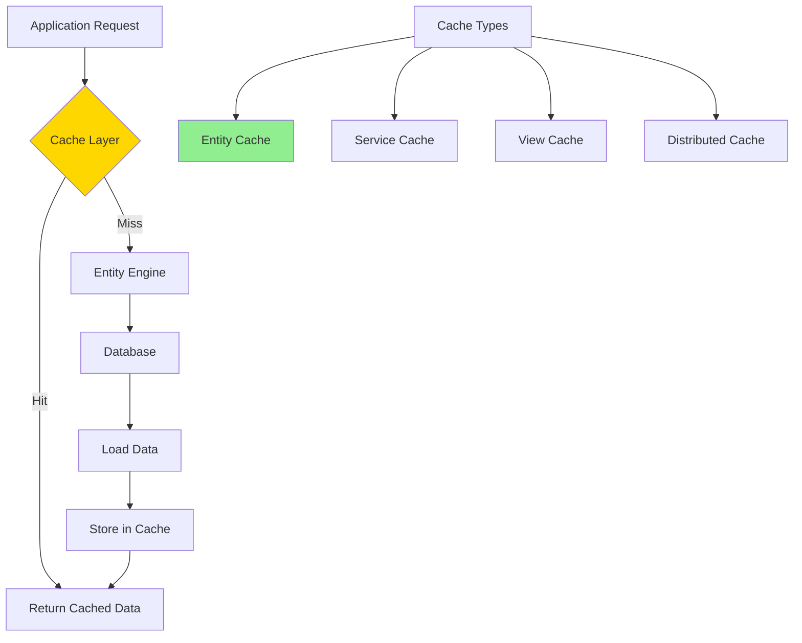

# Caching Strategy

**Purpose**: Documentation of OFBiz's multi-layer caching strategy for entities, services, and views.

**Audience**: Performance Engineers, System Architects, Developers

**Prerequisites**: 
- [Entity Engine Overview](../02-framework-core/entity-engine/overview.md)
- [Service Engine Overview](../02-framework-core/service-engine/overview.md)

**Related Documents**: 
- [Performance Characteristics](../09-quality-attributes/performance-characteristics.md)

---

## Overview

OFBiz implements a comprehensive multi-layer caching strategy to optimize performance, including entity caching, service result caching, view caching, and distributed cache support. Proper cache configuration is critical for production performance.

## Visual Architecture

### Cache Architecture



**Diagram Description**: Cache architecture showing cache hit/miss flow and different cache types (entity, service, view, distributed).

### Cache Layers


**Diagram Description**: Two-tier caching with local in-memory cache (L1) and optional distributed cache (L2) before hitting the database.

## Cache Types

### 1. Entity Cache

**Purpose**: Cache entity data to reduce database queries

**Configuration** (`entityengine.xml`):
```xml
<entity-cache>
    <cache-name>entity-default</cache-name>
    <max-in-memory>1000</max-in-memory>
    <expire-time-idle>0</expire-time-idle>
    <expire-time-live>0</expire-time-live>
    <use-soft-reference>true</use-soft-reference>
</entity-cache>
```

**Cache Modes**:
- `true`: Always cache
- `false`: Never cache
- `null`: Use default

**Example**:
```java
// Cached read
GenericValue product = delegator.findOne("Product", 
    UtilMisc.toMap("productId", "10000"), true); // true = use cache

// Non-cached read
GenericValue product = delegator.findOne("Product", 
    UtilMisc.toMap("productId", "10000"), false); // false = skip cache
```

### 2. Entity List Cache

**Purpose**: Cache query results

**Configuration**:
```xml
<entity-list-cache>
    <cache-name>entity-list</cache-name>
    <max-in-memory>500</max-in-memory>
</entity-list-cache>
```

**Example**:
```java
// Cached query
List<GenericValue> products = EntityQuery.use(delegator)
    .from("Product")
    .where("productTypeId", "FINISHED_GOOD")
    .cache(true)
    .queryList();
```

### 3. Service Result Cache

**Purpose**: Cache service execution results

**Service Definition**:
```xml
<service name="getProductInfo" engine="java" use-transaction="false">
    <attribute name="productId" type="String" mode="IN"/>
    <attribute name="productInfo" type="Map" mode="OUT"/>
    <!-- Enable result caching -->
    <attribute name="cache-results" type="Boolean" default-value="true"/>
</service>
```

### 4. View Cache

**Purpose**: Cache rendered screens and widgets

**Configuration**:
```xml
<cache name="screen-cache" 
       max-entries="1000" 
       expire-time-seconds="3600"/>
```

## Cache Invalidation

### Automatic Invalidation

**Entity Updates**:
```java
// Update invalidates cache automatically
product.set("productName", "New Name");
product.store(); // Cache entry for this product is invalidated
```

### Manual Invalidation

**Clear Specific Entity**:
```java
delegator.clearCacheLine("Product", UtilMisc.toMap("productId", "10000"));
```

**Clear All Entities of Type**:
```java
delegator.clearCacheLine("Product");
```

**Clear All Caches**:
```java
delegator.clearAllCaches();
```

### Distributed Cache Invalidation

**Configuration** (`cache.properties`):
```properties
# Use Redis for distributed cache
cache.distributed.class=org.apache.ofbiz.entity.cache.redis.RedisCacheManager
cache.distributed.redis.host=localhost
cache.distributed.redis.port=6379
```

## Cache Monitoring

### Cache Statistics

```java
// Get cache statistics
Map<String, Object> stats = delegator.getCacheStatistics();
long hitCount = (Long) stats.get("hitCount");
long missCount = (Long) stats.get("missCount");
double hitRate = hitCount / (double)(hitCount + missCount);
```

### JMX Monitoring

**Metrics Available**:
- Cache hit rate
- Cache size
- Eviction count
- Memory usage

## Best Practices

### 1. Cache Frequently Read Data

**Good Candidates**:
- Product catalog
- Party information
- Configuration data
- Status/type entities

**Poor Candidates**:
- Order data (frequently updated)
- Inventory (real-time accuracy needed)
- Financial transactions

### 2. Set Appropriate TTL

```xml
<!-- Short TTL for volatile data -->
<cache name="inventory-cache" expire-time-seconds="60"/>

<!-- Long TTL for stable data -->
<cache name="product-cache" expire-time-seconds="3600"/>

<!-- No expiration for static data -->
<cache name="status-cache" expire-time-seconds="0"/>
```

### 3. Use Soft References

```xml
<!-- Allow GC to reclaim cache memory under pressure -->
<use-soft-reference>true</use-soft-reference>
```

### 4. Monitor Cache Performance

- Track hit/miss ratios
- Monitor memory usage
- Adjust cache sizes based on metrics

## Architecture Decisions

### Decision: Multi-Layer Caching

**Context**: Need to balance performance and data freshness.

**Decision**: Implement entity, service, and view caching with configurable TTL.

**Consequences**:
- ✅ **Positive**: Significant performance improvement
- ✅ **Positive**: Reduced database load
- ❌ **Negative**: Potential stale data
- **Mitigation**: Automatic invalidation on updates, configurable TTL

### Decision: Distributed Cache Support

**Context**: Need cache coherency in clustered deployments.

**Decision**: Support distributed caches (Redis, Memcached) for multi-server deployments.

**Consequences**:
- ✅ **Positive**: Cache sharing across servers
- ✅ **Positive**: Improved hit rates
- ❌ **Negative**: Network latency for cache access
- **Mitigation**: Two-tier caching (local + distributed)

## Official References

- [Entity Engine Caching](https://cwiki.apache.org/confluence/display/OFBIZ/Entity+Engine+Caching)
- [Performance Tuning](https://cwiki.apache.org/confluence/display/OFBIZ/Performance+Tuning)

## Related Topics

- [Entity Engine Overview](../02-framework-core/entity-engine/overview.md)
- [Performance Characteristics](../09-quality-attributes/performance-characteristics.md)
- [Scalability Patterns](./scalability-patterns.md)

---

**Next**: [Multi-Tenancy Architecture](./multi-tenancy-architecture.md)

**Up**: [Data Architecture](./README.md)

**Home**: [Master Index](../00-INDEX.md)

---

**Document Metadata**:
- **Version**: 1.0
- **Last Updated**: December 2024
- **OFBiz Version**: Trunk (Latest)
- **Status**: Complete
