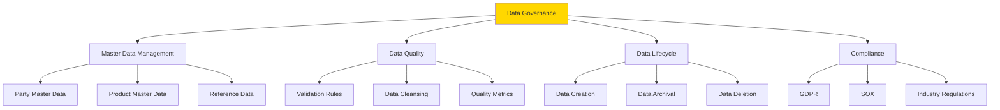

# Data Governance

**Purpose**: Documentation of data governance practices including master data management, data quality, and data lifecycle.

**Audience**: Data Governance Officers, Data Architects, Compliance Officers

**Prerequisites**: 
- [Entity Model Overview](./entity-model-overview.md)

**Related Documents**: 
- [Data Privacy (GDPR)](../10-governance-compliance/data-privacy-gdpr.md)
- [Audit Trail Architecture](../10-governance-compliance/audit-trail-architecture.md)

---

## Overview

Data governance in OFBiz encompasses master data management, data quality assurance, data lifecycle management, and compliance with data regulations. Proper governance ensures data accuracy, consistency, and regulatory compliance.

## Visual Architecture

### Data Governance Framework



**Diagram Description**: Data governance framework covering master data management, data quality, lifecycle management, and regulatory compliance.

## Master Data Management

### Party Master Data

**Golden Record**:
- Single source of truth for party data
- Deduplication rules
- Data stewardship

**Example**:
```java
// Find duplicate parties
List<GenericValue> duplicates = EntityQuery.use(delegator)
    .from("Person")
    .where("firstName", firstName, "lastName", lastName, "birthDate", birthDate)
    .queryList();

if (duplicates.size() > 1) {
    // Merge duplicates into golden record
    mergeDuplicateParties(duplicates);
}
```

### Product Master Data

**Attributes**:
- Product identifiers (SKU, UPC, EAN)
- Product hierarchy
- Product attributes
- Pricing master data

### Reference Data

**Types**:
- Status codes
- Type codes
- Geographic data
- Units of measure

## Data Quality

### Validation Rules

**Entity-Level Validation**:
```xml
<entity entity-name="Party">
    <field name="partyId" type="id" not-null="true"/>
    <field name="statusId" type="id" not-null="true"/>
    <field name="externalId" type="id"/>
</entity>
```

**Service-Level Validation**:
```java
public static Map<String, Object> validatePartyData(DispatchContext dctx, Map<String, ?> context) {
    String partyId = (String) context.get("partyId");
    
    // Validate party exists
    GenericValue party = delegator.findOne("Party", UtilMisc.toMap("partyId", partyId), false);
    if (party == null) {
        return ServiceUtil.returnError("Party not found: " + partyId);
    }
    
    // Validate status
    if (!"PARTY_ENABLED".equals(party.getString("statusId"))) {
        return ServiceUtil.returnError("Party is not enabled");
    }
    
    return ServiceUtil.returnSuccess();
}
```

### Data Quality Metrics

**Metrics to Track**:
- Completeness: % of required fields populated
- Accuracy: % of data matching source
- Consistency: % of data consistent across systems
- Timeliness: Age of data
- Uniqueness: % of duplicate records

### Data Cleansing

**Automated Cleansing**:
```java
public static Map<String, Object> cleansePartyData(DispatchContext dctx, Map<String, ?> context) {
    Delegator delegator = dctx.getDelegator();
    
    // Find parties with data quality issues
    List<GenericValue> parties = EntityQuery.use(delegator)
        .from("Party")
        .queryList();
    
    for (GenericValue party : parties) {
        // Standardize phone numbers
        standardizePhoneNumbers(party);
        
        // Standardize addresses
        standardizeAddresses(party);
        
        // Remove duplicates
        removeDuplicateContactMechs(party);
        
        party.store();
    }
    
    return ServiceUtil.returnSuccess();
}
```

## Data Lifecycle Management

### Data Creation

**Standards**:
- Required fields validation
- Data format standards
- Unique identifier assignment
- Audit trail creation

### Data Maintenance

**Processes**:
- Regular data quality checks
- Periodic data cleansing
- Master data updates
- Reference data updates

### Data Archival

**Policy**:
```java
public static Map<String, Object> archiveOldOrders(DispatchContext dctx, Map<String, ?> context) {
    Delegator delegator = dctx.getDelegator();
    
    // Archive orders older than 7 years
    Timestamp archiveDate = UtilDateTime.addYearsToTimestamp(UtilDateTime.nowTimestamp(), -7);
    
    List<GenericValue> oldOrders = EntityQuery.use(delegator)
        .from("OrderHeader")
        .where(EntityCondition.makeCondition("orderDate", EntityOperator.LESS_THAN, archiveDate))
        .queryList();
    
    for (GenericValue order : oldOrders) {
        // Move to archive database
        archiveOrder(order);
        
        // Delete from operational database
        order.remove();
    }
    
    return ServiceUtil.returnSuccess();
}
```

### Data Deletion

**GDPR Right to Erasure**:
```java
public static Map<String, Object> deletePersonalData(DispatchContext dctx, Map<String, ?> context) {
    String partyId = (String) context.get("partyId");
    
    // Anonymize personal data
    GenericValue person = delegator.findOne("Person", UtilMisc.toMap("partyId", partyId), false);
    person.set("firstName", "DELETED");
    person.set("lastName", "DELETED");
    person.set("birthDate", null);
    person.store();
    
    // Delete contact mechanisms
    delegator.removeByAnd("PartyContactMech", UtilMisc.toMap("partyId", partyId));
    
    return ServiceUtil.returnSuccess();
}
```

## Compliance

### GDPR Compliance

**Requirements**:
- Right to access
- Right to rectification
- Right to erasure
- Right to data portability
- Data breach notification

### SOX Compliance

**Requirements**:
- Financial data accuracy
- Audit trails
- Access controls
- Change management

### Industry-Specific

**Healthcare (HIPAA)**:
- PHI protection
- Access logging
- Encryption

**Financial (PCI-DSS)**:
- Payment card data protection
- Encryption
- Access controls

## Best Practices

### 1. Data Stewardship

- Assign data owners
- Define data standards
- Enforce data quality rules

### 2. Data Documentation

- Document data definitions
- Maintain data dictionary
- Document data lineage

### 3. Data Access Control

- Implement role-based access
- Log data access
- Regular access reviews

### 4. Data Quality Monitoring

- Automated quality checks
- Quality dashboards
- Quality improvement processes

## Architecture Decisions

### Decision: Audit Trail for All Changes

**Context**: Need to track all data changes for compliance and troubleshooting.

**Decision**: Implement automatic audit trail using createdStamp, lastUpdatedStamp fields and optional audit log entities.

**Consequences**:
- ✅ **Positive**: Complete change history
- ✅ **Positive**: Compliance support
- ❌ **Negative**: Storage overhead
- **Mitigation**: Archive old audit data

## Official References

- [Data Governance Best Practices](https://www.dama.org/cpages/body-of-knowledge)
- [GDPR Compliance](https://gdpr.eu/)

## Related Topics

- [Data Privacy (GDPR)](../10-governance-compliance/data-privacy-gdpr.md)
- [Audit Trail Architecture](../10-governance-compliance/audit-trail-architecture.md)
- [Security Architecture](../09-quality-attributes/security-architecture.md)

---

**Next**: [Scalability Patterns](./scalability-patterns.md)

**Up**: [Data Architecture](./README.md)

**Home**: [Master Index](../00-INDEX.md)

---

**Document Metadata**:
- **Version**: 1.0
- **Last Updated**: December 2024
- **OFBiz Version**: Trunk (Latest)
- **Status**: Complete
