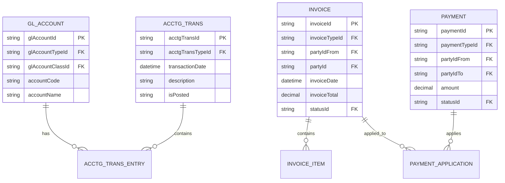
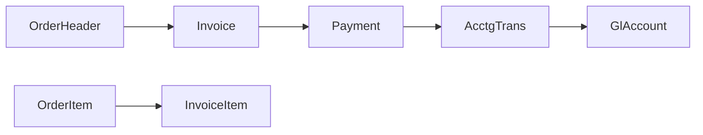

# Accounting Domain Model

**Purpose**: Documentation of the Accounting domain model covering general ledger, accounts payable/receivable, invoicing, and payments.

**Audience**: Data Architects, Accountants, Financial Analysts

**Prerequisites**: 
- [Entity Model Overview](../entity-model-overview.md)
- [Order Domain Model](./order-domain.md)

**Related Documents**: 
- [Party Domain Model](./party-domain.md)

---

## Overview

The Accounting domain is an **optional module** that can be replaced with external accounting systems like QuickBooks or SAP. It manages financial transactions, general ledger, invoicing, payments, and financial reporting.

## Visual Architecture

### Accounting Domain ERD

**Diagram Description**: Accounting domain ERD showing GL accounts, transactions, invoices, and payments with their relationships.

## Core Entities

### GlAccount

**Purpose**: Chart of accounts

**Key Fields**:
- `glAccountId`: Account identifier
- `glAccountTypeId`: ASSET, LIABILITY, REVENUE, EXPENSE
- `accountCode`: Account number
- `accountName`: Account description

### AcctgTrans

**Purpose**: Financial transactions

**Key Fields**:
- `acctgTransId`: Transaction ID
- `transactionDate`: Transaction date
- `isPosted`: Posted to GL flag

### Invoice

**Purpose**: Customer and supplier invoices

**Key Fields**:
- `invoiceId`: Invoice ID
- `invoiceTypeId`: SALES_INVOICE, PURCHASE_INVOICE
- `partyIdFrom`: Billing party
- `partyId`: Billed party
- `invoiceTotal`: Total amount
- `statusId`: INVOICE_IN_PROCESS, INVOICE_READY, INVOICE_PAID

### Payment

**Purpose**: Payments and receipts

**Key Fields**:
- `paymentId`: Payment ID
- `paymentTypeId`: CUSTOMER_PAYMENT, VENDOR_PAYMENT
- `amount`: Payment amount
- `statusId`: PMNT_NOT_PAID, PMNT_SENT, PMNT_RECEIVED

## Integration with Order Domain

## Replacement Strategy

**Can Replace With**:
- QuickBooks
- SAP
- NetSuite
- Xero

**Integration Pattern**:
- Sync invoices to external system
- Sync payments from external system
- Maintain order-to-invoice mapping in OFBiz

## Official References

- [Accounting Data Model](https://cwiki.apache.org/confluence/display/OFBIZ/Accounting+Data+Model)
- [GitHub Source](https://github.com/apache/ofbiz-framework/tree/trunk/applications/accounting/entitydef)

## Related Topics

- [Order Domain Model](./order-domain.md)
- [Accounting Module](../../04-application-modules/optional-modules/accounting-module.md)
- [QuickBooks Integration](../../04-application-modules/external-integration-examples/quickbooks-integration.md)

---

**Next**: [Caching Strategy](../caching-strategy.md)

**Up**: [Data Architecture](../README.md)

**Home**: [Master Index](../../00-INDEX.md)

---

**Document Metadata**:
- **Version**: 1.0
- **Last Updated**: December 2024
- **OFBiz Version**: Trunk (Latest)
- **Status**: Complete
