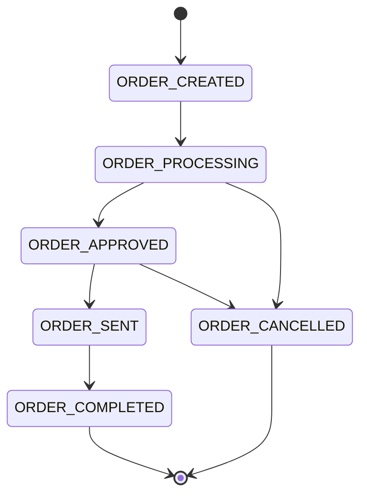

# Order Domain Model

**Purpose**: Documentation of the Order domain model covering sales orders, purchase orders, and order processing.

**Audience**: Data Architects, Business Analysts, Developers

**Prerequisites**: 
- [Entity Model Overview](../entity-model-overview.md)
- [Party Domain Model](./party-domain.md)
- [Product Domain Model](./product-domain.md)

**Related Documents**: 
- [Accounting Domain Model](./accounting-domain.md)

---

## Overview

The Order domain is a **core domain that cannot be disabled**, managing sales orders, purchase orders, returns, and order processing workflows. It integrates Party and Product domains to create complete business transactions.

## Visual Architecture

### Order Domain ERD

```mermaid
erDiagram
    ORDER_HEADER ||--o{ ORDER_ITEM : contains
    ORDER_HEADER ||--o{ ORDER_ROLE : has
    ORDER_HEADER ||--o{ ORDER_STATUS : tracks
    ORDER_HEADER ||--o{ ORDER_ADJUSTMENT : has
    
    ORDER_HEADER {
        string orderId PK
        string orderTypeId FK
        string orderName
        datetime orderDate
        string statusId FK
        string currencyUom FK
        decimal grandTotal
    }
    
    ORDER_ITEM {
        string orderId PK_FK
        string orderItemSeqId PK
        string orderItemTypeId FK
        string productId FK
        decimal quantity
        decimal unitPrice
        decimal unitListPrice
    }
    
    ORDER_ROLE {
        string orderId PK_FK
        string partyId PK_FK
        string roleTypeId PK_FK
    }
    
    ORDER_ITEM }o--|| PRODUCT : references
    ORDER_ROLE }o--|| PARTY : references
```

**Diagram Description**: Order domain ERD showing order header, items, roles, and relationships to Party and Product domains.

## Core Entities

### OrderHeader

**Key Fields**:
- `orderId`: Unique identifier
- `orderTypeId`: SALES_ORDER, PURCHASE_ORDER, RETURN_ORDER
- `orderDate`: Order creation date
- `statusId`: ORDER_CREATED, ORDER_APPROVED, ORDER_COMPLETED
- `currencyUom`: Currency
- `grandTotal`: Total amount

### OrderItem

**Key Fields**:
- `orderId`: Order reference
- `orderItemSeqId`: Item sequence
- `productId`: Product reference
- `quantity`: Ordered quantity
- `unitPrice`: Item price
- `statusId`: Item status

### OrderRole

**Purpose**: Link parties to orders in specific roles

**Common Roles**:
- `BILL_TO_CUSTOMER`: Billing party
- `SHIP_TO_CUSTOMER`: Shipping party
- `PLACING_CUSTOMER`: Ordering party
- `SUPPLIER`: Supplier (purchase orders)

## Order Lifecycle



## Common Queries

```java
// Find order by ID
GenericValue order = delegator.findOne("OrderHeader",
    UtilMisc.toMap("orderId", "10000"), false);

// Find order items
List<GenericValue> items = delegator.findByAnd("OrderItem",
    UtilMisc.toMap("orderId", "10000"), 
    UtilMisc.toList("orderItemSeqId"), false);

// Find customer orders
List<GenericValue> orders = EntityQuery.use(delegator)
    .from("OrderHeaderAndRoles")
    .where("partyId", "10000", "roleTypeId", "PLACING_CUSTOMER")
    .queryList();
```

## Official References

- [Order Data Model](https://cwiki.apache.org/confluence/display/OFBIZ/Order+Data+Model)
- [GitHub Source](https://github.com/apache/ofbiz-framework/tree/trunk/applications/order/entitydef)

## Related Topics

- [Party Domain Model](./party-domain.md)
- [Product Domain Model](./product-domain.md)
- [Order Module](../../04-application-modules/core-modules/order-module.md)

---

**Next**: [Accounting Domain Model](./accounting-domain.md)

**Up**: [Data Architecture](../README.md)

**Home**: [Master Index](../../00-INDEX.md)

---

**Document Metadata**:
- **Version**: 1.0
- **Last Updated**: December 2024
- **OFBiz Version**: Trunk (Latest)
- **Status**: Complete
