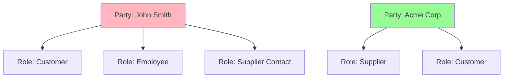
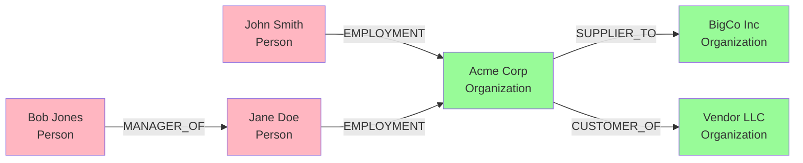

# Party Domain Model

**Purpose**: Detailed documentation of the Party domain model, covering people, organizations, roles, relationships, and contact mechanisms.

**Audience**: Data Architects, Business Analysts, Developers

**Prerequisites**: 
- [Entity Model Overview](../entity-model-overview.md)
- [Entity Engine Overview](../../02-framework-core/entity-engine/overview.md)

**Related Documents**: 
- [Order Domain Model](./order-domain.md)
- [Accounting Domain Model](./accounting-domain.md)

---

## Overview

The Party domain is the foundation of OFBiz's data model, representing people, organizations, and their relationships. It's a **core domain that cannot be disabled** as every business transaction involves parties (customers, suppliers, employees, etc.). The model uses a flexible pattern that can represent any type of party and their complex relationships.

## Visual Architecture

### Party Domain ERD

```mermaid
erDiagram
    PARTY ||--o| PERSON : "is a"
    PARTY ||--o| PARTY_GROUP : "is a"
    PARTY ||--o{ PARTY_ROLE : has
    PARTY ||--o{ PARTY_RELATIONSHIP : "from"
    PARTY ||--o{ PARTY_RELATIONSHIP : "to"
    PARTY ||--o{ CONTACT_MECH : has
    PARTY ||--o{ PARTY_CLASSIFICATION : has
    
    PARTY {
        string partyId PK
        string partyTypeId FK
        string externalId
        string description
        string statusId FK
    }
    
    PERSON {
        string partyId PK_FK
        string firstName
        string middleName
        string lastName
        date birthDate
        string gender
    }
    
    PARTY_GROUP {
        string partyId PK_FK
        string groupName
        string groupNameLocal
        string officeSiteName
        string logoImageUrl
    }
    
    PARTY_ROLE {
        string partyId PK_FK
        string roleTypeId PK_FK
        datetime fromDate
        datetime thruDate
    }
    
    PARTY_RELATIONSHIP {
        string partyIdFrom PK_FK
        string partyIdTo PK_FK
        string roleTypeIdFrom PK_FK
        string roleTypeIdTo PK_FK
        datetime fromDate PK
        datetime thruDate
        string relationshipName
    }
    
    CONTACT_MECH ||--o| POSTAL_ADDRESS : "is a"
    CONTACT_MECH ||--o| TELECOM_NUMBER : "is a"
    CONTACT_MECH ||--o| EMAIL_ADDRESS : "is a"
    
    PARTY_CONTACT_MECH }o--|| PARTY : belongs_to
    PARTY_CONTACT_MECH }o--|| CONTACT_MECH : uses
    
    PARTY_CONTACT_MECH {
        string partyId PK_FK
        string contactMechId PK_FK
        datetime fromDate PK
        datetime thruDate
        string contactMechPurposeTypeId FK
    }
```

**Diagram Description**: Complete Party domain ERD showing the party hierarchy (Party→Person/PartyGroup), roles, relationships, and contact mechanisms. Note the temporal aspects (fromDate/thruDate) for tracking changes over time.

### Party Role Pattern



**Diagram Description**: Party role pattern showing how a single party can have multiple roles in different contexts. John Smith is simultaneously a customer, employee, and supplier contact.

### Party Relationship Examples



**Diagram Description**: Party relationship examples showing employment, management, supplier, and customer relationships between people and organizations.

## Core Entities

### Party (Abstract Base)

**Purpose**: Base entity for all parties (people and organizations)

**Key Fields**:
- `partyId`: Unique identifier
- `partyTypeId`: PERSON, PARTY_GROUP, AUTOMATED_AGENT
- `statusId`: PARTY_ENABLED, PARTY_DISABLED
- `externalId`: External system reference

**Usage**: Never used directly; always use Person or PartyGroup

### Person

**Purpose**: Represents an individual person

**Key Fields**:
```xml
<field name="partyId" type="id"/>
<field name="salutation" type="name"/>
<field name="firstName" type="name"/>
<field name="middleName" type="name"/>
<field name="lastName" type="name"/>
<field name="personalTitle" type="name"/>
<field name="suffix" type="name"/>
<field name="nickname" type="name"/>
<field name="birthDate" type="date"/>
<field name="gender" type="indicator"/>
<field name="maritalStatus" type="indicator"/>
```

**Example**:
```java
GenericValue person = delegator.makeValue("Person");
person.set("partyId", delegator.getNextSeqId("Party"));
person.set("firstName", "John");
person.set("lastName", "Smith");
person.set("birthDate", UtilDateTime.toDate("1980-01-15"));
person.create();
```

### PartyGroup

**Purpose**: Represents an organization or group

**Key Fields**:
```xml
<field name="partyId" type="id"/>
<field name="groupName" type="name"/>
<field name="groupNameLocal" type="name"/>
<field name="officeSiteName" type="name"/>
<field name="annualRevenue" type="currency-amount"/>
<field name="numEmployees" type="numeric"/>
<field name="tickerSymbol" type="short-varchar"/>
<field name="logoImageUrl" type="url"/>
```

**Example**:
```java
GenericValue partyGroup = delegator.makeValue("PartyGroup");
partyGroup.set("partyId", delegator.getNextSeqId("Party"));
partyGroup.set("groupName", "Acme Corporation");
partyGroup.set("numEmployees", 500L);
partyGroup.create();
```

### PartyRole

**Purpose**: Assigns roles to parties in specific contexts

**Key Fields**:
```xml
<field name="partyId" type="id"/>
<field name="roleTypeId" type="id"/>
```

**Common Role Types**:
- `CUSTOMER`: Party as customer
- `SUPPLIER`: Party as supplier
- `EMPLOYEE`: Party as employee
- `CONTACT`: Party as contact person
- `BILL_TO_CUSTOMER`: Billing party
- `SHIP_TO_CUSTOMER`: Shipping party
- `SALES_REP`: Sales representative

**Example**:
```java
GenericValue partyRole = delegator.makeValue("PartyRole");
partyRole.set("partyId", "10000");
partyRole.set("roleTypeId", "CUSTOMER");
partyRole.create();
```

### PartyRelationship

**Purpose**: Defines relationships between parties

**Key Fields**:
```xml
<field name="partyIdFrom" type="id"/>
<field name="partyIdTo" type="id"/>
<field name="roleTypeIdFrom" type="id"/>
<field name="roleTypeIdTo" type="id"/>
<field name="fromDate" type="date-time"/>
<field name="thruDate" type="date-time"/>
<field name="partyRelationshipTypeId" type="id"/>
<field name="relationshipName" type="name"/>
```

**Common Relationship Types**:
- `EMPLOYMENT`: Employee-Employer
- `MANAGER`: Manager-Employee
- `CONTACT_REL`: Contact-Organization
- `SUPPLIER_REL`: Supplier-Customer
- `PARTNER`: Business partners

**Example**:
```java
GenericValue relationship = delegator.makeValue("PartyRelationship");
relationship.set("partyIdFrom", "10000"); // Employee
relationship.set("partyIdTo", "Company1"); // Employer
relationship.set("roleTypeIdFrom", "EMPLOYEE");
relationship.set("roleTypeIdTo", "INTERNAL_ORGANIZATIO");
relationship.set("partyRelationshipTypeId", "EMPLOYMENT");
relationship.set("fromDate", UtilDateTime.nowTimestamp());
relationship.create();
```

## Contact Mechanisms

### ContactMech (Abstract)

**Purpose**: Base for all contact mechanisms

**Types**:
- `POSTAL_ADDRESS`: Physical address
- `TELECOM_NUMBER`: Phone/fax
- `EMAIL_ADDRESS`: Email
- `WEB_ADDRESS`: Website URL
- `IP_ADDRESS`: IP address
- `FTP_ADDRESS`: FTP location

### PostalAddress

**Purpose**: Physical mailing address

**Key Fields**:
```xml
<field name="contactMechId" type="id"/>
<field name="toName" type="name"/>
<field name="attnName" type="name"/>
<field name="address1" type="long-varchar"/>
<field name="address2" type="long-varchar"/>
<field name="city" type="name"/>
<field name="stateProvinceGeoId" type="id"/>
<field name="postalCode" type="short-varchar"/>
<field name="countryGeoId" type="id"/>
```

**Example**:
```java
// Create contact mech
GenericValue contactMech = delegator.makeValue("ContactMech");
contactMech.set("contactMechId", delegator.getNextSeqId("ContactMech"));
contactMech.set("contactMechTypeId", "POSTAL_ADDRESS");
contactMech.create();

// Create postal address
GenericValue postalAddress = delegator.makeValue("PostalAddress");
postalAddress.set("contactMechId", contactMech.get("contactMechId"));
postalAddress.set("address1", "123 Main St");
postalAddress.set("city", "Springfield");
postalAddress.set("stateProvinceGeoId", "USA_IL");
postalAddress.set("postalCode", "62701");
postalAddress.set("countryGeoId", "USA");
postalAddress.create();

// Link to party
GenericValue partyContactMech = delegator.makeValue("PartyContactMech");
partyContactMech.set("partyId", "10000");
partyContactMech.set("contactMechId", contactMech.get("contactMechId"));
partyContactMech.set("fromDate", UtilDateTime.nowTimestamp());
partyContactMech.set("contactMechPurposeTypeId", "SHIPPING_LOCATION");
partyContactMech.create();
```

### TelecomNumber

**Purpose**: Phone and fax numbers

**Key Fields**:
```xml
<field name="contactMechId" type="id"/>
<field name="countryCode" type="short-varchar"/>
<field name="areaCode" type="short-varchar"/>
<field name="contactNumber" type="short-varchar"/>
```

### EmailAddress

**Purpose**: Email addresses

**Key Fields**:
```xml
<field name="contactMechId" type="id"/>
<field name="infoString" type="long-varchar"/>
```

## Common Queries

### Find Person by Name

```java
List<GenericValue> persons = delegator.findByAnd("Person",
    UtilMisc.toMap("firstName", "John", "lastName", "Smith"),
    null, false);
```

### Find Party Roles

```java
List<GenericValue> roles = delegator.findByAnd("PartyRole",
    UtilMisc.toMap("partyId", "10000"),
    null, false);
```

### Find Current Contact Mechanisms

```java
List<GenericValue> contactMechs = EntityQuery.use(delegator)
    .from("PartyContactMech")
    .where("partyId", "10000")
    .filterByDate()
    .queryList();
```

### Find Party Relationships

```java
List<GenericValue> relationships = delegator.findByAnd("PartyRelationship",
    UtilMisc.toMap("partyIdFrom", "10000", "partyRelationshipTypeId", "EMPLOYMENT"),
    null, false);
```

## Architecture Decisions

### Decision: Abstract Party Pattern

**Context**: Need to represent both people and organizations with shared attributes.

**Decision**: Use Party as abstract base with Person and PartyGroup specializations.

**Consequences**:
- ✅ **Positive**: Unified party handling
- ✅ **Positive**: Polymorphic queries
- ❌ **Negative**: Join required for specific attributes
- **Mitigation**: Views for common queries

### Decision: Flexible Role System

**Context**: Parties play different roles in different contexts.

**Decision**: Use PartyRole entity to assign context-specific roles.

**Consequences**:
- ✅ **Positive**: Same party can have multiple roles
- ✅ **Positive**: Easy to add new roles
- ❌ **Negative**: Must check roles for authorization
- **Mitigation**: Helper services for role checking

## Official References

**Apache OFBiz Documentation**:
- [Party Data Model](https://cwiki.apache.org/confluence/display/OFBIZ/Party+Data+Model)
- [GitHub Source - Party Entities](https://github.com/apache/ofbiz-framework/tree/trunk/applications/party/entitydef)

## Related Topics

**Within This Section**:
- [Entity Model Overview](../entity-model-overview.md)
- [Product Domain Model](./product-domain.md)
- [Order Domain Model](./order-domain.md)

**Other Sections**:
- [Party Module](../../04-application-modules/core-modules/party-module.md)
- [Security Framework](../../02-framework-core/security-framework/overview.md)

**Role-Based Guides**:
- [Developer Guide](../../role-based-guides/developer-guide.md)

---

**Next**: [Product Domain Model](./product-domain.md)

**Up**: [Data Architecture](../README.md)

**Home**: [Master Index](../../00-INDEX.md)

---

**Document Metadata**:
- **Version**: 1.0
- **Last Updated**: December 2024
- **OFBiz Version**: Trunk (Latest)
- **Status**: Complete
