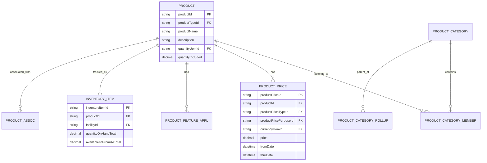

# Product Domain Model

**Purpose**: Documentation of the Product domain model covering products, categories, features, pricing, and inventory.

**Audience**: Data Architects, Product Managers, Developers

**Prerequisites**: 
- [Entity Model Overview](../entity-model-overview.md)

**Related Documents**: 
- [Order Domain Model](./order-domain.md)
- [Party Domain Model](./party-domain.md)

---

## Overview

The Product domain is a **core domain that cannot be disabled**, managing products, categories, features, pricing, and inventory. It supports physical products, digital products, services, and configurable products with complex feature variations.

## Visual Architecture

### Product Domain ERD



**Diagram Description**: Product domain ERD showing products, categories, pricing, features, and inventory relationships.

## Core Entities

### Product

**Key Fields**:
- `productId`: Unique identifier
- `productTypeId`: FINISHED_GOOD, RAW_MATERIAL, SERVICE, DIGITAL_GOOD
- `productName`: Display name
- `description`: Full description
- `quantityUomId`: Unit of measure (EA, LB, KG, etc.)

**Product Types**:
- `FINISHED_GOOD`: Sellable product
- `RAW_MATERIAL`: Manufacturing input
- `SERVICE`: Service product
- `DIGITAL_GOOD`: Downloadable product
- `ASSET_USAGE`: Rental/usage product

### ProductCategory

**Purpose**: Organize products hierarchically

**Key Fields**:
- `productCategoryId`: Unique identifier
- `productCategoryTypeId`: CATALOG_CATEGORY, SEARCH_CATEGORY, etc.
- `categoryName`: Display name
- `description`: Category description

### ProductPrice

**Purpose**: Product pricing with temporal support

**Key Fields**:
- `productId`: Product reference
- `productPriceTypeId`: DEFAULT_PRICE, LIST_PRICE, WHOLESALE_PRICE
- `productPricePurposeId`: PURCHASE, COMPONENT_PRICE
- `price`: Price amount
- `currencyUomId`: Currency
- `fromDate/thruDate`: Validity period

### InventoryItem

**Purpose**: Track product inventory

**Key Fields**:
- `inventoryItemId`: Unique identifier
- `productId`: Product reference
- `facilityId`: Warehouse location
- `quantityOnHandTotal`: Physical quantity
- `availableToPromiseTotal`: Available for sale

## Common Queries

```java
// Find product by ID
GenericValue product = delegator.findOne("Product", 
    UtilMisc.toMap("productId", "10000"), false);

// Find current price
List<GenericValue> prices = EntityQuery.use(delegator)
    .from("ProductPrice")
    .where("productId", "10000", "productPriceTypeId", "DEFAULT_PRICE")
    .filterByDate()
    .queryList();

// Find inventory
List<GenericValue> inventory = delegator.findByAnd("InventoryItem",
    UtilMisc.toMap("productId", "10000"), null, false);
```

## Official References

- [Product Data Model](https://cwiki.apache.org/confluence/display/OFBIZ/Product+Data+Model)
- [GitHub Source](https://github.com/apache/ofbiz-framework/tree/trunk/applications/product/entitydef)

## Related Topics

- [Order Domain Model](./order-domain.md)
- [Product Module](../../04-application-modules/core-modules/product-module.md)

---

**Next**: [Order Domain Model](./order-domain.md)

**Up**: [Data Architecture](../README.md)

**Home**: [Master Index](../../00-INDEX.md)

---

**Document Metadata**:
- **Version**: 1.0
- **Last Updated**: December 2024
- **OFBiz Version**: Trunk (Latest)
- **Status**: Complete
