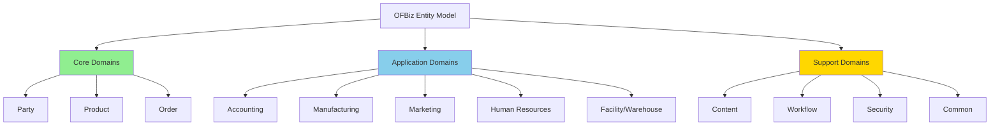
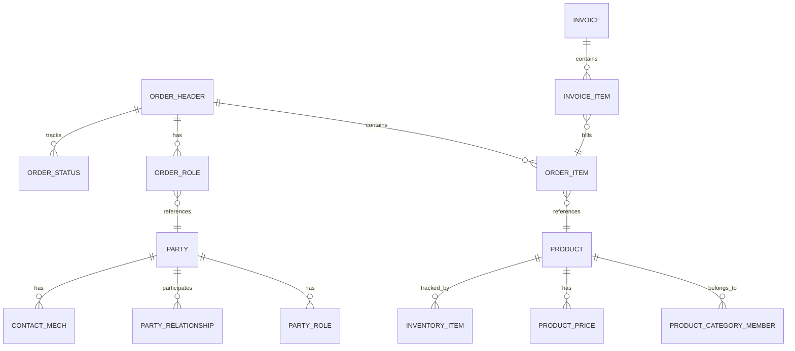
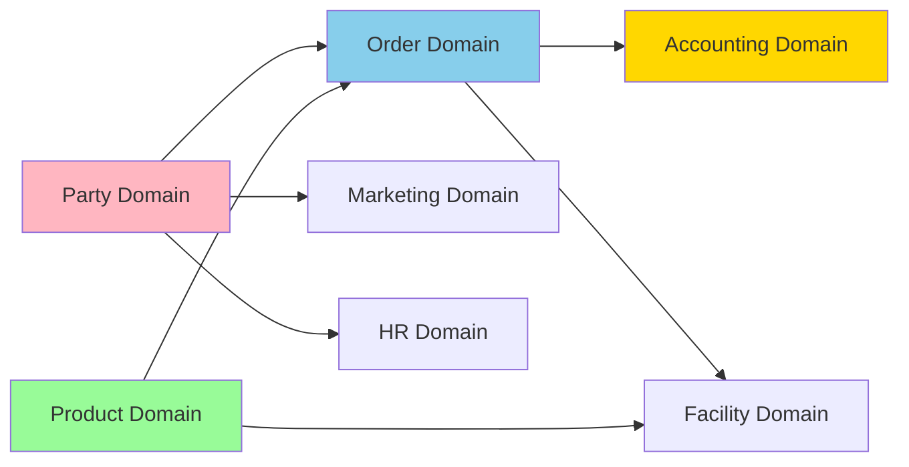

# Entity Model Overview

**Purpose**: High-level overview of the OFBiz entity model, covering the complete data model organization, entity relationships, and domain structure.

**Audience**: Data Architects, Database Administrators, Senior Developers

**Prerequisites**: 
- [Entity Engine Overview](../02-framework-core/entity-engine/overview.md)
- [System Overview](../01-system-overview/system-context.md)

**Related Documents**: 
- [Party Domain Model](./domain-models/party-domain.md)
- [Product Domain Model](./domain-models/product-domain.md)
- [Order Domain Model](./domain-models/order-domain.md)

---

## Overview

The OFBiz entity model is a comprehensive data model covering all aspects of enterprise resource planning, from party management and product catalogs to orders, accounting, manufacturing, and human resources. The model is organized into logical domains with well-defined relationships, supporting complex business processes while maintaining data integrity and flexibility.

## Visual Architecture

### High-Level Entity Model Organization



**Diagram Description**: OFBiz entity model organization showing core domains (Party, Product, Order) that cannot be disabled, application domains (optional modules), and support domains (cross-cutting concerns).

### Entity Relationship Patterns



**Diagram Description**: Common entity relationship patterns showing one-to-many and many-to-many relationships across core domains. Note the cross-domain references (Order→Product, Order→Party).

### Domain Interconnections



**Diagram Description**: Domain interconnections showing how core domains (Party, Product) feed into Order domain, which then connects to Accounting and Facility domains. This illustrates the data flow through business processes.

## Entity Organization

### Core Domains (Cannot Be Disabled)

**1. Party Domain**
- **Purpose**: Manage people, organizations, and their relationships
- **Key Entities**: Party, Person, PartyGroup, PartyRole, PartyRelationship, ContactMech
- **Entity Count**: ~80 entities
- **Why Core**: Every business transaction involves parties (customers, suppliers, employees)

**2. Product Domain**
- **Purpose**: Manage products, categories, features, and inventory
- **Key Entities**: Product, ProductCategory, ProductFeature, ProductPrice, InventoryItem
- **Entity Count**: ~120 entities
- **Why Core**: Products are central to commerce and manufacturing

**3. Order Domain**
- **Purpose**: Manage sales orders, purchase orders, and order processing
- **Key Entities**: OrderHeader, OrderItem, OrderRole, OrderStatus, OrderAdjustment
- **Entity Count**: ~60 entities
- **Why Core**: Orders drive business processes and revenue

### Application Domains (Optional Modules)

**4. Accounting Domain**
- **Purpose**: Financial management, GL, AP, AR, invoicing
- **Key Entities**: GlAccount, AcctgTrans, Invoice, Payment, FinAccount
- **Entity Count**: ~100 entities
- **Can Replace**: Yes, with QuickBooks, SAP, etc.

**5. Manufacturing Domain**
- **Purpose**: Production planning, BOM, routing, work orders
- **Key Entities**: WorkEffort, BillOfMaterials, RoutingTask, ProductionRun
- **Entity Count**: ~40 entities
- **Can Disable**: Yes, if not manufacturing

**6. Marketing Domain**
- **Purpose**: Campaigns, tracking, segmentation, contact lists
- **Key Entities**: MarketingCampaign, TrackingCode, ContactList, SegmentGroup
- **Entity Count**: ~30 entities
- **Can Disable**: Yes, or replace with Salesforce

**7. Human Resources Domain**
- **Purpose**: Employee management, payroll, benefits, training
- **Key Entities**: Employment, PayrollPreference, EmplPosition, TrainingClass
- **Entity Count**: ~50 entities
- **Can Disable**: Yes, or replace with external HR system

**8. Facility/Warehouse Domain**
- **Purpose**: Warehouse management, inventory locations, shipments
- **Key Entities**: Facility, FacilityLocation, Shipment, PickList
- **Entity Count**: ~60 entities
- **Can Replace**: Yes, with WMS systems

### Support Domains (Cross-Cutting)

**9. Content Domain**
- **Purpose**: Content management, documents, images
- **Key Entities**: Content, DataResource, ContentAssoc
- **Entity Count**: ~40 entities

**10. Workflow Domain**
- **Purpose**: Workflow definitions and execution
- **Key Entities**: WorkEffort, WorkEffortAssoc, WorkEffortPartyAssignment
- **Entity Count**: ~30 entities

**11. Security Domain**
- **Purpose**: Users, permissions, security groups
- **Key Entities**: UserLogin, SecurityGroup, SecurityPermission
- **Entity Count**: ~20 entities

**12. Common Domain**
- **Purpose**: Shared entities (status, type, enumeration)
- **Key Entities**: StatusItem, Enumeration, Uom, Geo
- **Entity Count**: ~30 entities

## Entity Naming Conventions

### Standard Patterns

**Entity Names**:
- PascalCase: `OrderHeader`, `ProductCategory`, `PartyRole`
- Descriptive: Entity name describes what it represents
- No abbreviations unless standard: `Uom` (Unit of Measure), `Gl` (General Ledger)

**Field Names**:
- camelCase: `orderId`, `productName`, `statusId`
- Primary keys: `{entityName}Id` (e.g., `orderId`, `partyId`)
- Foreign keys: `{referencedEntity}Id` (e.g., `productId`, `partyId`)
- Dates: `{purpose}Date` (e.g., `orderDate`, `shipDate`)
- Timestamps: `{purpose}Stamp` (e.g., `createdStamp`, `lastUpdatedStamp`)

**Relationship Entities** (Many-to-Many):
- Pattern: `{Entity1}{Entity2}` (e.g., `PartyRole`, `ProductCategoryMember`)
- Or: `{Entity1}Assoc` (e.g., `ProductAssoc`, `ContentAssoc`)

### Common Field Patterns

**Audit Fields** (on most entities):
```xml
<field name="createdDate" type="date-time"/>
<field name="createdByUserLogin" type="id-vlong"/>
<field name="lastModifiedDate" type="date-time"/>
<field name="lastModifiedByUserLogin" type="id-vlong"/>
<field name="lastUpdatedStamp" type="date-time"/>
<field name="lastUpdatedTxStamp" type="date-time"/>
<field name="createdStamp" type="date-time"/>
<field name="createdTxStamp" type="date-time"/>
```

**Status Tracking**:
```xml
<field name="statusId" type="id"/>
<relation type="one" rel-entity-name="StatusItem"/>
```

**Type Classification**:
```xml
<field name="orderTypeId" type="id"/>
<relation type="one" rel-entity-name="OrderType"/>
```

## Entity Statistics

### Entity Count by Domain

| Domain | Entity Count | Complexity | Interdependencies |
|--------|--------------|------------|-------------------|
| Party | ~80 | High | Core - referenced by all |
| Product | ~120 | High | Core - referenced by Order, Accounting |
| Order | ~60 | Very High | Core - references Party, Product |
| Accounting | ~100 | Very High | References Order, Party |
| Manufacturing | ~40 | High | References Product, Order |
| Marketing | ~30 | Medium | References Party |
| HR | ~50 | Medium | References Party |
| Facility | ~60 | High | References Product, Order |
| Content | ~40 | Medium | Referenced by many |
| Workflow | ~30 | Medium | References Party |
| Security | ~20 | Low | Standalone |
| Common | ~30 | Low | Referenced by all |
| **Total** | **~660** | - | - |

### Relationship Statistics

- **One-to-Many Relationships**: ~1,500
- **Many-to-Many Relationships**: ~200
- **Self-Referencing Relationships**: ~50
- **Cross-Domain References**: ~300

## Data Model Principles

### 1. Flexibility Through Generalization

**Party Pattern** (Person or Organization):
```
Party (abstract)
├── Person (individual)
└── PartyGroup (organization)
```

**Product Pattern** (Physical or Service):
```
Product (abstract)
├── Physical Product
├── Digital Product
├── Service Product
└── Configurable Product
```

### 2. Extensibility Through Type Entities

**Type Entities**:
- `OrderType`: SALES_ORDER, PURCHASE_ORDER, RETURN_ORDER
- `ProductType`: FINISHED_GOOD, RAW_MATERIAL, SERVICE
- `PartyType`: PERSON, PARTY_GROUP, AUTOMATED_AGENT

**Benefits**:
- Add new types without schema changes
- Business users can configure types
- Supports industry-specific variations

### 3. Temporal Data Support

**Effective Dating**:
```xml
<field name="fromDate" type="date-time"/>
<field name="thruDate" type="date-time"/>
```

**Use Cases**:
- Price changes over time
- Party relationships with validity periods
- Employment history
- Product category membership

### 4. Multi-Currency Support

**Currency Fields**:
```xml
<field name="amount" type="currency-amount"/>
<field name="currencyUomId" type="id"/>
<relation type="one" rel-entity-name="Uom" title="Currency"/>
```

### 5. Multi-UOM Support

**Unit of Measure**:
```xml
<field name="quantity" type="fixed-point"/>
<field name="quantityUomId" type="id"/>
<relation type="one" rel-entity-name="Uom" title="Quantity"/>
```

## Code References

<details>
<summary>View Entity Definition Examples</summary>

**Party Entity**:
`applications/party/entitydef/entitymodel.xml`

```xml
<entity entity-name="Party" package-name="org.apache.ofbiz.party.party">
    <field name="partyId" type="id"/>
    <field name="partyTypeId" type="id"/>
    <field name="externalId" type="id"/>
    <field name="description" type="description"/>
    <field name="statusId" type="id"/>
    <prim-key field="partyId"/>
    <relation type="one" rel-entity-name="PartyType"/>
    <relation type="one" rel-entity-name="StatusItem"/>
</entity>

<entity entity-name="Person" package-name="org.apache.ofbiz.party.person">
    <field name="partyId" type="id"/>
    <field name="firstName" type="name"/>
    <field name="middleName" type="name"/>
    <field name="lastName" type="name"/>
    <field name="birthDate" type="date"/>
    <prim-key field="partyId"/>
    <relation type="one" rel-entity-name="Party"/>
</entity>
```

**Product Entity**:
`applications/product/entitydef/entitymodel.xml`

```xml
<entity entity-name="Product" package-name="org.apache.ofbiz.product.product">
    <field name="productId" type="id"/>
    <field name="productTypeId" type="id"/>
    <field name="productName" type="name"/>
    <field name="description" type="description"/>
    <field name="quantityUomId" type="id"/>
    <prim-key field="productId"/>
    <relation type="one" rel-entity-name="ProductType"/>
    <relation type="one" rel-entity-name="Uom" title="Quantity"/>
</entity>
```

**OrderHeader Entity**:
`applications/order/entitydef/entitymodel.xml`

```xml
<entity entity-name="OrderHeader" package-name="org.apache.ofbiz.order.order">
    <field name="orderId" type="id"/>
    <field name="orderTypeId" type="id"/>
    <field name="orderDate" type="date-time"/>
    <field name="statusId" type="id"/>
    <field name="currencyUom" type="id"/>
    <field name="grandTotal" type="currency-amount"/>
    <prim-key field="orderId"/>
    <relation type="one" rel-entity-name="OrderType"/>
    <relation type="one" rel-entity-name="StatusItem"/>
    <relation type="one" rel-entity-name="Uom" title="Currency"/>
</entity>
```

</details>

## Architecture Decisions

### Decision: Flexible Party Model

**Context**: Need to represent individuals, organizations, and their complex relationships.

**Decision**: Use abstract Party entity with Person and PartyGroup specializations, plus PartyRole for context-specific roles.

**Consequences**:
- ✅ **Positive**: Handles any party type
- ✅ **Positive**: Supports complex relationships
- ✅ **Positive**: Role-based access control
- ❌ **Negative**: More complex queries
- **Mitigation**: Views and helper methods

### Decision: Temporal Data with From/Thru Dates

**Context**: Need to track data changes over time without losing history.

**Decision**: Use fromDate/thruDate pattern for temporal data.

**Consequences**:
- ✅ **Positive**: Complete history
- ✅ **Positive**: Point-in-time queries
- ❌ **Negative**: More complex queries
- **Mitigation**: Helper services for current data

### Decision: Type Entities for Extensibility

**Context**: Need to support industry-specific variations without schema changes.

**Decision**: Use type entities (OrderType, ProductType, etc.) for classification.

**Consequences**:
- ✅ **Positive**: No schema changes for new types
- ✅ **Positive**: Business user configuration
- ❌ **Negative**: Less type safety
- **Mitigation**: Validation in services

## Official References

**Apache OFBiz Documentation**:
- [Data Model Documentation](https://cwiki.apache.org/confluence/display/OFBIZ/Data+Model+Documentation)
- [Entity Engine Guide](https://cwiki.apache.org/confluence/display/OFBIZ/Entity+Engine+Guide)
- [GitHub Source - Entity Definitions](https://github.com/apache/ofbiz-framework/tree/trunk/applications)

**Data Modeling**:
- [The Data Model Resource Book](http://www.databaseanswers.org/data_models/)
- [Universal Data Models](https://www.universaldatamodels.com/)

## Related Topics

**Within This Section**:
- [Party Domain Model](./domain-models/party-domain.md)
- [Product Domain Model](./domain-models/product-domain.md)
- [Order Domain Model](./domain-models/order-domain.md)
- [Accounting Domain Model](./domain-models/accounting-domain.md)

**Other Sections**:
- [Entity Engine Overview](../02-framework-core/entity-engine/overview.md)
- [Module Architecture](../04-application-modules/module-architecture-overview.md)

**Role-Based Guides**:
- [Architect Guide](../role-based-guides/architect-guide.md)
- [Developer Guide](../role-based-guides/developer-guide.md)

---

**Next**: [Party Domain Model](./domain-models/party-domain.md)

**Up**: [Data Architecture](./README.md)

**Home**: [Master Index](../00-INDEX.md)

---

**Document Metadata**:
- **Version**: 1.0
- **Last Updated**: December 2024
- **OFBiz Version**: Trunk (Latest)
- **Status**: Complete
