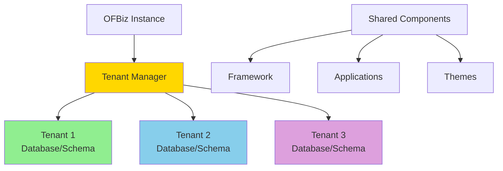
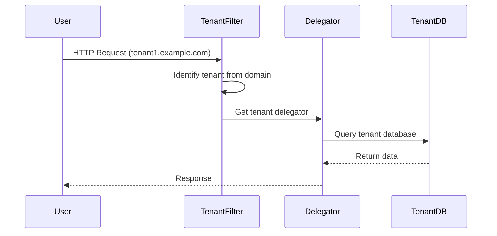

# Multi-Tenancy Architecture

**Purpose**: Documentation of OFBiz's multi-tenancy support for hosting multiple organizations on a single instance.

**Audience**: Enterprise Architects, System Administrators

**Prerequisites**: 
- [Entity Engine Overview](../02-framework-core/entity-engine/overview.md)
- [Entity Model Overview](./entity-model-overview.md)

**Related Documents**: 
- [Security Architecture](../09-quality-attributes/security-architecture.md)

---

## Overview

OFBiz supports multi-tenancy through tenant delegation, allowing multiple organizations to share a single OFBiz instance while maintaining data isolation. Each tenant has its own database schema or separate database, ensuring complete data segregation.

## Visual Architecture

### Multi-Tenancy Patterns



**Diagram Description**: Multi-tenancy architecture showing single OFBiz instance serving multiple tenants with separate databases/schemas while sharing application code.

### Tenant Delegation Flow



**Diagram Description**: Tenant delegation flow showing how requests are routed to the correct tenant database based on domain or tenant identifier.

## Tenant Configuration

### Tenant Definition

**Entity**: `Tenant`
```xml
<entity entity-name="Tenant">
    <field name="tenantId" type="id"/>
    <field name="tenantName" type="name"/>
    <field name="disabled" type="indicator"/>
    <prim-key field="tenantId"/>
</entity>
```

### Tenant Data Source

**Entity**: `TenantDataSource`
```xml
<entity entity-name="TenantDataSource">
    <field name="tenantId" type="id"/>
    <field name="entityGroupName" type="name"/>
    <field name="jdbcUri" type="long-varchar"/>
    <field name="jdbcUsername" type="short-varchar"/>
    <field name="jdbcPassword" type="short-varchar"/>
    <prim-key field="tenantId"/>
    <prim-key field="entityGroupName"/>
</entity>
```

### Configuration Example

```xml
<!-- entityengine.xml -->
<delegator name="default-tenant1" entity-model-reader="main" entity-group-reader="main">
    <group-map group-name="org.apache.ofbiz" datasource-name="localmysqltenant1"/>
</delegator>

<datasource name="localmysqltenant1"
            helper-class="org.apache.ofbiz.entity.datasource.GenericHelperDAO"
            schema-name="tenant1"
            jdbc-uri="jdbc:mysql://localhost/tenant1"
            jdbc-username="ofbiz"
            jdbc-password="ofbiz"/>
```

## Tenant Identification

### Domain-Based

**Configuration**:
```properties
# tenant.properties
tenant1.example.com=tenant1
tenant2.example.com=tenant2
```

**Filter**:
```java
public class TenantFilter implements Filter {
    public void doFilter(ServletRequest request, ServletResponse response, FilterChain chain) {
        HttpServletRequest httpRequest = (HttpServletRequest) request;
        String serverName = httpRequest.getServerName();
        String tenantId = getTenantIdFromDomain(serverName);
        request.setAttribute("tenantId", tenantId);
        chain.doFilter(request, response);
    }
}
```

### URL-Based

**Pattern**: `/tenant/{tenantId}/control/...`

### Header-Based

**Header**: `X-Tenant-ID: tenant1`

## Data Isolation Strategies

### 1. Separate Databases

**Pros**:
- Complete isolation
- Easy backup/restore per tenant
- Independent scaling

**Cons**:
- Higher resource usage
- More complex management

### 2. Separate Schemas

**Pros**:
- Good isolation
- Shared database resources
- Easier management

**Cons**:
- Schema-level permissions required
- Backup includes all tenants

### 3. Shared Schema with Tenant Column

**Pros**:
- Minimal resource usage
- Simplest management

**Cons**:
- Risk of data leakage
- Complex queries
- Not recommended for OFBiz

## Tenant Operations

### Create Tenant

```java
public static Map<String, Object> createTenant(DispatchContext dctx, Map<String, ?> context) {
    Delegator delegator = dctx.getDelegator();
    String tenantId = (String) context.get("tenantId");
    
    // Create tenant record
    GenericValue tenant = delegator.makeValue("Tenant");
    tenant.set("tenantId", tenantId);
    tenant.set("tenantName", context.get("tenantName"));
    tenant.create();
    
    // Create tenant database
    createTenantDatabase(tenantId);
    
    // Load seed data
    loadTenantSeedData(tenantId);
    
    return ServiceUtil.returnSuccess();
}
```

### Switch Tenant Context

```java
// Get tenant-specific delegator
Delegator tenantDelegator = DelegatorFactory.getDelegator("default-" + tenantId);

// Use tenant delegator for operations
GenericValue product = tenantDelegator.findOne("Product", 
    UtilMisc.toMap("productId", "10000"), false);
```

## Best Practices

### 1. Tenant Isolation

- Use separate databases or schemas
- Never share data between tenants
- Implement tenant-aware security

### 2. Resource Management

- Set resource limits per tenant
- Monitor tenant resource usage
- Implement fair scheduling

### 3. Backup Strategy

- Backup each tenant separately
- Test tenant restore procedures
- Maintain tenant backup schedules

### 4. Monitoring

- Track per-tenant metrics
- Monitor tenant health
- Alert on tenant issues

## Architecture Decisions

### Decision: Tenant Delegation Pattern

**Context**: Need to support multiple tenants with data isolation.

**Decision**: Use delegator pattern with separate databases/schemas per tenant.

**Consequences**:
- ✅ **Positive**: Complete data isolation
- ✅ **Positive**: Tenant-specific configuration
- ❌ **Negative**: More complex deployment
- **Mitigation**: Automation tools for tenant management

## Official References

- [Multi-Tenancy Guide](https://cwiki.apache.org/confluence/display/OFBIZ/Multi-Tenancy)
- [Tenant Management](https://cwiki.apache.org/confluence/display/OFBIZ/Tenant+Management)

## Related Topics

- [Entity Engine Overview](../02-framework-core/entity-engine/overview.md)
- [Security Architecture](../09-quality-attributes/security-architecture.md)
- [Scalability Patterns](./scalability-patterns.md)

---

**Next**: [Data Governance](./data-governance.md)

**Up**: [Data Architecture](./README.md)

**Home**: [Master Index](../00-INDEX.md)

---

**Document Metadata**:
- **Version**: 1.0
- **Last Updated**: December 2024
- **OFBiz Version**: Trunk (Latest)
- **Status**: Complete
