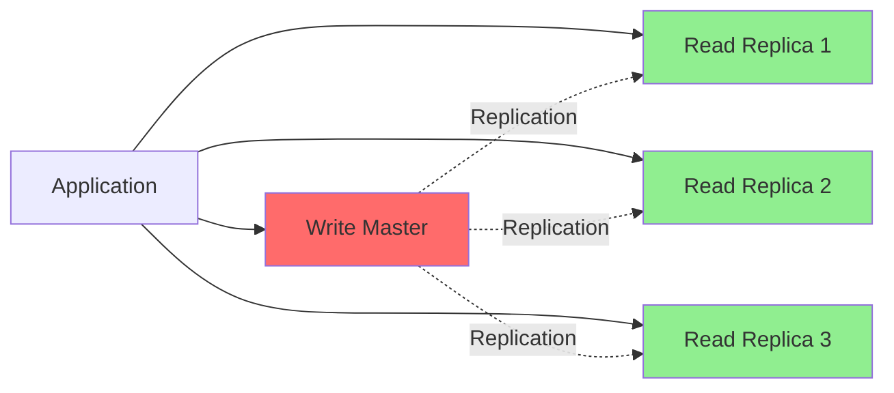
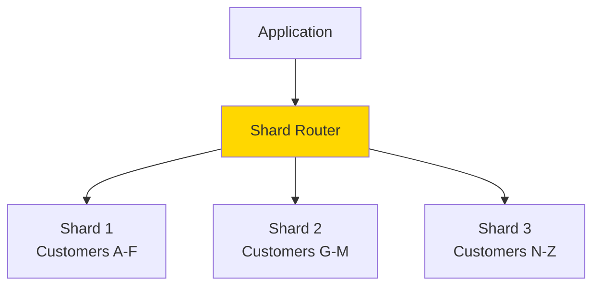

# Scalability Patterns

**Purpose**: Documentation of database scalability patterns including sharding, read replicas, and clustering.

**Audience**: Database Architects, Performance Engineers, System Administrators

**Prerequisites**: 
- [Entity Engine Overview](../02-framework-core/entity-engine/overview.md)
- [Caching Strategy](./caching-strategy.md)

**Related Documents**: 
- [Performance Characteristics](../09-quality-attributes/performance-characteristics.md)
- [Deployment Topologies](../01-system-overview/deployment-topologies.md)

---

## Overview

OFBiz supports various database scalability patterns to handle growing data volumes and user loads, including read replicas, database sharding, connection pooling, and query optimization.

## Visual Architecture

### Read Replica Pattern



**Diagram Description**: Read replica pattern with single write master and multiple read replicas for distributing read load.

### Database Sharding



**Diagram Description**: Database sharding pattern distributing data across multiple databases based on shard key (e.g., customer name range).

## Scalability Patterns

### 1. Read Replicas

**Configuration** (`entityengine.xml`):
```xml
<!-- Master database for writes -->
<datasource name="localmysql-master"
            helper-class="org.apache.ofbiz.entity.datasource.GenericHelperDAO"
            jdbc-uri="jdbc:mysql://master-db:3306/ofbiz"
            jdbc-username="ofbiz"
            jdbc-password="ofbiz"/>

<!-- Read replica 1 -->
<datasource name="localmysql-replica1"
            helper-class="org.apache.ofbiz.entity.datasource.GenericHelperDAO"
            jdbc-uri="jdbc:mysql://replica1-db:3306/ofbiz"
            jdbc-username="ofbiz"
            jdbc-password="ofbiz"
            read-only="true"/>

<!-- Read replica 2 -->
<datasource name="localmysql-replica2"
            helper-class="org.apache.ofbiz.entity.datasource.GenericHelperDAO"
            jdbc-uri="jdbc:mysql://replica2-db:3306/ofbiz"
            jdbc-username="ofbiz"
            jdbc-password="ofbiz"
            read-only="true"/>
```

**Load Balancing**:
```java
// Route reads to replicas
public GenericValue findOne(String entityName, Map<String, Object> fields) {
    String datasource = selectReadReplica(); // Round-robin or least-loaded
    return delegator.findOne(entityName, fields, false, datasource);
}
```

### 2. Connection Pooling

**Configuration**:
```xml
<datasource name="localmysql">
    <inline-jdbc
        jdbc-driver="com.mysql.jdbc.Driver"
        jdbc-uri="jdbc:mysql://localhost/ofbiz"
        jdbc-username="ofbiz"
        jdbc-password="ofbiz"
        pool-minsize="10"
        pool-maxsize="100"
        time-between-eviction-runs-millis="600000"/>
</datasource>
```

**Best Practices**:
- Set min pool size to handle baseline load
- Set max pool size based on database capacity
- Monitor pool utilization
- Tune eviction settings

### 3. Query Optimization

**Use Indexes**:
```xml
<entity entity-name="OrderHeader">
    <field name="orderId" type="id"/>
    <field name="orderDate" type="date-time"/>
    <field name="statusId" type="id"/>
    <prim-key field="orderId"/>
    <index name="ORDER_DATE_IDX">
        <index-field name="orderDate"/>
    </index>
    <index name="ORDER_STATUS_IDX">
        <index-field name="statusId"/>
    </index>
</entity>
```

**Optimize Queries**:
```java
// Bad: Load all then filter in memory
List<GenericValue> allOrders = delegator.findAll("OrderHeader", false);
List<GenericValue> filtered = EntityUtil.filterByDate(allOrders);

// Good: Filter in database
List<GenericValue> orders = EntityQuery.use(delegator)
    .from("OrderHeader")
    .where("statusId", "ORDER_APPROVED")
    .filterByDate()
    .queryList();
```

### 4. Batch Processing

**Batch Inserts**:
```java
List<GenericValue> entities = new ArrayList<>();
for (int i = 0; i < 1000; i++) {
    GenericValue entity = delegator.makeValue("Product");
    entity.set("productId", "PROD-" + i);
    entities.add(entity);
}
// Batch insert
delegator.storeAll(entities);
```

### 5. Partitioning

**Table Partitioning** (MySQL):
```sql
CREATE TABLE order_header (
    order_id VARCHAR(20),
    order_date DATETIME,
    ...
) PARTITION BY RANGE (YEAR(order_date)) (
    PARTITION p2020 VALUES LESS THAN (2021),
    PARTITION p2021 VALUES LESS THAN (2022),
    PARTITION p2022 VALUES LESS THAN (2023),
    PARTITION p2023 VALUES LESS THAN (2024),
    PARTITION p_future VALUES LESS THAN MAXVALUE
);
```

## Monitoring and Tuning

### Database Metrics

**Monitor**:
- Query response time
- Connection pool utilization
- Slow query log
- Lock contention
- Replication lag

### Query Analysis

```sql
-- MySQL slow query log
SET GLOBAL slow_query_log = 'ON';
SET GLOBAL long_query_time = 2;

-- Analyze query
EXPLAIN SELECT * FROM order_header WHERE order_date > '2024-01-01';
```

### Performance Tuning

**Database Configuration**:
```ini
# MySQL configuration
[mysqld]
innodb_buffer_pool_size = 8G
innodb_log_file_size = 512M
max_connections = 500
query_cache_size = 256M
```

## Best Practices

### 1. Design for Scale

- Normalize appropriately
- Use appropriate data types
- Plan for growth

### 2. Index Strategy

- Index foreign keys
- Index frequently queried fields
- Avoid over-indexing

### 3. Query Optimization

- Use EXPLAIN to analyze queries
- Avoid SELECT *
- Use pagination for large result sets

### 4. Caching

- Cache frequently accessed data
- Use appropriate TTL
- Monitor cache hit rates

## Architecture Decisions

### Decision: Support Read Replicas

**Context**: Need to scale read operations independently of writes.

**Decision**: Support multiple read-only datasources with load balancing.

**Consequences**:
- ✅ **Positive**: Horizontal read scaling
- ✅ **Positive**: Improved read performance
- ❌ **Negative**: Eventual consistency
- **Mitigation**: Route critical reads to master

## Official References

- [MySQL Replication](https://dev.mysql.com/doc/refman/8.0/en/replication.html)
- [PostgreSQL Replication](https://www.postgresql.org/docs/current/high-availability.html)
- [Database Sharding](https://en.wikipedia.org/wiki/Shard_(database_architecture))

## Related Topics

- [Caching Strategy](./caching-strategy.md)
- [Performance Characteristics](../09-quality-attributes/performance-characteristics.md)
- [Deployment Topologies](../01-system-overview/deployment-topologies.md)

---

**Next**: [Security and Encryption](./security-encryption.md)

**Up**: [Data Architecture](./README.md)

**Home**: [Master Index](../00-INDEX.md)

---

**Document Metadata**:
- **Version**: 1.0
- **Last Updated**: December 2024
- **OFBiz Version**: Trunk (Latest)
- **Status**: Complete
