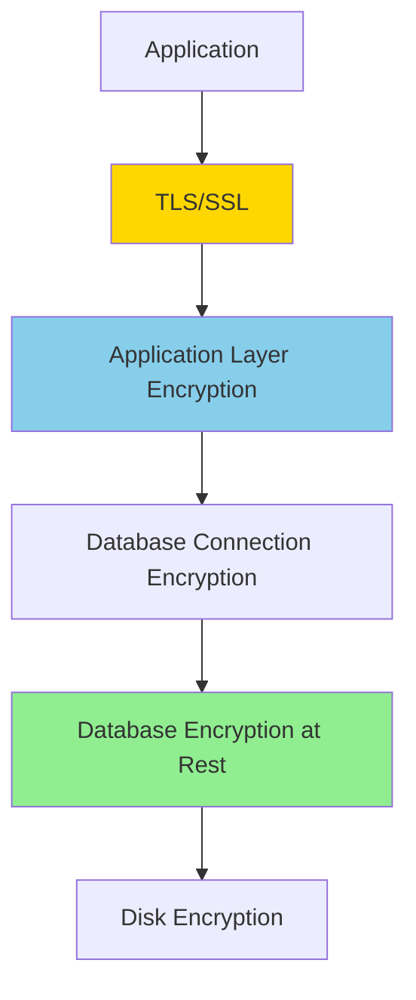

# Data Security and Encryption

**Purpose**: Documentation of data security practices including encryption at rest, encryption in transit, and data masking.

**Audience**: Security Architects, Database Administrators, Compliance Officers

**Prerequisites**: 
- [Security Framework Overview](../02-framework-core/security-framework/overview.md)
- [Entity Model Overview](./entity-model-overview.md)

**Related Documents**: 
- [Security Architecture](../09-quality-attributes/security-architecture.md)
- [Data Privacy (GDPR)](../10-governance-compliance/data-privacy-gdpr.md)

---

## Overview

OFBiz implements comprehensive data security including encryption at rest, encryption in transit, field-level encryption, and data masking to protect sensitive information and comply with regulations like GDPR, PCI-DSS, and HIPAA.

## Visual Architecture

### Data Security Layers



**Diagram Description**: Multiple layers of data security from application through database to disk encryption.

## Encryption at Rest

### Database-Level Encryption

**MySQL Transparent Data Encryption**:
```sql
-- Enable encryption for tablespace
ALTER TABLESPACE ofbiz_data ENCRYPTION = 'Y';

-- Create encrypted table
CREATE TABLE sensitive_data (
    id VARCHAR(20),
    data TEXT
) ENCRYPTION='Y';
```

**PostgreSQL**:
```sql
-- Enable encryption at cluster level
initdb --data-checksums --pwfile=password.txt --encryption=AES256
```

### Field-Level Encryption

**Encrypt Sensitive Fields**:
```java
public class EncryptionUtil {
    private static final String ALGORITHM = "AES/GCM/NoPadding";
    private static final int KEY_SIZE = 256;
    
    public static String encrypt(String plaintext, SecretKey key) throws Exception {
        Cipher cipher = Cipher.getInstance(ALGORITHM);
        GCMParameterSpec spec = new GCMParameterSpec(128, generateIV());
        cipher.init(Cipher.ENCRYPT_MODE, key, spec);
        
        byte[] ciphertext = cipher.doFinal(plaintext.getBytes(StandardCharsets.UTF_8));
        return Base64.getEncoder().encodeToString(ciphertext);
    }
    
    public static String decrypt(String ciphertext, SecretKey key) throws Exception {
        Cipher cipher = Cipher.getInstance(ALGORITHM);
        GCMParameterSpec spec = new GCMParameterSpec(128, extractIV(ciphertext));
        cipher.init(Cipher.DECRYPT_MODE, key, spec);
        
        byte[] plaintext = cipher.doFinal(Base64.getDecoder().decode(ciphertext));
        return new String(plaintext, StandardCharsets.UTF_8);
    }
}
```

**Usage**:
```java
// Encrypt credit card number before storing
String ccNumber = context.get("creditCardNumber");
String encryptedCC = EncryptionUtil.encrypt(ccNumber, getEncryptionKey());

GenericValue paymentMethod = delegator.makeValue("PaymentMethod");
paymentMethod.set("cardNumber", encryptedCC);
paymentMethod.create();

// Decrypt when needed
String encryptedCC = paymentMethod.getString("cardNumber");
String ccNumber = EncryptionUtil.decrypt(encryptedCC, getEncryptionKey());
```

### Key Management

**Key Storage**:
```properties
# security.properties
encryption.key.location=/secure/path/encryption.key
encryption.key.algorithm=AES
encryption.key.size=256
```

**Key Rotation**:
```java
public static void rotateEncryptionKey() {
    SecretKey oldKey = loadKey("old-key");
    SecretKey newKey = generateNewKey();
    
    // Re-encrypt all sensitive data
    List<GenericValue> records = delegator.findAll("PaymentMethod", false);
    for (GenericValue record : records) {
        String encrypted = record.getString("cardNumber");
        String decrypted = decrypt(encrypted, oldKey);
        String reencrypted = encrypt(decrypted, newKey);
        record.set("cardNumber", reencrypted);
        record.store();
    }
    
    saveKey("current-key", newKey);
    archiveKey("old-key", oldKey);
}
```

## Encryption in Transit

### TLS/SSL Configuration

**HTTPS Configuration** (`web.xml`):
```xml
<security-constraint>
    <web-resource-collection>
        <web-resource-name>Secure Pages</web-resource-name>
        <url-pattern>/*</url-pattern>
    </web-resource-collection>
    <user-data-constraint>
        <transport-guarantee>CONFIDENTIAL</transport-guarantee>
    </user-data-constraint>
</security-constraint>
```

**Database Connection Encryption**:
```xml
<!-- MySQL SSL -->
<datasource name="localmysql"
            jdbc-uri="jdbc:mysql://localhost/ofbiz?useSSL=true&requireSSL=true"
            jdbc-username="ofbiz"
            jdbc-password="ofbiz"/>

<!-- PostgreSQL SSL -->
<datasource name="localpostgres"
            jdbc-uri="jdbc:postgresql://localhost/ofbiz?ssl=true&sslmode=require"
            jdbc-username="ofbiz"
            jdbc-password="ofbiz"/>
```

## Data Masking

### Display Masking

**Credit Card Masking**:
```java
public static String maskCreditCard(String cardNumber) {
    if (cardNumber == null || cardNumber.length() < 4) {
        return "****";
    }
    return "****-****-****-" + cardNumber.substring(cardNumber.length() - 4);
}
```

**SSN Masking**:
```java
public static String maskSSN(String ssn) {
    if (ssn == null || ssn.length() < 4) {
        return "***-**-****";
    }
    return "***-**-" + ssn.substring(ssn.length() - 4);
}
```

**Usage in UI**:
```ftl
<#-- Display masked credit card -->
<@displayField value=maskCreditCard(paymentMethod.cardNumber) />

<#-- Display full number only to authorized users -->
<#if security.hasPermission("PAYMENT_INFO_VIEW", userLogin)>
    <@displayField value=paymentMethod.cardNumber />
<#else>
    <@displayField value=maskCreditCard(paymentMethod.cardNumber) />
</#if>
```

### Database Masking

**Dynamic Data Masking** (SQL Server):
```sql
ALTER TABLE payment_method
ALTER COLUMN card_number ADD MASKED WITH (FUNCTION = 'partial(0,"XXXX-XXXX-XXXX-",4)');
```

## Sensitive Data Handling

### PCI-DSS Compliance

**Requirements**:
- Encrypt cardholder data
- Mask PAN when displayed
- Restrict access to cardholder data
- Log access to cardholder data

**Implementation**:
```java
@Secured("PAYMENT_INFO_VIEW")
public static Map<String, Object> viewPaymentInfo(DispatchContext dctx, Map<String, ?> context) {
    String paymentMethodId = (String) context.get("paymentMethodId");
    GenericValue userLogin = (GenericValue) context.get("userLogin");
    
    // Log access
    logDataAccess(userLogin, "PaymentMethod", paymentMethodId, "VIEW");
    
    // Decrypt and return
    GenericValue paymentMethod = delegator.findOne("PaymentMethod", 
        UtilMisc.toMap("paymentMethodId", paymentMethodId), false);
    
    String encryptedCard = paymentMethod.getString("cardNumber");
    String cardNumber = decrypt(encryptedCard, getEncryptionKey());
    
    Map<String, Object> result = ServiceUtil.returnSuccess();
    result.put("cardNumber", cardNumber);
    return result;
}
```

### GDPR Compliance

**Personal Data Protection**:
```java
// Pseudonymization
public static String pseudonymize(String personalData) {
    return HashCrypt.digestHash("SHA-256", personalData.getBytes());
}

// Anonymization
public static void anonymizePersonalData(String partyId) {
    GenericValue person = delegator.findOne("Person", 
        UtilMisc.toMap("partyId", partyId), false);
    
    person.set("firstName", "ANONYMIZED");
    person.set("lastName", "ANONYMIZED");
    person.set("birthDate", null);
    person.store();
}
```

## Audit Logging

**Log Sensitive Data Access**:
```java
public static void logDataAccess(GenericValue userLogin, String entityName, 
        String entityId, String operation) {
    GenericValue auditLog = delegator.makeValue("DataAccessLog");
    auditLog.set("logId", delegator.getNextSeqId("DataAccessLog"));
    auditLog.set("userLoginId", userLogin.getString("userLoginId"));
    auditLog.set("entityName", entityName);
    auditLog.set("entityId", entityId);
    auditLog.set("operation", operation);
    auditLog.set("accessTime", UtilDateTime.nowTimestamp());
    auditLog.set("ipAddress", getClientIP());
    auditLog.create();
}
```

## Best Practices

### 1. Encryption

- Use strong encryption algorithms (AES-256)
- Implement proper key management
- Rotate keys regularly
- Never store keys in code

### 2. Access Control

- Implement least privilege
- Log all access to sensitive data
- Regular access reviews
- Multi-factor authentication for sensitive operations

### 3. Data Classification

- Classify data by sensitivity
- Apply appropriate controls per classification
- Document data flows

### 4. Compliance

- Understand applicable regulations
- Implement required controls
- Regular compliance audits
- Maintain documentation

## Architecture Decisions

### Decision: Field-Level Encryption for Sensitive Data

**Context**: Need to protect sensitive data like credit cards and SSNs.

**Decision**: Implement field-level encryption for sensitive fields with application-managed keys.

**Consequences**:
- ✅ **Positive**: Strong data protection
- ✅ **Positive**: Compliance support
- ❌ **Negative**: Performance overhead
- ❌ **Negative**: Complex key management
- **Mitigation**: Cache decrypted data in memory, implement efficient key management

## Official References

- [OWASP Cryptographic Storage Cheat Sheet](https://cheatsheetseries.owasp.org/cheatsheets/Cryptographic_Storage_Cheat_Sheet.html)
- [PCI-DSS Requirements](https://www.pcisecuritystandards.org/)
- [GDPR](https://gdpr.eu/)

## Related Topics

- [Security Framework Overview](../02-framework-core/security-framework/overview.md)
- [Security Architecture](../09-quality-attributes/security-architecture.md)
- [Data Privacy (GDPR)](../10-governance-compliance/data-privacy-gdpr.md)

---

**Next**: [Application Modules](../04-application-modules/README.md)

**Up**: [Data Architecture](./README.md)

**Home**: [Master Index](../00-INDEX.md)

---

**Document Metadata**:
- **Version**: 1.0
- **Last Updated**: December 2024
- **OFBiz Version**: Trunk (Latest)
- **Status**: Complete
