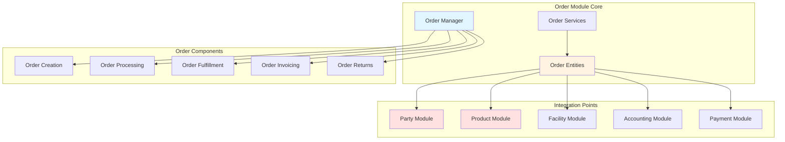
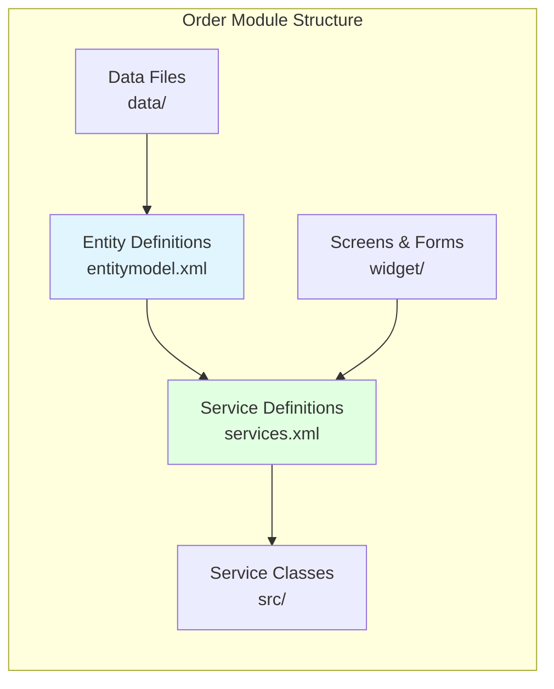
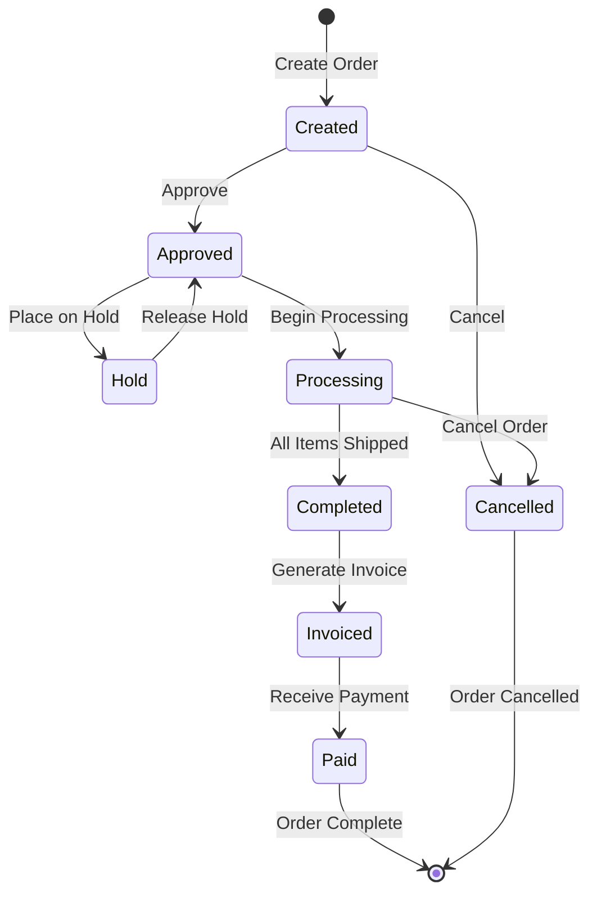
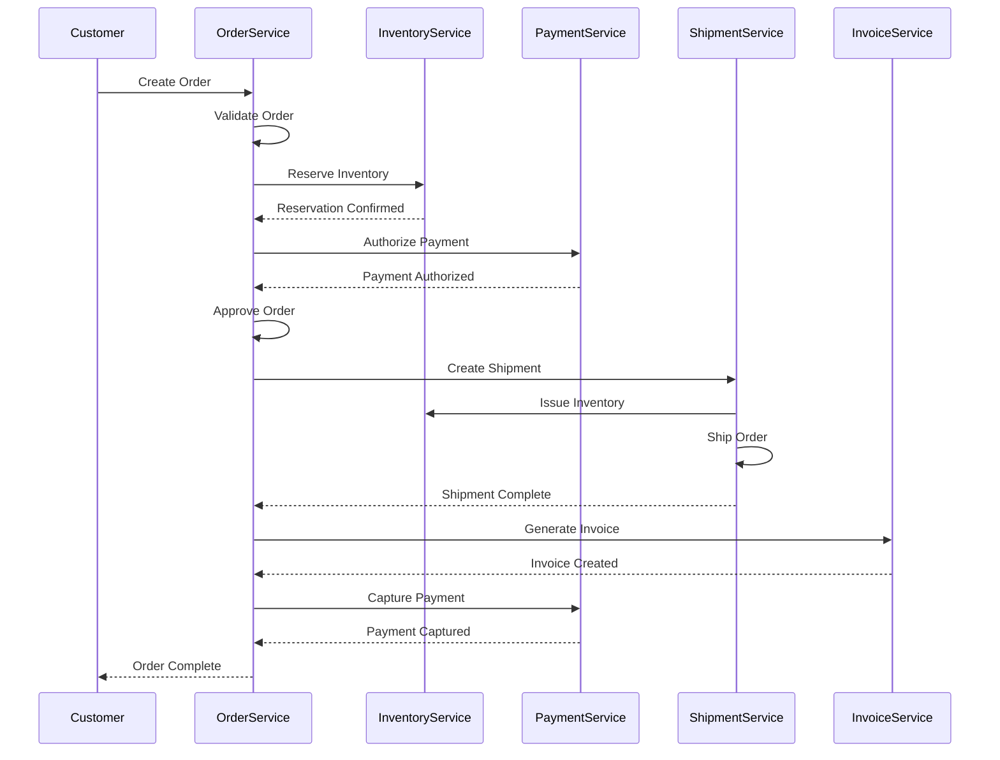
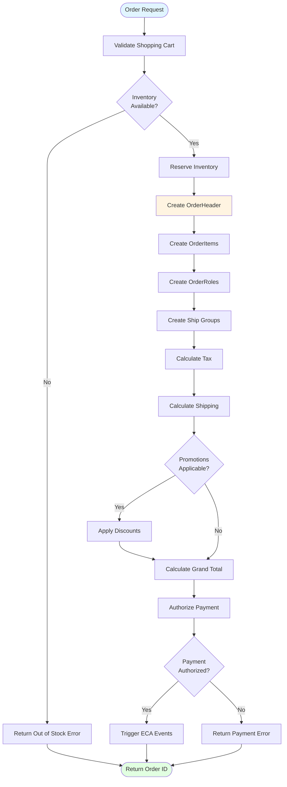
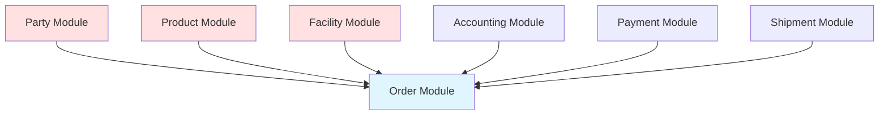
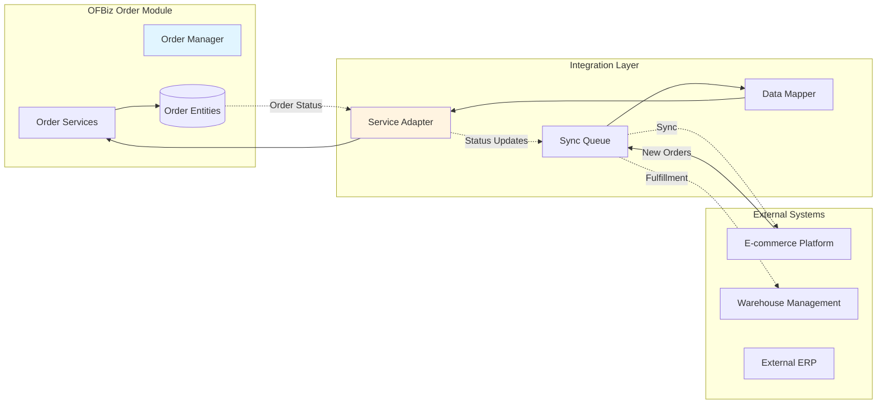

# Order Module Architecture

**Document Type**: Application Module Documentation  
**Module Classification**: Core Module (Cannot be Disabled)  
**Last Updated**: December 2024

---

## Overview

The Order module manages the complete order lifecycle in Apache OFBiz, from order creation through fulfillment, invoicing, and returns. It is a **core module that cannot be disabled** because it represents the fundamental business transaction capability that ties together customers, products, inventory, and accounting.

### Why Order Module Cannot Be Disabled

The Order module is central to business operations:

1. **Revenue Generation**: Orders are the primary source of revenue transactions
2. **Cross-Module Integration**: Links Party, Product, Facility, Accounting, and Payment
3. **Business Process Core**: Order fulfillment drives warehouse, shipping, and invoicing
4. **Financial Recording**: Orders trigger accounting entries and revenue recognition
5. **Customer Relationship**: Order history is essential for customer service

Disabling the Order module would eliminate the ability to conduct business transactions.

---

## Module Architecture

### High-Level Architecture



### Component Structure



---

## Entity Model

### Core Order Entities

```mermaid
erDiagram
    OrderHeader ||--o{ OrderItem : "contains"
    OrderHeader ||--o{ OrderRole : "has"
    OrderHeader ||--o{ OrderStatus : "tracks"
    OrderHeader ||--o{ OrderContactMech : "has"
    OrderHeader ||--o{ OrderPaymentPreference : "has"
    OrderHeader ||--|| OrderType : "of type"
    
    OrderItem ||--|| Product : "references"
    OrderItem ||--o{ OrderItemShipGroupAssoc : "assigned to"
    OrderItem ||--o{ OrderAdjustment : "has"
    OrderItem ||--o{ OrderItemStatus : "tracks"
    
    OrderItemShipGroupAssoc ||--|| OrderItemShipGroup : "belongs to"
    OrderItemShipGroup ||--|| ContactMech : "ships to"
    OrderItemShipGroup ||--|| Shipment : "fulfilled by"
    
    OrderPaymentPreference ||--|| PaymentMethodType : "uses"
    OrderPaymentPreference ||--o{ Payment : "generates"
    
    OrderHeader ||--o{ Invoice : "generates"
    Invoice ||--o{ InvoiceItem : "contains"
    InvoiceItem ||--|| OrderItem : "references"
    
    OrderHeader {
        string orderId PK
        string orderTypeId
        string orderName
        string salesChannelEnumId
        string orderDate
        string statusId
        string currencyUom
        decimal grandTotal
    }
    
    OrderItem {
        string orderId PK_FK
        string orderItemSeqId PK
        string orderItemTypeId
        string productId FK
        decimal quantity
        decimal unitPrice
        decimal unitListPrice
        string statusId
    }
    
    OrderRole {
        string orderId PK_FK
        string partyId PK_FK
        string roleTypeId PK_FK
    }
```

### Key Entity Descriptions

<details>
<summary><strong>OrderHeader Entity</strong> - Order master record</summary>

**File**: `applications/order/entitydef/entitymodel.xml`

```xml
<entity entity-name="OrderHeader" package-name="org.apache.ofbiz.order.order">
    <field name="orderId" type="id"></field>
    <field name="orderTypeId" type="id"></field>
    <field name="orderName" type="name"></field>
    <field name="externalId" type="id"></field>
    <field name="salesChannelEnumId" type="id"></field>
    <field name="orderDate" type="date-time"></field>
    <field name="priority" type="indicator"></field>
    <field name="entryDate" type="date-time"></field>
    <field name="statusId" type="id"></field>
    <field name="currencyUom" type="id"></field>
    <field name="grandTotal" type="currency-amount"></field>
    <prim-key field="orderId"/>
</entity>
```

OrderHeader is the master record for all orders (sales orders, purchase orders, etc.).

</details>

<details>
<summary><strong>OrderItem Entity</strong> - Order line items</summary>

**File**: `applications/order/entitydef/entitymodel.xml`

```xml
<entity entity-name="OrderItem" package-name="org.apache.ofbiz.order.order">
    <field name="orderId" type="id"></field>
    <field name="orderItemSeqId" type="id"></field>
    <field name="orderItemTypeId" type="id"></field>
    <field name="productId" type="id"></field>
    <field name="prodCatalogId" type="id"></field>
    <field name="quantity" type="fixed-point"></field>
    <field name="selectedAmount" type="fixed-point"></field>
    <field name="unitPrice" type="currency-precise"></field>
    <field name="unitListPrice" type="currency-precise"></field>
    <field name="statusId" type="id"></field>
    <prim-key field="orderId"/>
    <prim-key field="orderItemSeqId"/>
</entity>
```

OrderItem represents individual line items within an order.

</details>

---

## Order Lifecycle

### Order State Machine



### Order Processing Flow



---

## Service Architecture

### Core Order Services

<details>
<summary><strong>createOrder Service</strong> - Create new order</summary>

**File**: `applications/order/servicedef/services.xml`

```xml
<service name="createOrder" engine="java"
         location="org.apache.ofbiz.order.order.OrderServices" 
         invoke="createOrder" auth="true">
    <description>Create an Order</description>
    <attribute name="orderTypeId" type="String" mode="IN" optional="false"/>
    <attribute name="orderName" type="String" mode="IN" optional="true"/>
    <attribute name="salesChannelEnumId" type="String" mode="IN" optional="true"/>
    <attribute name="orderDate" type="Timestamp" mode="IN" optional="true"/>
    <attribute name="currencyUom" type="String" mode="IN" optional="true"/>
    <attribute name="orderItems" type="List" mode="IN" optional="false"/>
    <attribute name="orderRoles" type="List" mode="IN" optional="false"/>
    <attribute name="orderId" type="String" mode="OUT" optional="false"/>
</service>
```

Creates a complete order with items, roles, and contact information.

</details>

<details>
<summary><strong>approveOrder Service</strong> - Approve order for processing</summary>

**File**: `applications/order/servicedef/services.xml`

```xml
<service name="approveOrder" engine="simple"
         location="component://order/minilang/order/OrderServices.xml" 
         invoke="approveOrder" auth="true">
    <description>Approve Order</description>
    <attribute name="orderId" type="String" mode="IN" optional="false"/>
    <attribute name="statusId" type="String" mode="OUT" optional="false"/>
</service>
```

Transitions order from Created to Approved status, triggering fulfillment.

</details>

<details>
<summary><strong>quickShipEntireOrder Service</strong> - Ship complete order</summary>

**File**: `applications/order/servicedef/services.xml`

```xml
<service name="quickShipEntireOrder" engine="java"
         location="org.apache.ofbiz.order.order.OrderServices" 
         invoke="quickShipEntireOrder" auth="true">
    <description>Quick Ship Entire Order</description>
    <attribute name="orderId" type="String" mode="IN" optional="false"/>
    <attribute name="facilityId" type="String" mode="IN" optional="true"/>
    <attribute name="shipmentId" type="String" mode="OUT" optional="false"/>
</service>
```

Simplified service to ship an entire order in one operation.

</details>

---

## Order Creation Flow



---

## Module Dependencies

### Incoming Dependencies



### Dependency Examples

1. **Party**: OrderRole links to Party for customer, billing, shipping
2. **Product**: OrderItem references Product for items ordered
3. **Facility**: Inventory reservation and fulfillment
4. **Accounting**: Invoice generation from orders
5. **Payment**: Payment authorization and capture

---

## Integration Patterns

### External Order Management Integration



<details>
<summary><strong>Order Import Service</strong></summary>

```java
public static Map<String, Object> importExternalOrder(DispatchContext dctx, Map<String, ?> context) {
    Delegator delegator = dctx.getDelegator();
    LocalDispatcher dispatcher = dctx.getDispatcher();
    
    String externalOrderId = (String) context.get("externalOrderId");
    Map<String, Object> orderData = (Map<String, Object>) context.get("orderData");
    
    try {
        // Check if order already imported
        List<GenericValue> existing = delegator.findByAnd("OrderHeader", 
            UtilMisc.toMap("externalId", externalOrderId), null, false);
        
        if (UtilValidate.isNotEmpty(existing)) {
            return ServiceUtil.returnError("Order already imported: " + externalOrderId);
        }
        
        // Prepare order items
        List<Map<String, Object>> orderItems = new ArrayList<>();
        List<Map<String, Object>> externalItems = (List) orderData.get("items");
        
        for (Map<String, Object> item : externalItems) {
            orderItems.add(UtilMisc.toMap(
                "productId", item.get("sku"),
                "quantity", item.get("quantity"),
                "unitPrice", item.get("price")
            ));
        }
        
        // Prepare order roles
        List<Map<String, Object>> orderRoles = UtilMisc.toList(
            UtilMisc.toMap("partyId", orderData.get("customerId"), "roleTypeId", "BILL_TO_CUSTOMER"),
            UtilMisc.toMap("partyId", orderData.get("customerId"), "roleTypeId", "SHIP_TO_CUSTOMER")
        );
        
        // Create order
        Map<String, Object> createContext = UtilMisc.toMap(
            "orderTypeId", "SALES_ORDER",
            "orderName", "Imported: " + externalOrderId,
            "externalId", externalOrderId,
            "currencyUom", orderData.get("currency"),
            "orderItems", orderItems,
            "orderRoles", orderRoles
        );
        
        Map<String, Object> result = dispatcher.runSync("createOrder", createContext);
        String orderId = (String) result.get("orderId");
        
        return ServiceUtil.returnSuccess("Order imported: " + orderId);
    } catch (Exception e) {
        return ServiceUtil.returnError("Error importing order: " + e.getMessage());
    }
}
```

</details>

---

## Official References

- [Apache OFBiz Order Component](https://cwiki.apache.org/confluence/display/OFBIZ/Order+Component)
- [Order Data Model](https://cwiki.apache.org/confluence/display/OFBIZ/Order+Data+Model)
- [Order Processing](https://cwiki.apache.org/confluence/display/OFBIZ/Order+Processing)

---

## Related Documentation

- [Module Architecture Overview](../module-architecture-overview.md)
- [Order Domain Model](../../03-data-architecture/domain-models/order-domain.md)
- [Party Module](party-module.md)
- [Product Module](product-module.md)

---

## Summary

The Order module is the transaction core of OFBiz and cannot be disabled. It orchestrates the complete order lifecycle from creation through fulfillment and invoicing, integrating Party, Product, Facility, Payment, and Accounting modules. While it cannot be disabled, orders can be imported from and synchronized with external e-commerce platforms and ERP systems using adapter patterns.
