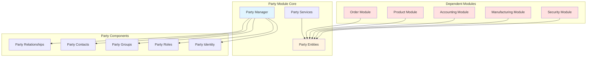
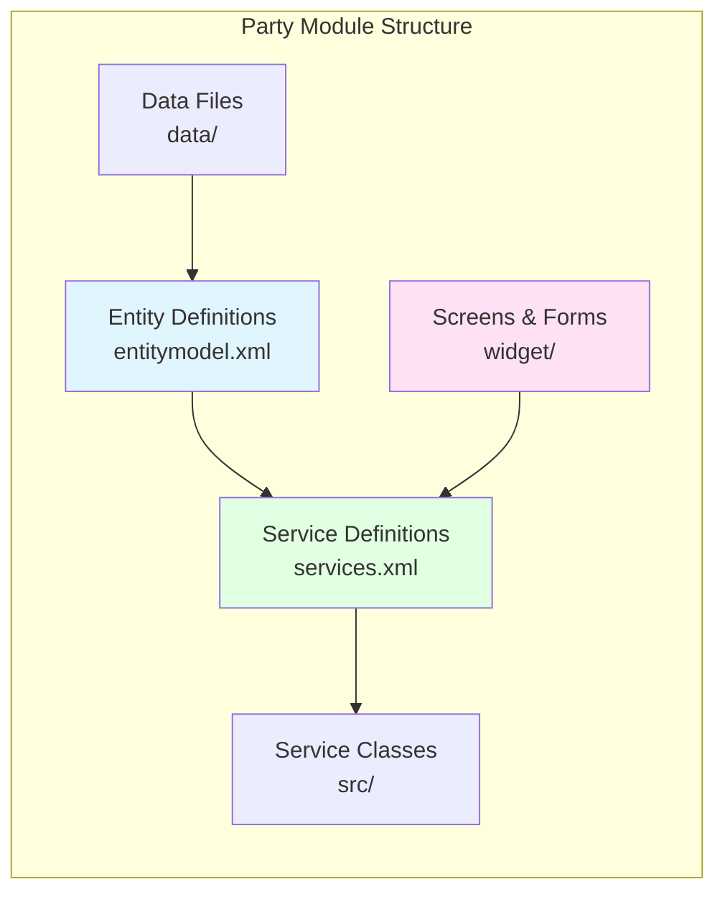
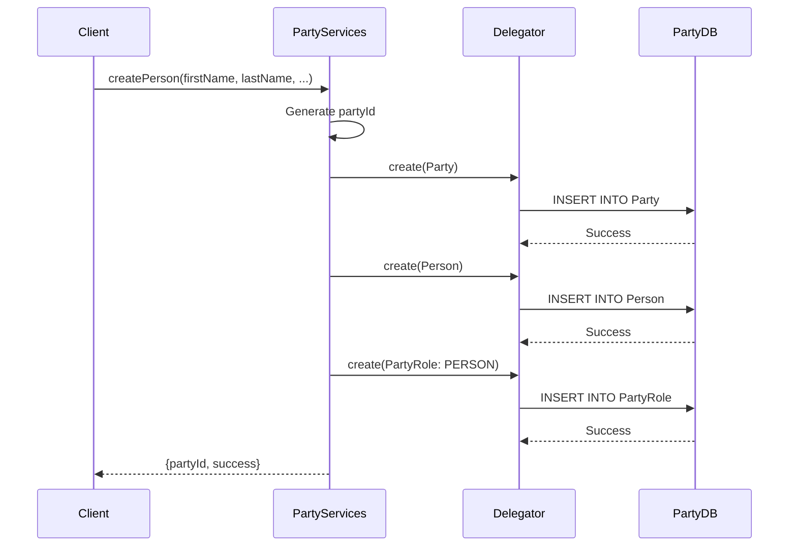
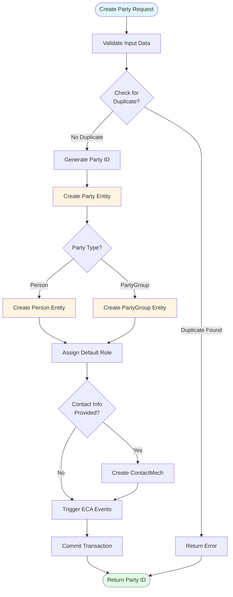
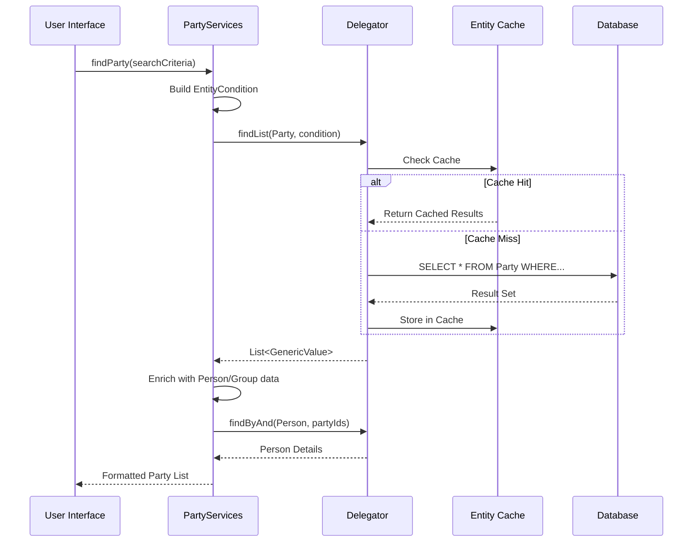
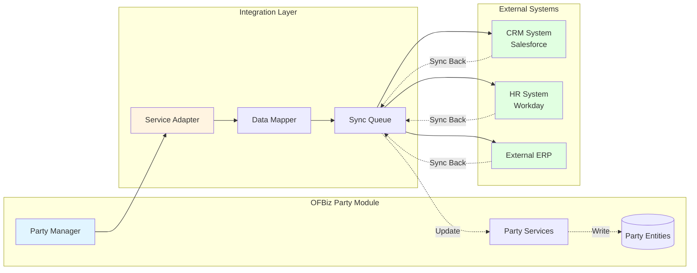
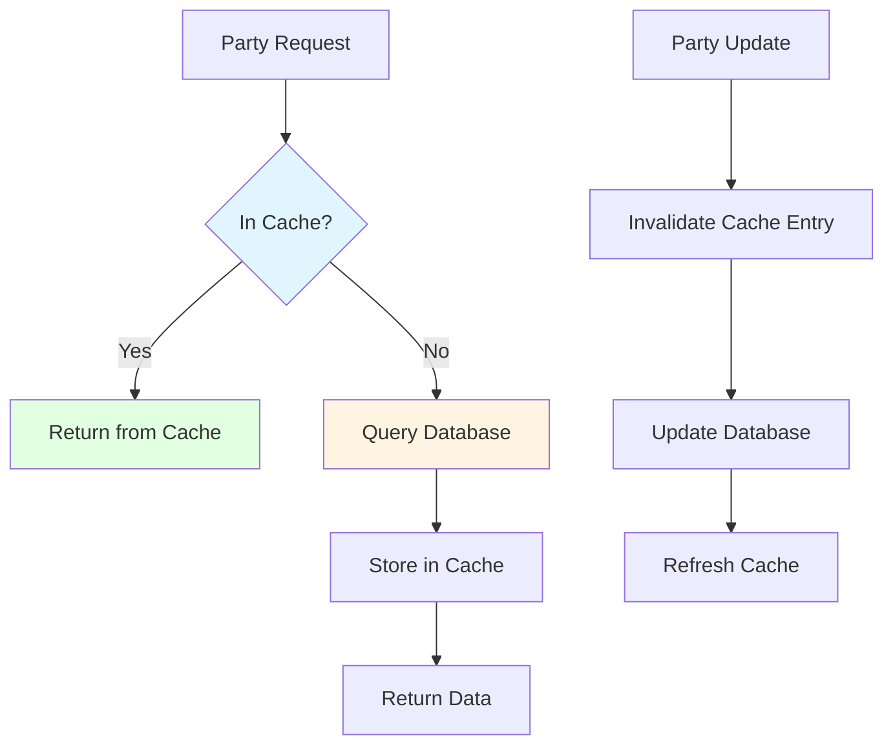

# Party Module Architecture

**Document Type**: Application Module Documentation  
**Module Classification**: Core Module (Cannot be Disabled)  
**Last Updated**: December 2024

---

## Overview

The Party module is the foundational module in Apache OFBiz that manages all entities representing people, organizations, and their relationships. It is a **core module that cannot be disabled** because virtually every other module in OFBiz depends on Party entities for identity, relationships, and role management.

### Why Party Module Cannot Be Disabled

The Party module is deeply integrated into OFBiz's architecture:

1. **Universal Identity**: All users, customers, suppliers, employees are represented as Party entities
2. **Cross-Module Dependencies**: Order, Product, Accounting, Manufacturing all reference Party
3. **Security Foundation**: Authentication and authorization are tied to Party and PartyRole
4. **Relationship Management**: All business relationships are modeled through Party associations
5. **Contact Information**: All addresses, phone numbers, emails are linked to Party

Disabling the Party module would break fundamental OFBiz functionality across all applications.

---

## Module Architecture

### High-Level Architecture



### Component Structure



---

## Entity Model

### Core Party Entities

```mermaid
erDiagram
    Party ||--o{ Person : "is a"
    Party ||--o{ PartyGroup : "is a"
    Party ||--o{ PartyRole : "has"
    Party ||--o{ PartyRelationship : "participates in"
    Party ||--o{ PartyContactMech : "has"
    Party ||--o{ PartyClassification : "belongs to"
    
    PartyRole ||--|| RoleType : "of type"
    PartyContactMech ||--|| ContactMech : "uses"
    ContactMech ||--o{ PostalAddress : "is a"
    ContactMech ||--o{ TelecomNumber : "is a"
    ContactMech ||--o{ EmailAddress : "is a"
    
    PartyRelationship ||--|| Party : "from"
    PartyRelationship ||--|| Party : "to"
    PartyRelationship ||--|| RoleType : "from role"
    PartyRelationship ||--|| RoleType : "to role"
    
    Party {
        string partyId PK
        string partyTypeId
        string externalId
        string description
        timestamp createdDate
    }
    
    Person {
        string partyId PK_FK
        string firstName
        string middleName
        string lastName
        string gender
        date birthDate
    }
    
    PartyGroup {
        string partyId PK_FK
        string groupName
        string groupNameLocal
        string officeSiteName
        string logoImageUrl
    }
    
    PartyRole {
        string partyId PK_FK
        string roleTypeId PK_FK
    }
    
    PartyContactMech {
        string partyId PK_FK
        string contactMechId PK_FK
        timestamp fromDate PK
        timestamp thruDate
        string extension
        string comments
    }
```

### Key Entity Descriptions

<details>
<summary><strong>Party Entity</strong> - Universal identity representation</summary>

**File**: `applications/party/entitydef/entitymodel.xml`

```xml
<entity entity-name="Party" package-name="org.apache.ofbiz.party.party">
    <field name="partyId" type="id"></field>
    <field name="partyTypeId" type="id"></field>
    <field name="externalId" type="id"></field>
    <field name="description" type="description"></field>
    <field name="statusId" type="id"></field>
    <field name="createdDate" type="date-time"></field>
    <field name="createdByUserLogin" type="id-vlong"></field>
    <field name="lastModifiedDate" type="date-time"></field>
    <field name="lastModifiedByUserLogin" type="id-vlong"></field>
    <prim-key field="partyId"/>
</entity>
```

The Party entity is the root of all identity in OFBiz. Every person, organization, system user, customer, supplier, or employee is represented as a Party.

</details>

<details>
<summary><strong>Person Entity</strong> - Individual person details</summary>

**File**: `applications/party/entitydef/entitymodel.xml`

```xml
<entity entity-name="Person" package-name="org.apache.ofbiz.party.person">
    <field name="partyId" type="id"></field>
    <field name="salutation" type="name"></field>
    <field name="firstName" type="name"></field>
    <field name="middleName" type="name"></field>
    <field name="lastName" type="name"></field>
    <field name="personalTitle" type="name"></field>
    <field name="suffix" type="name"></field>
    <field name="nickname" type="name"></field>
    <field name="gender" type="indicator"></field>
    <field name="birthDate" type="date"></field>
    <prim-key field="partyId"/>
    <relation type="one" fk-name="PERSON_PARTY" rel-entity-name="Party"/>
</entity>
```

Person extends Party with individual-specific attributes like name, gender, and birth date.

</details>

<details>
<summary><strong>PartyRole Entity</strong> - Role assignments</summary>

**File**: `applications/party/entitydef/entitymodel.xml`

```xml
<entity entity-name="PartyRole" package-name="org.apache.ofbiz.party.party">
    <field name="partyId" type="id"></field>
    <field name="roleTypeId" type="id"></field>
    <prim-key field="partyId"/>
    <prim-key field="roleTypeId"/>
    <relation type="one" fk-name="PROLE_PARTY" rel-entity-name="Party"/>
    <relation type="one" fk-name="PROLE_RTYPE" rel-entity-name="RoleType"/>
</entity>
```

PartyRole assigns roles (Customer, Supplier, Employee, etc.) to parties, enabling role-based business logic.

</details>

---

## Service Architecture

### Key Service Patterns



### Core Services

<details>
<summary><strong>createPerson Service</strong> - Create individual party</summary>

**File**: `applications/party/servicedef/services.xml`

```xml
<service name="createPerson" engine="entity-auto" invoke="create" auth="true">
    <description>Create a Person</description>
    <permission-service service-name="partyPermissionCheck" main-action="CREATE"/>
    <auto-attributes entity-name="Party" include="nonpk" mode="IN" optional="true"/>
    <auto-attributes entity-name="Person" include="nonpk" mode="IN" optional="true"/>
    <attribute name="partyId" type="String" mode="OUT" optional="false"/>
</service>
```

**Implementation**: `applications/party/src/main/java/org/apache/ofbiz/party/party/PartyServices.java`

This service creates both Party and Person entities in a single transaction, ensuring data consistency.

</details>

<details>
<summary><strong>createPartyRelationship Service</strong> - Link parties</summary>

**File**: `applications/party/servicedef/services.xml`

```xml
<service name="createPartyRelationship" engine="simple" 
         location="component://party/minilang/party/PartyServices.xml" 
         invoke="createPartyRelationship" auth="true">
    <description>Create a Party Relationship</description>
    <attribute name="partyIdFrom" type="String" mode="IN" optional="false"/>
    <attribute name="partyIdTo" type="String" mode="IN" optional="false"/>
    <attribute name="roleTypeIdFrom" type="String" mode="IN" optional="false"/>
    <attribute name="roleTypeIdTo" type="String" mode="IN" optional="false"/>
    <attribute name="partyRelationshipTypeId" type="String" mode="IN" optional="false"/>
    <attribute name="fromDate" type="Timestamp" mode="IN" optional="true"/>
</service>
```

Creates relationships between parties (e.g., Employee-Employer, Customer-Account Manager).

</details>

<details>
<summary><strong>getPartyNameForDate Service</strong> - Retrieve party name</summary>

**File**: `applications/party/servicedef/services.xml`

```xml
<service name="getPartyNameForDate" engine="java"
         location="org.apache.ofbiz.party.party.PartyServices" 
         invoke="getPartyNameForDate" auth="false">
    <description>Get Party Name For Date</description>
    <attribute name="partyId" type="String" mode="IN" optional="false"/>
    <attribute name="compareDate" type="Timestamp" mode="IN" optional="true"/>
    <attribute name="lastNameFirst" type="String" mode="IN" optional="true"/>
    <attribute name="fullName" type="String" mode="OUT" optional="false"/>
</service>
```

Retrieves formatted party name, handling Person vs PartyGroup differences.

</details>

---

## Service Orchestration

### Party Creation Flow



### Party Search Flow



---

## Module Dependencies

### Incoming Dependencies (Modules that depend on Party)

```mermaid
graph TD
    Party[Party Module]
    
    Order[Order Module] --> Party
    Product[Product Module] --> Party
    Accounting[Accounting Module] --> Party
    Manufacturing[Manufacturing Module] --> Party
    Facility[Facility/Warehouse Module] --> Party
    Marketing[Marketing Module] --> Party
    HR[Human Resources Module] --> Party
    Security[Security Framework] --> Party
    Content[Content Module] --> Party
    Workeffort[Work Effort Module] --> Party
    
    style Party fill:#e1f5ff
    style Order fill:#ffe1e1
    style Product fill:#ffe1e1
    style Accounting fill:#ffe1e1
    style Manufacturing fill:#ffe1e1
    style Facility fill:#ffe1e1
    style Marketing fill:#ffe1e1
    style HR fill:#ffe1e1
    style Security fill:#ffe1e1
    style Content fill:#ffe1e1
    style Workeffort fill:#ffe1e1
```



### Dependency Examples

1. **Order Module**: OrderHeader has `billToPartyId`, `shipToPartyId`, `placingPartyId`
2. **Product Module**: ProductStore has `payToPartyId`, `shipFromPartyId`
3. **Accounting Module**: Invoice has `partyIdFrom`, `partyIdTo`
4. **Security**: UserLogin is linked to Party via `partyId`
5. **Manufacturing**: ProductionRun has `ownerPartyId`

---

## Integration Points

### External System Integration

While the Party module cannot be disabled, party data can be synchronized with external systems:



### Integration Patterns

<details>
<summary><strong>Master Data Management Pattern</strong></summary>

**Scenario**: OFBiz as master for party data, sync to external systems

```java
// Service to sync party to external CRM
public static Map<String, Object> syncPartyToCRM(DispatchContext dctx, Map<String, ?> context) {
    Delegator delegator = dctx.getDelegator();
    LocalDispatcher dispatcher = dctx.getDispatcher();
    String partyId = (String) context.get("partyId");
    
    try {
        // Get party data from OFBiz
        GenericValue party = delegator.findOne("Party", UtilMisc.toMap("partyId", partyId), false);
        GenericValue person = delegator.findOne("Person", UtilMisc.toMap("partyId", partyId), false);
        
        // Map to external format
        Map<String, Object> crmData = new HashMap<>();
        crmData.put("externalId", party.getString("externalId"));
        crmData.put("firstName", person.getString("firstName"));
        crmData.put("lastName", person.getString("lastName"));
        
        // Call external CRM API
        CRMAdapter.syncContact(crmData);
        
        return ServiceUtil.returnSuccess("Party synced to CRM");
    } catch (GenericEntityException e) {
        return ServiceUtil.returnError("Error syncing party: " + e.getMessage());
    }
}
```

</details>

<details>
<summary><strong>Bidirectional Sync Pattern</strong></summary>

**Scenario**: Party data maintained in both OFBiz and external system

```java
// ECA rule to trigger sync on party update
<eca entity="Party" operation="create-store" event="return">
    <condition field-name="externalId" operator="is-not-empty"/>
    <action service="syncPartyToExternalSystem" mode="async"/>
</eca>

// Service to handle incoming sync from external system
public static Map<String, Object> receiveExternalPartyUpdate(DispatchContext dctx, Map<String, ?> context) {
    Delegator delegator = dctx.getDelegator();
    String externalId = (String) context.get("externalId");
    
    try {
        // Find party by external ID
        List<GenericValue> parties = delegator.findByAnd("Party", 
            UtilMisc.toMap("externalId", externalId), null, false);
        
        if (UtilValidate.isNotEmpty(parties)) {
            GenericValue party = parties.get(0);
            
            // Update party with external data
            party.set("description", context.get("description"));
            party.set("lastModifiedDate", UtilDateTime.nowTimestamp());
            party.store();
            
            return ServiceUtil.returnSuccess("Party updated from external system");
        } else {
            return ServiceUtil.returnError("Party not found for externalId: " + externalId);
        }
    } catch (GenericEntityException e) {
        return ServiceUtil.returnError("Error updating party: " + e.getMessage());
    }
}
```

</details>

---

## Customization Strategies

### Safe Customization Patterns

Since the Party module cannot be disabled, customization must be done carefully:

#### 1. Extension Entities

Add custom fields without modifying core entities:

```xml
<!-- Custom entity extending Party -->
<entity entity-name="PartyCustom" package-name="com.company.party">
    <field name="partyId" type="id"></field>
    <field name="customField1" type="description"></field>
    <field name="customField2" type="indicator"></field>
    <field name="customField3" type="date"></field>
    <prim-key field="partyId"/>
    <relation type="one" fk-name="PCUSTOM_PARTY" rel-entity-name="Party"/>
</entity>
```

#### 2. Service Overrides

Override party services with custom logic:

```xml
<!-- Override createPerson service -->
<service name="createPerson" engine="java"
         location="com.company.party.PartyServicesCustom" 
         invoke="createPerson" auth="true">
    <description>Custom Create Person with additional validation</description>
    <implements service="createPerson"/>
</service>
```

#### 3. ECA Hooks

Add custom logic via ECA rules without modifying core:

```xml
<eca entity="Party" operation="create" event="return">
    <condition field-name="partyTypeId" operator="equals" value="PERSON"/>
    <action service="customPartyCreatedNotification" mode="async"/>
</eca>
```

---

## Performance Considerations

### Caching Strategy

Party entities are heavily cached due to frequent access:



### Query Optimization

<details>
<summary><strong>Indexed Queries</strong></summary>

```java
// Efficient party lookup by external ID (indexed)
List<GenericValue> parties = delegator.findByAnd("Party", 
    UtilMisc.toMap("externalId", externalId), null, true); // Use cache

// Efficient role-based query
EntityCondition condition = EntityCondition.makeCondition(
    UtilMisc.toList(
        EntityCondition.makeCondition("roleTypeId", "CUSTOMER"),
        EntityCondition.makeCondition("statusId", "PARTY_ENABLED")
    ),
    EntityOperator.AND
);
List<GenericValue> customers = delegator.findList("PartyRole", condition, null, null, null, true);
```

</details>

---

## Security Considerations

### Access Control

Party data access is controlled through security permissions:

```xml
<!-- Party permission definitions -->
<SecurityPermission description="View Party" permissionId="PARTY_VIEW"/>
<SecurityPermission description="Create Party" permissionId="PARTY_CREATE"/>
<SecurityPermission description="Update Party" permissionId="PARTY_UPDATE"/>
<SecurityPermission description="Delete Party" permissionId="PARTY_DELETE"/>
<SecurityPermission description="Admin Party" permissionId="PARTY_ADMIN"/>
```

### Data Privacy

Party module supports GDPR compliance:

1. **Data Masking**: Sensitive fields can be masked
2. **Right to be Forgotten**: Party anonymization services
3. **Consent Management**: PartyConsent entity tracks consent
4. **Audit Trail**: All party changes are logged

---

## Testing Strategies

### Unit Testing

<details>
<summary><strong>Party Service Tests</strong></summary>

```java
public class PartyServicesTest extends OFBizTestCase {
    
    public void testCreatePerson() throws Exception {
        Map<String, Object> context = UtilMisc.toMap(
            "firstName", "John",
            "lastName", "Doe",
            "userLogin", userLogin
        );
        
        Map<String, Object> result = dispatcher.runSync("createPerson", context);
        
        assertTrue(ServiceUtil.isSuccess(result));
        String partyId = (String) result.get("partyId");
        assertNotNull(partyId);
        
        // Verify party was created
        GenericValue party = delegator.findOne("Party", UtilMisc.toMap("partyId", partyId), false);
        assertNotNull(party);
        
        // Verify person was created
        GenericValue person = delegator.findOne("Person", UtilMisc.toMap("partyId", partyId), false);
        assertNotNull(person);
        assertEquals("John", person.getString("firstName"));
        assertEquals("Doe", person.getString("lastName"));
    }
}
```

</details>

---

## Official References

- [Apache OFBiz Party Component Documentation](https://cwiki.apache.org/confluence/display/OFBIZ/Party+Component)
- [Party Data Model](https://cwiki.apache.org/confluence/display/OFBIZ/Party+Data+Model)
- [Party Services Reference](https://cwiki.apache.org/confluence/display/OFBIZ/Party+Services)

---

## Related Documentation

- [Module Architecture Overview](../module-architecture-overview.md) - Understanding module classification
- [Party Domain Model](../../03-data-architecture/domain-models/party-domain.md) - Detailed entity relationships
- [Security Framework](../../02-framework-core/security-framework/overview.md) - Party-based authentication
- [Order Module](order-module.md) - How orders depend on Party
- [Product Module](product-module.md) - How products relate to Party

---

## Summary

The Party module is the identity foundation of Apache OFBiz. It cannot be disabled because:

1. **Universal Dependency**: Every module references Party entities
2. **Security Integration**: Authentication and authorization depend on Party
3. **Business Relationships**: All relationships are modeled through Party
4. **Data Integrity**: Removing Party would break referential integrity

While the module cannot be disabled, party data can be synchronized with external systems using adapter patterns, and the module can be safely extended through custom entities, service overrides, and ECA hooks.
