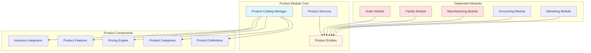
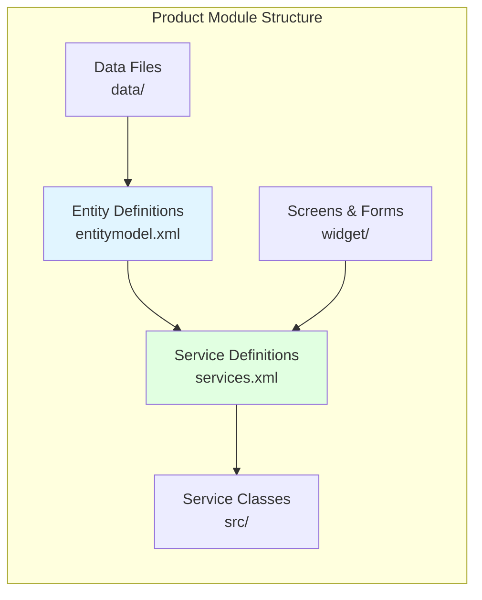
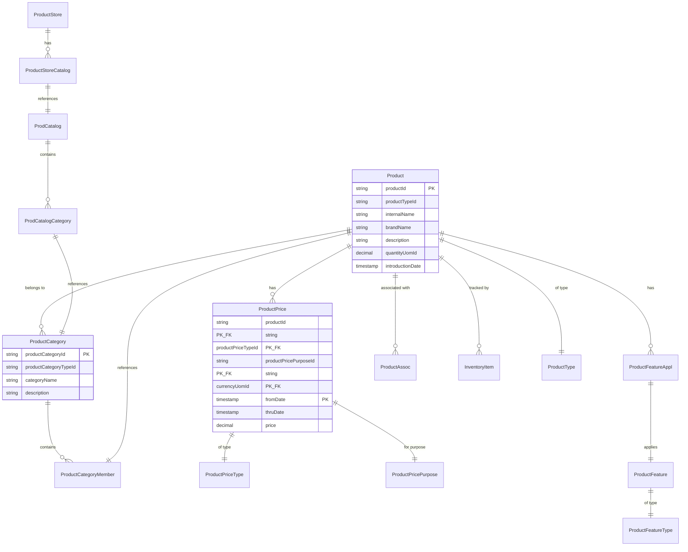
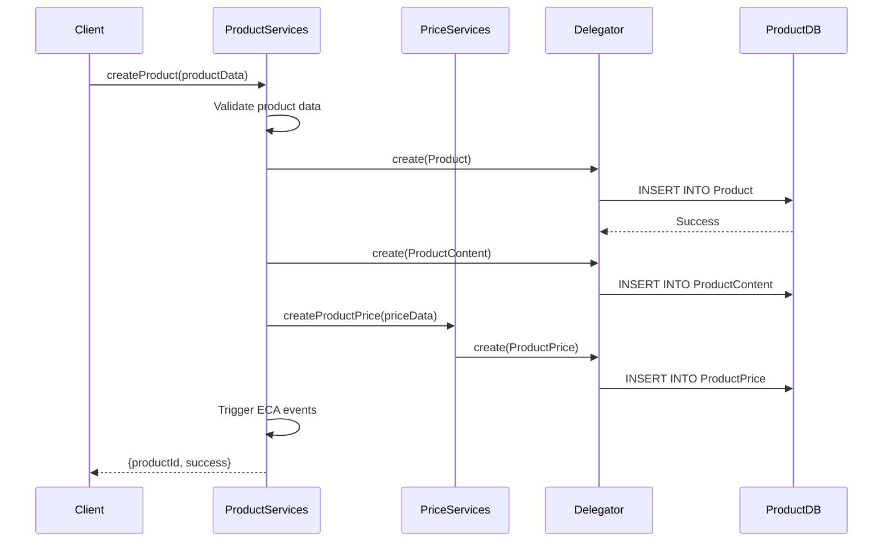
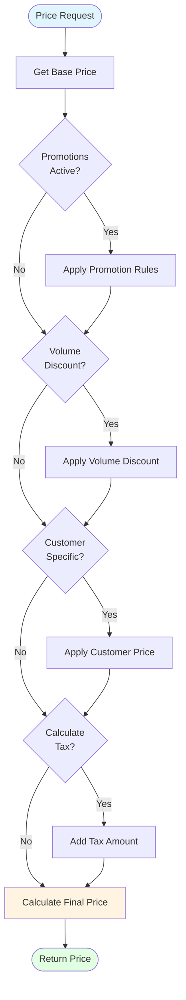
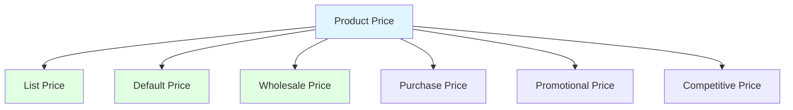
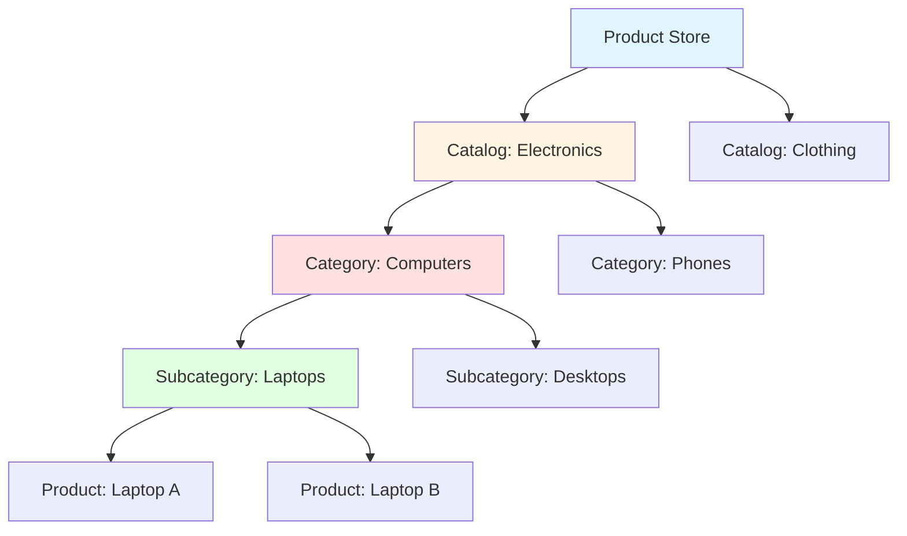
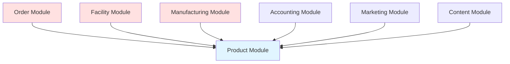
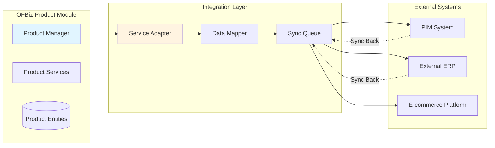

# Product Module Architecture

**Document Type**: Application Module Documentation  
**Module Classification**: Core Module (Cannot be Disabled)  
**Last Updated**: December 2024

---

## Overview

The Product module manages all product-related functionality in Apache OFBiz, including product definitions, catalogs, categories, pricing, inventory, and product features. It is a **core module that cannot be disabled** because it provides essential e-commerce and inventory management capabilities that other modules depend on.

### Why Product Module Cannot Be Disabled

The Product module is fundamental to OFBiz operations:

1. **Order Dependency**: Orders reference products - no products means no orders
2. **Inventory Management**: Facility and warehouse operations depend on product definitions
3. **Pricing Engine**: All pricing, promotions, and discounts are product-based
4. **Manufacturing**: Production runs require product definitions (raw materials, finished goods)
5. **Accounting**: Cost accounting and revenue recognition tied to products

Disabling the Product module would eliminate core business functionality across multiple domains.

---

## Module Architecture

### High-Level Architecture



### Component Structure



---

## Entity Model

### Core Product Entities



### Key Entity Descriptions

<details>
<summary><strong>Product Entity</strong> - Core product definition</summary>

**File**: `applications/product/entitydef/entitymodel.xml`

```xml
<entity entity-name="Product" package-name="org.apache.ofbiz.product.product">
    <field name="productId" type="id"></field>
    <field name="productTypeId" type="id"></field>
    <field name="primaryProductCategoryId" type="id"></field>
    <field name="internalName" type="name"></field>
    <field name="brandName" type="name"></field>
    <field name="comments" type="comment"></field>
    <field name="description" type="description"></field>
    <field name="longDescription" type="very-long"></field>
    <field name="quantityUomId" type="id"></field>
    <field name="introductionDate" type="date-time"></field>
    <field name="salesDiscontinuationDate" type="date-time"></field>
    <prim-key field="productId"/>
</entity>
```

The Product entity represents any sellable or trackable item in the system.

</details>

<details>
<summary><strong>ProductPrice Entity</strong> - Product pricing</summary>

**File**: `applications/product/entitydef/entitymodel.xml`

```xml
<entity entity-name="ProductPrice" package-name="org.apache.ofbiz.product.price">
    <field name="productId" type="id"></field>
    <field name="productPriceTypeId" type="id"></field>
    <field name="productPricePurposeId" type="id"></field>
    <field name="currencyUomId" type="id"></field>
    <field name="productStoreGroupId" type="id"></field>
    <field name="fromDate" type="date-time"></field>
    <field name="thruDate" type="date-time"></field>
    <field name="price" type="currency-amount"></field>
    <prim-key field="productId"/>
    <prim-key field="productPriceTypeId"/>
    <prim-key field="productPricePurposeId"/>
    <prim-key field="currencyUomId"/>
    <prim-key field="productStoreGroupId"/>
    <prim-key field="fromDate"/>
</entity>
```

ProductPrice supports complex pricing scenarios with date ranges, purposes, and store groups.

</details>


---

## Service Architecture

### Product Creation Flow



### Core Services

<details>
<summary><strong>createProduct Service</strong> - Create new product</summary>

**File**: `applications/product/servicedef/services.xml`

```xml
<service name="createProduct" engine="simple"
         location="component://product/minilang/product/ProductServices.xml" 
         invoke="createProduct" auth="true">
    <description>Create a Product</description>
    <permission-service service-name="productPermissionCheck" main-action="CREATE"/>
    <auto-attributes entity-name="Product" include="nonpk" mode="IN" optional="true"/>
    <attribute name="productId" type="String" mode="OUT" optional="false"/>
</service>
```

Creates a new product with all associated data.

</details>

<details>
<summary><strong>calculateProductPrice Service</strong> - Calculate price</summary>

**File**: `applications/product/servicedef/services.xml`

```xml
<service name="calculateProductPrice" engine="java"
         location="org.apache.ofbiz.product.price.PriceServices" 
         invoke="calculateProductPrice" auth="false">
    <description>Calculate Product Price</description>
    <attribute name="product" type="org.apache.ofbiz.entity.GenericValue" mode="IN" optional="false"/>
    <attribute name="prodCatalogId" type="String" mode="IN" optional="true"/>
    <attribute name="productStoreId" type="String" mode="IN" optional="true"/>
    <attribute name="partyId" type="String" mode="IN" optional="true"/>
    <attribute name="quantity" type="BigDecimal" mode="IN" optional="true"/>
    <attribute name="currencyUomId" type="String" mode="IN" optional="true"/>
    <attribute name="basePrice" type="BigDecimal" mode="OUT" optional="false"/>
    <attribute name="price" type="BigDecimal" mode="OUT" optional="false"/>
    <attribute name="listPrice" type="BigDecimal" mode="OUT" optional="true"/>
</service>
```

Complex pricing calculation considering promotions, discounts, and rules.

</details>

---

## Pricing Engine

### Price Calculation Flow



### Price Types



---

## Catalog Management

### Catalog Structure



---

## Module Dependencies

### Incoming Dependencies



### Dependency Examples

1. **Order Module**: OrderItem references `productId`
2. **Facility Module**: InventoryItem tracks `productId`
3. **Manufacturing**: ProductionRun produces `productId`
4. **Accounting**: InvoiceItem references `productId` for revenue

---

## Integration Patterns

### External Product Catalog Integration



<details>
<summary><strong>Product Import Service</strong></summary>

```java
public static Map<String, Object> importProductFromExternal(DispatchContext dctx, Map<String, ?> context) {
    Delegator delegator = dctx.getDelegator();
    LocalDispatcher dispatcher = dctx.getDispatcher();
    
    String externalProductId = (String) context.get("externalProductId");
    Map<String, Object> productData = (Map<String, Object>) context.get("productData");
    
    try {
        // Check if product exists
        List<GenericValue> existing = delegator.findByAnd("Product", 
            UtilMisc.toMap("externalId", externalProductId), null, false);
        
        if (UtilValidate.isEmpty(existing)) {
            // Create new product
            Map<String, Object> createContext = UtilMisc.toMap(
                "productTypeId", productData.get("productType"),
                "internalName", productData.get("name"),
                "description", productData.get("description"),
                "externalId", externalProductId
            );
            
            Map<String, Object> result = dispatcher.runSync("createProduct", createContext);
            String productId = (String) result.get("productId");
            
            // Create price
            dispatcher.runSync("createProductPrice", UtilMisc.toMap(
                "productId", productId,
                "productPriceTypeId", "DEFAULT_PRICE",
                "productPricePurposeId", "PURCHASE",
                "price", productData.get("price"),
                "currencyUomId", "USD"
            ));
            
            return ServiceUtil.returnSuccess("Product imported: " + productId);
        } else {
            // Update existing product
            GenericValue product = existing.get(0);
            product.set("internalName", productData.get("name"));
            product.set("description", productData.get("description"));
            product.store();
            
            return ServiceUtil.returnSuccess("Product updated: " + product.getString("productId"));
        }
    } catch (Exception e) {
        return ServiceUtil.returnError("Error importing product: " + e.getMessage());
    }
}
```

</details>

---

## Official References

- [Apache OFBiz Product Component](https://cwiki.apache.org/confluence/display/OFBIZ/Product+Component)
- [Product Data Model](https://cwiki.apache.org/confluence/display/OFBIZ/Product+Data+Model)
- [Catalog Management](https://cwiki.apache.org/confluence/display/OFBIZ/Catalog+Management)

---

## Related Documentation

- [Module Architecture Overview](../module-architecture-overview.md)
- [Product Domain Model](../../03-data-architecture/domain-models/product-domain.md)
- [Order Module](order-module.md)
- [Facility Module](../optional-modules/facility-module.md)

---

## Summary

The Product module is essential to OFBiz operations and cannot be disabled. It provides product definitions, catalog management, pricing engine, and inventory integration that all other business modules depend on. While it cannot be disabled, product data can be synchronized with external PIM or ERP systems using adapter patterns.
