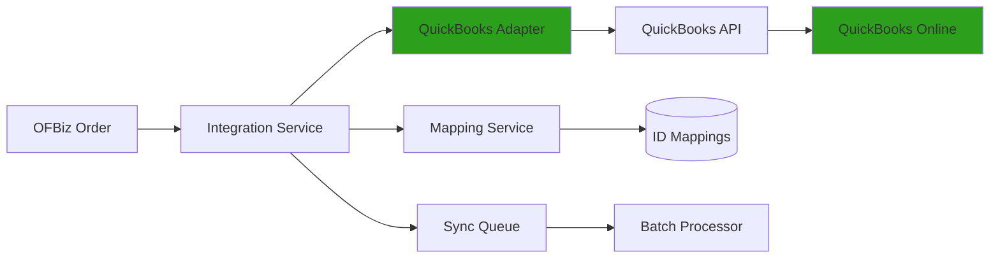

# QuickBooks Integration Example

**Purpose**: Detailed example of integrating OFBiz with QuickBooks Online for accounting, replacing the OFBiz Accounting module.

**Audience**: Integration Architects, Developers, Accountants

**Prerequisites**: 
- [Module Replacement Patterns](../module-replacement-patterns.md)
- [Accounting Domain Model](../../03-data-architecture/domain-models/accounting-domain.md)

**Related Documents**: 
- [Salesforce Integration](./salesforce-integration.md)

---

## Overview

This example demonstrates replacing the OFBiz Accounting module with QuickBooks Online while maintaining order-to-invoice workflows and financial reporting capabilities.

## Visual Architecture

### Integration Architecture



**Diagram Description**: QuickBooks integration architecture showing OFBiz orders flowing through integration service and adapter to QuickBooks Online, with ID mapping and batch processing support.

## Implementation

### 1. QuickBooks Client Setup

**Dependencies** (`build.gradle`):
```gradle
dependencies {
    implementation 'com.intuit.quickbooks-online:ipp-v3-java-devkit:6.0.7'
    implementation 'com.intuit.quickbooks-online:oauth2-platform-api:6.0.7'
}
```

**Configuration**:
```properties
# quickbooks.properties
quickbooks.clientId=YOUR_CLIENT_ID
quickbooks.clientSecret=YOUR_CLIENT_SECRET
quickbooks.redirectUri=https://yourapp.com/oauth/callback
quickbooks.realmId=YOUR_COMPANY_ID
quickbooks.accessToken=YOUR_ACCESS_TOKEN
quickbooks.refreshToken=YOUR_REFRESH_TOKEN
```

**Client Initialization**:
```java
public class QuickBooksClient {
    private DataService dataService;
    
    public QuickBooksClient() {
        OAuth2Config oauth2Config = new OAuth2Config.OAuth2ConfigBuilder(
            UtilProperties.getPropertyValue("quickbooks", "clientId"),
            UtilProperties.getPropertyValue("quickbooks", "clientSecret"))
            .accessToken(UtilProperties.getPropertyValue("quickbooks", "accessToken"))
            .refreshToken(UtilProperties.getPropertyValue("quickbooks", "refreshToken"))
            .build();
        
        Context context = new Context(oauth2Config, 
            ServiceType.QBO, 
            UtilProperties.getPropertyValue("quickbooks", "realmId"));
        
        dataService = new DataService(context);
    }
    
    public DataService getDataService() {
        return dataService;
    }
}
```

### 2. Invoice Synchronization

**Service Definition**:
```xml
<service name="syncOrderToQuickBooks" engine="java"
         location="com.company.integration.QuickBooksServices" 
         invoke="syncOrderToQuickBooks">
    <attribute name="orderId" type="String" mode="IN" required="true"/>
    <attribute name="qbInvoiceId" type="String" mode="OUT"/>
</service>
```

**Implementation**:
```java
public static Map<String, Object> syncOrderToQuickBooks(DispatchContext dctx, Map<String, ?> context) {
    Delegator delegator = dctx.getDelegator();
    String orderId = (String) context.get("orderId");
    
    try {
        // Load order from OFBiz
        GenericValue orderHeader = delegator.findOne("OrderHeader", 
            UtilMisc.toMap("orderId", orderId), false);
        List<GenericValue> orderItems = delegator.findByAnd("OrderItem",
            UtilMisc.toMap("orderId", orderId), null, false);
        
        // Get customer mapping
        String partyId = getOrderParty(orderHeader, "BILL_TO_CUSTOMER");
        String qbCustomerId = getQuickBooksCustomerId(partyId);
        
        if (qbCustomerId == null) {
            // Create customer in QuickBooks first
            qbCustomerId = createQuickBooksCustomer(partyId);
        }
        
        // Create invoice in QuickBooks
        Invoice qbInvoice = buildQuickBooksInvoice(orderHeader, orderItems, qbCustomerId);
        Invoice created = createInvoiceInQuickBooks(qbInvoice);
        
        // Store mapping
        storeInvoiceMapping(orderId, created.getId());
        
        Map<String, Object> result = ServiceUtil.returnSuccess();
        result.put("qbInvoiceId", created.getId());
        return result;
        
    } catch (Exception e) {
        return ServiceUtil.returnError("Failed to sync order to QuickBooks: " + e.getMessage());
    }
}

private static Invoice buildQuickBooksInvoice(GenericValue orderHeader, 
        List<GenericValue> orderItems, String qbCustomerId) {
    
    Invoice invoice = new Invoice();
    
    // Set customer
    ReferenceType customerRef = new ReferenceType();
    customerRef.setValue(qbCustomerId);
    invoice.setCustomerRef(customerRef);
    
    // Set date
    invoice.setTxnDate(orderHeader.getTimestamp("orderDate"));
    
    // Set line items
    List<Line> lines = new ArrayList<>();
    for (GenericValue orderItem : orderItems) {
        Line line = new Line();
        line.setAmount(orderItem.getBigDecimal("unitPrice")
            .multiply(orderItem.getBigDecimal("quantity")));
        line.setDetailType(LineDetailTypeEnum.SALES_ITEM_LINE_DETAIL);
        
        SalesItemLineDetail detail = new SalesItemLineDetail();
        detail.setQty(orderItem.getBigDecimal("quantity"));
        detail.setUnitPrice(orderItem.getBigDecimal("unitPrice"));
        
        // Map product to QuickBooks item
        String productId = orderItem.getString("productId");
        String qbItemId = getQuickBooksItemId(productId);
        if (qbItemId != null) {
            ReferenceType itemRef = new ReferenceType();
            itemRef.setValue(qbItemId);
            detail.setItemRef(itemRef);
        }
        
        line.setSalesItemLineDetail(detail);
        lines.add(line);
    }
    invoice.setLine(lines);
    
    return invoice;
}

private static Invoice createInvoiceInQuickBooks(Invoice invoice) throws FMSException {
    QuickBooksClient client = new QuickBooksClient();
    DataService dataService = client.getDataService();
    return dataService.add(invoice);
}
```

### 3. Payment Synchronization

**Implementation**:
```java
public static Map<String, Object> syncPaymentToQuickBooks(DispatchContext dctx, Map<String, ?> context) {
    String paymentId = (String) context.get("paymentId");
    
    try {
        // Load payment from OFBiz
        GenericValue payment = delegator.findOne("Payment", 
            UtilMisc.toMap("paymentId", paymentId), false);
        
        // Get invoice mapping
        String orderId = getOrderIdForPayment(paymentId);
        String qbInvoiceId = getQuickBooksInvoiceId(orderId);
        
        // Create payment in QuickBooks
        Payment qbPayment = new Payment();
        qbPayment.setTotalAmt(payment.getBigDecimal("amount"));
        qbPayment.setTxnDate(payment.getTimestamp("effectiveDate"));
        
        // Link to invoice
        Line line = new Line();
        line.setAmount(payment.getBigDecimal("amount"));
        LinkedTxn linkedTxn = new LinkedTxn();
        linkedTxn.setTxnId(qbInvoiceId);
        linkedTxn.setTxnType("Invoice");
        line.setLinkedTxn(Arrays.asList(linkedTxn));
        qbPayment.setLine(Arrays.asList(line));
        
        // Create in QuickBooks
        QuickBooksClient client = new QuickBooksClient();
        Payment created = client.getDataService().add(qbPayment);
        
        // Store mapping
        storePaymentMapping(paymentId, created.getId());
        
        return ServiceUtil.returnSuccess();
        
    } catch (Exception e) {
        return ServiceUtil.returnError("Failed to sync payment: " + e.getMessage());
    }
}
```

### 4. Customer Synchronization

**Implementation**:
```java
private static String createQuickBooksCustomer(String partyId) throws Exception {
    Delegator delegator = DelegatorFactory.getDelegator("default");
    
    // Load party data
    GenericValue party = delegator.findOne("Party", UtilMisc.toMap("partyId", partyId), false);
    GenericValue person = delegator.findOne("Person", UtilMisc.toMap("partyId", partyId), false);
    
    // Create QuickBooks customer
    Customer customer = new Customer();
    customer.setDisplayName(person.getString("firstName") + " " + person.getString("lastName"));
    customer.setGivenName(person.getString("firstName"));
    customer.setFamilyName(person.getString("lastName"));
    
    // Add email
    List<GenericValue> emails = getPartyEmails(partyId);
    if (!emails.isEmpty()) {
        EmailAddress email = new EmailAddress();
        email.setAddress(emails.get(0).getString("infoString"));
        customer.setPrimaryEmailAddr(email);
    }
    
    // Add address
    List<GenericValue> addresses = getPartyAddresses(partyId);
    if (!addresses.isEmpty()) {
        GenericValue address = addresses.get(0);
        PhysicalAddress physicalAddress = new PhysicalAddress();
        physicalAddress.setLine1(address.getString("address1"));
        physicalAddress.setCity(address.getString("city"));
        physicalAddress.setPostalCode(address.getString("postalCode"));
        customer.setBillAddr(physicalAddress);
    }
    
    // Create in QuickBooks
    QuickBooksClient client = new QuickBooksClient();
    Customer created = client.getDataService().add(customer);
    
    // Store mapping
    storeCustomerMapping(partyId, created.getId());
    
    return created.getId();
}
```

### 5. ECA Integration

**Automatic Sync on Order Completion**:
```xml
<service-eca service-name="changeOrderStatus" event="return">
    <condition field-name="statusId" operator="equals" value="ORDER_COMPLETED"/>
    <condition field-name="responseMessage" operator="equals" value="success"/>
    <action service="syncOrderToQuickBooks" mode="async"/>
</service-eca>

<service-eca service-name="createPayment" event="return">
    <condition field-name="responseMessage" operator="equals" value="success"/>
    <action service="syncPaymentToQuickBooks" mode="async"/>
</service-eca>
```

### 6. Batch Synchronization

**Scheduled Sync**:
```java
@Scheduled(cron = "0 0 * * * *") // Every hour
public void batchSyncToQuickBooks() {
    // Find orders not yet synced
    List<GenericValue> orders = EntityQuery.use(delegator)
        .from("OrderHeader")
        .where(EntityCondition.makeCondition("statusId", "ORDER_COMPLETED"))
        .queryList();
    
    for (GenericValue order : orders) {
        String orderId = order.getString("orderId");
        
        // Check if already synced
        if (getQuickBooksInvoiceId(orderId) == null) {
            try {
                dispatcher.runSync("syncOrderToQuickBooks", 
                    UtilMisc.toMap("orderId", orderId));
            } catch (Exception e) {
                Debug.logError("Failed to sync order " + orderId + ": " + e.getMessage(), module);
            }
        }
    }
}
```

## Error Handling

### Retry Logic

```java
public class QuickBooksRetryService {
    private static final int MAX_RETRIES = 3;
    
    public static Map<String, Object> syncWithRetry(String orderId) {
        int attempts = 0;
        Exception lastException = null;
        
        while (attempts < MAX_RETRIES) {
            try {
                return dispatcher.runSync("syncOrderToQuickBooks", 
                    UtilMisc.toMap("orderId", orderId));
            } catch (Exception e) {
                lastException = e;
                attempts++;
                
                if (attempts < MAX_RETRIES) {
                    Thread.sleep(5000 * attempts); // Exponential backoff
                }
            }
        }
        
        // Log failure
        logSyncFailure(orderId, lastException);
        return ServiceUtil.returnError("Failed after " + MAX_RETRIES + " attempts");
    }
}
```

## Testing

```java
@Test
public void testQuickBooksInvoiceSync() {
    // Create test order
    Map<String, Object> orderContext = createTestOrder();
    Map<String, Object> orderResult = dispatcher.runSync("createOrder", orderContext);
    String orderId = (String) orderResult.get("orderId");
    
    // Sync to QuickBooks
    Map<String, Object> syncResult = dispatcher.runSync("syncOrderToQuickBooks",
        UtilMisc.toMap("orderId", orderId));
    
    assertTrue(ServiceUtil.isSuccess(syncResult));
    
    String qbInvoiceId = (String) syncResult.get("qbInvoiceId");
    assertNotNull(qbInvoiceId);
    
    // Verify in QuickBooks
    QuickBooksClient client = new QuickBooksClient();
    Invoice invoice = client.getDataService().findById(new Invoice(), qbInvoiceId);
    assertNotNull(invoice);
    assertEquals(orderContext.get("grandTotal"), invoice.getTotalAmt());
}
```

## Best Practices

1. **OAuth Token Management**: Refresh tokens before expiry
2. **Rate Limiting**: Respect QuickBooks API rate limits (500 requests/minute)
3. **Error Handling**: Implement retry logic with exponential backoff
4. **Data Validation**: Validate data before sending to QuickBooks
5. **Monitoring**: Log all API calls and track sync status

## Official References

- [QuickBooks Online API](https://developer.intuit.com/app/developer/qbo/docs/api/accounting/all-entities/invoice)
- [QuickBooks Java SDK](https://developer.intuit.com/app/developer/qbo/docs/develop/sdks-and-samples-collections/java)

## Related Topics

- [Module Replacement Patterns](../module-replacement-patterns.md)
- [Accounting Domain Model](../../03-data-architecture/domain-models/accounting-domain.md)
- [Salesforce Integration](./salesforce-integration.md)

---

**Next**: [Salesforce Integration](./salesforce-integration.md)

**Up**: [Application Modules](../README.md)

**Home**: [Master Index](../../00-INDEX.md)

---

**Document Metadata**:
- **Version**: 1.0
- **Last Updated**: December 2024
- **OFBiz Version**: Trunk (Latest)
- **Status**: Complete
