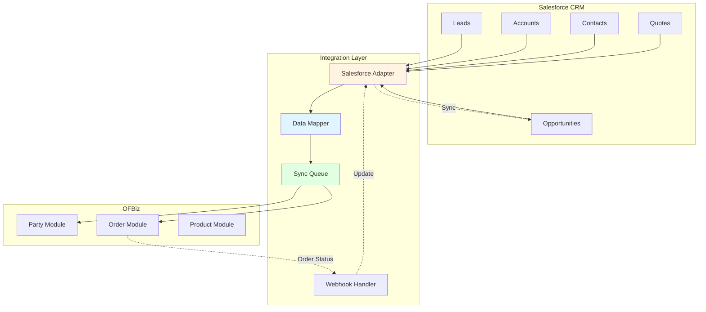
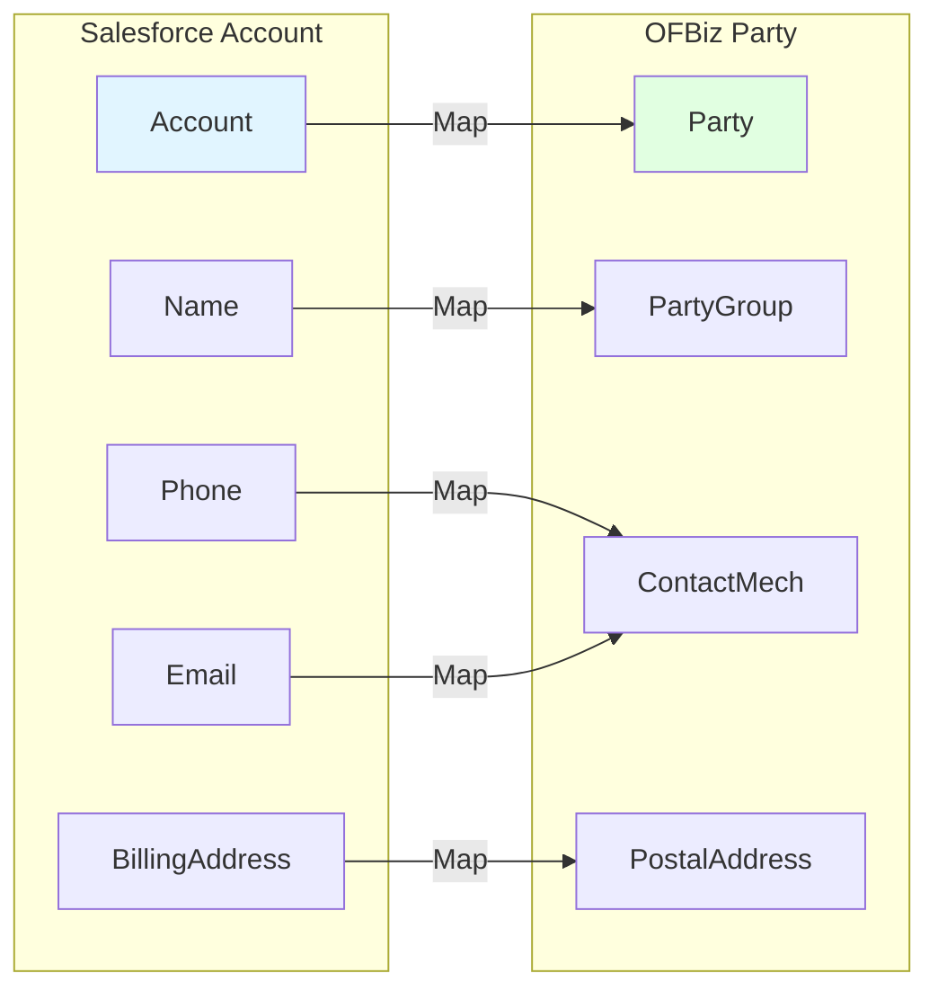
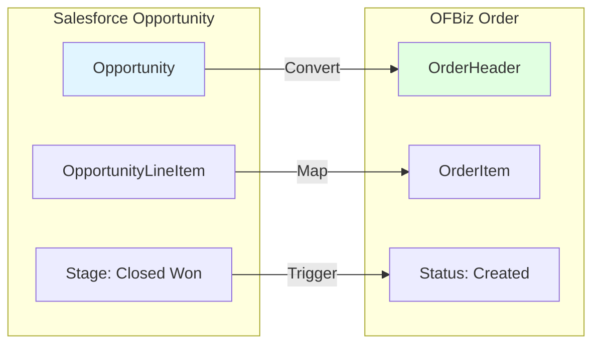

# Salesforce CRM Integration

**Document Type**: Integration Example  
**Integration Type**: External CRM System  
**Last Updated**: December 2024

---

## Overview

This document demonstrates how to integrate Apache OFBiz with Salesforce CRM for customer relationship management. This integration allows OFBiz to focus on order processing and fulfillment while Salesforce handles sales, marketing, and customer service.

### Integration Scenario

**Use Case**: Hybrid architecture where Salesforce manages customer relationships and OFBiz handles order fulfillment.

**Data Flow**:
- Salesforce → OFBiz: Customer data, opportunities, quotes
- OFBiz → Salesforce: Order status, shipment tracking, invoices

---

## Integration Architecture



---

## Data Mapping

### Salesforce Account → OFBiz Party



### Salesforce Opportunity → OFBiz Order



---

## Implementation

### Salesforce Adapter Service

<details>
<summary><strong>Sync Account to Party Service</strong></summary>

```java
package com.company.integration.salesforce;

import org.apache.ofbiz.base.util.*;
import org.apache.ofbiz.entity.Delegator;
import org.apache.ofbiz.entity.GenericValue;
import org.apache.ofbiz.service.DispatchContext;
import org.apache.ofbiz.service.LocalDispatcher;
import org.apache.ofbiz.service.ServiceUtil;
import com.sforce.soap.enterprise.*;
import com.sforce.ws.ConnectionException;

public class SalesforceIntegrationServices {
    
    public static Map<String, Object> syncAccountToParty(DispatchContext dctx, Map<String, ?> context) {
        Delegator delegator = dctx.getDelegator();
        LocalDispatcher dispatcher = dctx.getDispatcher();
        
        String salesforceAccountId = (String) context.get("salesforceAccountId");
        
        try {
            // Connect to Salesforce
            EnterpriseConnection connection = getSalesforceConnection();
            
            // Query account data
            QueryResult qr = connection.query(
                "SELECT Id, Name, Phone, BillingStreet, BillingCity, BillingState, " +
                "BillingPostalCode, BillingCountry FROM Account WHERE Id = '" + salesforceAccountId + "'"
            );
            
            if (qr.getSize() == 0) {
                return ServiceUtil.returnError("Account not found in Salesforce: " + salesforceAccountId);
            }
            
            SObject account = qr.getRecords()[0];
            
            // Check if party already exists
            List<GenericValue> existingParties = delegator.findByAnd("Party", 
                UtilMisc.toMap("externalId", salesforceAccountId), null, false);
            
            String partyId;
            
            if (UtilValidate.isEmpty(existingParties)) {
                // Create new party
                Map<String, Object> createPartyContext = UtilMisc.toMap(
                    "partyTypeId", "PARTY_GROUP",
                    "externalId", salesforceAccountId,
                    "userLogin", context.get("userLogin")
                );
                
                Map<String, Object> createPartyResult = dispatcher.runSync("createParty", createPartyContext);
                partyId = (String) createPartyResult.get("partyId");
                
                // Create party group
                Map<String, Object> createGroupContext = UtilMisc.toMap(
                    "partyId", partyId,
                    "groupName", account.getField("Name"),
                    "userLogin", context.get("userLogin")
                );
                dispatcher.runSync("createPartyGroup", createGroupContext);
                
            } else {
                // Update existing party
                partyId = existingParties.get(0).getString("partyId");
                
                GenericValue partyGroup = delegator.findOne("PartyGroup", 
                    UtilMisc.toMap("partyId", partyId), false);
                partyGroup.set("groupName", account.getField("Name"));
                partyGroup.store();
            }
            
            // Sync phone number
            if (UtilValidate.isNotEmpty(account.getField("Phone"))) {
                Map<String, Object> phoneContext = UtilMisc.toMap(
                    "partyId", partyId,
                    "contactNumber", account.getField("Phone"),
                    "contactMechPurposeTypeId", "PRIMARY_PHONE",
                    "userLogin", context.get("userLogin")
                );
                dispatcher.runSync("createPartyTelecomNumber", phoneContext);
            }
            
            // Sync billing address
            if (UtilValidate.isNotEmpty(account.getField("BillingStreet"))) {
                Map<String, Object> addressContext = UtilMisc.toMap(
                    "partyId", partyId,
                    "address1", account.getField("BillingStreet"),
                    "city", account.getField("BillingCity"),
                    "stateProvinceGeoId", account.getField("BillingState"),
                    "postalCode", account.getField("BillingPostalCode"),
                    "countryGeoId", account.getField("BillingCountry"),
                    "contactMechPurposeTypeId", "BILLING_LOCATION",
                    "userLogin", context.get("userLogin")
                );
                dispatcher.runSync("createPartyPostalAddress", addressContext);
            }
            
            return ServiceUtil.returnSuccess("Account synced to Party: " + partyId);
            
        } catch (ConnectionException | GenericEntityException | GenericServiceException e) {
            return ServiceUtil.returnError("Error syncing account: " + e.getMessage());
        }
    }
}
```

</details>

<details>
<summary><strong>Convert Opportunity to Order Service</strong></summary>

```java
public static Map<String, Object> convertOpportunityToOrder(DispatchContext dctx, Map<String, ?> context) {
    Delegator delegator = dctx.getDelegator();
    LocalDispatcher dispatcher = dctx.getDispatcher();
    
    String opportunityId = (String) context.get("opportunityId");
    
    try {
        // Connect to Salesforce
        EnterpriseConnection connection = getSalesforceConnection();
        
        // Query opportunity and line items
        QueryResult qr = connection.query(
            "SELECT Id, Name, AccountId, Amount, CloseDate, " +
            "(SELECT Id, Product2Id, Quantity, UnitPrice FROM OpportunityLineItems) " +
            "FROM Opportunity WHERE Id = '" + opportunityId + "' AND StageName = 'Closed Won'"
        );
        
        if (qr.getSize() == 0) {
            return ServiceUtil.returnError("Opportunity not found or not Closed Won: " + opportunityId);
        }
        
        SObject opportunity = qr.getRecords()[0];
        String accountId = (String) opportunity.getField("AccountId");
        
        // Find corresponding party
        List<GenericValue> parties = delegator.findByAnd("Party", 
            UtilMisc.toMap("externalId", accountId), null, false);
        
        if (UtilValidate.isEmpty(parties)) {
            // Sync account first
            dispatcher.runSync("syncAccountToParty", UtilMisc.toMap("salesforceAccountId", accountId));
            parties = delegator.findByAnd("Party", UtilMisc.toMap("externalId", accountId), null, false);
        }
        
        String partyId = parties.get(0).getString("partyId");
        
        // Prepare order items
        List<Map<String, Object>> orderItems = new ArrayList<>();
        SObject[] lineItems = opportunity.getChild("OpportunityLineItems").getRecords();
        
        for (SObject lineItem : lineItems) {
            String productCode = (String) lineItem.getField("Product2Id");
            
            // Map Salesforce product to OFBiz product
            List<GenericValue> products = delegator.findByAnd("Product", 
                UtilMisc.toMap("externalId", productCode), null, false);
            
            if (UtilValidate.isNotEmpty(products)) {
                orderItems.add(UtilMisc.toMap(
                    "productId", products.get(0).getString("productId"),
                    "quantity", lineItem.getField("Quantity"),
                    "unitPrice", lineItem.getField("UnitPrice")
                ));
            }
        }
        
        // Create order
        Map<String, Object> createOrderContext = UtilMisc.toMap(
            "orderTypeId", "SALES_ORDER",
            "orderName", "SF Opp: " + opportunity.getField("Name"),
            "externalId", opportunityId,
            "currencyUom", "USD",
            "orderItems", orderItems,
            "orderRoles", UtilMisc.toList(
                UtilMisc.toMap("partyId", partyId, "roleTypeId", "BILL_TO_CUSTOMER"),
                UtilMisc.toMap("partyId", partyId, "roleTypeId", "SHIP_TO_CUSTOMER")
            ),
            "userLogin", context.get("userLogin")
        );
        
        Map<String, Object> createOrderResult = dispatcher.runSync("createOrder", createOrderContext);
        String orderId = (String) createOrderResult.get("orderId");
        
        // Update opportunity with order reference
        SObject oppUpdate = new SObject("Opportunity");
        oppUpdate.setId(opportunityId);
        oppUpdate.setField("OFBiz_Order_Id__c", orderId);  // Custom field in Salesforce
        connection.update(new SObject[]{oppUpdate});
        
        return ServiceUtil.returnSuccess("Order created from opportunity: " + orderId);
        
    } catch (Exception e) {
        return ServiceUtil.returnError("Error converting opportunity: " + e.getMessage());
    }
}
```

</details>

---

## Webhook Integration

### OFBiz → Salesforce Order Status Updates

<details>
<summary><strong>ECA Rule to Trigger Salesforce Update</strong></summary>

```xml
<!-- In applications/order/entitydef/eecas.xml -->
<eca entity="OrderHeader" operation="create-store" event="return">
    <condition field-name="statusId" operator="equals" value="ORDER_COMPLETED"/>
    <condition field-name="externalId" operator="is-not-empty"/>
    <action service="updateSalesforceOpportunityStatus" mode="async"/>
</eca>
```

</details>

<details>
<summary><strong>Update Salesforce Service</strong></summary>

```java
public static Map<String, Object> updateSalesforceOpportunityStatus(DispatchContext dctx, Map<String, ?> context) {
    Delegator delegator = dctx.getDelegator();
    GenericValue orderHeader = (GenericValue) context.get("instance");
    
    try {
        String opportunityId = orderHeader.getString("externalId");
        String orderId = orderHeader.getString("orderId");
        String statusId = orderHeader.getString("statusId");
        
        // Connect to Salesforce
        EnterpriseConnection connection = getSalesforceConnection();
        
        // Update opportunity
        SObject opp = new SObject("Opportunity");
        opp.setId(opportunityId);
        opp.setField("OFBiz_Order_Status__c", statusId);
        opp.setField("OFBiz_Order_Id__c", orderId);
        
        if ("ORDER_COMPLETED".equals(statusId)) {
            opp.setField("StageName", "Delivered");
        }
        
        connection.update(new SObject[]{opp});
        
        return ServiceUtil.returnSuccess("Salesforce opportunity updated");
        
    } catch (Exception e) {
        Debug.logError("Error updating Salesforce: " + e.getMessage(), module);
        return ServiceUtil.returnError("Error updating Salesforce: " + e.getMessage());
    }
}
```

</details>

---

## Configuration

### Service Definitions

```xml
<!-- In component://integration/servicedef/services.xml -->
<service name="syncAccountToParty" engine="java"
         location="com.company.integration.salesforce.SalesforceIntegrationServices" 
         invoke="syncAccountToParty" auth="true">
    <description>Sync Salesforce Account to OFBiz Party</description>
    <attribute name="salesforceAccountId" type="String" mode="IN" optional="false"/>
    <attribute name="partyId" type="String" mode="OUT" optional="false"/>
</service>

<service name="convertOpportunityToOrder" engine="java"
         location="com.company.integration.salesforce.SalesforceIntegrationServices" 
         invoke="convertOpportunityToOrder" auth="true">
    <description>Convert Salesforce Opportunity to OFBiz Order</description>
    <attribute name="opportunityId" type="String" mode="IN" optional="false"/>
    <attribute name="orderId" type="String" mode="OUT" optional="false"/>
</service>

<service name="updateSalesforceOpportunityStatus" engine="java"
         location="com.company.integration.salesforce.SalesforceIntegrationServices" 
         invoke="updateSalesforceOpportunityStatus" auth="true">
    <description>Update Salesforce Opportunity with Order Status</description>
    <attribute name="instance" type="org.apache.ofbiz.entity.GenericValue" mode="IN" optional="false"/>
</service>
```

---

## Deployment Considerations

### Authentication

Use OAuth 2.0 for Salesforce authentication:

```properties
# In integration.properties
salesforce.clientId=YOUR_CLIENT_ID
salesforce.clientSecret=YOUR_CLIENT_SECRET
salesforce.username=YOUR_USERNAME
salesforce.password=YOUR_PASSWORD
salesforce.securityToken=YOUR_SECURITY_TOKEN
salesforce.loginUrl=https://login.salesforce.com
```

### Error Handling

Implement retry logic and dead letter queue for failed syncs:

```java
public static void handleSyncFailure(String entityType, String entityId, String errorMessage) {
    // Log to sync error table
    GenericValue syncError = delegator.makeValue("SyncError");
    syncError.set("syncErrorId", delegator.getNextSeqId("SyncError"));
    syncError.set("entityType", entityType);
    syncError.set("entityId", entityId);
    syncError.set("errorMessage", errorMessage);
    syncError.set("retryCount", 0);
    syncError.set("createdDate", UtilDateTime.nowTimestamp());
    syncError.create();
}
```

---

## Official References

- [Salesforce REST API Documentation](https://developer.salesforce.com/docs/atlas.en-us.api_rest.meta/api_rest/)
- [Salesforce Enterprise WSDL](https://developer.salesforce.com/docs/atlas.en-us.api.meta/api/)

---

## Related Documentation

- [Module Replacement Patterns](../module-replacement-patterns.md)
- [Party Module](../core-modules/party-module.md)
- [External Service Adapters](../../05-integration-architecture/external-service-adapters.md)

---

## Summary

Salesforce CRM integration enables a hybrid architecture where Salesforce manages customer relationships and OFBiz handles order fulfillment. Use bidirectional sync to keep customer data, opportunities, and order status synchronized between systems.
