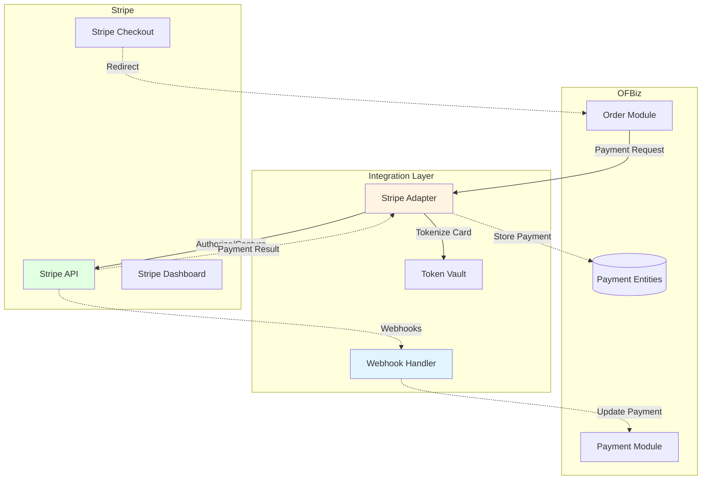
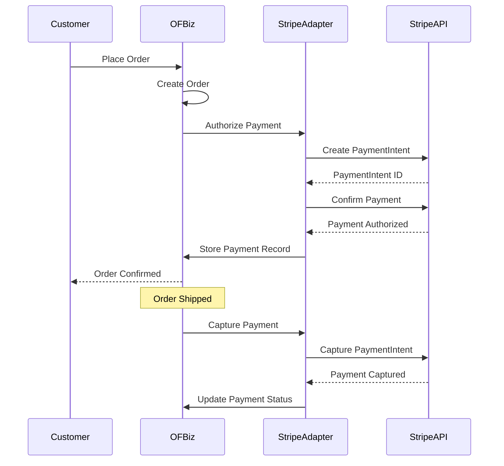
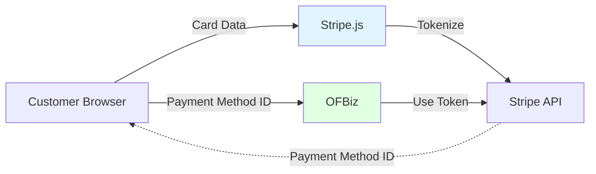

# Stripe Payment Integration

**Document Type**: Integration Example  
**Integration Type**: External Payment Gateway  
**Last Updated**: December 2024

---

## Overview

This document demonstrates how to integrate Apache OFBiz with Stripe for payment processing. Stripe provides modern payment APIs for credit cards, digital wallets, and alternative payment methods while OFBiz maintains transaction records and order management.

### Integration Scenario

**Use Case**: Use Stripe as the payment gateway while maintaining payment records in OFBiz for accounting and reconciliation.

**Data Flow**:
- OFBiz → Stripe: Payment authorization/capture requests
- Stripe → OFBiz: Payment confirmations, webhooks for events
- OFBiz: Maintains payment records linked to orders

---

## Integration Architecture



---

## Payment Flow

### Authorization and Capture Flow



---

## Implementation

### Stripe Adapter Service

<details>
<summary><strong>Authorize Payment Service</strong></summary>

```java
package com.company.integration.stripe;

import com.stripe.Stripe;
import com.stripe.model.PaymentIntent;
import com.stripe.param.PaymentIntentCreateParams;
import org.apache.ofbiz.base.util.*;
import org.apache.ofbiz.entity.Delegator;
import org.apache.ofbiz.entity.GenericValue;
import org.apache.ofbiz.service.DispatchContext;
import org.apache.ofbiz.service.ServiceUtil;

public class StripePaymentServices {
    
    public static final String module = StripePaymentServices.class.getName();
    
    public static Map<String, Object> stripeAuthorize(DispatchContext dctx, Map<String, ?> context) {
        Delegator delegator = dctx.getDelegator();
        
        String orderId = (String) context.get("orderId");
        BigDecimal amount = (BigDecimal) context.get("amount");
        String currency = (String) context.get("currency");
        String paymentMethodId = (String) context.get("paymentMethodId");
        
        try {
            // Set Stripe API key
            Stripe.apiKey = UtilProperties.getPropertyValue("stripe.properties", "stripe.secretKey");
            
            // Convert amount to cents (Stripe uses smallest currency unit)
            long amountInCents = amount.multiply(new BigDecimal(100)).longValue();
            
            // Create PaymentIntent
            PaymentIntentCreateParams params = PaymentIntentCreateParams.builder()
                .setAmount(amountInCents)
                .setCurrency(currency.toLowerCase())
                .setPaymentMethod(paymentMethodId)
                .setCaptureMethod(PaymentIntentCreateParams.CaptureMethod.MANUAL)  // Authorize only
                .setConfirm(true)
                .putMetadata("orderId", orderId)
                .build();
            
            PaymentIntent paymentIntent = PaymentIntent.create(params);
            
            // Check status
            if ("requires_capture".equals(paymentIntent.getStatus())) {
                // Create payment record in OFBiz
                GenericValue payment = delegator.makeValue("Payment");
                payment.set("paymentId", delegator.getNextSeqId("Payment"));
                payment.set("paymentTypeId", "CREDIT_CARD");
                payment.set("paymentMethodTypeId", "CREDIT_CARD");
                payment.set("amount", amount);
                payment.set("currencyUomId", currency);
                payment.set("statusId", "PMNT_AUTHORIZED");
                payment.set("externalId", paymentIntent.getId());  // Store Stripe PaymentIntent ID
                payment.set("effectiveDate", UtilDateTime.nowTimestamp());
                payment.create();
                
                // Link payment to order
                GenericValue orderPaymentPreference = delegator.makeValue("OrderPaymentPreference");
                orderPaymentPreference.set("orderPaymentPreferenceId", delegator.getNextSeqId("OrderPaymentPreference"));
                orderPaymentPreference.set("orderId", orderId);
                orderPaymentPreference.set("paymentMethodTypeId", "CREDIT_CARD");
                orderPaymentPreference.set("maxAmount", amount);
                orderPaymentPreference.set("statusId", "PAYMENT_AUTHORIZED");
                orderPaymentPreference.set("externalId", paymentIntent.getId());
                orderPaymentPreference.create();
                
                Map<String, Object> result = ServiceUtil.returnSuccess("Payment authorized successfully");
                result.put("paymentId", payment.getString("paymentId"));
                result.put("stripePaymentIntentId", paymentIntent.getId());
                return result;
                
            } else {
                return ServiceUtil.returnError("Payment authorization failed: " + paymentIntent.getStatus());
            }
            
        } catch (Exception e) {
            Debug.logError(e, "Error authorizing payment with Stripe", module);
            return ServiceUtil.returnError("Error authorizing payment: " + e.getMessage());
        }
    }
}
```

</details>

<details>
<summary><strong>Capture Payment Service</strong></summary>

```java
public static Map<String, Object> stripeCapture(DispatchContext dctx, Map<String, ?> context) {
    Delegator delegator = dctx.getDelegator();
    
    String paymentId = (String) context.get("paymentId");
    BigDecimal amount = (BigDecimal) context.get("amount");
    
    try {
        // Get payment record
        GenericValue payment = delegator.findOne("Payment", UtilMisc.toMap("paymentId", paymentId), false);
        
        if (payment == null) {
            return ServiceUtil.returnError("Payment not found: " + paymentId);
        }
        
        String paymentIntentId = payment.getString("externalId");
        
        // Set Stripe API key
        Stripe.apiKey = UtilProperties.getPropertyValue("stripe.properties", "stripe.secretKey");
        
        // Retrieve and capture PaymentIntent
        PaymentIntent paymentIntent = PaymentIntent.retrieve(paymentIntentId);
        
        // Capture with optional amount (can be less than authorized)
        PaymentIntentCaptureParams captureParams = null;
        if (amount != null) {
            long amountInCents = amount.multiply(new BigDecimal(100)).longValue();
            captureParams = PaymentIntentCaptureParams.builder()
                .setAmountToCapture(amountInCents)
                .build();
        }
        
        PaymentIntent capturedIntent = paymentIntent.capture(captureParams);
        
        // Check status
        if ("succeeded".equals(capturedIntent.getStatus())) {
            // Update payment record
            payment.set("statusId", "PMNT_RECEIVED");
            payment.set("actualCurrencyAmount", amount != null ? amount : payment.getBigDecimal("amount"));
            payment.store();
            
            // Update order payment preference
            List<GenericValue> orderPaymentPrefs = delegator.findByAnd("OrderPaymentPreference", 
                UtilMisc.toMap("externalId", paymentIntentId), null, false);
            
            for (GenericValue pref : orderPaymentPrefs) {
                pref.set("statusId", "PAYMENT_RECEIVED");
                pref.store();
            }
            
            return ServiceUtil.returnSuccess("Payment captured successfully");
            
        } else {
            return ServiceUtil.returnError("Payment capture failed: " + capturedIntent.getStatus());
        }
        
    } catch (Exception e) {
        Debug.logError(e, "Error capturing payment with Stripe", module);
        return ServiceUtil.returnError("Error capturing payment: " + e.getMessage());
    }
}
```

</details>

<details>
<summary><strong>Refund Payment Service</strong></summary>

```java
public static Map<String, Object> stripeRefund(DispatchContext dctx, Map<String, ?> context) {
    Delegator delegator = dctx.getDelegator();
    
    String paymentId = (String) context.get("paymentId");
    BigDecimal amount = (BigDecimal) context.get("amount");
    String reason = (String) context.get("reason");
    
    try {
        // Get payment record
        GenericValue payment = delegator.findOne("Payment", UtilMisc.toMap("paymentId", paymentId), false);
        String paymentIntentId = payment.getString("externalId");
        
        // Set Stripe API key
        Stripe.apiKey = UtilProperties.getPropertyValue("stripe.properties", "stripe.secretKey");
        
        // Create refund
        RefundCreateParams.Builder paramsBuilder = RefundCreateParams.builder()
            .setPaymentIntent(paymentIntentId);
        
        if (amount != null) {
            long amountInCents = amount.multiply(new BigDecimal(100)).longValue();
            paramsBuilder.setAmount(amountInCents);
        }
        
        if (UtilValidate.isNotEmpty(reason)) {
            paramsBuilder.setReason(RefundCreateParams.Reason.valueOf(reason.toUpperCase()));
        }
        
        Refund refund = Refund.create(paramsBuilder.build());
        
        // Create refund payment record
        GenericValue refundPayment = delegator.makeValue("Payment");
        refundPayment.set("paymentId", delegator.getNextSeqId("Payment"));
        refundPayment.set("paymentTypeId", "CUSTOMER_REFUND");
        refundPayment.set("paymentMethodTypeId", "CREDIT_CARD");
        refundPayment.set("amount", amount != null ? amount : payment.getBigDecimal("amount"));
        refundPayment.set("currencyUomId", payment.getString("currencyUomId"));
        refundPayment.set("statusId", "PMNT_SENT");
        refundPayment.set("externalId", refund.getId());
        refundPayment.set("effectiveDate", UtilDateTime.nowTimestamp());
        refundPayment.create();
        
        return ServiceUtil.returnSuccess("Refund processed successfully");
        
    } catch (Exception e) {
        Debug.logError(e, "Error processing refund with Stripe", module);
        return ServiceUtil.returnError("Error processing refund: " + e.getMessage());
    }
}
```

</details>

---

## Webhook Integration

### Stripe Webhook Handler

<details>
<summary><strong>Webhook Event Handler</strong></summary>

```java
public static Map<String, Object> handleStripeWebhook(DispatchContext dctx, Map<String, ?> context) {
    Delegator delegator = dctx.getDelegator();
    LocalDispatcher dispatcher = dctx.getDispatcher();
    
    String payload = (String) context.get("payload");
    String sigHeader = (String) context.get("stripeSignature");
    
    try {
        // Verify webhook signature
        String webhookSecret = UtilProperties.getPropertyValue("stripe.properties", "stripe.webhookSecret");
        Event event = Webhook.constructEvent(payload, sigHeader, webhookSecret);
        
        // Handle different event types
        switch (event.getType()) {
            case "payment_intent.succeeded":
                handlePaymentIntentSucceeded(delegator, dispatcher, event);
                break;
                
            case "payment_intent.payment_failed":
                handlePaymentIntentFailed(delegator, dispatcher, event);
                break;
                
            case "charge.refunded":
                handleChargeRefunded(delegator, dispatcher, event);
                break;
                
            case "charge.dispute.created":
                handleDisputeCreated(delegator, dispatcher, event);
                break;
                
            default:
                Debug.logInfo("Unhandled event type: " + event.getType(), module);
        }
        
        return ServiceUtil.returnSuccess("Webhook processed");
        
    } catch (Exception e) {
        Debug.logError(e, "Error processing Stripe webhook", module);
        return ServiceUtil.returnError("Error processing webhook: " + e.getMessage());
    }
}

private static void handlePaymentIntentSucceeded(Delegator delegator, LocalDispatcher dispatcher, Event event) 
        throws GenericEntityException {
    PaymentIntent paymentIntent = (PaymentIntent) event.getDataObjectDeserializer().getObject().get();
    String paymentIntentId = paymentIntent.getId();
    
    // Find payment in OFBiz
    List<GenericValue> payments = delegator.findByAnd("Payment", 
        UtilMisc.toMap("externalId", paymentIntentId), null, false);
    
    for (GenericValue payment : payments) {
        if ("PMNT_AUTHORIZED".equals(payment.getString("statusId"))) {
            payment.set("statusId", "PMNT_RECEIVED");
            payment.store();
            
            Debug.logInfo("Payment " + payment.getString("paymentId") + " marked as received", module);
        }
    }
}

private static void handlePaymentIntentFailed(Delegator delegator, LocalDispatcher dispatcher, Event event) 
        throws GenericEntityException {
    PaymentIntent paymentIntent = (PaymentIntent) event.getDataObjectDeserializer().getObject().get();
    String paymentIntentId = paymentIntent.getId();
    
    // Find payment in OFBiz
    List<GenericValue> payments = delegator.findByAnd("Payment", 
        UtilMisc.toMap("externalId", paymentIntentId), null, false);
    
    for (GenericValue payment : payments) {
        payment.set("statusId", "PMNT_DECLINED");
        payment.store();
        
        Debug.logWarning("Payment " + payment.getString("paymentId") + " failed", module);
    }
}
```

</details>

---

## Configuration

### Service Definitions

```xml
<!-- In component://integration/servicedef/services.xml -->
<service name="stripeAuthorize" engine="java"
         location="com.company.integration.stripe.StripePaymentServices" 
         invoke="stripeAuthorize" auth="true">
    <description>Authorize payment with Stripe</description>
    <attribute name="orderId" type="String" mode="IN" optional="false"/>
    <attribute name="amount" type="BigDecimal" mode="IN" optional="false"/>
    <attribute name="currency" type="String" mode="IN" optional="false"/>
    <attribute name="paymentMethodId" type="String" mode="IN" optional="false"/>
    <attribute name="paymentId" type="String" mode="OUT" optional="false"/>
    <attribute name="stripePaymentIntentId" type="String" mode="OUT" optional="false"/>
</service>

<service name="stripeCapture" engine="java"
         location="com.company.integration.stripe.StripePaymentServices" 
         invoke="stripeCapture" auth="true">
    <description>Capture authorized payment with Stripe</description>
    <attribute name="paymentId" type="String" mode="IN" optional="false"/>
    <attribute name="amount" type="BigDecimal" mode="IN" optional="true"/>
</service>

<service name="stripeRefund" engine="java"
         location="com.company.integration.stripe.StripePaymentServices" 
         invoke="stripeRefund" auth="true">
    <description>Refund payment with Stripe</description>
    <attribute name="paymentId" type="String" mode="IN" optional="false"/>
    <attribute name="amount" type="BigDecimal" mode="IN" optional="true"/>
    <attribute name="reason" type="String" mode="IN" optional="true"/>
</service>

<service name="handleStripeWebhook" engine="java"
         location="com.company.integration.stripe.StripePaymentServices" 
         invoke="handleStripeWebhook" auth="false">
    <description>Handle Stripe webhook events</description>
    <attribute name="payload" type="String" mode="IN" optional="false"/>
    <attribute name="stripeSignature" type="String" mode="IN" optional="false"/>
</service>
```

### Properties Configuration

```properties
# In stripe.properties
stripe.publishableKey=pk_test_YOUR_PUBLISHABLE_KEY
stripe.secretKey=sk_test_YOUR_SECRET_KEY
stripe.webhookSecret=whsec_YOUR_WEBHOOK_SECRET
stripe.apiVersion=2023-10-16
```

---

## Security Considerations

### PCI Compliance

- **Never store card numbers**: Use Stripe tokens/payment methods
- **Use Stripe.js**: Collect card data directly to Stripe
- **Webhook verification**: Always verify webhook signatures
- **API key security**: Store keys securely, never in code

### Token Vault Pattern



---

## Official References

- [Stripe API Documentation](https://stripe.com/docs/api)
- [Stripe Payment Intents](https://stripe.com/docs/payments/payment-intents)
- [Stripe Webhooks](https://stripe.com/docs/webhooks)

---

## Related Documentation

- [Payment Module](../core-modules/order-module.md#payment-integration)
- [External Service Adapters](../../05-integration-architecture/external-service-adapters.md)
- [Security Architecture](../../09-quality-attributes/security-architecture.md)

---

## Summary

Stripe integration enables modern payment processing while OFBiz maintains transaction records. Use authorize/capture flow for order fulfillment workflows, implement webhook handlers for asynchronous events, and follow PCI compliance best practices by never storing card data in OFBiz.
