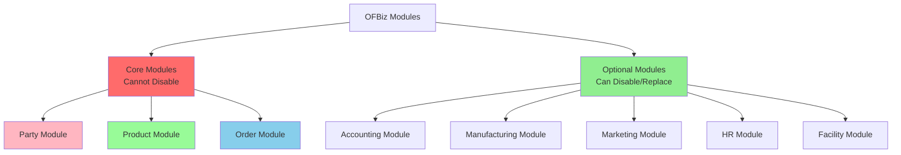
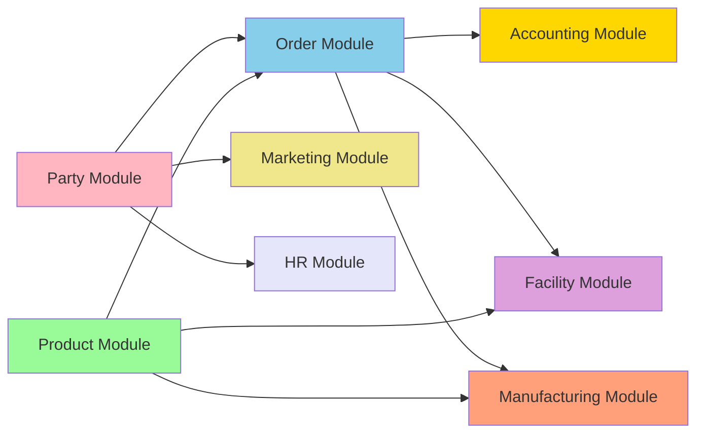
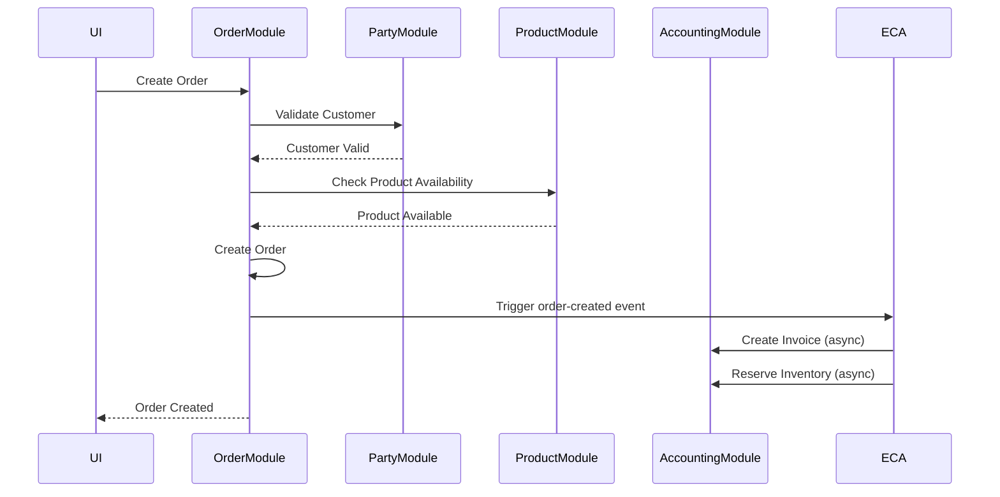

# Module Architecture Overview

**Purpose**: Overview of OFBiz's modular architecture, distinguishing between core modules (cannot be disabled) and optional modules (can be disabled or replaced).

**Audience**: Enterprise Architects, System Integrators, Technical Leads

**Prerequisites**: 
- [Modular Architecture](../01-system-overview/modular-architecture.md)
- [Entity Model Overview](../03-data-architecture/entity-model-overview.md)

**Related Documents**: 
- [Module Isolation Techniques](./module-isolation-techniques.md)
- [Module Replacement Patterns](./module-replacement-patterns.md)

---

## Overview

OFBiz's modular architecture organizes functionality into discrete modules, with **core modules** that provide essential business capabilities and **optional modules** that can be disabled or replaced with external systems. Understanding this distinction is critical for system customization and integration planning.

## Visual Architecture

### Module Classification



**Diagram Description**: Module classification showing core modules (Party, Product, Order) that cannot be disabled versus optional modules that can be disabled or replaced with external systems.

### Module Dependencies



**Diagram Description**: Module dependency graph showing how core modules (Party, Product) feed into Order module, which then connects to optional modules (Accounting, Facility, Manufacturing).

### Module Interaction Patterns



**Diagram Description**: Module interaction showing how Order module coordinates with Party and Product modules (synchronous) and triggers optional module actions (Accounting) via ECA events (asynchronous).

## Core Modules (Cannot Be Disabled)

### 1. Party Module

**Purpose**: Manage people, organizations, and relationships

**Why Core**:
- Every business transaction involves parties
- Referenced by all other modules
- Provides identity and contact management

**Key Capabilities**:
- Person and organization management
- Party roles and relationships
- Contact mechanisms (address, phone, email)
- Party classification and segmentation

**Dependencies**: None (foundational)

**Entity Count**: ~80 entities

### 2. Product Module

**Purpose**: Manage products, categories, and inventory

**Why Core**:
- Products are central to commerce
- Required for orders and manufacturing
- Provides catalog management

**Key Capabilities**:
- Product catalog management
- Product categories and features
- Pricing management
- Inventory tracking
- Product associations

**Dependencies**: Party (for suppliers, manufacturers)

**Entity Count**: ~120 entities

### 3. Order Module

**Purpose**: Manage sales and purchase orders

**Why Core**:
- Orders drive business processes
- Integrates Party and Product
- Generates revenue

**Key Capabilities**:
- Sales order management
- Purchase order management
- Order processing workflow
- Order status tracking
- Order adjustments and promotions

**Dependencies**: Party, Product

**Entity Count**: ~60 entities

## Optional Modules (Can Be Disabled/Replaced)

### 4. Accounting Module

**Purpose**: Financial management and accounting

**Can Replace With**: QuickBooks, SAP, NetSuite, Xero

**Key Capabilities**:
- General ledger
- Accounts payable/receivable
- Invoicing
- Payment processing
- Financial reporting

**Dependencies**: Order, Party

**Entity Count**: ~100 entities

**Replacement Strategy**: Sync invoices and payments with external system

### 5. Manufacturing Module

**Purpose**: Production planning and execution

**Can Disable If**: Not manufacturing products

**Can Replace With**: SAP PP, Oracle Manufacturing, Plex

**Key Capabilities**:
- Bill of materials (BOM)
- Routing and work centers
- Production runs
- Material requirements planning (MRP)

**Dependencies**: Product, Order

**Entity Count**: ~40 entities

### 6. Marketing Module

**Purpose**: Marketing campaigns and tracking

**Can Disable If**: Not running marketing campaigns

**Can Replace With**: Salesforce Marketing Cloud, HubSpot, Marketo

**Key Capabilities**:
- Campaign management
- Tracking codes
- Contact lists
- Segmentation

**Dependencies**: Party

**Entity Count**: ~30 entities

### 7. HR Module

**Purpose**: Human resources management

**Can Disable If**: Using external HR system

**Can Replace With**: Workday, SAP SuccessFactors, BambooHR

**Key Capabilities**:
- Employee management
- Payroll
- Benefits administration
- Training and development

**Dependencies**: Party

**Entity Count**: ~50 entities

### 8. Facility/Warehouse Module

**Purpose**: Warehouse and inventory management

**Can Replace With**: Manhattan WMS, SAP EWM, Oracle WMS

**Key Capabilities**:
- Warehouse management
- Inventory locations
- Shipment management
- Pick/pack/ship operations

**Dependencies**: Product, Order

**Entity Count**: ~60 entities

## Module Isolation Principles

### 1. Loose Coupling via ECA/SECA

**Pattern**: Modules communicate through events rather than direct calls

**Example**:
```xml
<!-- Order module triggers event -->
<service-eca service-name="createOrder" event="return">
    <condition field-name="responseMessage" operator="equals" value="success"/>
    <!-- Accounting module reacts -->
    <action service="createInvoiceForOrder" mode="async"/>
    <!-- Facility module reacts -->
    <action service="reserveInventoryForOrder" mode="async"/>
</service-eca>
```

**Benefits**:
- Modules don't directly depend on each other
- Easy to disable optional modules
- Easy to replace with external systems

### 2. Service Interfaces

**Pattern**: Modules expose well-defined service interfaces

**Example**:
```xml
<!-- Party module service -->
<service name="getPartyInfo" engine="java">
    <attribute name="partyId" type="String" mode="IN"/>
    <attribute name="partyInfo" type="Map" mode="OUT"/>
</service>

<!-- Order module calls party service -->
<service name="createOrder" engine="java">
    <attribute name="partyId" type="String" mode="IN"/>
    <!-- Calls getPartyInfo internally -->
</service>
```

### 3. Data Isolation

**Pattern**: Each module owns its entities

**Example**:
- Party module owns: Party, Person, PartyGroup
- Product module owns: Product, ProductCategory
- Order module owns: OrderHeader, OrderItem

**Cross-Module References**: Via foreign keys, not direct access

## Module Configuration

### Enable/Disable Modules

**Configuration** (`component-load.xml`):
```xml
<component-loader>
    <!-- Core modules - always loaded -->
    <load-component component-location="party"/>
    <load-component component-location="product"/>
    <load-component component-location="order"/>
    
    <!-- Optional modules - can be commented out -->
    <load-component component-location="accounting"/>
    <load-component component-location="manufacturing"/>
    <load-component component-location="marketing"/>
    <load-component component-location="humanres"/>
</component-loader>
```

### Module Dependencies Check

**Before Disabling**:
1. Check ECA/SECA rules referencing the module
2. Check service dependencies
3. Check entity relationships
4. Test thoroughly

## Module Statistics

| Module | Type | Entities | Services | Screens | Can Disable | Can Replace |
|--------|------|----------|----------|---------|-------------|-------------|
| Party | Core | 80 | 150+ | 50+ | ❌ No | ❌ No |
| Product | Core | 120 | 200+ | 80+ | ❌ No | ❌ No |
| Order | Core | 60 | 180+ | 60+ | ❌ No | ❌ No |
| Accounting | Optional | 100 | 150+ | 70+ | ⚠️ Risky | ✅ Yes |
| Manufacturing | Optional | 40 | 80+ | 40+ | ✅ Yes | ✅ Yes |
| Marketing | Optional | 30 | 50+ | 30+ | ✅ Yes | ✅ Yes |
| HR | Optional | 50 | 70+ | 40+ | ✅ Yes | ✅ Yes |
| Facility | Optional | 60 | 100+ | 50+ | ⚠️ Risky | ✅ Yes |

**Legend**:
- ❌ No: Cannot disable/replace
- ✅ Yes: Can safely disable/replace
- ⚠️ Risky: Can disable but may impact core functionality

## Architecture Decisions

### Decision: Core vs Optional Module Classification

**Context**: Need to balance flexibility with system integrity.

**Decision**: Classify Party, Product, Order as core (cannot disable); all others as optional.

**Consequences**:
- ✅ **Positive**: Clear boundaries for customization
- ✅ **Positive**: Protects essential functionality
- ✅ **Positive**: Enables external system integration
- ❌ **Negative**: Less flexibility for core modules
- **Mitigation**: Core modules are well-designed and extensible

### Decision: ECA/SECA for Module Integration

**Context**: Need loose coupling between modules.

**Decision**: Use ECA/SECA events for cross-module communication.

**Consequences**:
- ✅ **Positive**: Loose coupling
- ✅ **Positive**: Easy to disable modules
- ✅ **Positive**: Easy to add new modules
- ❌ **Negative**: Harder to trace execution flow
- **Mitigation**: Documentation, logging, visualization tools

## Official References

- [OFBiz Module Structure](https://cwiki.apache.org/confluence/display/OFBIZ/OFBiz+Module+Structure)
- [Component Loading](https://cwiki.apache.org/confluence/display/OFBIZ/Component+Loading)

## Related Topics

**Within This Section**:
- [Module Isolation Techniques](./module-isolation-techniques.md)
- [Module Replacement Patterns](./module-replacement-patterns.md)
- [Core Modules](./core-modules/)
- [Optional Modules](./optional-modules/)

**Other Sections**:
- [Modular Architecture](../01-system-overview/modular-architecture.md)
- [ECA/SECA Overview](../02-framework-core/event-driven-architecture/eca-seca-overview.md)

**Role-Based Guides**:
- [Architect Guide](../role-based-guides/architect-guide.md)
- [Integrator Guide](../role-based-guides/integrator-guide.md)

---

**Next**: [Party Module](./core-modules/party-module.md)

**Up**: [Application Modules](./README.md)

**Home**: [Master Index](../00-INDEX.md)

---

**Document Metadata**:
- **Version**: 1.0
- **Last Updated**: December 2024
- **OFBiz Version**: Trunk (Latest)
- **Status**: Complete
