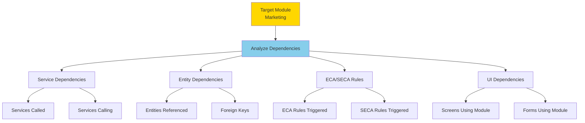

# Module Isolation Techniques

**Purpose**: Techniques for isolating and toggling module influence, including dependency analysis and safe disabling procedures.

**Audience**: System Architects, Technical Leads, DevOps Engineers

**Prerequisites**: 
- [Module Architecture Overview](./module-architecture-overview.md)
- [ECA/SECA Overview](../02-framework-core/event-driven-architecture/eca-seca-overview.md)

**Related Documents**: 
- [Module Replacement Patterns](./module-replacement-patterns.md)

---

## Overview

Module isolation enables disabling or replacing optional modules without breaking core functionality. This requires understanding module dependencies, ECA/SECA rules, service dependencies, and data relationships.

## Visual Architecture

### Module Dependency Analysis



**Diagram Description**: Dependency analysis process examining service, entity, ECA/SECA, and UI dependencies before disabling a module.

## Isolation Techniques

### 1. Dependency Analysis

**Analyze Service Dependencies**:
```bash
# Find services that call marketing services
grep -r "MarketingServices" applications/*/servicedef/*.xml

# Find services called by marketing module
grep -r "service-name=" applications/marketing/servicedef/*.xml
```

**Analyze Entity Dependencies**:
```sql
-- Find foreign keys to marketing entities
SELECT 
    TABLE_NAME, 
    COLUMN_NAME, 
    REFERENCED_TABLE_NAME
FROM INFORMATION_SCHEMA.KEY_COLUMN_USAGE
WHERE REFERENCED_TABLE_NAME LIKE 'marketing_%';
```

**Analyze ECA/SECA Rules**:
```bash
# Find ECA rules involving marketing
grep -r "marketing" applications/*/entitydef/eecas.xml

# Find SECA rules involving marketing services
grep -r "MarketingServices" applications/*/servicedef/secas.xml
```

### 2. Safe Module Disabling

**Step-by-Step Process**:

**Step 1: Backup**
```bash
# Backup database
mysqldump ofbiz > ofbiz_backup_$(date +%Y%m%d).sql

# Backup configuration
tar -czf config_backup_$(date +%Y%m%d).tar.gz framework/*/config
```

**Step 2: Identify Dependencies**
```java
public static Map<String, Object> analyzeModuleDependencies(DispatchContext dctx, Map<String, ?> context) {
    String moduleName = (String) context.get("moduleName");
    
    Map<String, Object> result = ServiceUtil.returnSuccess();
    
    // Find service dependencies
    List<String> serviceDeps = findServiceDependencies(moduleName);
    result.put("serviceDependencies", serviceDeps);
    
    // Find entity dependencies
    List<String> entityDeps = findEntityDependencies(moduleName);
    result.put("entityDependencies", entityDeps);
    
    // Find ECA/SECA dependencies
    List<String> ecaDeps = findECADependencies(moduleName);
    result.put("ecaDependencies", ecaDeps);
    
    // Assess risk
    String riskLevel = assessDisablingRisk(serviceDeps, entityDeps, ecaDeps);
    result.put("riskLevel", riskLevel);
    
    return result;
}
```

**Step 3: Remove/Comment ECA/SECA Rules**
```xml
<!-- Comment out marketing ECA rules -->
<!--
<service-eca service-name="createOrder" event="return">
    <action service="createMarketingCampaignResponse" mode="async"/>
</service-eca>
-->
```

**Step 4: Disable Module Loading**
```xml
<!-- component-load.xml -->
<component-loader>
    <!-- Comment out marketing module -->
    <!-- <load-component component-location="marketing"/> -->
</component-loader>
```

**Step 5: Test Thoroughly**
```bash
# Run automated tests
./gradlew test

# Test core workflows
# - Create order
# - Process payment
# - Ship order
# - Generate invoice
```

**Step 6: Monitor**
```bash
# Monitor logs for errors
tail -f runtime/logs/ofbiz.log | grep -i "error\|exception"

# Monitor service failures
# Check for services trying to call disabled module
```

### 3. Conditional Module Activation

**Runtime Module Check**:
```java
public static boolean isModuleEnabled(String moduleName) {
    ComponentConfig config = ComponentConfig.getComponentConfig(moduleName);
    return config != null && config.enabled();
}

public static Map<String, Object> createOrder(DispatchContext dctx, Map<String, ?> context) {
    // Core order creation logic
    Map<String, Object> result = createOrderCore(context);
    
    // Conditionally call marketing module
    if (isModuleEnabled("marketing")) {
        dispatcher.runAsync("recordMarketingResponse", context);
    }
    
    return result;
}
```

**Feature Flags**:
```properties
# feature-flags.properties
marketing.enabled=false
manufacturing.enabled=true
accounting.enabled=true
```

```java
public static boolean isFeatureEnabled(String feature) {
    return "true".equals(UtilProperties.getPropertyValue("feature-flags", feature + ".enabled"));
}
```

### 4. Service Stub Pattern

**Create Stub Services**:
```xml
<!-- When disabling marketing, provide stub services -->
<service name="createMarketingCampaignResponse" engine="java"
         location="org.apache.ofbiz.common.StubServices" invoke="stubService">
    <description>Stub service when marketing module disabled</description>
    <attribute name="orderId" type="String" mode="IN"/>
</service>
```

```java
public class StubServices {
    public static Map<String, Object> stubService(DispatchContext dctx, Map<String, ?> context) {
        Debug.logInfo("Stub service called - module disabled", module);
        return ServiceUtil.returnSuccess();
    }
}
```

### 5. Data Migration

**Before Disabling Module with Data**:
```java
public static Map<String, Object> migrateMarketingData(DispatchContext dctx, Map<String, ?> context) {
    Delegator delegator = dctx.getDelegator();
    
    // Export marketing data
    List<GenericValue> campaigns = delegator.findAll("MarketingCampaign", false);
    exportToCSV(campaigns, "marketing_campaigns.csv");
    
    // Archive in separate database
    archiveToExternalDB(campaigns, "marketing_archive");
    
    // Optionally delete from operational DB
    if (Boolean.TRUE.equals(context.get("deleteAfterMigration"))) {
        delegator.removeAll("MarketingCampaign");
    }
    
    return ServiceUtil.returnSuccess();
}
```

## Module Isolation Patterns

### Pattern 1: Adapter Layer

**Create Adapter for External System**:
```java
public interface MarketingAdapter {
    void recordCampaignResponse(String orderId, String campaignId);
    void trackConversion(String orderId);
}

// OFBiz implementation
public class OFBizMarketingAdapter implements MarketingAdapter {
    public void recordCampaignResponse(String orderId, String campaignId) {
        dispatcher.runAsync("createMarketingCampaignResponse", 
            UtilMisc.toMap("orderId", orderId, "campaignId", campaignId));
    }
}

// External system implementation
public class SalesforceMarketingAdapter implements MarketingAdapter {
    public void recordCampaignResponse(String orderId, String campaignId) {
        salesforceClient.createCampaignMember(orderId, campaignId);
    }
}

// Usage
MarketingAdapter adapter = getMarketingAdapter(); // Factory method
adapter.recordCampaignResponse(orderId, campaignId);
```

### Pattern 2: Event-Based Decoupling

**Publish Events Instead of Direct Calls**:
```java
// Instead of direct call
dispatcher.runAsync("createMarketingCampaignResponse", context);

// Publish event
EventBus.publish(new OrderCreatedEvent(orderId, customerId));

// Marketing module subscribes
@EventListener
public void handleOrderCreated(OrderCreatedEvent event) {
    if (isModuleEnabled("marketing")) {
        createMarketingCampaignResponse(event.getOrderId());
    }
}
```

### Pattern 3: Null Object Pattern

**Provide No-Op Implementation**:
```java
public interface MarketingService {
    void recordResponse(String orderId);
}

public class ActiveMarketingService implements MarketingService {
    public void recordResponse(String orderId) {
        // Real implementation
    }
}

public class NullMarketingService implements MarketingService {
    public void recordResponse(String orderId) {
        // Do nothing
    }
}

// Factory
public static MarketingService getMarketingService() {
    if (isModuleEnabled("marketing")) {
        return new ActiveMarketingService();
    }
    return new NullMarketingService();
}
```

## Testing Module Isolation

### Test Suite

```java
public class ModuleIsolationTests {
    
    @Test
    public void testOrderCreationWithoutMarketing() {
        // Disable marketing module
        disableModule("marketing");
        
        // Create order
        Map<String, Object> result = dispatcher.runSync("createOrder", orderContext);
        
        // Verify order created successfully
        assertTrue(ServiceUtil.isSuccess(result));
        
        // Verify no marketing data created
        List<GenericValue> responses = delegator.findByAnd("MarketingCampaignResponse",
            UtilMisc.toMap("orderId", result.get("orderId")), null, false);
        assertTrue(responses.isEmpty());
    }
    
    @Test
    public void testManufacturingDisabled() {
        disableModule("manufacturing");
        
        // Verify manufacturing services return gracefully
        Map<String, Object> result = dispatcher.runSync("createProductionRun", context);
        assertTrue(ServiceUtil.isSuccess(result) || ServiceUtil.isError(result));
        // Should not throw exception
    }
}
```

## Monitoring Disabled Modules

### Log Module Status

```java
public static void logModuleStatus() {
    List<String> modules = Arrays.asList("marketing", "manufacturing", "humanres");
    
    for (String module : modules) {
        boolean enabled = isModuleEnabled(module);
        Debug.logInfo("Module " + module + ": " + (enabled ? "ENABLED" : "DISABLED"), module);
    }
}
```

### Health Check Endpoint

```java
@RestController
@RequestMapping("/api/health")
public class HealthCheckController {
    
    @GetMapping("/modules")
    public Map<String, Object> getModuleStatus() {
        Map<String, Object> status = new HashMap<>();
        
        status.put("party", Map.of("enabled", true, "required", true));
        status.put("product", Map.of("enabled", true, "required", true));
        status.put("order", Map.of("enabled", true, "required", true));
        status.put("accounting", Map.of("enabled", isModuleEnabled("accounting"), "required", false));
        status.put("marketing", Map.of("enabled", isModuleEnabled("marketing"), "required", false));
        status.put("manufacturing", Map.of("enabled", isModuleEnabled("manufacturing"), "required", false));
        
        return status;
    }
}
```

## Best Practices

### 1. Always Analyze First
- Run dependency analysis before disabling
- Understand impact on other modules
- Document dependencies

### 2. Test Thoroughly
- Test all core workflows
- Test edge cases
- Monitor for errors

### 3. Provide Fallbacks
- Stub services for disabled modules
- Graceful degradation
- Clear error messages

### 4. Document Changes
- Document which modules are disabled
- Document why they were disabled
- Document any workarounds

### 5. Monitor Production
- Log module status at startup
- Monitor for errors related to disabled modules
- Set up alerts

## Architecture Decisions

### Decision: Support Module Disabling

**Context**: Need flexibility to disable optional modules.

**Decision**: Design modules with loose coupling via ECA/SECA to enable safe disabling.

**Consequences**:
- ✅ **Positive**: Flexibility to customize deployment
- ✅ **Positive**: Can replace with external systems
- ❌ **Negative**: More complex architecture
- ❌ **Negative**: Requires careful dependency management
- **Mitigation**: Dependency analysis tools, comprehensive testing

## Official References

- [OFBiz Component Management](https://cwiki.apache.org/confluence/display/OFBIZ/Component+Management)
- [Module Configuration](https://cwiki.apache.org/confluence/display/OFBIZ/Module+Configuration)

## Related Topics

**Within This Section**:
- [Module Architecture Overview](./module-architecture-overview.md)
- [Module Replacement Patterns](./module-replacement-patterns.md)

**Other Sections**:
- [ECA/SECA Overview](../02-framework-core/event-driven-architecture/eca-seca-overview.md)
- [Service Engine](../02-framework-core/service-engine/overview.md)

**Role-Based Guides**:
- [Architect Guide](../role-based-guides/architect-guide.md)
- [Developer Guide](../role-based-guides/developer-guide.md)

---

**Next**: [Module Replacement Patterns](./module-replacement-patterns.md)

**Up**: [Application Modules](./README.md)

**Home**: [Master Index](../00-INDEX.md)

---

**Document Metadata**:
- **Version**: 1.0
- **Last Updated**: December 2024
- **OFBiz Version**: Trunk (Latest)
- **Status**: Complete
