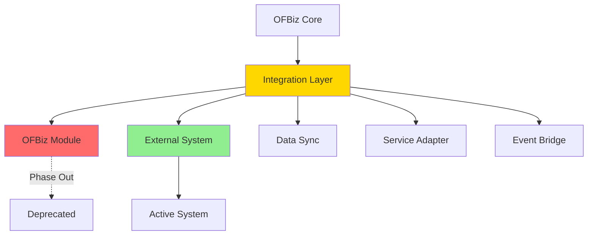

# Module Replacement Patterns

**Purpose**: Patterns and strategies for replacing OFBiz modules with external systems while maintaining integration.

**Audience**: Enterprise Architects, Integration Architects, System Integrators

**Prerequisites**: 
- [Module Architecture Overview](./module-architecture-overview.md)
- [Module Isolation Techniques](./module-isolation-techniques.md)

**Related Documents**: 
- [QuickBooks Integration](./external-integration-examples/quickbooks-integration.md)
- [Salesforce Integration](./external-integration-examples/salesforce-integration.md)

---

## Overview

Replacing OFBiz modules with external systems requires careful planning to maintain data consistency, preserve business logic, and ensure seamless integration. This document provides proven patterns for module replacement.

## Visual Architecture

### Module Replacement Architecture



**Diagram Description**: Module replacement architecture showing integration layer that bridges OFBiz core with external system while phasing out internal module.

## Replacement Patterns

### Pattern 1: Adapter Pattern

**Use Case**: Replace module while maintaining OFBiz service interface

**Architecture**:
```
OFBiz Services → Service Adapter → External System API
```

**Implementation**:
```java
// Original OFBiz service interface
public interface AccountingService {
    Map<String, Object> createInvoice(Map<String, Object> context);
    Map<String, Object> createPayment(Map<String, Object> context);
}

// OFBiz implementation (being replaced)
public class OFBizAccountingService implements AccountingService {
    public Map<String, Object> createInvoice(Map<String, Object> context) {
        // OFBiz accounting logic
    }
}

// QuickBooks adapter
public class QuickBooksAccountingAdapter implements AccountingService {
    private QuickBooksClient qbClient;
    
    public Map<String, Object> createInvoice(Map<String, Object> context) {
        // Map OFBiz context to QuickBooks format
        Invoice qbInvoice = mapToQuickBooksInvoice(context);
        
        // Create in QuickBooks
        Invoice created = qbClient.createInvoice(qbInvoice);
        
        // Store mapping in OFBiz
        storeInvoiceMapping(context.get("orderId"), created.getId());
        
        // Return OFBiz-style result
        Map<String, Object> result = ServiceUtil.returnSuccess();
        result.put("invoiceId", created.getId());
        return result;
    }
    
    private Invoice mapToQuickBooksInvoice(Map<String, Object> context) {
        Invoice invoice = new Invoice();
        invoice.setCustomerRef(new ReferenceType(context.get("partyId")));
        invoice.setTxnDate(new Date());
        
        // Map line items
        List<Line> lines = new ArrayList<>();
        List<Map<String, Object>> items = (List) context.get("items");
        for (Map<String, Object> item : items) {
            Line line = new Line();
            line.setAmount(new BigDecimal(item.get("amount").toString()));
            line.setDescription((String) item.get("description"));
            lines.add(line);
        }
        invoice.setLine(lines);
        
        return invoice;
    }
}

// Factory to switch implementations
public class AccountingServiceFactory {
    public static AccountingService getAccountingService() {
        String impl = UtilProperties.getPropertyValue("accounting", "implementation");
        
        if ("quickbooks".equals(impl)) {
            return new QuickBooksAccountingAdapter();
        } else {
            return new OFBizAccountingService();
        }
    }
}
```

### Pattern 2: Facade Pattern

**Use Case**: Simplify complex external system API

**Implementation**:
```java
public class SalesforceFacade {
    private SalesforceClient sfClient;
    
    // Simplified interface for OFBiz
    public String createContact(Map<String, Object> partyData) {
        // Complex Salesforce API calls hidden behind simple interface
        Contact contact = new Contact();
        contact.setFirstName((String) partyData.get("firstName"));
        contact.setLastName((String) partyData.get("lastName"));
        contact.setEmail((String) partyData.get("email"));
        
        // Handle Salesforce-specific logic
        if (contact.getEmail() != null) {
            // Check for duplicates
            List<Contact> existing = sfClient.query(
                "SELECT Id FROM Contact WHERE Email = '" + contact.getEmail() + "'");
            if (!existing.isEmpty()) {
                return existing.get(0).getId();
            }
        }
        
        SaveResult result = sfClient.create(contact);
        return result.getId();
    }
    
    public void syncPartyToSalesforce(String partyId) {
        // Load party from OFBiz
        GenericValue party = delegator.findOne("Party", 
            UtilMisc.toMap("partyId", partyId), false);
        GenericValue person = delegator.findOne("Person", 
            UtilMisc.toMap("partyId", partyId), false);
        
        // Create in Salesforce
        Map<String, Object> partyData = new HashMap<>();
        partyData.put("firstName", person.getString("firstName"));
        partyData.put("lastName", person.getString("lastName"));
        
        String sfId = createContact(partyData);
        
        // Store mapping
        storePartyMapping(partyId, sfId);
    }
}
```

### Pattern 3: Strangler Fig Pattern

**Use Case**: Gradual migration from OFBiz module to external system

**Phases**:
1. **Coexistence**: Both systems run in parallel
2. **Gradual Migration**: Move functionality piece by piece
3. **Complete Migration**: Retire OFBiz module

**Implementation**:
```java
public class HybridAccountingService {
    private OFBizAccountingService ofbizService;
    private QuickBooksAdapter qbAdapter;
    
    public Map<String, Object> createInvoice(Map<String, Object> context) {
        String strategy = getMigrationStrategy();
        
        switch (strategy) {
            case "ofbiz-only":
                return ofbizService.createInvoice(context);
                
            case "parallel":
                // Create in both systems
                Map<String, Object> ofbizResult = ofbizService.createInvoice(context);
                Map<String, Object> qbResult = qbAdapter.createInvoice(context);
                // Compare results for validation
                validateParallelResults(ofbizResult, qbResult);
                return ofbizResult; // Still using OFBiz as primary
                
            case "quickbooks-primary":
                // QuickBooks is primary, OFBiz for reference
                Map<String, Object> result = qbAdapter.createInvoice(context);
                ofbizService.createInvoice(context); // Keep for reference
                return result;
                
            case "quickbooks-only":
                return qbAdapter.createInvoice(context);
                
            default:
                throw new IllegalStateException("Unknown migration strategy: " + strategy);
        }
    }
}
```

### Pattern 4: Event-Driven Integration

**Use Case**: Loosely coupled integration via events

**Implementation**:
```java
// OFBiz publishes events
public static Map<String, Object> createOrder(DispatchContext dctx, Map<String, ?> context) {
    // Create order in OFBiz
    Map<String, Object> result = createOrderInternal(context);
    
    // Publish event
    OrderEvent event = new OrderEvent();
    event.setOrderId((String) result.get("orderId"));
    event.setEventType("ORDER_CREATED");
    event.setData(context);
    
    kafkaTemplate.send("order-events", event);
    
    return result;
}

// External system consumes events
@KafkaListener(topics = "order-events", groupId = "quickbooks-integration")
public void handleOrderEvent(OrderEvent event) {
    if ("ORDER_CREATED".equals(event.getEventType())) {
        // Create invoice in QuickBooks
        createQuickBooksInvoice(event.getOrderId());
    }
}
```

## Data Synchronization Strategies

### Strategy 1: Real-Time Sync

**Pattern**: Sync data immediately on change

**Implementation**:
```java
public static Map<String, Object> createParty(DispatchContext dctx, Map<String, ?> context) {
    // Create in OFBiz
    Map<String, Object> result = createPartyInternal(context);
    String partyId = (String) result.get("partyId");
    
    // Sync to Salesforce immediately
    try {
        salesforceFacade.syncPartyToSalesforce(partyId);
    } catch (Exception e) {
        // Log error but don't fail OFBiz operation
        Debug.logError("Failed to sync party to Salesforce: " + e.getMessage(), module);
    }
    
    return result;
}
```

### Strategy 2: Batch Sync

**Pattern**: Sync data in scheduled batches

**Implementation**:
```java
@Scheduled(cron = "0 0 * * * *") // Every hour
public void syncPartiesToSalesforce() {
    // Find parties modified since last sync
    Timestamp lastSync = getLastSyncTime();
    
    List<GenericValue> parties = EntityQuery.use(delegator)
        .from("Party")
        .where(EntityCondition.makeCondition("lastModifiedDate", 
            EntityOperator.GREATER_THAN, lastSync))
        .queryList();
    
    for (GenericValue party : parties) {
        try {
            salesforceFacade.syncPartyToSalesforce(party.getString("partyId"));
        } catch (Exception e) {
            Debug.logError("Failed to sync party: " + party.getString("partyId"), module);
        }
    }
    
    updateLastSyncTime();
}
```

### Strategy 3: Change Data Capture

**Pattern**: Capture and stream database changes

**Implementation**:
```java
// Using Debezium for CDC
@Component
public class PartyCDCListener {
    
    @KafkaListener(topics = "ofbiz.party", groupId = "salesforce-sync")
    public void handlePartyChange(ChangeEvent event) {
        if ("INSERT".equals(event.getOperation()) || "UPDATE".equals(event.getOperation())) {
            String partyId = event.getData().get("party_id");
            salesforceFacade.syncPartyToSalesforce(partyId);
        }
    }
}
```

## Mapping and Transformation

### Entity Mapping

**Store ID Mappings**:
```xml
<entity entity-name="ExternalSystemMapping">
    <field name="ofbizEntityName" type="name"/>
    <field name="ofbizEntityId" type="id"/>
    <field name="externalSystem" type="name"/>
    <field name="externalEntityId" type="id-long"/>
    <field name="lastSyncDate" type="date-time"/>
    <prim-key field="ofbizEntityName"/>
    <prim-key field="ofbizEntityId"/>
    <prim-key field="externalSystem"/>
</entity>
```

**Mapping Service**:
```java
public class MappingService {
    public String getExternalId(String entityName, String ofbizId, String externalSystem) {
        GenericValue mapping = delegator.findOne("ExternalSystemMapping",
            UtilMisc.toMap("ofbizEntityName", entityName, 
                          "ofbizEntityId", ofbizId,
                          "externalSystem", externalSystem), false);
        
        return mapping != null ? mapping.getString("externalEntityId") : null;
    }
    
    public void storeMapping(String entityName, String ofbizId, 
                            String externalSystem, String externalId) {
        GenericValue mapping = delegator.makeValue("ExternalSystemMapping");
        mapping.set("ofbizEntityName", entityName);
        mapping.set("ofbizEntityId", ofbizId);
        mapping.set("externalSystem", externalSystem);
        mapping.set("externalEntityId", externalId);
        mapping.set("lastSyncDate", UtilDateTime.nowTimestamp());
        mapping.create();
    }
}
```

## Error Handling

### Retry Pattern

```java
public class RetryableIntegration {
    private static final int MAX_RETRIES = 3;
    private static final long RETRY_DELAY = 5000; // 5 seconds
    
    public void syncWithRetry(String partyId) {
        int attempts = 0;
        Exception lastException = null;
        
        while (attempts < MAX_RETRIES) {
            try {
                salesforceFacade.syncPartyToSalesforce(partyId);
                return; // Success
            } catch (Exception e) {
                lastException = e;
                attempts++;
                
                if (attempts < MAX_RETRIES) {
                    try {
                        Thread.sleep(RETRY_DELAY * attempts); // Exponential backoff
                    } catch (InterruptedException ie) {
                        Thread.currentThread().interrupt();
                    }
                }
            }
        }
        
        // All retries failed
        logFailedSync(partyId, lastException);
        queueForManualReview(partyId);
    }
}
```

### Dead Letter Queue

```java
@Component
public class IntegrationErrorHandler {
    
    @KafkaListener(topics = "integration-errors", groupId = "error-handler")
    public void handleIntegrationError(IntegrationError error) {
        // Log error
        Debug.logError("Integration error: " + error.getMessage(), module);
        
        // Store in dead letter queue
        GenericValue dlq = delegator.makeValue("IntegrationDeadLetterQueue");
        dlq.set("errorId", delegator.getNextSeqId("IntegrationDeadLetterQueue"));
        dlq.set("entityName", error.getEntityName());
        dlq.set("entityId", error.getEntityId());
        dlq.set("externalSystem", error.getExternalSystem());
        dlq.set("errorMessage", error.getMessage());
        dlq.set("errorDate", UtilDateTime.nowTimestamp());
        dlq.set("retryCount", 0);
        dlq.create();
        
        // Alert administrators
        sendAlertEmail(error);
    }
}
```

## Testing Replacement

### Integration Tests

```java
@Test
public void testQuickBooksInvoiceCreation() {
    // Create order in OFBiz
    Map<String, Object> orderContext = createTestOrderContext();
    Map<String, Object> orderResult = dispatcher.runSync("createOrder", orderContext);
    String orderId = (String) orderResult.get("orderId");
    
    // Verify invoice created in QuickBooks
    String qbInvoiceId = mappingService.getExternalId("Invoice", orderId, "quickbooks");
    assertNotNull("QuickBooks invoice should be created", qbInvoiceId);
    
    // Verify invoice data matches
    Invoice qbInvoice = quickBooksClient.getInvoice(qbInvoiceId);
    assertEquals(orderContext.get("grandTotal"), qbInvoice.getTotalAmt());
}

@Test
public void testSalesforcePartySync() {
    // Create party in OFBiz
    Map<String, Object> partyContext = createTestPartyContext();
    Map<String, Object> partyResult = dispatcher.runSync("createParty", partyContext);
    String partyId = (String) partyResult.get("partyId");
    
    // Wait for async sync
    Thread.sleep(2000);
    
    // Verify contact created in Salesforce
    String sfContactId = mappingService.getExternalId("Party", partyId, "salesforce");
    assertNotNull("Salesforce contact should be created", sfContactId);
    
    // Verify contact data matches
    Contact sfContact = salesforceClient.getContact(sfContactId);
    assertEquals(partyContext.get("firstName"), sfContact.getFirstName());
    assertEquals(partyContext.get("lastName"), sfContact.getLastName());
}
```

## Best Practices

### 1. Maintain Data Integrity
- Store ID mappings
- Validate data before sync
- Handle conflicts gracefully

### 2. Error Handling
- Implement retry logic
- Use dead letter queues
- Alert on failures

### 3. Performance
- Use batch operations
- Implement caching
- Monitor API rate limits

### 4. Testing
- Test integration thoroughly
- Test error scenarios
- Test rollback procedures

### 5. Monitoring
- Log all integration operations
- Monitor sync status
- Track error rates

## Architecture Decisions

### Decision: Adapter Pattern for Module Replacement

**Context**: Need to replace modules while maintaining OFBiz service interface.

**Decision**: Use adapter pattern to wrap external system APIs.

**Consequences**:
- ✅ **Positive**: Minimal changes to OFBiz code
- ✅ **Positive**: Easy to switch implementations
- ✅ **Positive**: Testable with mocks
- ❌ **Negative**: Additional abstraction layer
- **Mitigation**: Keep adapters simple and well-documented

## Official References

- [Enterprise Integration Patterns](https://www.enterpriseintegrationpatterns.com/)
- [Strangler Fig Pattern](https://martinfowler.com/bliki/StranglerFigApplication.html)

## Related Topics

**Within This Section**:
- [Module Architecture Overview](./module-architecture-overview.md)
- [Module Isolation Techniques](./module-isolation-techniques.md)
- [QuickBooks Integration](./external-integration-examples/quickbooks-integration.md)
- [Salesforce Integration](./external-integration-examples/salesforce-integration.md)

**Other Sections**:
- [Service Engine Replacement](../02-framework-core/service-engine/replacement-strategies.md)
- [Event-Driven Integration](../05-integration-architecture/event-driven-integration.md)

**Role-Based Guides**:
- [Architect Guide](../role-based-guides/architect-guide.md)
- [Integrator Guide](../role-based-guides/integrator-guide.md)

---

**Next**: [QuickBooks Integration](./external-integration-examples/quickbooks-integration.md)

**Up**: [Application Modules](./README.md)

**Home**: [Master Index](../00-INDEX.md)

---

**Document Metadata**:
- **Version**: 1.0
- **Last Updated**: December 2024
- **OFBiz Version**: Trunk (Latest)
- **Status**: Complete
