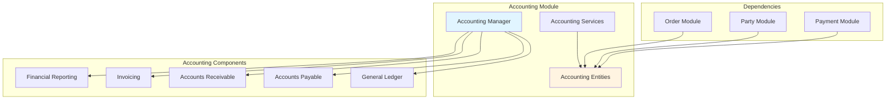
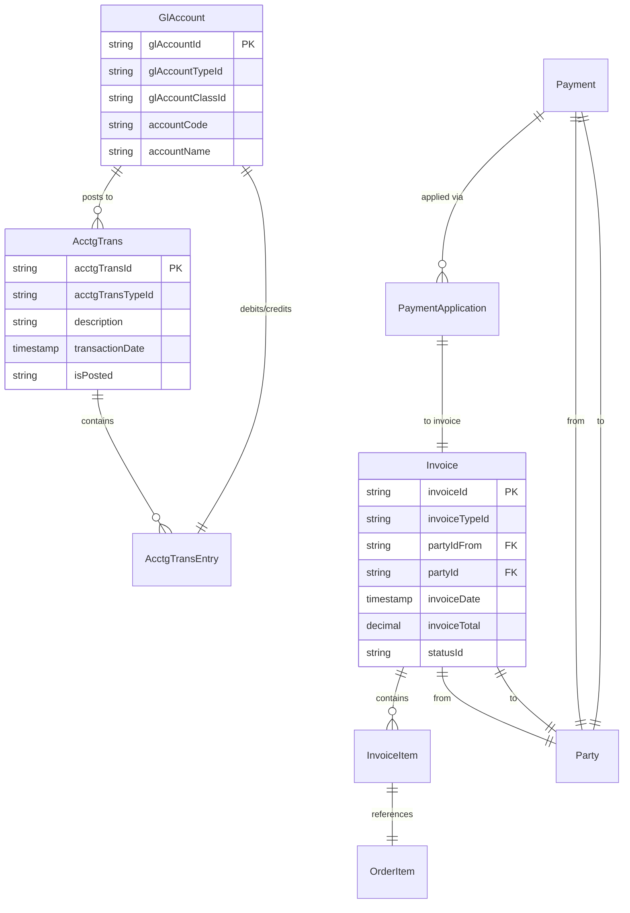
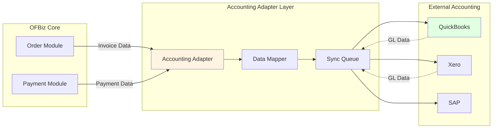

# Accounting Module Architecture

**Document Type**: Application Module Documentation  
**Module Classification**: Optional Module (Can be Replaced)  
**Last Updated**: December 2024

---

## Overview

The Accounting module provides comprehensive financial management capabilities including general ledger, accounts payable/receivable, invoicing, and financial reporting. Unlike core modules, the Accounting module is **optional and can be replaced** with external accounting systems like QuickBooks, Xero, or SAP.

### Why Accounting Module Can Be Replaced

1. **Specialized Requirements**: Companies often have established accounting systems
2. **Regulatory Compliance**: External systems may better support specific regulations
3. **Integration Preference**: Finance teams prefer familiar tools
4. **Separation of Concerns**: E-commerce operations can be separate from accounting
5. **Cost Considerations**: Existing accounting licenses and expertise

---

## Module Architecture

### High-Level Architecture



---

## Entity Model

### Core Accounting Entities



---

## Replacement Strategy

### Integration Architecture



### Replacement Steps

1. **Disable Accounting Services**: Comment out accounting service calls
2. **Implement Adapter**: Create adapter for external system API
3. **Map Data**: Transform OFBiz data to external format
4. **Sync Transactions**: Push invoices, payments to external system
5. **Maintain References**: Keep external IDs in OFBiz for tracking

<details>
<summary><strong>QuickBooks Adapter Example</strong></summary>

```java
public class QuickBooksAccountingAdapter {
    
    public static Map<String, Object> syncInvoiceToQuickBooks(DispatchContext dctx, Map<String, ?> context) {
        Delegator delegator = dctx.getDelegator();
        String orderId = (String) context.get("orderId");
        
        try {
            // Get order data
            GenericValue orderHeader = delegator.findOne("OrderHeader", 
                UtilMisc.toMap("orderId", orderId), false);
            List<GenericValue> orderItems = orderHeader.getRelated("OrderItem", null, null, false);
            
            // Map to QuickBooks format
            QuickBooksInvoice qbInvoice = new QuickBooksInvoice();
            qbInvoice.setCustomerRef(orderHeader.getString("billToPartyId"));
            qbInvoice.setTxnDate(orderHeader.getTimestamp("orderDate"));
            
            for (GenericValue item : orderItems) {
                QuickBooksInvoiceLine line = new QuickBooksInvoiceLine();
                line.setItemRef(item.getString("productId"));
                line.setQuantity(item.getBigDecimal("quantity"));
                line.setRate(item.getBigDecimal("unitPrice"));
                qbInvoice.addLine(line);
            }
            
            // Send to QuickBooks
            QuickBooksAPI api = new QuickBooksAPI();
            String qbInvoiceId = api.createInvoice(qbInvoice);
            
            // Store external reference
            orderHeader.set("externalInvoiceId", qbInvoiceId);
            orderHeader.store();
            
            return ServiceUtil.returnSuccess("Invoice synced to QuickBooks: " + qbInvoiceId);
        } catch (Exception e) {
            return ServiceUtil.returnError("Error syncing to QuickBooks: " + e.getMessage());
        }
    }
}
```

</details>

---

## Official References

- [Apache OFBiz Accounting Component](https://cwiki.apache.org/confluence/display/OFBIZ/Accounting+Component)
- [QuickBooks Integration Guide](../external-integration-examples/quickbooks-integration.md)

---

## Related Documentation

- [Module Replacement Patterns](../module-replacement-patterns.md)
- [Accounting Domain Model](../../03-data-architecture/domain-models/accounting-domain.md)
- [External Service Adapters](../../05-integration-architecture/external-service-adapters.md)

---

## Summary

The Accounting module is optional and can be replaced with external accounting systems. Use adapter patterns to sync financial data from OFBiz orders and payments to external systems like QuickBooks, Xero, or SAP while maintaining transaction references for reconciliation.
