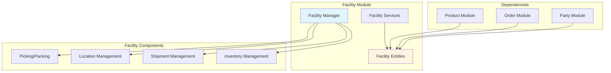
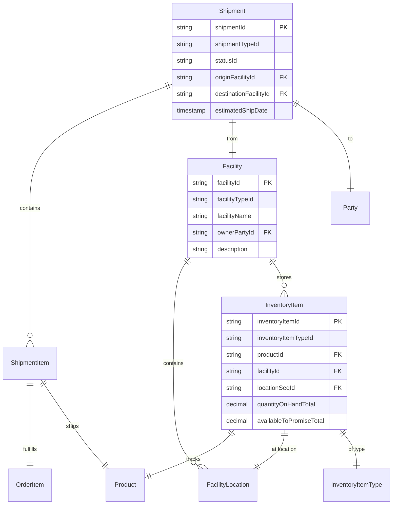
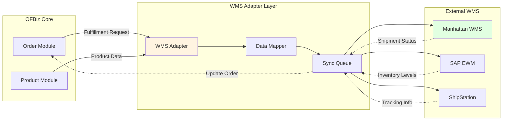
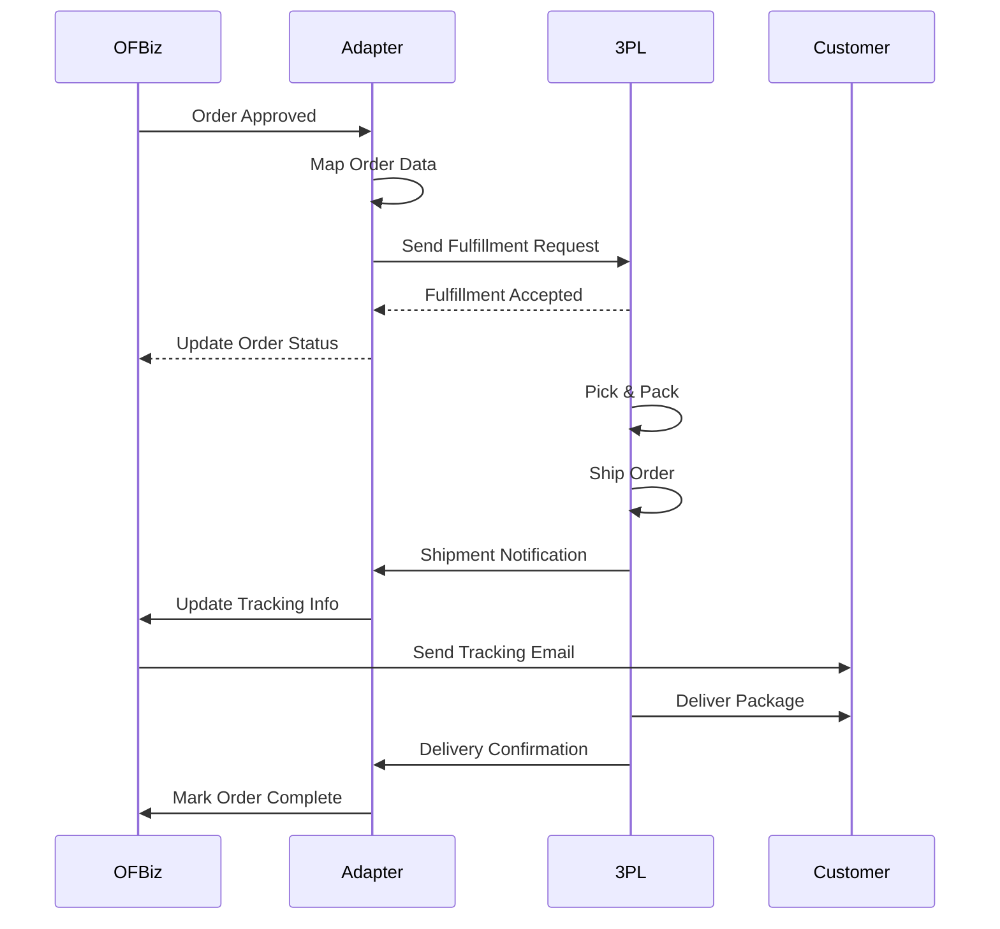

# Facility Module Architecture

**Document Type**: Application Module Documentation  
**Module Classification**: Optional Module (Can be Replaced)  
**Last Updated**: December 2024

---

## Overview

The Facility module manages warehouses, inventory locations, shipments, and inventory tracking. While critical for physical operations, it is **optional and can be replaced** with external Warehouse Management Systems (WMS) or 3PL (Third-Party Logistics) providers.

### When to Replace Facility Module

1. **External WMS**: Using dedicated systems like Manhattan, HighJump, or SAP EWM
2. **3PL Operations**: Fulfillment handled by third-party logistics providers
3. **Dropshipping**: No inventory management needed
4. **Virtual/Digital Products**: No physical inventory to track

---

## Module Architecture



---

## Entity Model



---

## Replacement Strategy

### External WMS Integration



### Replacement Steps

1. **Implement WMS Adapter**: Create service adapter for external WMS API
2. **Map Fulfillment Requests**: Transform OFBiz orders to WMS format
3. **Sync Inventory Levels**: Pull inventory data from WMS to OFBiz
4. **Track Shipments**: Receive shipment and tracking updates
5. **Maintain References**: Store WMS IDs in OFBiz for reconciliation

<details>
<summary><strong>ShipStation Integration Example</strong></summary>

```java
public class ShipStationAdapter {
    
    public static Map<String, Object> createShipStationOrder(DispatchContext dctx, Map<String, ?> context) {
        Delegator delegator = dctx.getDelegator();
        String orderId = (String) context.get("orderId");
        
        try {
            // Get order data
            GenericValue orderHeader = delegator.findOne("OrderHeader", 
                UtilMisc.toMap("orderId", orderId), false);
            List<GenericValue> orderItems = orderHeader.getRelated("OrderItem", null, null, false);
            
            // Get shipping address
            GenericValue shipToContactMech = getShipToAddress(delegator, orderId);
            GenericValue postalAddress = shipToContactMech.getRelatedOne("PostalAddress", false);
            
            // Map to ShipStation format
            ShipStationOrder ssOrder = new ShipStationOrder();
            ssOrder.setOrderNumber(orderId);
            ssOrder.setOrderDate(orderHeader.getTimestamp("orderDate"));
            ssOrder.setOrderStatus("awaiting_shipment");
            
            // Add shipping address
            ShipStationAddress ssAddress = new ShipStationAddress();
            ssAddress.setName(postalAddress.getString("toName"));
            ssAddress.setStreet1(postalAddress.getString("address1"));
            ssAddress.setCity(postalAddress.getString("city"));
            ssAddress.setState(postalAddress.getString("stateProvinceGeoId"));
            ssAddress.setPostalCode(postalAddress.getString("postalCode"));
            ssAddress.setCountry(postalAddress.getString("countryGeoId"));
            ssOrder.setShipTo(ssAddress);
            
            // Add items
            for (GenericValue item : orderItems) {
                ShipStationItem ssItem = new ShipStationItem();
                ssItem.setSku(item.getString("productId"));
                ssItem.setQuantity(item.getBigDecimal("quantity").intValue());
                ssItem.setUnitPrice(item.getBigDecimal("unitPrice"));
                ssOrder.addItem(ssItem);
            }
            
            // Send to ShipStation
            ShipStationAPI api = new ShipStationAPI();
            String ssOrderId = api.createOrder(ssOrder);
            
            // Store external reference
            orderHeader.set("externalShipmentId", ssOrderId);
            orderHeader.store();
            
            return ServiceUtil.returnSuccess("Order sent to ShipStation: " + ssOrderId);
        } catch (Exception e) {
            return ServiceUtil.returnError("Error sending to ShipStation: " + e.getMessage());
        }
    }
    
    public static Map<String, Object> receiveShipStationWebhook(DispatchContext dctx, Map<String, ?> context) {
        Delegator delegator = dctx.getDelegator();
        
        String eventType = (String) context.get("resource_type");
        Map<String, Object> resourceData = (Map<String, Object>) context.get("resource_url");
        
        try {
            if ("SHIP_NOTIFY".equals(eventType)) {
                String orderNumber = (String) resourceData.get("order_number");
                String trackingNumber = (String) resourceData.get("tracking_number");
                String carrier = (String) resourceData.get("carrier_code");
                
                // Update order in OFBiz
                GenericValue orderHeader = delegator.findOne("OrderHeader", 
                    UtilMisc.toMap("orderId", orderNumber), false);
                
                if (orderHeader != null) {
                    orderHeader.set("trackingNumber", trackingNumber);
                    orderHeader.set("carrierCode", carrier);
                    orderHeader.set("statusId", "ORDER_COMPLETED");
                    orderHeader.store();
                    
                    return ServiceUtil.returnSuccess("Order updated with tracking: " + trackingNumber);
                }
            }
            
            return ServiceUtil.returnSuccess("Webhook processed");
        } catch (Exception e) {
            return ServiceUtil.returnError("Error processing webhook: " + e.getMessage());
        }
    }
}
```

</details>

---

## 3PL Integration Pattern

For third-party logistics providers:



---

## Official References

- [Apache OFBiz Facility Component](https://cwiki.apache.org/confluence/display/OFBIZ/Facility+Component)
- [Shipment Management](https://cwiki.apache.org/confluence/display/OFBIZ/Shipment+Management)

---

## Related Documentation

- [Module Replacement Patterns](../module-replacement-patterns.md)
- [Product Module](../core-modules/product-module.md)
- [Order Module](../core-modules/order-module.md)
- [External Service Adapters](../../05-integration-architecture/external-service-adapters.md)

---

## Summary

The Facility module is optional and can be replaced with external WMS or 3PL providers. Use adapter patterns to send fulfillment requests to external systems and receive shipment status updates. Maintain external references in OFBiz for order tracking and reconciliation.
