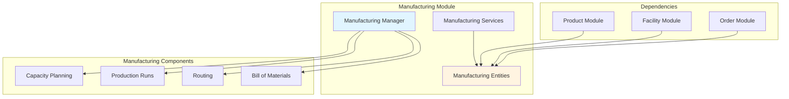
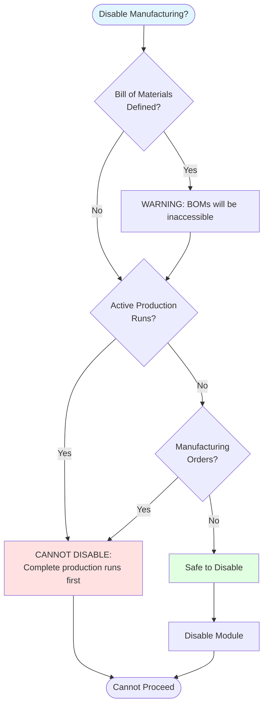
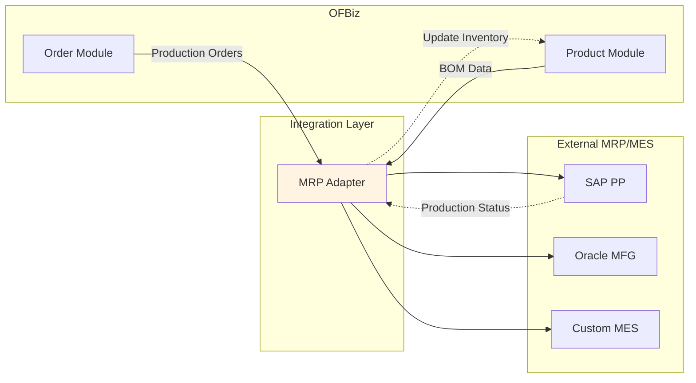

# Manufacturing Module Architecture

**Document Type**: Application Module Documentation  
**Module Classification**: Optional Module (Can be Disabled)  
**Last Updated**: December 2024

---

## Overview

The Manufacturing module provides production planning, bill of materials (BOM), routing, and production run management. It is an **optional module that can be disabled** if your business doesn't involve manufacturing operations.

### When to Disable Manufacturing Module

1. **Retail/Distribution Only**: No production or assembly operations
2. **Service Business**: No physical product manufacturing
3. **Dropshipping**: Products shipped directly from suppliers
4. **Pure E-commerce**: Reselling finished goods only

---

## Module Architecture



---

## Entity Model

```mermaid
erDiagram
    WorkEffort ||--|| WorkEffortType : "of type"
    WorkEffort ||--o{ WorkEffortGoodStandard : "produces"
    WorkEffortGoodStandard ||--|| Product : "references"
    
    WorkEffort ||--o{ WorkEffortAssoc : "has routing"
    WorkEffortAssoc ||--|| WorkEffort : "to task"
    
    ProductionRun ||--|| WorkEffort : "is a"
    ProductionRun ||--|| Product : "produces"
    ProductionRun ||--|| Facility : "at location"
    
    WorkEffort {
        string workEffortId PK
        string workEffortTypeId
        string currentStatusId
        decimal estimatedMilliSeconds
        decimal actualMilliSeconds
    }
    
    ProductionRun {
        string workEffortId PK_FK
        string productId FK
        string facilityId FK
        decimal quantityToProduce
        decimal quantityProduced
    }
```

---

## Disabling Manufacturing Module

### Impact Analysis

Before disabling, verify:



### Disable Steps

<details>
<summary><strong>1. Comment out component in framework/base/config/component-load.xml</strong></summary>

```xml
<!-- Disable manufacturing component -->
<!-- <load-component component-location="applications/manufacturing"/> -->
```

</details>

<details>
<summary><strong>2. Remove manufacturing menu items</strong></summary>

```xml
<!-- In applications/commonext/widget/CommonMenus.xml -->
<!-- Comment out manufacturing menu -->
<!-- <menu-item name="Manufacturing" title="Manufacturing">
    <link target="main" url-mode="inter-app" target-window="_self">
        <parameter param-name="app" value="manufacturing"/>
    </link>
</menu-item> -->
```

</details>

<details>
<summary><strong>3. Disable manufacturing services (optional)</strong></summary>

```xml
<!-- In applications/manufacturing/servicedef/services.xml -->
<!-- Add disabled="true" to services you want to disable -->
<service name="createProductionRun" disabled="true" ...>
```

</details>

---

## Alternative: External MRP/MES Integration

If you need manufacturing but want external system:



---

## Official References

- [Apache OFBiz Manufacturing Component](https://cwiki.apache.org/confluence/display/OFBIZ/Manufacturing+Component)

---

## Related Documentation

- [Module Isolation Techniques](../module-isolation-techniques.md)
- [Product Module](../core-modules/product-module.md)
- [Facility Module](facility-module.md)

---

## Summary

The Manufacturing module is optional and can be disabled for non-manufacturing businesses. Before disabling, ensure no active production runs or manufacturing orders exist. Alternatively, integrate with external MRP/MES systems using adapter patterns.
