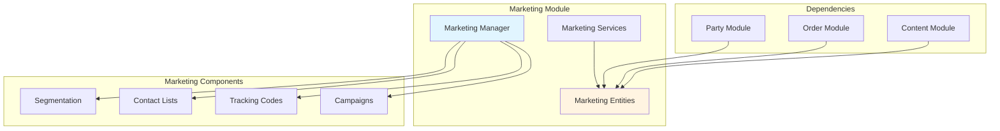
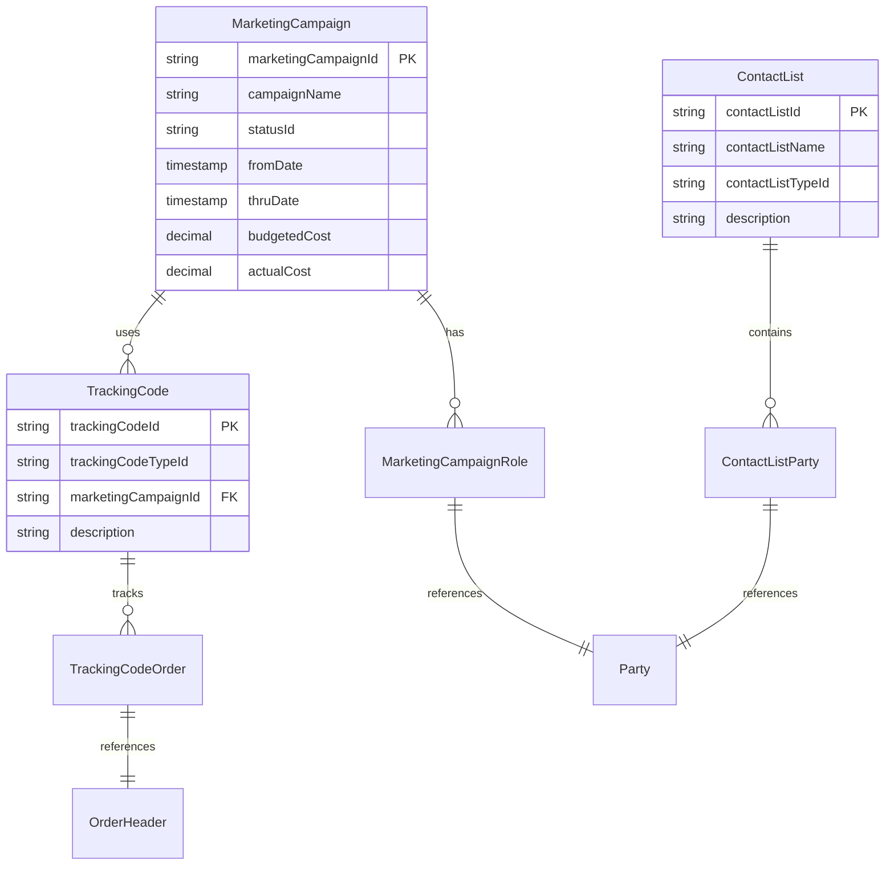
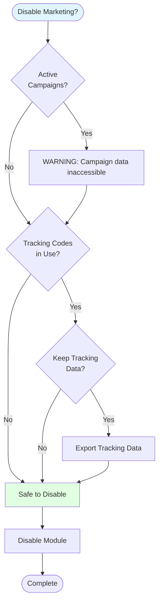
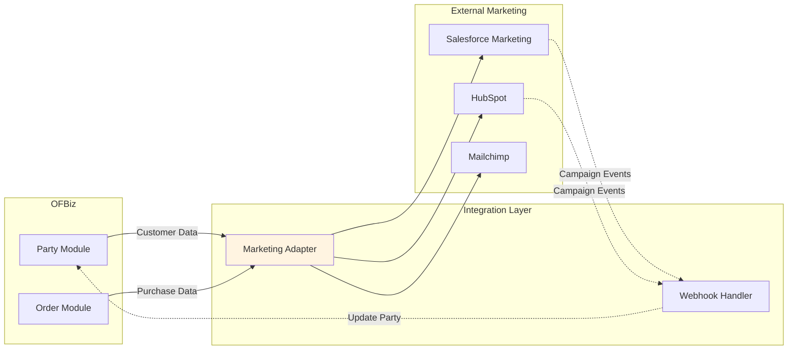

# Marketing Module Architecture

**Document Type**: Application Module Documentation  
**Module Classification**: Optional Module (Can be Disabled)  
**Last Updated**: December 2024

---

## Overview

The Marketing module provides campaign management, contact lists, tracking codes, and marketing analytics. It is an **optional module that can be disabled** if marketing activities are managed externally or not required.

### When to Disable Marketing Module

1. **External Marketing Platform**: Using Salesforce Marketing Cloud, HubSpot, Marketo
2. **Minimal Marketing**: No campaigns or tracking requirements
3. **B2B Focus**: Marketing handled through sales team, not campaigns
4. **Simplified Operations**: Reducing system complexity

---

## Module Architecture



---

## Entity Model



---

## Disabling Marketing Module

### Impact Analysis



### Disable Steps

<details>
<summary><strong>1. Disable component</strong></summary>

```xml
<!-- In framework/base/config/component-load.xml -->
<!-- <load-component component-location="applications/marketing"/> -->
```

</details>

<details>
<summary><strong>2. Remove tracking code references (optional)</strong></summary>

If orders reference tracking codes, you may want to preserve the data:

```sql
-- Export tracking code data before disabling
SELECT o.order_id, o.order_date, t.tracking_code_id, t.description
FROM order_header o
LEFT JOIN tracking_code_order tco ON o.order_id = tco.order_id
LEFT JOIN tracking_code t ON tco.tracking_code_id = t.tracking_code_id
WHERE t.tracking_code_id IS NOT NULL;
```

</details>

---

## Alternative: External Marketing Platform Integration



<details>
<summary><strong>Salesforce Marketing Cloud Integration Example</strong></summary>

```java
public class SalesforceMarketingAdapter {
    
    public static Map<String, Object> syncCustomerToSalesforce(DispatchContext dctx, Map<String, ?> context) {
        Delegator delegator = dctx.getDelegator();
        String partyId = (String) context.get("partyId");
        
        try {
            // Get party data
            GenericValue party = delegator.findOne("Party", UtilMisc.toMap("partyId", partyId), false);
            GenericValue person = delegator.findOne("Person", UtilMisc.toMap("partyId", partyId), false);
            
            // Get contact info
            List<GenericValue> contactMechs = party.getRelated("PartyContactMech", null, null, false);
            String email = null;
            for (GenericValue cm : contactMechs) {
                if ("EMAIL_ADDRESS".equals(cm.getString("contactMechTypeId"))) {
                    GenericValue emailAddr = cm.getRelatedOne("ContactMech", false);
                    email = emailAddr.getString("infoString");
                    break;
                }
            }
            
            // Map to Salesforce format
            SalesforceContact sfContact = new SalesforceContact();
            sfContact.setFirstName(person.getString("firstName"));
            sfContact.setLastName(person.getString("lastName"));
            sfContact.setEmail(email);
            sfContact.setExternalId(partyId);
            
            // Send to Salesforce
            SalesforceAPI api = new SalesforceAPI();
            String sfContactId = api.upsertContact(sfContact);
            
            // Store external reference
            party.set("externalMarketingId", sfContactId);
            party.store();
            
            return ServiceUtil.returnSuccess("Customer synced to Salesforce: " + sfContactId);
        } catch (Exception e) {
            return ServiceUtil.returnError("Error syncing to Salesforce: " + e.getMessage());
        }
    }
}
```

</details>

---

## Official References

- [Apache OFBiz Marketing Component](https://cwiki.apache.org/confluence/display/OFBIZ/Marketing+Component)

---

## Related Documentation

- [Module Isolation Techniques](../module-isolation-techniques.md)
- [Salesforce Integration](../external-integration-examples/salesforce-integration.md)
- [Party Module](../core-modules/party-module.md)

---

## Summary

The Marketing module is optional and can be disabled if marketing activities are managed externally. Before disabling, export campaign and tracking data if needed. Alternatively, integrate with external marketing platforms like Salesforce Marketing Cloud, HubSpot, or Mailchimp using adapter patterns.
